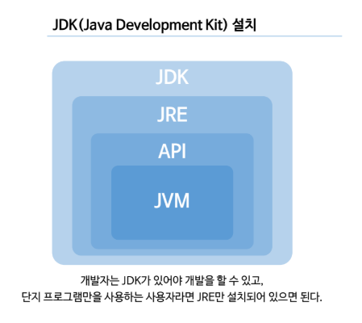
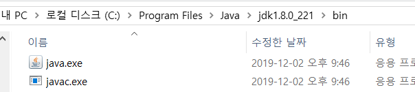
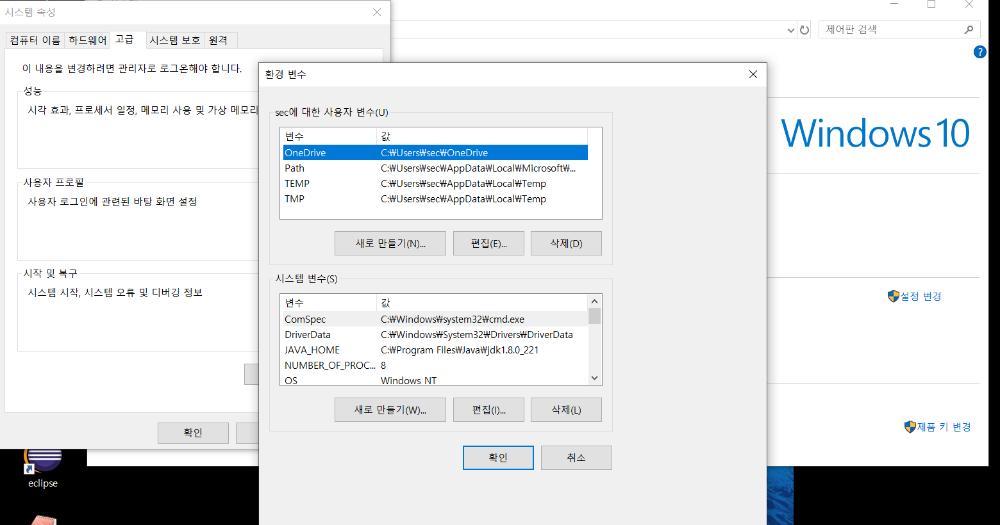
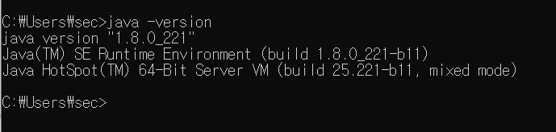
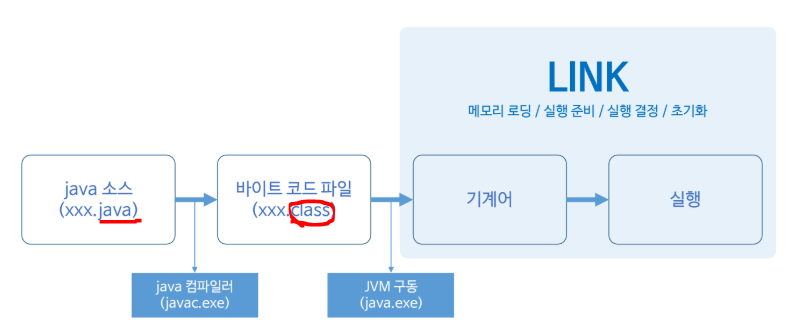

## 0. java

* 단점
  * 기존 C/C++에 비해서 속도가 굉장히 느리다.
    * C/C++은 메모리를 직접 관리, 제어하기 때문
  * JAVA는 메모리 관리를 하지 않고 C/C++에 비해 리소스(메모리,CPU)를 많이 사용한다.
* 장점
  * 객체 지향 언어로 기능을 부품화할 수 있다.
  * `JRE`를 이용해서 운영체제로부터 자유롭다.
    * JRE :java learntime environment
    * OS환경에 상관없이 한번의 코딩으로 자유롭게 사용 가능.
  * 웹 및 모바일 프로그래밍이 쉽다.
  * GC(가비지 컬렉터)를 통한 자동 메모리 관리 지원.





> java.exe : JVM구동 명령
>
> javac.exe : 컴파일러



> 시스템 변수 : pc를 만지는 모든 사용자가 사용할 수 있는 변수 설정
>
> 사용자 변수 : 사용자에 대해서만 사용할 수 있는 변수

* 환경변수 설정 : javac.exe, java.exe를 **다른 디렉토리에서도 실행할 수 있도록** 하기 위해 환경 변수를 등록해야 한다.
  * 환경변수 (path)에 bin 등록 



* cmd 를 통해 java가 잘 설치되어 있는지 확인한다.



---

### 0.1 java application

java interpreter`가 함수를 인식해 실행되는 것을 java application 이라고 한다.

```java
public static void main(String[] args){}
```

>소스코드를 **컴파일**하면 컴파일러가 소스코드(*.java)에 대해 오타나 잘못된 구문, 자료형 체크 등 오류가 있는 지를 알려준다.
>
>컴파일러가 알려 준 에러들을 모두 수정해서 컴파일을 성공적으로 마치고나면, 클래스파일(*.class)이 생성된다.
>
>이 클래스 파일을 실행할 수 있다.

* **static**  메서드 영역, static 영역, 클래스 영역, 설계도
* **stack**   기본 타입의 연산이나 레퍼런스를 저장
* **Heap**    생성된 객체를 저장


### 0.2 API

* java는 `application` 형태(java라는 interprinter를 통해서 실행하는 언어)

``` java
public static void main(String[] args){
    String str = new String("java");	//("")안에 어떤 문자열을 조작 할 것인지 		
}  //시작
```


* | STACK                                | HEAP                                            |
  | ------------------------------------ | ----------------------------------------------- |
  | 한 줄 한 줄 현재 작업 중인 작업 내용 | heap에 할당된 API 클래스(객체)가 참조하는 형태. |
  |                                      | *객체* = *인스턴스*                             |


## 1. 변수

* `변수` 란 프로그램 실행 시 발생되는 **임의의 값을 저장하는 메모리 장소**.

#### 1.1 선언

데이터타입(Type) 변수명 = 초기값;

* **기본형** : 프로그램 처리 시 발생하는 value 저장(문자, 숫자, boolean)
  * 즉, 데이터가 변수에 직접 저장된다. 
  * 문자(charater)
  * 정수 (byte,short,int,long)
  * 실수(float,double)
    * 정수형의 경우 long타입의 리터럴에 접미사 'l' 또는 'L'을 붙이고, 접미사가 없으면 int타입의  리터럴.
    * 실수형의 경우 float타입의 리터럴에 접미사 'f'또는 'F'를 붙이고, double타입의 리터럴에는 'd' 또는 'D'
* **참조형** (reference type) : 어떤 값이 저장되어 있는 **주소**를 값으로 갖는다.
  * C계열에서는 '포인터'라고 한다.
  * JVM의 피연산자 스택이 피연산자를 4byte단위로 저장. 
  * `API`에 포함된 클래스
    * heap에 할당된 값을 참조하여, 속도가 느리다.
  * **String**, 배열
  * 내가 만든 클래스

``` java
		char c = 'c';
		System.out.println("c = "+c);
		int i = 10;
		System.out.println("i = "+i);
		double d = 10.123;
		System.out.println("d = "+d);
		boolean b = false;
		System.out.println("b = "+b);
		
		String s = "Hello java World!!!";
		//String s = new String ();
		System.out.println("s = "+s);
```


#### 1.2 형변환(Casting)

* 변수나 리터럴 타입을 다른 타입으로 변환하는 것.

* 피연산자의 타입이 서로 다르다면, 형변환 연산자를 이용해서 피연산자의 타입을 일치시켜야 한다.

  * **자동 형변환** : 작은 공간의 메모리에서 큰 공간의 메모리로 이동.
  * **명시적 형변환** : 큰 공간의 메모리에서 작은 공간의 메모리로 이동.
    * 명시적 형변환은 '데이터가 누실'될 수 있다.

  * 피연산자의 타입이 int보다 작은 타입이면 int로 변환된다.

>  byte < short < int < long  		< float < double
>
>  1--------- 2 ------- 4 ------8  [byte]

 ``` java
int i = 10;
float f =20.0f;

float result = f + (float)i; //형변환으로 두 피연산자의 타입 일치.
 byte c = (byte)(a * c);
 ```

```java
//문자열 실수로 변환하기
String slat = "37.5212722511242";
double latitude = Double.parseDouble(slat.trim());
System.out.println(latitude);
```


## 2. 연산(Operation)

```java
public static void main(String[] args) {
		System.out.println(6);						 //Number
		System.out.println("six"); 					//String (문자열)
		System.out.println("6"); 	//String 6 - 컴퓨터에서 숫자가 아니라 문자로 인식.
		System.out.println(6+6); 					//12
		System.out.println("6"+"6"); 				//66, +는 결합연산자
		System.out.println(6*6);					//36
						//System.out.println("6"*"6");//문자열은 *연산을 할 수 없다.
		System.out.println("1111".length()); //문자열의 길이 ( 숫자의 길이는 확인x)
	}
```

#### 1] 나머지 연산자 '%'

```java
		Scanner A = new Scanner(System.in);
		int Ainput = A.nextInt();
		int Binput = A.nextInt();
		A.close();
		
		System.out.println(Ainput * (Binput %10));
		System.out.println(Ainput * ((Binput % 100)/ 10));
		System.out.println(Ainput * (Binput / 100));
		System.out.println(Ainput * Binput);
```


#### 2] 비교 연산자 

주로 조건문과 반복문의 조건식에서 사용되며, 연산결과는 오직 true와 false 둘 중의 하나.

* 대소비교 연산자 **< > <= >=**

  * boolean형을 제외한 나머지 자료형에 다 사용 가능.
* 등가비교 연산자 **== , !=**

  * = 는 변수에 값을 저장하는 `대입연산자`										
* 논리연산자  **&& , || , !**  
  * `&&` : 첫번째 조건이 참일때만 검사하는것
  * `&`  : 두 조건을 무조건 검사하는것


## 3. String

* " "는 String (character의 모임)
  * ' '는 Character(문자, **한 글자**를 표현하는 datatype)를 나타낸다.

* `String`은 `new` 연산자를 사용하지 않고 생성할 수 있는 참조 타입(객체, 개체)로, 기본 타입처럼 대입연산자를 사용한다. 
  * 단, 기본 타입처럼 사용하지만 참조 타입이기 때문에 메서드를 갖고있다.

```java
public static void main(String[] args) {
	String city1 = "Asia";
    String city2 = "Europe";		
    city2 = city1;						//값이 복사되므로 city2 = "Asia"
    System.out.println(city1.length()); // 문자 열의 길이 구하기
		
	}
```

#### 3.1 문자열의 비교

* 두 문자열을 비교할 때는, 비교 연산자 `==` 대신 `equals()`라는 메서드를 사용해야 한다.

```java 
public static void main(String[] args) {
    String str1 = "abd";
    String str2 = new String("abd");
    
    System.out.println("str1.equals(\"abc\" ? %b%n",str1.equals("abc"));
    System.out.println("str2.equals(\"abc\" ? %b%n",str2.equals("abc"));
    System.out.println("str2.equals(\"ABC\" ? %b%n",str2.equals("ABC"));
	}
}
    
```


## 4. 제어구문

### 1) 순차형

### 2) 선택형 (조건문)

* if

  * 주로 논리연산자, 비교연산자 많이 사용

  * True of False return

  * 중첩해서 사용 가능 (3~4개)  **들여쓰기 필수**

    

* switch

  ```java
  switch (조건식){
      case 값1 :
          break;
       default :   
  }
  ```

  * 조건식 : Switch의 조건문은 int로 casting될 수 있는 값을 담고있는 변수, 연산식, 메소드 호출문
  * byte, short, int, char, String

### 3) 순환문

* for
* do ~while
* while

