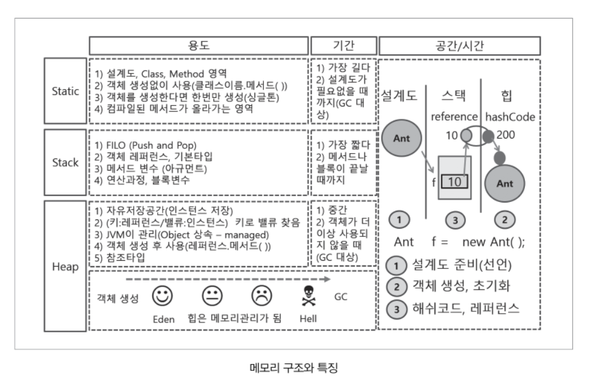

## 0. Java Application 

`java interpreter`가 함수를 인식해 실행되는 것을 java application 이라고 한다.

```java
public static void main(String[] args){}
```

>소스코드를 **컴파일**하면 컴파일러가 소스코드(*.java)에 대해 오타나 잘못된 구문, 자료형 체크 등 오류가 있는 지를 알려준다.
>
>컴파일러가 알려 준 에러들을 모두 수정해서 컴파일을 성공적으로 마치고나면, 클래스파일(*.class)이 생성된다.
>
>이 클래스 파일을 실행할 수 있다.

* **static**  메서드 영역, static 영역, 클래스 영역, 설계도
* **stack**   기본 타입의 연산이나 레퍼런스를 저장
* **Heap**    생성된 객체를 저장



## 1. 변수

`변수` 란 프로그램 실행 시 발생되는 임의의 값을 저장하는 메모리 장소.

#### 선언

데이터타입(Type) 변수명 = 초기값;

* 기본형 : 프로그램 처리 시 발생하는 value 저장(문자, 숫자, boolean)
  * 문자(charater)
  * 정수 (byte,short,int,long)
  * 실수(float,double)
  * JVM의 피연산자 스택이 피연산자를 4byte단위로 저장. 기본 int
* 참조형 (reference type) ; 어떤 값이 저장되어 있는 주소를 값으로 갖는다.
  * `API`에 포함된 클래스
  
    * heap에 할당된 값을 참조하여, 속도가 느리다.
  
  * String
  
  * 내가 만든 클래스
  
  * 배열
  
    ​	
  
    ```java
    String str1 = new String("java");
    String str2 = new String("java");
    if(str1==str2){
        system.out.println("참조형 같다.");
    }else{
        system.out.println("참조형 다르다.");
    }
    ```
  
    
  
    
  
    ```java
    if(str1.equals(str2)){ 			//문자열 비교 - String클래스 매소드로 처리
       //boolean result = str1,equals(Str2);
        system.out.println("문자열 같다.");
    }else {
        system.out.println("문자열 다르다.")
    }
    ```
  
    
  

#### 형변환(Casting)

* 변수나 리터럴 타입을 다른 타입으로 변환하는 것

* 정수형의 경우 long타입의 리터럴에 접미사 'l' 또는 'L'을 붙이고, 접미사가 없으면 int타입의  리터럴.

* 실수형의 경우 float타입의 리터럴에 접미사 'f'또는 'F'를 붙이고, double타입의 리터럴에는 'd' 또는 'D'
  * 피연산자의 타입이 서로 다르다면, 형변환 연산자를 이용해서 피연산자의 타입을 일치시켜야 한다.
  * 보통 더 큰 타입으로 일치시킨다.(값의 손실 방지)
  * 피연산자의 타입이 int보다 작은 타입이면 int로 변환된다.

>  byte < short < int < long  		< float < double
>    1	       2        4	     8  [byte]

 ``` java
int i = 10;
float f =20.0f;

float result = f + (float)i; //형변환으로 두 피연산자의 타입 일치.
 ```

``` java
   byte c = (byte)(a * c);
      
```

```java
//문자열 실수로 변환하기
String slat = "37.5212722511242";
double latitude = Double.parseDouble(slat.trim());
System.out.println(latitude);
```


## 2. 연산(Operation)

```java
public static void main(String[] args) {
		System.out.println(6);						 //Number
		System.out.println("six"); 					//String (문자열)
		System.out.println("6"); 	//String 6 - 컴퓨터에서 숫자가 아니라 문자로 인식.
		System.out.println(6+6); 					//12
		System.out.println("6"+"6"); 				//66, +는 결합연산자
		System.out.println(6*6);					//36
						//System.out.println("6"*"6");//문자열은 *연산을 할 수 없다.
		System.out.println("1111".length()); //문자열의 길이 ( 숫자의 길이는 확인x)
	}
```

#### 1] 나머지 연산자 %


```java
import java.util.Scanner;

public class Main {

	public static void main(String[] args) {
		Scanner A = new Scanner(System.in);
		int Ainput = A.nextInt();
		int Binput = A.nextInt();
		A.close();
		
		System.out.println(Ainput * (Binput %10));
		System.out.println(Ainput * ((Binput % 100)/ 10));
		System.out.println(Ainput * (Binput / 100));
		System.out.println(Ainput * Binput);
	}

}
```


#### 2] 비교 연산자 

주로 조건문과 반복문의 조건식에서 사용되며, 연산결과는 오직 true와 false 둘 중의 하나.

* 대소비교 연산자 **< > <= >=**

  * boolean형을 제외한 나머지 자료형에 다 사용 가능.
* 등가비교 연산자 **== , !=**

  * = 는 변수에 값을 저장하는 `대입연산자`										
* 논리연산자  **&& , || , !**  
  * `&&` : 첫번째 조건이 참일때만 검사하는것
  * `&`  : 두 조건을 무조건 검사하는것


## 3. String

' '는 Character(문자, **한 글자**를 표현하는 datatype)를 나타낸다.

" "는 String (character의 모임)

`String`은 `new` 연산자를 사용하지 않고 생성할 수 있는 참조 타입(객체, 개체)로, 기본 타입처럼 대입연산자를 사용한다. *단, 기본 타입처럼 사용하지만 참조 타입이기 때문에 메서드를 갖고있다.*

```java
public static void main(String[] args) {
	String city1 = "Asia";
    String city2 = "Europe";		
    city2 = city1;						//값이 복사되므로 city2 = "Asia"
    System.out.println(city1.length()); // 문자 열의 길이 구하기
		
	}
```


#### * 문자열의 비교

두 문자열을 비교할 때는, 비교 연산자 `==` 대신 `equals()`라는 메서드를 사용해야 한다.

```java 
public static void main(String[] args) {
    String str1 = "abd";
    String str2 = new String("abd");
    
    System.out.println("str1.equals(\"abc\" ? %b%n",str1.equals("abc"));
    System.out.println("str2.equals(\"abc\" ? %b%n",str2.equals("abc"));
    System.out.println("str2.equals(\"ABC\" ? %b%n",str2.equals("ABC"));
	}
}
    
```

java는 기본형 데이터, 오류까지 전부 객체로 관리 가능.

​		-String과 기본형 데이터가 서로 변환 가능.


### 3. Method()

> mothod();
>
> ()에 정의해야 하는 값이 있는 건 메시지를 입력 받아야하는 메소드.
>
> 메소드 처리 후 만들어지는 오직 한개의 값 = `return`값 
>
> void = return 값이 없다는 뜻!


## 4. 제어구문


### 1) 순차형

### 2) 선택형 (조건문)

* if

  * 주로 논리연산자, 비교연산자 많이 사용

  * True of False return

  * 중첩해서 사용 가능 (3~4개)  **들여쓰기 필수**

    

* switch

  ```java
  switch (조건식){
      case 값1 :
          break;
       default :   
  }
  ```

  * 조건식 : Switch의 조건문은 int로 casting될 수 있는 값을 담고있는 변수, 연산식, 메소드 호출문
  * byte, short, int, char, String

### 3) 순환문

* for
* do ~while
* while

## API

* java는 `application` 형태(java라는 interprinter를 통해서 실행하는 언어)

``` java
public static void main(String[] args){
    String str = new String("java");	//("")안에 어떤 문자열을 조작 할 것인지 		
}  //시작
```


* | STACK                                | HEAP                                            |
  | ------------------------------------ | ----------------------------------------------- |
  | 한 줄 한 줄 현재 작업 중인 작업 내용 | heap에 할당된 API 클래스(객체)가 참조하는 형태. |
  |                                      | *객체* = *인스턴스*                             |

##

Ctrl+Shift+f = 코드 정리


