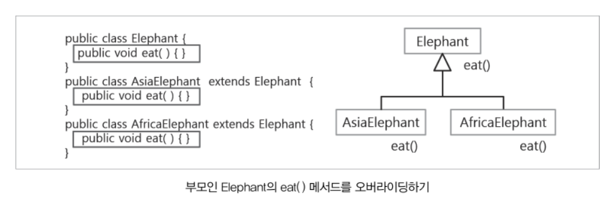

##  OOP 특성

### 2.1 캡슐화(encapsulation)

* 데이터가 유효한 값을 유지하도록, 또는 비밀번호와 같은 데이터를 외부에서 함부로 변경하지 못하도록 하기 위해서 **외부로부터의 접근을 제한**.

* 외부에서 접근할 필요가 없는 멤버들을 `private`으로 지정하여 (`은닉`) 외부에 노출시키지 않음으로서 복잡성을 줄일 수 있다.

* **get메서드 :** 단순히 멤버변수의 값을 **반환** ( 외부에 노출 시킬 때)

  * 멤버변수의 값을 읽는 메서드

* **set메서드** : 매개변수에 저장된 값을 검사하여 조건에 맞는 값일 때만 멤버변수의 값을 **변경**하도록 작성. ( 값을 넣을 때)

  * 멤버변수의 값을 변경하는 메서드.

    ```java
    class 클래스{
        private 데이터;
        메소드();
    }
    ```

    

### 2.2 상속성

상속 :  공통의 특징을 일반화하여 기존의 클래스를 재사용해 새로운 클래스를 작성하는 것이다. 

[장점]

①코드의 길이가 줄어들고, 코드의 추가 및  변경이 매우 용이하다.

②코드의 재사용성을 높이고 코드이 중복을 제거한다.

③ 프로그램의 생산성과 유지보수에 기여할 수 있다.

* Child 클래스는 Parent클래스의 멤버들을 모두 포함한다.
  * 단, 생성자와 초기화 블럭은 상속되지 않고, **멤버만 상속**된다.

**<<상속관계에서 멤버변수가 갖는 특징>>**

 1. 상속관계에서는 상위클래스에 정의된 멤버변수를 하위클래스에서 사용할 수 있다.

      (**하위클래스 참조 변수**를 통해서 접근할 수 있다.)
      
 2. 상위클래스의 변수와 동일한 이름의 변수를 하위클래스에 정의하는 경우 **하위클래스의 멤버변수가 우선순위가 높다.** 

  3. 레퍼런스 **this**

      * `this`는 생성된 객체 자신의 주소를 참조하는 **reference** 이다. 
      * 메서드 인자와 멤버이름이 같은 경우에는 **메서드 인자가 우선**이다. 
        * this는 메서드 인자와 멤버이름을 구분하기 위해 사용한다.
      * **객체 내부**에서 사용할 때만 `this`사용.

  4. private으로 선언된 변수는 상속관계에 있다고 하더라도 하위클래스에서 접근할 수 없다.

  5. 상위클래스는 하위클래스의 일반적인 내용을 정의하기 위해서 사용하는 클래스이므로
       주로 하위클래스를 생성해서 사용한다.

**<상속관계에서 메소드가 갖는 특징>**

  1. 상속관계에서는 상위클래스에 정의된 메소드를 하위클래스에서 사용할 수 있다
 (하위클래스 참조 변수를 통해서 접근할 수 있다.)
 2. 상위클래스에 정의된 메소드와 동일한 메소드를 하위클래스에서 정의하고 사용할 수 있다.
    * 상위클래스에 선언된 메소드와 동일한 메소드를 하위클래스에 정의하는 것을 메소드 재정의**(메소드 오버라이딩)**라고 한다. 
  3. 부모 클래스의 메소드를 사용하고 싶은 경우 **super();**로 호출한다.

         1. 자식의 생성자에서 부모의 생성자를 호출할 때는 `super()` 생성자를 사용한다.
           2. 부모의 멤버에 접근할 때는 **super** 레퍼런스인 `super.`를 사용한다.
              * 단, private인 부모의 멤버에 자식이 접근할 수 없으므로, 부모의 멤버 접근 제한자를 `protected` 나 `public`으로 수정해야한다.
           3. 동일한 네임의 메소드를 호출할 때는, 가장 가까운 메소드 부터 호출한다. (하위 클래스 메소드 실행.)

  4. 모든 클래스의 최상위클래스는 **java.lang.Object**클래스

     * 자바에서 실행되는 모든 객체가 갖는 공통의 특징을 정의한 클래스로, 상속받고 있는 클래스가 없는 경우 컴파일러가 자동으로 상속하도록 한다.

     * Object클래스는 JVM의 메서드(네이티브 메서드)를 이용하여 메모리와 주소를 관리한다. 그러므로 반드시 Object를 상속해야한다.

* **StackOverflowError** 

  ※ java에서 exception이 아닌 error는 치명적인 오류

: 클래스의 모든 생성자메소드의 첫 번째 문장에는 부모클래스의 기본생성자를 호출하는 명령문이 생략되어 있다.

```java
SuperA(){
		super();
	}
```

부모의 private 멤버를 직접 액세스하지않고 생성자를 호출하며 전달한다.

#### #오버라이딩(overriding)

**부모 클래스로부터 상속받은 메서드의 내용을 변경**하는 것. 즉 , 자식 클래스에서 부모 클래스의 메서드(메서드 이름, 타입, 리턴 타입)와 동일한 메서드를 **재정의** 하는 것을 `오버라이딩`이라고 한다

* 메소드의 반환값은 메소드를 호출하는 시점에서 전달되지 않는 정보이기 때문에 오버로딩의 대상이 될 수 없다.
* [조건]   이름, 매개변수, 반환타입이 같아야 한다.  즉, 선언부가 서로 일치해야 한다.
* overloading 
  * 기존에 없는 새로운 메서드를 정의하는 것(new)
  * 매개변수의 숫자에 따라서 같은 이름의, 서로 다른 메소드를 호출하는 방법.
  * setOprands(int left, int right) 와 setOprands(int left, int right, int third)는 다르다.

|               overriding                |                     overloading                      |
| :-------------------------------------: | :--------------------------------------------------: |
| 부모 클래스의 메소드 동장방법 변경한다. | 같은 이름, 다른 매개변수의 메소드들을 여러개 만든다. |


```java
String getLocation(){
    return "x:"+x+",y"+y;
}
String getLocation(){						//오버라이딩
    //return "x:"+x+",y"+y+",z:"+z;
    return super.getLocation()+",z:"+z;		//조상의 메서드 호출
}
```

[ 배열 생성자. 예제]

``` java
class Calculator{
    int[] oprands;

    public void setOprands(int[] oprands){
        this.oprands = oprands;
    }

    public void sum(){
        int total = 0;
        for(int value : this.oprands){
            total += value;
        }
        System.out.println(total);
    }

    public void avg(){
        int total = 0;
        for(int value : this.oprands){
            total += value;
        }
        System.out.println(total/this.oprands.length);
    }
}

class Main {

    public static void main(String[] args) {
        Calculator c1 = new Calculator();
        c1.setOprands(new int[]{10,20});
        c1.sum();
        c1.avg();
        c1.setOprands(new int[]{10,20,30});
        c1.sum();
        c1.avg();
    }
}

```


### 2.3 다형성을 시작하기 전에..

다형성이란 **한 타입의 참조 변수**로 **여러 타입의 객체**를 생성해 사용할 수 있는 것을 말한다. 

(시작 전 꼭 알아야 할 개념 : 상속, 오버라이딩,객체의 형변환,추상클래스)

### 2.3.1 추상클래스-abstract

>미완성된 클래스, 모든 내용이 구현되어있지 않은 클래스로, 완성되지 않았으므로 **객체생성을 할 수 없다.**
>
>메소드의 body가 구현되지않은 메소드를 갖고있는 클래스-추상메소드
>
>내용이 비어있는 메소드

1) 추상메소드를 선언하는 방법
 * 접근제어자 `abstract` 리턴타입 메소드명()(매개변수 list.....);

 * 추상메소드가 정의된 클래스는 미완성된 추상클래스가 되므로 일반 클래스와 다르다.

 * 추상클래스를 정의하는 경우, 클래스 선언부에도 `abstract`를 추가해야한다.

    * abstract 클래스나 메소드를 사용하기 위해서는 반드시 상속해서 사용하도록 강제하는 것이 `abstract`.
   
   ```java
   abstract class AbstractSuper {
   	public abstract void show();
   	public void display() {
   		System.out.println("display");
   	}
}
   ```
   
   

 2) 추상클래스의 특징 

 * 일반메소드와 추상메소드 모두 정의 가능.

 * 추상메소드가 한개라도 정의되어있는 클래스는 반드시 `abstract`를 추가해야한다.  

 * 추상클래스는 구체적인 메소드의 내용이 존재하지 않기 때문에 인스턴스화 할 수 없다.

     * **객체 생성 불가능** - Cannot instantiate the type AbstractSuper

 * 추상클래스(abstract클래스)를 상속하고 클래스에 `abstract` 추가하지 않거나,
   
    상위 클래스가 가진 `abtract`메소드를 오버라이딩 하지 않으면 에러가 발생한다.
   
   
   
   
   
   * [해결방법]
   
   1. **상위클래스**로 사용될 목적으로 만들어진 클래스라면 **클래스 선언부에 abstract추가.**
   2. 모든 추상메소드를 **반드시 오버라이딩**한다.
   
   > [추상클래스와 추상메소드를 작성하는 이유  ??]
   >
   > **다형성**을 적용하기 위해서
   >
   > **상위클래스**로 사용하기 위한 목적(객체 생성을 문법으로 제한하기 위해)
   >
   > 하위클래스에서 반드시 재정의해야하는 메소드를 문법으로 정의하여 반드시 재정의하도록 하기 위해서
   >
   
   
   
   

```java
Parent obj3 = new Child();
		// -> 참조 가능
		//기본적으로 TYPE이 Parent이기때문에 parnet만 접근 가능.
		//접근하기 위해서는 변수 자체를 casting(자동 형변환)
Child obj4 = new Parent();//cannot convert from Parent to Child 
		//parent에는 child 객체가 없기 때문에 접근 불가능.

```


## 2.3.1 final

* `final ` 은 값이 변하지 않는 상수.
  * 상수는 대문자를 사용한다.
* 한 번 정의하면 그 값을 그대로 가지며 수정할 수 없다.
* final 메서드를 오버라이딩 할 수 없다.
* final 클래스는 상속을 할 수 없다.

``` java
static final double PI = 3.14;
```

``` java
static final int NUM = 100;
class FinalSub extends FinalSuper {	// FinalSupper클래스는 상속이 불가능
	static final int NUM = 100;	// 상수로 선언했으므로 값을 수정할 수 없다.(The final field FinalSub.num cannot be assigned)
}
```


```java
class FinalSuper {
	public final void display() {
		System.out.println("super display");
	}
}
class FinalSub extends FinalSuper {
	@Override			
	public void display() {		
        // final 메서드는 오버라이딩 할 수 없다.
		System.out.println("display");
	}
}
// 클래스 상속 금지
final class FinalSuper {
	public void display() {
		System.out.println("super display");
	}
}
```

>@Override			
>: (어노테이션) 컴파일러에게 알려주기 위한 기호


