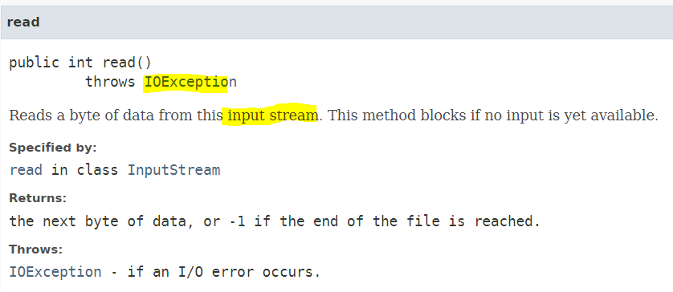

## 0.  Exception Handling

> 실행 시 발생할 수 있는 예외 또한 클래스로 관리하고 있다.

- 컴파일 에러

  : 컴파일 시에 발생하는 에러(주로 문법 오류)

- 런타임 에러

  : 실행 시에 발생하는 에러

- 논리적 에러

  : 실행은 되지만, 의도와 다르게 동작하는 것

#### 1. 에러(Error)

: 프로그램 코드에 의해서 수습될 수 없는 심각한 오류

#### 2. 예외(Exception)

: 프로그램 코드에 의해서 수습될 수 있는 다소 미약한 오류

> `Exception`클래스와 `Error`클래스는 `Throwable`클래스를 상속받고 있다.

##  1.  Throws

> 프로그래머가 **고의로 발생**시키는 예외
>
> > 예외가 발생할 상황이 없지만 고의로 예외를 발생시켰다.
> >
> > 예로, 잔액을 출금하는 메서드에 잔액이 0원이라면 에러가 발생해야 하지만 **Java언어 상에서 0은 오류로 정의되어 있지 않다.**
> >
> > 이런 경우에 위의 **`throw`키워드를 사용**해 **고의로 에러를 발생**시킬 수 있다.


#### Class FileInputStream 

- [java.lang.Object](../../java/lang/Object.html)
   - [java.io.InputStream](../../java/io/InputStream.html)
     - java.io.FileInputStream

*메소드를 찾을 때는 상위 것도 다 찾아봐야 한다. (상속관계 파악 필수)*

```java
public class ExceptionTest05 {
	public static void main(String[] args) {
		try {
			FileInputStream fs = new FileInputStream("test.txt");
			System.out.println(fs.read());
			// Unhandled exception type FileNotFoundException
			//이 생성자는 예외 발생가능성이 있으니, 꼭 exception을 처리할 것을 경고해주는 것.
			System.out.println(Integer.parseInt("1234"));
			//System.out.println(Integer.parseInt("문자열"));
			//NumberFormatException : 문자열이지만, 숫자로 인식되어야 한다.
		}catch (FileNotFoundException e) {
			System.out.println("파일을 읽을 때 오류가 발생했습니다.");
		}catch (IOException e) {
			System.out.println("파일을 찾을 수 없습니다.");
			// 파일을 다시 선택할 수 있도록 처리
		}
	}
}
```

####  Class FileNotFoundException

- [java.lang.Object](../../java/lang/Object.html)
   - [java.lang.Throwable](../../java/lang/Throwable.html)
     - [java.lang.Exception](../../java/lang/Exception.html)
        - [java.io.IOException](../../java/io/IOException.html)
           - java.io.FileNotFoundException	




### [Throws 처리 방법]

 1. 예외가 발생된 곳에서 예외를 처리하도록 정의

     예외가 발생한 곳에서 예외를 처리하면 호출하는 곳에서는 어떤 예외가 발생했는지 알 수 없고
     예외가 발생할 때 경우에 따라서 다르게 처리하고 싶어도 할 수 없다.
     
 2. 메소드를 호출하는 곳에서 예외를 처리하도록 설정.

     ```java
     public int test(int num1, int num2) throws ArithmeticException {
         return ~;
     }
     ```

#### 사용자 정의 Exeption

* 나만의 `Exception`을 만들었으나 **JVM이 인지하지 못하는 오류 사항**이기 때문에 발생시키는 것도 프로그래머가 해야 한다.

  위에서 설명한 **`throw`**키워드를 통해 **사용자가 정의한 `Exception`**을 발생시킬 수 있다.	

* 내가 만든 클래스가 exception 클래스가 되게 하려면? exception  클래스 중 아무거나 상속을 받는다.

>`Exception(String message)`        				
>
>  Constructs a new exception with the specified detail message.
>
>일반적으로 Exception클래스들의 상위가 Exception

```java
public class MyException extends Exception{
	public MyException(String msg) {
		super(msg);
	}
	//MyException이 발생햇을 때 저장하고 싶은 정보가 있거나 처리해야 할 내용이 있는 경우 구현
}
```

---

```java
//생략
		try { // 더 좋은 방법
			s1.deposit(-10);
		} catch (Exception e) {
			System.out.println(e.getMessage());
		}
		try {
			s1.withdraw(6000000);
		} catch (Exception e) {
			System.out.println("금액이 0보다 적거나 현재 잔액보다 많습니다.");
		}

```


```java
public void deposit(double money) throws Exception {//호출할 수 있게 처리하도록 예외를 던져버림

		if (money < 0) {
			throw new Exception("입금 금액이 0보다 적습니다.");
		}
		this.balance = balance + money;
	}	
public void withdraw(int money) throws Exception {
		if (money < 0 | balance < money) {
			throw new Exception();
		}
		this.balance = balance - money;
	}
```


