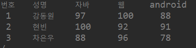

## 0. CRUD / CLRUD

> Create, Read, Update, Delete,list
>
> 기본적인 데이터 처리 기능을 말한다.

### 1.DAO

> Data Access Object
>

DAO에서만 DB와 연동된 작업을 하는 클래스이다.(select 작업의 필수 과정)

### 2. VO or DTO

> Value Object
>
> Data Transfer Object

※ 데이터베이스와 통신 시에 사용하는 Design Pattern 중 하나이다.

## 1. Transaction

**트랜잭션** : 논리적인 작업에 물리적인 작업이 묶여 있는데, 이러한 일들을 모두 commit, rollback 시키는 것

### # Thread (쓰레드)

* stringbuffer : 쓰레드에 대한 처리가 되어있다. 
* stringbuilder : 쓰레드에 대한 처리 X.  동시접속에 대한 처리가 되지 않는다.

## 2. Collection Framework

* **컬렉션 프레임웍** 이란 '배열에 담을 수 있는 데이터 즉, 데이터 군을 저장하는 클래스들을 표준화한 설계' 를 말한다.

* `collection framework`는 `<>`(제네릭) 을 통해 데이터 타입을 명확하게 명시해주어야 한다.
  
  * <>은 레퍼런스타입만 사용할 수 있다.
  
  

| 인터페이스 |                             특징                             |
| :--------: | :----------------------------------------------------------: |
|    List    | 순서가 있는 데이터의 집합. 데이터의 중복허용o 구현 클래스 : ArrayList, Stack,Vector |
|    set     | 순서를 유지하지 않은 데이터의 집합. 중복 허용 x  구현 클래스 : HashSet, TreeSet |
|    Map     | key 와 value의 쌍으로 이루어진 데이터의 집합 구현 클래스 : HashMap, TreeMap, Properties |

 ### 1. Vector

> Vector<E>
>
> Vector<데이터타입>

* vertor는 동시접속에 대한 고려를 하기 때문에 무겁다. 

  그래서  web에는 적당하지 않지만, application 만들때는 최적.

1) 생성

``` java
//배열 
int[] myarr = new int[5];
//Vector
Vector<Integer> v = new Vector<Integer>();
```

2) 요소저장

``` java
//배열
myarr[0] = 100;
//Vector
v.add(100);
```

3) 요소의 갯수

``` java
//배열
myarr.length()
//Vector
v.size();
```

### 2. ArrayList

* 컬렉션 프레임웍에서 가장 많이 사용되는 컬렉션 클래스.
* List인터페이스를 구현하기 때문에 데이터의 저장순서가 유지되고 중복을 허용한다.
  * 기존의 Vector를 개선.
  * Linear list. 순차형 리스트

``` java
String[] arr = {"java", "oracle","jdbc","htmls", "css","java"};
		// 중복된 변수 출력 가능.
		ArrayList<String> list = changeData(arr);
		for(String data : list) {
			System.out.println("요소 :"+data);
		}
		System.out.println("========================================");
		//for 문을 돌 때마다 list.size()를 call한다. 
		//size를 변수화하면서 resource를 줄일 수 있다.
		int size = list.size();
		for (int i = 0; i<size ; i++) {
			System.out.println("요소 : "+list.get(i));
		}
```

* 담아야 할 데이터가 여러개이지만, 데이터의 타입이 다른 경우가 있을 때 DTO를 만들어 사용한다.

  * DTO 만들 때 **멤버변수 , 생성자 , SETGET메소드 , ToString** 을 꼭 만들어 주어야 한다.
  
  

``` java
ArrayList<StudentDTO> stdlist = new ArrayList<StudentDTO>();
		
		StudentDTO std1 = new StudentDTO(1,"강동원", 97,100,88);
		StudentDTO std2 = new StudentDTO(2,"현빈", 100,92,91);
		StudentDTO std3 = new StudentDTO(3,"차은우", 97,96,78);
		
		stdlist.add(std1);
		stdlist.add(std2);
		stdlist.add(std3);
```

* 매개변수로 전달받은 ArrayList에 저장된 데이터 꺼내서 출력하기


``` java
	public static void display(ArrayList<StudentDTO> stdlist) {
		int size = stdlist.size();
		for(int i =0;i<size;i++) {
			StudentDTO std = stdlist.get(i);
			System.out.print("번호 : "+std.getNum()+",");
			System.out.print("성명: "+std.getName()+",");
			System.out.print("자바 : "+std.getJava()+",");
			System.out.print("웹 : "+std.getWeb()+",");
			System.out.println("안드로이드 : "+std.getAndroid());
		}
```

### 3. Collection 담기

*  조회한 결과를 ArrayList로 변환하여 리턴한다. 

* 조회한 게시글을 담을  Collection을 만들어 준다.

  ``` java
  ArrayList<BoardDTO> boardlist = new ArrayList<BoardDTO>();
  ```

  * 데이터를 조회하는 작업을 하는 곳이 'while문 내부'이므로 객체를 생성하지 않고 **null로 초기화** 해준다.	
  * 1. 조회한 레코드의 컬럼을 읽어서 DTO로 변환하는 작업
    2. DTO로 변환된 레코드를 ArrayList에 추가

  ``` java
  BoardDTO board = null;
  //생략
  while (rs.next()) {
  board = new BoardDTO(rs.getInt(1),
                       rs.getString(2), rs.getString(3),
                       rs.getString(4), rs.getDate(5),
  					 rs.getInt(6));
  boardlist.add(board);
  }
  ```

  * 입력받는 데이터가 한개일 경우 (`?`가 한개)  굳이`while`문을 돌리지 않아도 된다.

    

