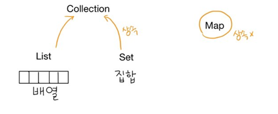

## 0. CRUD / CLRUD

> Create, Read, Update, Delete,list
>
> 기본적인 데이터 처리 기능을 말한다.

### 1.DAO

> Data Access Object
>

DAO에서만 DB와 연동된 작업을 하는 클래스이다.(select 작업의 필수 과정)

### 2. VO or DTO

> Value Object
>
> Data Transfer Object

※ 데이터베이스와 통신 시에 사용하는 Design Pattern 중 하나이다.

## 1. Transaction

논리적인 작업에 물리적인 작업이 묶여 있는데, 이러한 일들을 모두 commit, rollback 시키는 것 : 트랜잭션

### * Thread (쓰레드)

* stringbuffer : 쓰레드에 대한 처리가 되어있다. 
* stringbuilder : 쓰레드 x 동시접속에 대한 처리 x 

## 2. Collection Framework

* **컬렉션 프레임웍** 이란 '배열에 담을 수 있는 데이터 즉, 데이터 군을 저장하는 클래스들을 표준화한 설계' 를 말한다.

* `collection framework`는 `<>`(제네릭) 을 통해 데이터 타입을 명확하게 명시해주어야 한다.
  
  * <>은 레퍼런스타입만 사용할 수 있다.
  
  

| 인터페이스 |                             특징                             |
| :--------: | :----------------------------------------------------------: |
|    List    | 순서가 있는 데이터의 집합. 데이터의 중복허용o 구현 클래스 : ArrayList, Stack,Vector |
|    set     | 순서를 유지하지 않은 데이터의 집합. 중복 허용 x  구현 클래스 : HashSet, TreeSet |
|    Map     | key 와 value의 쌍으로 이루어진 데이터의 집합 구현 클래스 : HashMap, TreeMap, Properties |

 ### 1. Vector

> Vector<E>
>
> Vector<데이터타입>

* vertor는 동시접속에 대한 고려를 하기 때문에 무겁다. 

  그래서  web에는 적당하지 않지만, application 만들때는 최적.

1) 생성

``` java
//배열 
int[] myarr = new int[5];
//Vector
Vector<Integer> v = new Vector<Integer>();
```

2) 요소저장

``` java
//배열
myarr[0] = 100;
//Vector
v.add(100);
```

3) 요소의 갯수

``` java
//배열
myarr.length()
//Vector
v.size();
```

4) 요소의 값을 가져오는 방법

### 2. ArrayList

* 컬렉션 프레임웍에서 가장 많이 사용되는 컬렉션 클래스.
* List인터페이스를 구현하기 때문에 데이터의 저장순서가 유지되고 중복을 허용한다.
  * 기존의 Vector를 개선.
* 


