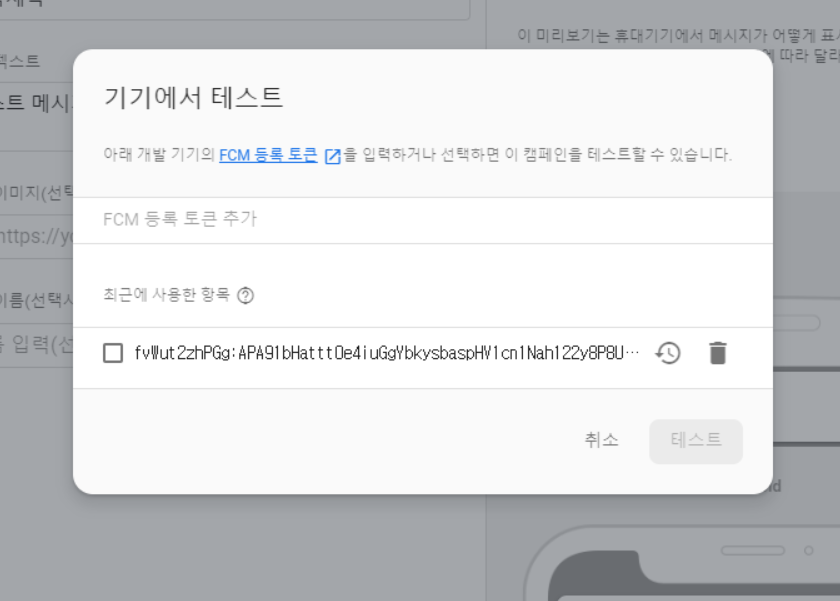

```java
public class FcmActivity extends AppCompatActivity {

    @Override
    protected void onCreate(Bundle savedInstanceState) {
        super.onCreate(savedInstanceState);
        setContentView(R.layout.activity_fcm);
        getToken();
    }

    //토큰을 생성하고 만드는 작업
    public void getToken(){
        //현재 토큰 검색
        FirebaseInstanceId.getInstance().getInstanceId()
                .addOnCompleteListener(new OnCompleteListener<InstanceIdResult>() {
                    @Override
                    public void onComplete(@NonNull Task<InstanceIdResult> task) {
                        //토큰을 가져오다 실패하면 실행하게 된다.
                        if (!task.isSuccessful()) {
                            Log.d("myfcm", "getInstanceId failed", task.getException());
                            return;
                        }
                        //new Instance ID Token
                        String token = task.getResult().getToken();

                        Log.d("myfcm", token);

                    }
                });
    }

}
```

* 토큰 생성

> 2020-04-29 10:56:30.556 9016-9016/com.example.among D/myfcm: fvWut2zhPGg:APA91bHattt0e4iuGgYbkysbaspHV1cn1Nah122y8P8U5LY0aRQ40_PBBEMH0ya_x3A5tnMU-DwJ4ax1XEl5kCH26U56h0VP6dIZEMb0FT2aGrgdmN0LjM7X6pweU9BRTjvv8weMqLBf


