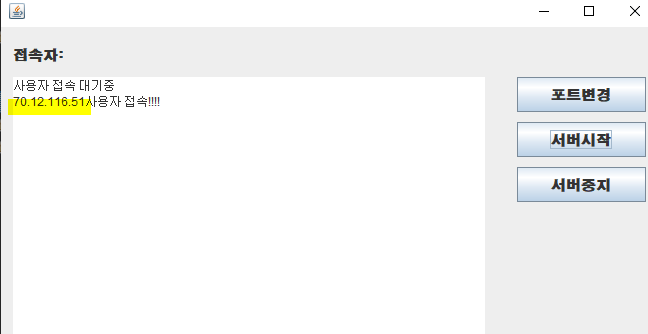

# Chatting

>  **서버(server)**는 클라이언트에게 네트워크를 통해 정보나 서비스를 제공하는 컴퓨터 또는 프로그램

client는 socket객체를 만들어 통신을 한다

화면을 띄워주는 작업 외에 다른 작업을 하기 위해 Thread 작업


client가 대기하면 seversocket이 accept 해서 

Thread : 독립적인 실행 흐름 -> 접속한 사용자에 한해서 Thread 처리를 해주어야 한다.

Thread 

* 클라이언트의 접속 (연결)
* 데이터 보내기 / 받기


* TCP : 연결 지향적
  * 각자 작업 흐름에 연결되어 쓰레드를 처리한다. ( 데이터의 무결성을 유지한다.)
  * 어느 한쪽에서 소켓 연결을 끊지 않는 이상 계속 연결이 되어 있다.
  * 

## 1. 서버 준비 및 문제점 파악

> 실행하면 프로그램이 멈춘 것처럼 보인다
> 버튼이나 GUI 이벤트처리를 하지 못한다. 
> accept 때문에 계속 대기 상태
> ====> 클라이언트의 요청을 받는 부분은 쓰레드 처리를 해야한다.


| Server (서비스 제공)               | Client |
| ---------------------------------- | ------ |
| 클라이언트 처리 (채팅)             |        |
| 클라이언트 접속 / 출력             |        |
| 데이터가 전송되는 것이 있는지 대기 |        |

1. 서버 실행

   **chatServerView** 

   ----------------------- 서버가 여러가지 상태를 확인할 수 있는 화면

   * 소켓 프로그래밍을 하기 위한 객체 준비

   ```JAVA
    ServerSocket server;
    Socket socket;
   ```

   * 클라이언트의 접속을 기다리면서 서비스를 시작할 수 있는 메서드를 정의

   ```JAVA
   public void serverStart(int port) {
   		try {
   			server = new ServerSocket(port);
   			taclientlist.append("사용자 접속 대기중\n");
   			if (server != null) {
   				// 클라이언트의 접속을 기다리는 처리
   				connection();
   			}
   		} catch (IOException e) {
   			e.printStackTrace();
   		}
   	}
   ```

   *  사용자 접속을 위한 메서드 정의

   ```JAVA
               public void connection() {  		
               Thread thread = new Thread(new Runnable() {
     			@Override
     			public void run() {
     				try {
     					socket = server.accept();
     					taclientlist.append("사용자 접속!!!!\n");
     				} catch (IOException e) {
     					e.printStackTrace();
     				}
     	
     			}
     	
     		});
     		thread.start();
     	}
   ```

   **(ChatServerViewListener)**

   ```JAVA
   //ActionListener 버튼 클릭 시 발생하는 리스너
   public class ChatLoginListener  implements ActionListener{
   	ChatLogin view; //이벤트를 발생시키는 화면 - chatLogin
   	String nickname;
   	public ChatLoginListener(ChatLogin view) {
   		super();
   		this.view = view;
   	}
   	//Swing에서 버튼이 클릭될 때 호출되는 메서드 
   	@Override
   	public void actionPerformed(ActionEvent e) {  //OnClick 메서드
   		
   		if(e.getSource()==view.btnConnect){
   			nickname = view.txtId.getText().trim();
   			if(nickname.isEmpty()) {
   				JOptionPane.showMessageDialog(view,
   						"대화명을 입력하세요", "대화명오류", JOptionPane.WARNING_MESSAGE);
   				return;
   			}
   			String ip = view.cboServer.getSelectedItem()+"";
   			int port = Integer.parseInt(view.cboPort.getSelectedItem()+"");
   			System.out.println(ip+port);
   		}
   	}
   }
   ```

   

   

2. 클라이언트 접속

   1. ChatLogin (ChatLoginListener)을 먼저 실행해서 로그인(ip,port,채팅 nickname)

   

   ```java
private void startevent() {
   		ChatLoginListener listener = new ChatLoginListener(this);
   		btnConnect.addActionListener(listener);
   	}
   ```
   
   
   
   2. ClientChatView가 실행 (ClientChatListener)
   
   *  *클라이언트가 채팅하는 화면*

## 2. 서버의 accept을 쓰레드로 변경

* 서버 시작 버튼 눌렀을 때 action
* 서버 접속
  * 클라이언트 접속
    * 클라이언트 한 개만 접속 가능
    *  클라이언트가 접속하면 서버 창에 클라이언트의 ip 출력

```java
@Override
	public void actionPerformed(ActionEvent e) {
		if(e.getSource()==view.btnstartServer){ //
			String port = JOptionPane.showInputDialog(view, 
					"port를 입력하세요",JOptionPane.INFORMATION_MESSAGE);
			//4.  =====서버 시작 버튼을 누르면 서버 start하는 메서드를 호출=========
			view.serverStart(Integer.parseInt(port));
			//=========================================================
		}else if(e.getSource()==view.btnstop){
			System.out.println("서버중지");
		}
	}
```

* ChatLoginListener
  * ActionListener 버튼 클릭 시 발생하는 리스너

```java
public class ChatLoginListener  implements ActionListener{
	ChatLogin view; //이벤트를 발생시키는 화면 - chatLogin
	String nickname;
	public ChatLoginListener(ChatLogin view) {
		super();
		this.view = view;
	}
    //Swing에서 버튼이 클릭될 때 호출되는 메서드 
	@Override
	public void actionPerformed(ActionEvent e) {  //OnClick 메서드
		
		if(e.getSource()==view.btnConnect){
			nickname = view.txtId.getText().trim();
			if(nickname.isEmpty()) {
				JOptionPane.showMessageDialog(view,
						"대화명을 입력하세요", "대화명오류", JOptionPane.WARNING_MESSAGE);
				return;
			}
			String ip = view.cboServer.getSelectedItem()+"";
			int port = Integer.parseInt(view.cboPort.getSelectedItem()+"");
			System.out.println(ip+port);
		}
	}
}
```

* ip,port,nickname 을 전달하며 ClientChatView를 실행
```java
			ClientChatView client = new ClientChatView(ip,port,nickname);
			view.dispose();//로그인창을 닫는다.
```

* 클라이언트가 서버에 접속하기 위한 메서드를 정의

```java

public void connectServer() {
	try {
		socket = new Socket(ip,port);
	}catch (UnknownHostException e) {
		e.printStackTrace();
	}catch (IOException e) {
		e.printStackTrace();
	}	
}
```
# Swing (gui Program)

### :panda_face: java fx (css, javascript)

* 이클립스 플러그인 **window builder** 툴 설치하고 드래그앤 드랍으로 화면 디자인

* JFrame


