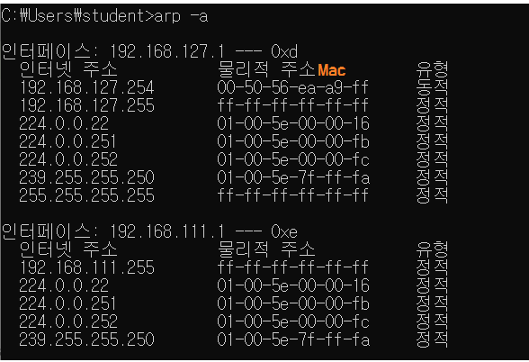
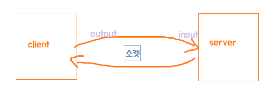
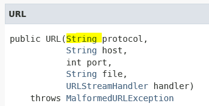
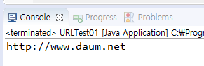
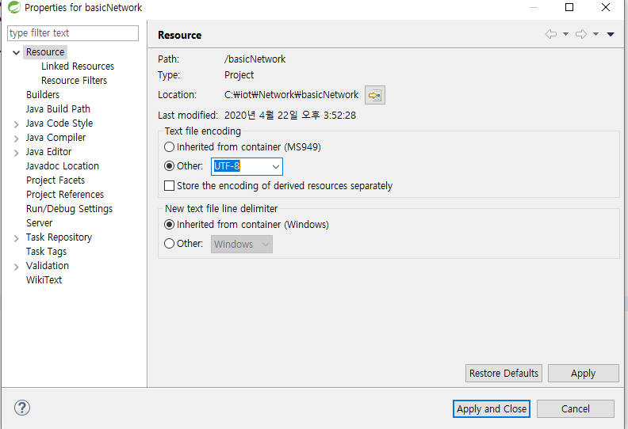
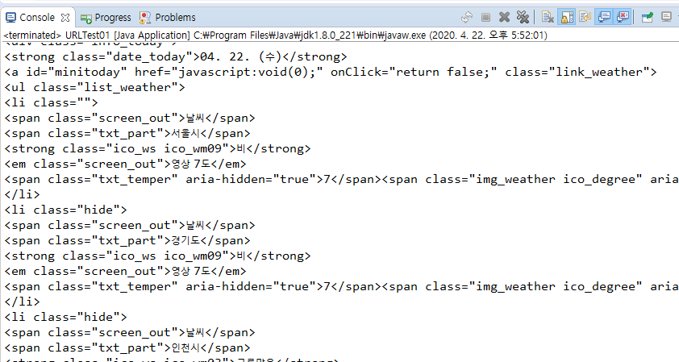
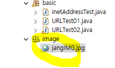

# Network 프로그래밍



* Ip : 컴퓨터를 구별하는데 사용되는 고유한 값

* 통신 - Thread , io ,network 처리를 할 줄 알아야 한다.

* http 프로토콜 : 

* TCP : 연결지향
  * 데이터를 보내고 잘 갔는지 확인한다. 도착이 되지 않으면 다시 보낸다. 


> TCP 로의 연결은 Socket 클래스 사용
>
>    TCP / IP 를 써서 리모트 호스트와 통신하기 위해서는 우선 클라이언트가 서버에 대한 소켓을 생성해야 한다.


네트워크 프로그래밍 시 Server가 필요

 ( 서비스 pc ) 





## 1. InetAddress

```java
public class inetAddressTest {
	public static void main(String[] args) {
		try {
			InetAddress ia = InetAddress.getByName(args[0]);
			System.out.println("ia.getHostName()=>"+ia.getHostName());
			System.out.println("ia.getHostAddress()=>"+ia.getHostAddress());
		} catch (UnknownHostException e) {
			e.printStackTrace();
		}
	}
}
```


```java
InetAddress[] ialist = InetAddress.getAllByName(args[0]);
		for(int i=0;i<ialist.length;i++) {
			System.out.println("ialist[i].getHostName()=>"+ialist[i].getHostName());
		System.out.println("ialist[i].getHostAddress()=>"+ialist[i].getHostAddress());
			}
```




* MalformedURLException : 입력한 URL 형식이 잘못되었을 때

```java
public class URLTest01 {
	public static void main(String[] args) {
		try {
			URL url = new URL("http://www.daum.net");
			System.out.println(url);
		} catch (MalformedURLException e) {
			// TODO Auto-generated catch block
			e.printStackTrace();
		}
	}
}

```







## 2. URL

* port가 -1
  *  -1 포트로 접속했다는 의미가 아니라 http의 기본 포트가 80port
    * 우리가 접속한 url이 기본 포트를 사용하고 있다는 의미

```java
			URL url = new URL("https://www.daum.net");
			System.out.println(url.toString());
			System.out.println("url.getHost()=>"+url.getHost());
			System.out.println("url.getPath()=>"+url.getPath());
			System.out.println("url.getPort()=>"+url.getPort());			
			System.out.println("url.getProtocol()=>"+url.getProtocol());
			System.out.println("url.getFile()=>"+url.getFile());
```

* URL 불러오기

```java
InputStream data = url.openStream(); //openStream : inputstream 리턴
			InputStreamReader isr = new InputStreamReader(data);
			BufferedReader br = new BufferedReader(isr);
//	BufferedReader br = new BufferedReader(new InputStreamReader(url.openStream()));
			while(true) {
				String data_byte = br.readLine(); //(byte단위)
				if(data_byte==null) {
					break;
				}
				System.out.println(data_byte);
			}
```



* 이미지 저장

```java
            URL url = new URL(				"http://cafefiles.naver.net/20120209_226/pododumok_13287752996753FNE4_jpg/%C0%E5%B5%BF%B0%C7_5_pododumok.jpg%20[%EC%B6%9C%EC%B2%98]%20url%EC%97%B0%EC%8A%B5%7C%EC%9E%91%EC%84%B1%EC%9E%90%20heaves1");
			InputStream data = url.openStream();

```

```java
BufferedInputStream bis = new BufferedInputStream(url.openStream());
			fos = new FileOutputStream("src/image/jangImg.jpg");

			while (true) {
				int data_byte = bis.read(); // (byte단위)

				if (data_byte == -1) {
					break;
				}
				fos.write(data_byte);
			}
```

