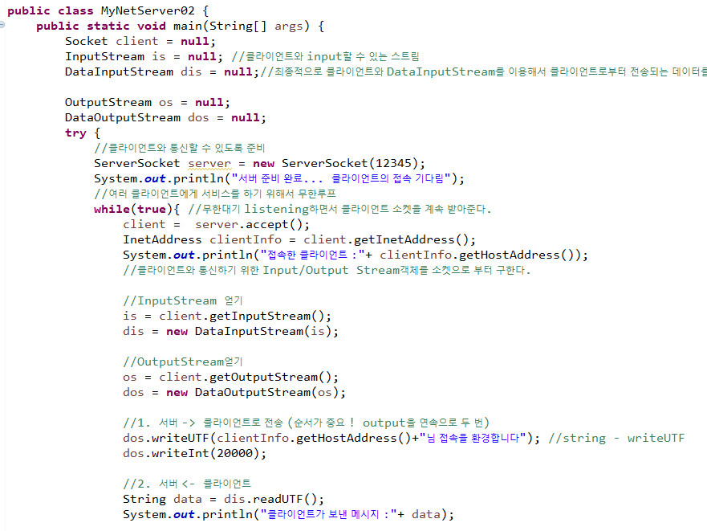
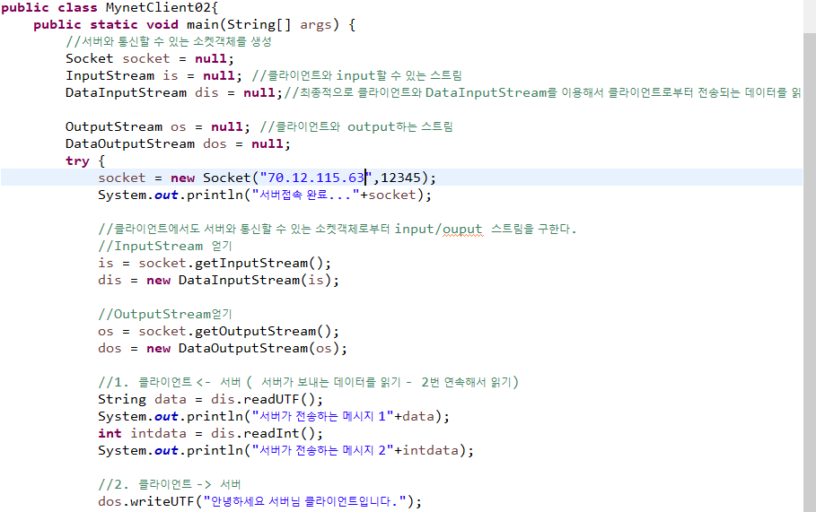
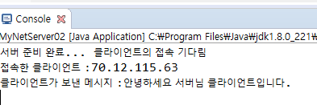
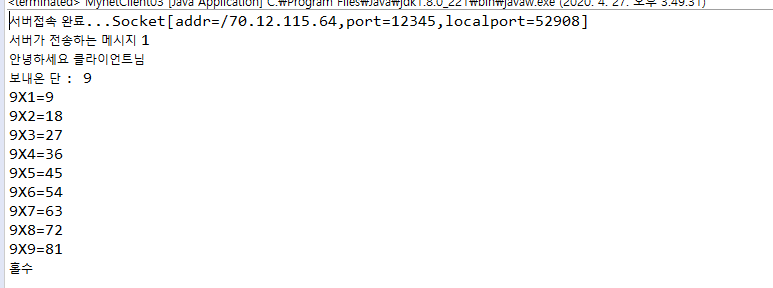
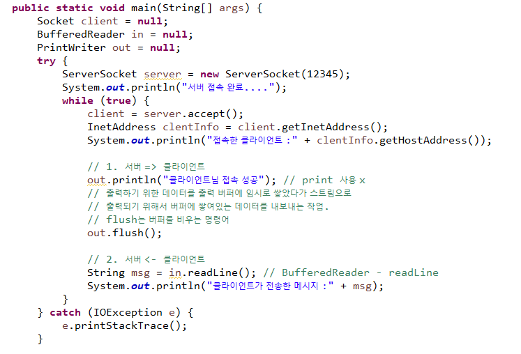
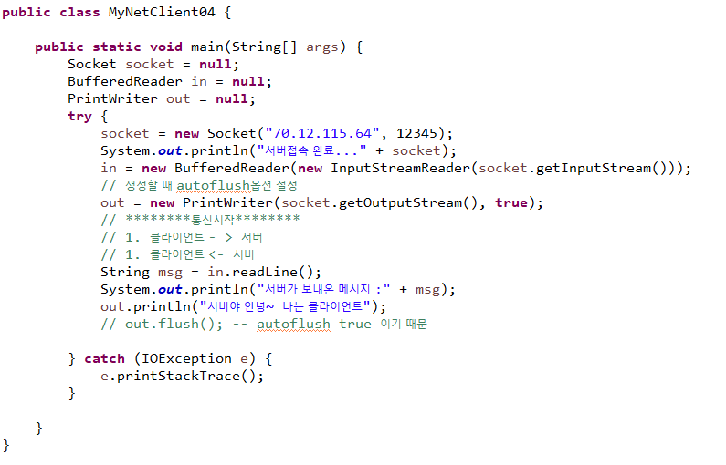
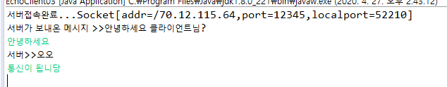
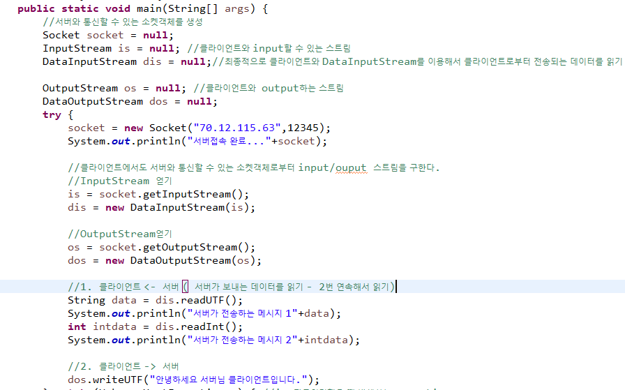
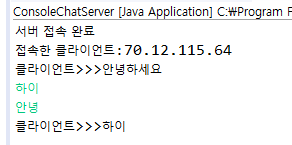

# Network 통신

* **서버** : Port를 열고 Client를 받아들이기 위한 대기를 해야한다.
  * Server Socket 객체 생성

* **클라이언트** : ip와 port를 아는 상태여야 한다.

  * Socket 객체 생성

  

  * Server와 client가 서로 교차하면서 input/output을 진행한다.

  > http : 요청이 한번 input/output 되고 끊어진다.(지속성 x)
  >
  > 안드로이드는 원래 만들어놓은 서버로부터 데이터를 가져오고 저장하기 때문에 http를 많이 사용한다.
  >
  > 하지만 서버의 지속성을 위해 tcp/ip를 사용해준다.
  >
  > tcp/ip : 서버와 연결되어 데이터를 가져온다.

* 서버와 클라이언트는 같은 네트워크 망 안에 묶여있어야 사용이 가능하다.

* 각각의 클라이언트의 접속을 독립적으로 유지하고 실행해주어야 한다. 


### 기초 예제

* Server

```java
public static void main(String[] args) {
		//클라이언트와 통신할 수 있도록 준비
		try {
			ServerSocket server = new ServerSocket(12345);
			System.out.println("서버 준비 완료... 클라이언트의 접속 기다림");
			//클라이언트가 접속할 때까지 대기
			//클라이언트가 접속하면 접속한 클라이언트의 소켓객체를 리턴
			Socket client =  server.accept();
			InetAddress clentInfo = client.getInetAddress();
			System.out.println("접속한 클라이언트 :"+ clentInfo.getHostAddress());
		} catch (IOException e) {
			e.printStackTrace();
		}
	}
```

* Client
  * 서버와 통신할 수 있는 소켓객체를 생성

```java
public static void main(String[] args) {		
		try {
			Socket socket = new Socket("70.12.115.64",12345);
			System.out.println("서버접속 완료..."+socket);
		} catch (UnknownHostException e) { //ip 잘못입력했을 때 발생하는 exception
			// TODO Auto-generated catch block
			e.printStackTrace();
		} catch (IOException e) {
			// TODO Auto-generated catch block
			e.printStackTrace();
		}
	}
```


- `getInputStream()` Returns an input stream for this socket.
  - 데이터가 들어오는 통로

- `getOutputStream()` Returns an output stream for this socket.
  - 데이터를 내보내는 통로(객체)


### 통신 실습 1

* server



* client



[결과]



### 통신 실습 2

**MyNetServer03**

1. 클라이언트가 접속하면 "안녕하세요 클라이언트님"이라는 메시지를 클라이언트로 보낸다.

2. 클라이언트에게 2부터 9까지의 랜덤수를 보낸다.

3. 클라이언트가 전송하는 데이터를 출력한다.


* 매개변수

```java
		Socket client = null;
		InputStream is = null; 
		DataInputStream dis = null;
		//최종적으로 클라이언트와 DataInputStream를 이용해서 클라이언트로부터 전송되는 데이터를 읽기
		
		OutputStream os = null; 
		DataOutputStream dos = null;
		Random rand = new Random();
```

* try/catch
  * `String`출력은  ` writeUTF()` 메소드

```java
			ServerSocket server = new ServerSocket(12345);
			System.out.println("서버 준비 완료... 클라이언트의 접속 기다림");
			
			while(true){ 
			    client =  server.accept();
				InetAddress clientInfo = client.getInetAddress();
				System.out.println("접속한 클라이언트 :"+ clientInfo.getHostAddress());

				is = client.getInputStream();
				dis = new DataInputStream(is);
				
				os = client.getOutputStream();
				dos = new DataOutputStream(os);
				
				//1. 서버 -> 클라이언트로 전송 (순서가 중요 ! output을 연속으로 두 번)
				dos.writeUTF("안녕하세요 클라이언트님"); 
				
				int randNum = rand.nextInt(8)+2;
				dos.writeInt(randNum);
				//2. 서버 <- 클라이언트
				
				String data = dis.readUTF();
				System.out.println("클라이언트가 보낸 메시지 :"+ data);
            }
```


**MyNetClient03**

1. 서버가 보내오는 환영메시지를 출력한다.

2. 서버가 보내오는 랜덤수에 해당하는 구구단을 출력한다.

3. 서버가 보내오는 랜덤수를 짝수 홀수 판단해서 서버로 메시지를 보낸다.

   ex)서버가 보낸 랜덤수가 5이면 5단을 클라이언트 콘솔에 출력하고

   "홀수"라는 메시지를 서버로 보낸다.


* 매개변수
  * 서버와 통신할 수 있는 소켓객체를 생성

```java
		Socket socket = null;
		InputStream is = null; 
		DataInputStream dis = null;
		
		OutputStream os = null; 
		DataOutputStream dos = null;
```

* try/catch

```java
socket = new Socket("70.12.115.64",12345);
			System.out.println("서버접속 완료..."+socket);

			is = socket.getInputStream();
			dis = new DataInputStream(is);

			os = socket.getOutputStream();
			dos = new DataOutputStream(os);
			
			//1. 클라이언트 <- 서버 
			String msg = dis.readUTF();
			System.out.println("서버가 전송하는 메시지 >>  1\n"+msg);
			
			int gugu = dis.readInt();
			System.out.println("보내온 단 : "+gugu);
			//2. 클라이언트 -> 서버
			for(int i=1;i<=9;i++) {
				System.out.println(gugu+"X"+i+"="+(gugu*i));
			}
			String clientMsg="";
			if(gugu%2==0) {
				clientMsg="짝수";
			}else {
				clientMsg="홀수";
			}
			System.out.println(clientMsg);
			dos.writeUTF("안녕하세요 서버님 클라이언트입니다.");
```



### 통신 실습 3

* 바이너리 데이터를 읽고 쓰지 않는 경우

* server






- `PrintWriter(Writer out, boolean autoFlush)`

  -  Creates a new PrintWriter.

  [결과]




* 




## Thread를 이용한 채팅 구현

서버와 클라이언트가 1대1로 채팅을 할 수 있도록 구현하기

-ConsoleChatServer.java : 서버 (클라이언트가 보내는 것 읽는 것만)

-ConsoleChatClient.java : 클라이언트 (서버에게 보내기만 하는 쓰레드)

클라이언트와 서버의 input / output을 쓰레드로 구현

* **ClientSenderThread**

```java
public class ClientSenderThread extends Thread{
	Socket socket;
	public ClientSenderThread(Socket socket) {
		super();
		this.socket=socket;
	}
	//키보드로 입력한 내용을 서버로 보내는 작업
	@Override
	public void run() {
		PrintWriter out = null;
		BufferedReader keyin = null;
		
		try {
			out = new PrintWriter(socket.getOutputStream(),true);
			keyin = new BufferedReader(
					new InputStreamReader(System.in));
			String sendMsg = ""; //서버로 보낼 메시지
			while(true) {
				sendMsg = keyin.readLine();
				if(sendMsg==null) {
					break;
				}
				out.println(sendMsg);
			}
		} catch (IOException e) {
			e.printStackTrace();
		}
		
	}
	 
}
```


* **ClientReceiverThread**

```java
public class ClientReceiverThread extends Thread {
	Socket socket;
	public ClientReceiverThread(Socket socket) {
		super();
		this.socket=socket;
	}
	//서버가 전달한 데이터를 읽어서 출력
	@Override
	public void run() {
		BufferedReader in = null;
		try {
		
			in = new BufferedReader(
					new InputStreamReader(socket.getInputStream()));
			String resMsg = ""; //서버에서 받은 데이터
			while(true) {
				resMsg = in.readLine();
				if(resMsg==null) {
					break;
				}
				System.out.println("서버>>>"+resMsg);
			}
		} catch (IOException e) {
			e.printStackTrace();
		}
	}
}
```


* **ServerSenderThread**

```java
public class ServerSenderThread extends Thread{
	// 서버에서  클라이언트로 보내는 데이터를 전송하는  작업을 수행하는 쓰레드
	Socket socket;
	public ServerSenderThread(Socket socket) {
		super();
		this.socket=socket;
	}
	//키보드로 입력한 내용을 클라이언트로 보내는 작업
	@Override
	public void run() {
		PrintWriter out = null;
		BufferedReader keyin = null;
		
		try {
			out = new PrintWriter(socket.getOutputStream(),true);
			keyin = new BufferedReader(
					new InputStreamReader(System.in));
			String sendMsg = ""; //클라이언트로 보내는 메시지
			while(true) {
				sendMsg = keyin.readLine();
				if(sendMsg==null) {
					break;
				}
				out.println(sendMsg);
			}
		} catch (IOException e) {
			e.printStackTrace();
		}
		
	}
}
```

* **ServerRecieveThread**

```java
public class ServerRecieveThread extends Thread {
	Socket socket;
	public ServerRecieveThread(Socket socket) {
		super();
		this.socket = socket;
	}

	// 클라이언트가 전달한 데이터를 읽어서 출력
	@Override
	public void run() {
		BufferedReader in = null;
		try {

			in = new BufferedReader(new InputStreamReader(socket.getInputStream()));
			String resMsg = ""; // 서버에서 받은 데이터
			while (true) {
				resMsg = in.readLine();
				if (resMsg == null) {
					break;
				}
				System.out.println("클라이언트>>>" + resMsg);
			}
		} catch (IOException e) {
			e.printStackTrace();
		}
	}

}

```

* **ConsoleChatServer**

```java
public class ConsoleChatServer {
	public static void main(String[] args) {
		
		try {
			ServerSocket server = new ServerSocket(12345);
			System.out.println("서버 접속 완료");
			while(true) {
				Socket socket = server.accept();
				InetAddress clientInfo = socket.getInetAddress();
				System.out.println("접속한 클라이언트:"+
						clientInfo.getHostAddress());
				ServerSenderThread senderThread = new ServerSenderThread(socket);
				senderThread.start();
				
				new ServerRecieveThread(socket).start();
			}
			
			
		} catch (IOException e) {
			e.printStackTrace();
		}
	}

}
```

* **ConsoleChatClient**

```java
public class ConsoleChatClient {
	public static void main(String[] args) {

		try {
			Socket socket = new Socket("70.12.115.63", 12345);
			new ClientReceiverThread(socket).start();
			new ClientSenderThread(socket).start();
			
		} catch (UnknownHostException e) {
			e.printStackTrace();
		} catch (IOException e) {
			e.printStackTrace();
		}

	}

}

```

**[결과]**

