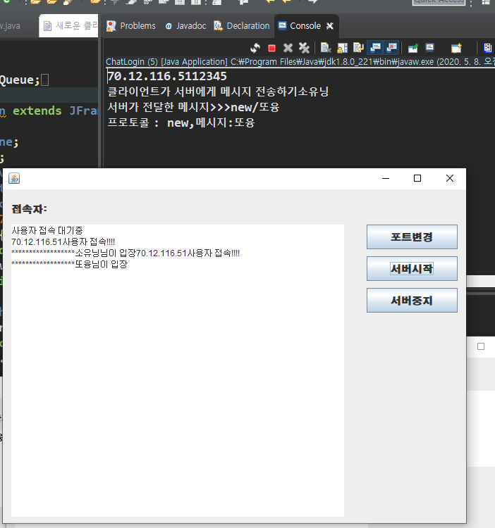

## MultiThread

[새로운 클라이언트의 접속을 기존 클라이언트에게 알리기]

1. 클라이언트가 이미 접속되어 있는 상태에서 다른 클라이언트가 접속을 하면 기존 사용자들에게 알려주는 작업을 처리
	* 먼저 기존의 클라이언트들에게 새로운 클라이언트 접속을 안내하고 새로운 클라이언트에게 기존 클라이언트를 안내 
2. 채팅목록에 nickname을 추가	
   * 

**순서**

1. 클라이언트들의 정보를 저장할 변수 선언

Vector<User> userlist = new Vector<User>();

2. 채팅하는 사용자들의 목록(nickname)을 JList에 추가하기 위한 변수

```java
Vector<String> nicknamelist = new Vector<>();
	StringTokenizer st;
```

3.  User객체에 기존 사용자의 정보를 액세스할 수 있도록 변수 정의

```java
Vector<User> userlist;
```

4. 서버가 접속한 클라이언트의 정보를 User객체로 만들 때 접속 user의 소켓 객체와 서버뷰,userlist전달
```java
public User(Socket client, ChatServerView serverView,Vector<User> userlist) {
    super();
   		this.client = client;
   		this.serverView = serverView;
   		this.userlist = userlist;
   		iowork();
   	}
```

5. 새로운 클라이언트가 접속하면 기존 사용자의 정보를 넘길 수 있도록 수정

```java
public void connection() {
		Thread thread = new Thread(new Runnable() {
		@Override
		public void run() {
			
			while (true) {
				try {
					socket = server.accept();
					String ip = socket.getInetAddress().getHostAddress();
					taclientlist.append(ip + "사용자 접속!!!!\n");
				    User user = new User(socket,ChatServerView.this,userlist);
					// 여러 클라이언트가 접속할 수 있도록 처리
					user.start();
                    } catch (IOException e) {
					e.printStackTrace();
				}
			}
		}
	});
	thread.start();
}
```

6.  서버가 보내오는 데이터를 분석해서 처리하는 메소드를 정의

```java
6. private void filtering(String msg) {
   		st = new StringTokenizer(msg,"/"); //msg 를 "/" 기준으로 분리
   		String protocol = st.nextToken(); 
   		//어떤 작업을 했는 지를 알 수 있는 keyword - new, old, chatting...
   		String message = st.nextToken();
   		System.out.println("프로토콜 : "+protocol+",메시지:"+message);
   		if(protocol.equals("new")) {
   			//새로운 사용자가 접속하면 호출되는 부분
   			nicknamelist.add(message);//nicknamelist에 추가
   			lstconnect.setListData(nicknamelist);//벡터에 데이터를 새로고침
   			//클라이언트 창에 메시지 출력
   			taChat.append("******************"+message+"님이 입장하셨습니다.\n");
   		}
   	}
```

**<<프로토콜>>**

> 1. new  :  새로운 클라이언트가 접속했음을 안내
> 2. old : 새로운 클라이언트에게 기존 사용자의 정보를 안내
> 3. chatting : 대화하기
> 4. out : 채팅방에서 나가기


7. 기존 사용자에게 메시지를 보내는 메소드를 정의

   ```java
   private void broadCast(String msg) {
   	int size = userlist.size(); // 기존 접속자 인원수
   	for(int i=0;i<size;i++) {
   		User user = userlist.get(i);
   		user.sendMsg("new/"+nickname); 
           //이미 접속한 사용자들한테 안내 - 새로접속한 사용자의 nickname을 보낸다
   	}
   }
   ```

   

### <<채팅하기>>
1.User 
	* 클라이언트가 보내오는 메시지를 분석하여 프로토콜이 chatting인 경우 
	접속되어 있는 모든 클라이언트에게 채팅한 내용을 보낼 수 있도록 구현한다.
 * 클라이언트에게 전달된 메시지를 분석하는 메소드

```java
private void filteringMsg(String msg) {
		System.out.println("서버가 받은 클라이언트의 메시지  : "+msg);
		st = new StringTokenizer(msg, "/"); // msg 를 "/" 기준으로 분리
		String protocol = st.nextToken();
		if(protocol.equals("chatting")) {
			String message = st.nextToken();
			String nickname = st.nextToken();
			//클라이언트가 메시지를 보내면 연결되어 있는 모든 다른 클라이언트에게 메시지를 전송
			broadCast("chatting/"+message+"/"+nickname);
		}
	}
```


2. ClientChatView
	* 서버가 전송한 내용의 프로토콜이 chatting인 경우 클라이언트 대화창에 출력하기
	


