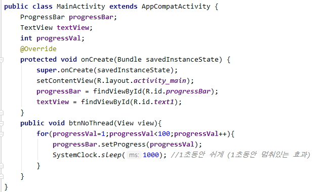
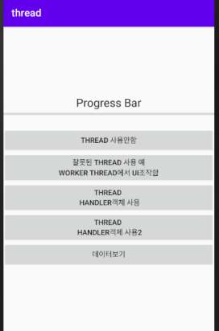
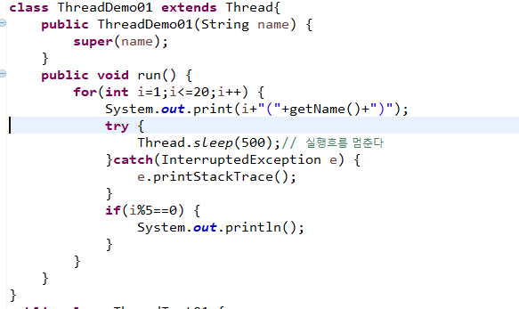
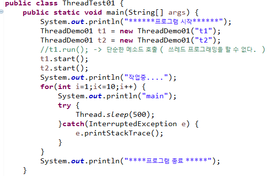

# Thread

>  **멀티 스레드(multi thread)**란 하나의 프로세스 내에서 둘 이상의 스레드가 동시에 작업을 수행하는 것
>
>  **멀티 프로세스(multi process)**는 여러 개의 CPU를 사용하여 여러 프로세스를 동시에 수행
>
> 프로세스 : 실행중인 프로그램  (각각의 프로세스는 서로 관여를 할 수 없다.)

[공통점]

*   프로그램의 **여러 흐름을 동시에 수행**한다는 공통점

[차이점]

* **멀티 스레드(multi thread)** :  각 스레드가 자신이 속한 프로세스의 메모리를 공유
  * 시스템 자원의 낭비가 적다. 
  * 하나의 스레드가 작업을 할 때 다른 스레드가 별도의 작업을 할 수 있다. 

* **멀티 프로세스(multi process)** : 각 프로세스가 독립적인 메모리를 가지고 별도로 실행
  

* public void **run()**
  *  If this thread was constructed using a separate  `Runnable` run object, then that  `Runnable` object's `run` method is called; otherwise, this method does nothing and returns.  
  * `run` in interface `Runnable`

    ## Multi Thread 프로그래밍

>Java에서는 2가지 Thread 처리 방식이 있다.  
>
>* Thread 클래스 상속
>
>* Runnable인터페이스 구현 ( 일반적)
>
>  *Thread를 상속받으면 다른 클래스를 상속받을 수 없기 때문*

1. Thread 클래스를 상속하는 클래스 생성
2. Run 메소드를 오버라이딩
   * Thread 프로그래밍으로 작업하고 싶은 내용을 구현 
   * 동시의 실행 흐름으로 표현하고 싶은 내용을 구현
3. Thread 클래스의 (Thread의 하위 클래스) start 메소드를 호츌
   * 동시 작업 시작
   * run을 직접 호출하지 않고 start 메소드를 호출하면 JVM이 실행할 수 있는 상태가 되면 자동으로 Thread클래스의 run 메소드를 호출

[실습]

 1.쓰레드 프로그래밍을 구현

- 1부터 100까지 출력하는  DigitThread
- A~Z까지 출력하는 AlphaThread
- ThreadExam01의 main메소드에서 DigitThread 와 AlphaThread를 동시에 실행해보자