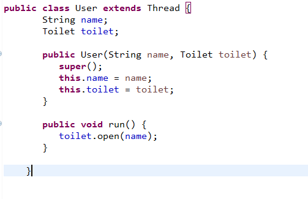
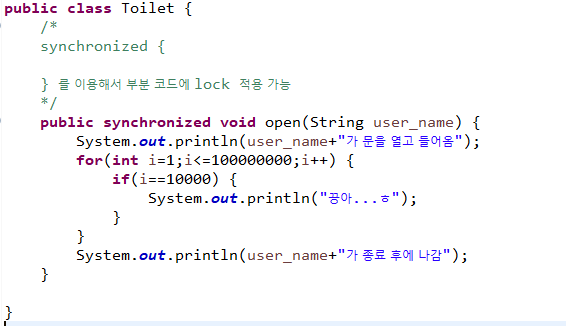

# Thread

>  **멀티 스레드(multi thread)**란 하나의 프로세스 내에서 둘 이상의 스레드가 동시에 작업을 수행하는 것
>
>  **멀티 프로세스(multi process)**는 여러 개의 CPU를 사용하여 여러 프로세스를 동시에 수행
>
> **프로세스** : 실행중인 프로그램  (각각의 프로세스는 서로 관여를 할 수 없다.)

[공통점]

*   프로그램의 **여러 흐름을 동시에 수행**한다는 공통점

[차이점]

* **멀티 스레드(multi thread)** :  각 스레드가 자신이 속한 프로세스의 메모리를 공유
  * 시스템 자원의 낭비가 적다. 
  * 하나의 스레드가 작업을 할 때 다른 스레드가 별도의 작업을 할 수 있다. 

* **멀티 프로세스(multi process)** : 각 프로세스가 독립적인 메모리를 가지고 별도로 실행
  
  


* public void **run()**
  *  If this thread was constructed using a separate  `Runnable` run object, then that  `Runnable` object's `run` method is called; otherwise, this method does nothing and returns.  
  * `run` in interface `Runnable`

## Multi Thread 프로그래밍

>Java에서는 2가지 Thread 처리 방식이 있다.  
>
>* Thread 클래스 상속
>
>* Runnable인터페이스 구현 ( 일반적)
>
>  *Thread를 상속받으면 다른 클래스를 상속받을 수 없기 때문*

### 1) Thread 상속

1. Thread 클래스를 상속하는 클래스 생성
2. Run 메소드를 오버라이딩
   * Thread 프로그래밍으로 작업하고 싶은 내용을 구현 
   * 동시의 실행 흐름으로 표현하고 싶은 내용을 구현
3. Thread 클래스의 (Thread의 하위 클래스) start 메소드를 호츌
   * 동시 작업 시작
   * run을 직접 호출하지 않고 start 메소드를 호출하면 JVM이 실행할 수 있는 상태가 되면 자동으로 Thread클래스의 run 메소드를 호출


*[실습]*

*쓰레드 프로그래밍을 구현*

- *1부터 100까지 출력하는  DigitThread*
- *A~Z까지 출력하는 AlphaThread*
- *ThreadExam01의 main메소드에서 DigitThread 와 AlphaThread를 동시에 실행해보자*


* 하나의 주제를 하나의 쓰레드로 작성한다.


[결과]


### 2) Runnable 인터페이스

1. Runnable 인터페이스를 구현하는 클래스를 생성
2. Runnable인터페이스가 갖고 있는 추상메소드인 run메소드를 오버라이딩
  *  동시 작업하고 싶은 내용을 정의
3. 작성한 Runnable 객체를 이용해서 Thread객체를 생성
    * Thread객체를 생성하면서 매개변수로 Runnable 객체를 전달 
4. 생성한 Thread객체의 start를 호출

* `currentThread()` : 현재 실행중인 Thread객체 리턴 - `static Thread`

```java
class RunnableDemo01 implements Runnable{
	public void run() {
		for(int i=1;i<=20;i++) {
			System.out.print(i+"("+
		Thread.currentThread().getName()+")");
			try {
				Thread.sleep(500);
			}catch(InterruptedException e) {
				e.printStackTrace();
			}
			if(i%5==0) {
				System.out.println();
			}
		}
	}
}
```


### 3) Thread 종료

* Activity가 꺼졌을 때도 계속 작업을 해야 하는 시스템 - 서비스 처리
  * App은 여러개의 Activity로 작업되기 때문에 필요

1. **임의의 변수를 선언해서 종료하는 방법**

>  * 	  flag 변수 
>        * 	  변수에 저장된 값에 따라서 처리할 수 있도록 구현 (실행 or 종료 - boolean)
>        * 	  변수 값 체크 (오래 걸리는 작업이 있는 경우 중간에 이 값을 체크해서 쓰레드를 종료할 수 있다.)


2. **인터럽트를 발생시키고 현재 상태를 확인하고 작업하기**

>  **isInterrupted()** 메소드를 이용해서 현재 쓰레드의 상태가 인터럽트 상태인지 파악
>
>  * 		 인터럽트 상태이면 true를 리턴


### 4) Thread Lock

* User / Toilet





* Main


* synchronized 걸지 않았을 때


* synchronized를 걸었을 때


