# Thread - 동기화

* 멀티 쓰레드 프로세스의 경우 여러 쓰레드가 같은 프로세스 내의 자원을 공유해서 작업하기 때문에 서로의 작업에 영향을 주게된다. 
  * 작업의 제어권이 넘어간다면 원래 의도했던 것과 다른 결과를 얻을 수가 있다. 
  * 이러한 일이 발생하는 것을 방지하기 위해 코드가 실행되는 도중에 다른 코드의 실행을 막아버린다. **(Lock - 임계영역 (critical section))**

> 쓰레드가 진행 중인 작업을 다른 쓰레드가 간섭하지 못하도록 막는 것을 **쓰레드의 동기화(synchronization)** 이라고 한다.

* 메소드 동기화 - 메서드 전체를 Lock 설정

```java
public synchronized 리턴타입 메소드명(){
    
}
```

* 코드블럭을 동기화

```java
synchronized(공유객체){
    //동기화시킬 코드를 정의
}
```

두 방법 모두 lock의 획득과 반납이 자동적으로 이루어진다. 

---

[실습]


1. *두 계좌의 잔액을 더하는 쓰레드*

   * *SharedObj 객체의 계좌잔액을 더해서 sysout으로 출력하는 쓰레드*

   - *5번 출력할 수 있도록*

2. *acc1계좌에서 acc2계좌에 100만원씩 이체하는 작업을 수행하는 쓰레드*

   * *20번 이체할 수 있도록*
     * *Account 클래스 활용*
     * *sysout 으로 정보 출력*
   * *SharedObj객체를 이용해서 작업*

3. *동기화 하지 않고 테스트*

4. *동기화 하고 테스트*

* 공유 객체

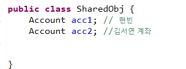

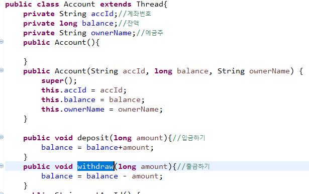

* Thread

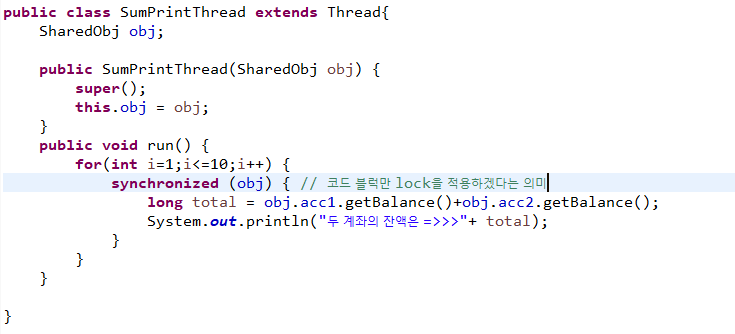

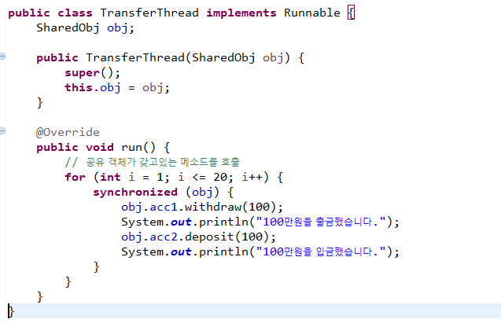

* Main

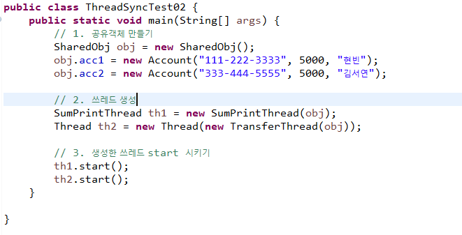

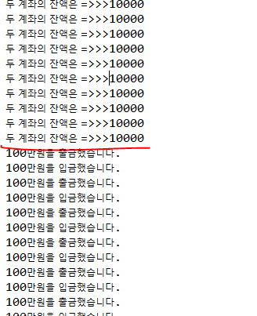


## Android에서 Thread 처리하기


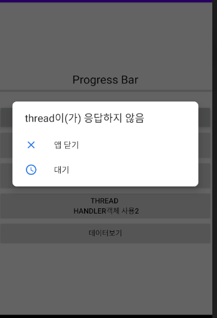

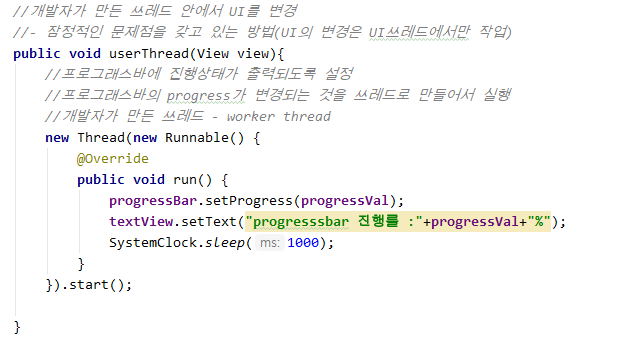

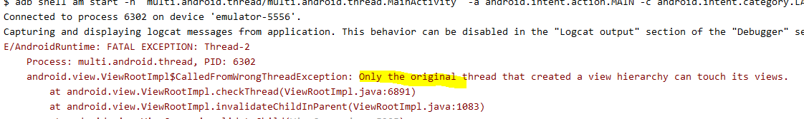

* UI에서는 thread 처리를 한개만 할 수 있음

* Ui는 쓰레드가 아닌 별도의 다른 방법을 통해서 바꿔주어야 한다.
  * 중간에 Handler라는 객체를 만들어 처리한다.
  * 지속적, 반복적으로 처리되는 업무를 Handler가 처리한다.


### 처리방법

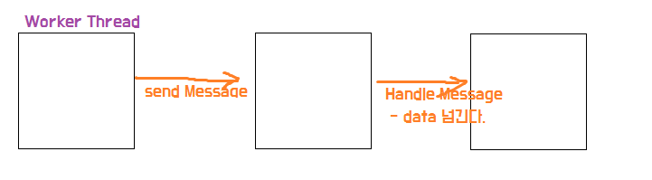

1. **Handler** 이용

   : **오랜시간 처리해야 하는 작업을 할 수 없다.**

   1) 동시 실행 흐름으로 처리할 내용을 쓰레드 객체로 구현

   2) UI 쓰레드에서 Handler객체를 생성 (구현 - 하위 객체)

   * onCreate메소드 내부에서 처리

   3)  worker thread에서 Handler객체에게 작업을 의뢰

   4) Handler객체에서 worker thread로 부터 의뢰받은 내용을 view에 적용

   * handleMessage 메소드를 이용해서 처리 (오버라이딩 해서 구현)

   * work thread한테 전달받은 값으로 view를 변경
   * 쓰레드로부터 요청이 올 때마다 handleMessage메소드가 호출된다. 

   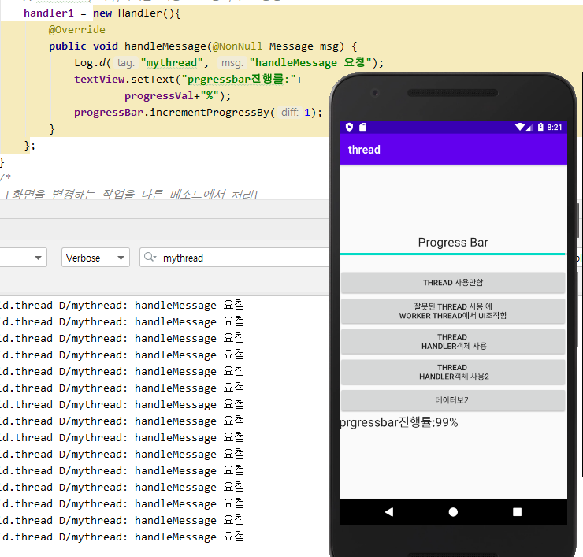

   

    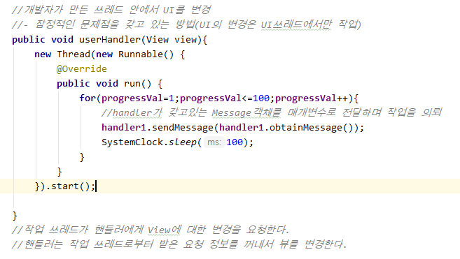

2. **AsyncTask** 이용

   : 시간이 오래 걸리는 작업도 가능, UI 변경하는 작업도 가능

