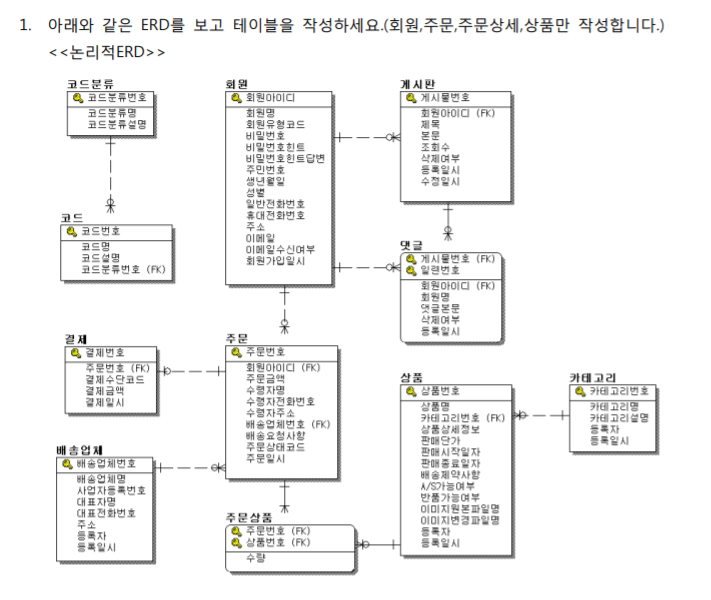
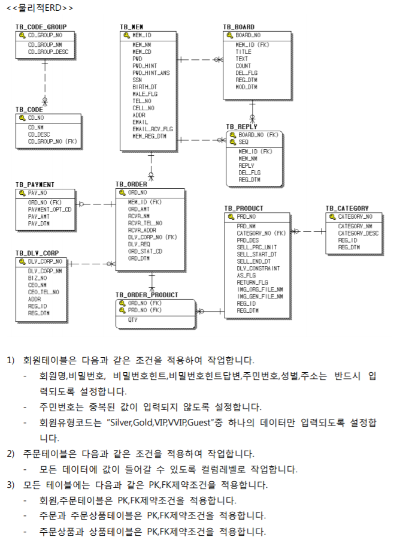

## 1] 관계형 데이터베이스

* 테이블의 형태로 데이터를 저장한다.
* **테이블 정규화**
  * 데이터가 중복될 경우 디스크 공간을 많이 차지 하거나 수정상에 문제가 발생하는 등 여러 가지 문제점이 발생한다. 관계형 데이터베이스에서는 **데이터의 성격 별로** 테이블을 나누어서 설계하는데, 이를 **테이블 정규화**라 한다.
* **PK(primary key)**
  * 기본키
  * 각 레코드를 구분하기 위한 **고유한 값**을 갖고 있는 키
    * PK를 가지고 있는 테이블을 **ParentTable**이라고 부른다.
* **FK(foreign key)**
  * 외래키
  * 기본키를 데이터를 참조하여 사용하므로 중복된 값이 저장될 수 있다.
    * FK를 가지고 있는 테이블을 **ChildTable** 이라한다.

## 2] DDL

- 테이블 정의하기 위해 사용하는 언어 (Create, Alter, Drop 문)

  - **사용자 테이블**과 **데이터 딕셔너리**로 구분된다. 
  - **사용자 테이블** – 사용자가 시스템을 활용하며 발생하는 데이터를 저장할 때 사용하는 테이블 
  - **데이터 딕셔너리** – 오라클에서 발생하는 모든 데이터베이스의 정보를 저장하는 테이블
### 1.  테이블 생성

  ``` sql 
  create table 테이블명(
  	컬럼명 데이터타입(크기) [제약조건],
      컬럼명 데이터타입(크기))
  ```

  ``` sql
  SQL>  create table mydept(
    2       code varchar2(20) primary key,
    3       name varchar2(20));
  ```

  - 테이블 구조 보기

``` sql
SQL> desc dept;
```

- 데이터 타입

  - Varchar2 - 가변문자열 저장
  - Char - 고정문자열 저장
  - Number(전체자리수, 소수자리수)
  
- Date - 날짜형식	
  
### 2.테이블 변경 

  - 테이블의 구조를 변경
  - 컬럼 추가
    - 컬럼명은 같아도 상관없다.

  ``` sql
  Alter table 테이블명
  Add (컬럼명 데이터타입)
  ```

  ```sql
  SQL> insert into mydept values ('001','전산실');
  SQL> alter table member
   2     add (deptcode varchar2(20));
  ```

  - 컬럼 삭제

``` sql
Alter table 테이블명
drop (컬럼명)
```

### 3. 테이블 삭제
  - 테이블의 모든 데이터와 테이블 구조 삭제
  - commit되지 않은 모든 데이터는 반드시 commit 한다.

``` sql
Drop table 테이블명
```

### 4.제약 조건

  - 테이블 설계시 제약조건 줄 수 있다 for **데이터 무결성**

  - 제약조건은 테이블을 생성하 며 정의하거나 생성 후에 **alter table**문을 이용하여 추가할 수 있다.

  - 생성된 제약조건은 삭제해야할 수 있으므로 제약조건을 정의할 때 제약조건의 이름을 정의한다.

#### **NOT NULL**  

*  컬럼에 데이터가 저장될 때 NULL이 포함되지 못하도록 지정한다

    ``` sql
    SQL> insert into member(id, name) values('jang',null);
    insert into member(id, name) values('jang',null)
                                               *
    ERROR at line 1:
    ORA-01400: cannot insert NULL into ("SCOTT"."MEMBER"."NAME")
    --NULL을 insert하려 하면 에러가 발생한다.
    ```
    
    
#### **UNIQUE** 

*  중복된 값이 저장될 수 없는 컬럼
  *  중복된 값이 저장되는 경우 에러발생

  ```sql
 alter table dept
 add constraint uk_dname unique(deptname)
  ```

#### **PRIMARY KEY**

 - 테이블에 저장된 **레코드를 식별**하기 위한 제약조건
     - **not null, unique의 특성**을 함께 갖고 있는 제약조건이다. 

#### **FOREIGN KEY**  

*  다른 테이블에서 이미 정의되어 있는  KEY를 참조하는데, 반드시 **PRIMARY KEY이 외의 값은 사용할 수 없다.**

- *parent key not found* 오류가 생기지 않도록 조심.
  
- 기본키 값을 FK에서 참조하는 경우 기본키 테이블(parent table)는 삭제가 불가능
  - 이런 경우 FK를 먼저 삭제하거나, CASCADE 이용해서 삭제 가능.
  - 제약 조건을 이용해서 제거하는 것이 가장 안전한 방법.
  
  - 테이블에 저장된 **레코드를 식별**하기 위한 제약조건
  
  ```sql
  SQL>  alter table member
  2     add constraint mem_dcode_fk foreign key(deptcode)
  3                     references mydept(code);
  ```
  
  ``` sql
  SQL> drop table mydept;
  
             *
  ERROR at line 1:
  ORA-02449: unique/primary keys in table referenced by foreign keys
  ```

​    

#### **CHECK** 

*  컬럼에 입력되는 값에 제한을 둔다.

      - 값에 대한 제한을 둘 때는 모든 연산자 사용 가능(in , between 등 ..)
      - 테이블을 지우면 관련된 모든 제약조건들이 삭제된다.
      
    ``` sql
    SQL> alter table member
    2  add constraint member_ck check(addr in ('인천','서울','경기'));
    ```
    
    ``` sql
    SQL> insert into member (id,name,addr) values ('kang2','강감찬2','부산');
  insert into member (id,name,addr) values ('kang2','강감찬2','부산')
  *
    ERROR at line 1:
  ORA-02290: check constraint (SCOTT.MEMBER_CK) violated
  ```
```sql
     SQL> alter table member
      2  drop constraint MEMBER_CK;
      -- 삭제 가능
```

- 제약조건의 조회 
  
  - 제약조건이 저장되는 **user_constraints**에서 정보를 조회한다.
  
  ``` sql
    SQL> desc user_constraints;
  
    SQL> select OWNER, CONSTRAINT_NAME, CONSTRAINT_TYPE,TABLE_NAME
      2  from user_constraints;
  ```
  
    
  
    - 오라클에서 사용자가 만든 테이블은 아니지만, 자동으로 제공되는 테이블이 존재.
  
  - `rollback` 은 DML에서 적용 가능하다. (insert...)
  
## 3] Sequence (시퀀스)

* 숫자를 자동으로 생성하여 기본 키의 조건을 만족시켜 주며, 편의를 제공해줄 수 있는 방법

``` sql
-- next value
SQL> insert into myorder values ( myorder_seq.nextval ,'jang');
-- 현재
SQL> insert into order_detail values ( myorder_seq.currval,'prd001');
```

``` sql
--시퀀스 갯수 조회
SQL> select myorder_seq.currval from dual;
--시퀀스 삭제
SQL> drop sequence myorder_seq;
```

* 테이블 명 변경

``` sql
alter table
myorder rename to orderinfo;
```

## 4] shop 테이블 만들기

ERD : 테이블 산출물






``` sql
SQL> INSERT INTO TB_MEM
  2  VALUES('user01', '홍길동', 'Gold', 'user01', '초등학교는?', '서울초등학교', '8010101234567', '19801010', 'F', '02-555-4567', '010-234-4567', '서울시 서초구 서초동 서초아파트 101동 1001호', 'abcd@email.com', 'Y', to_char(sysdate, 'YYYYMMDDHH24MISS'))  ;
```

``` sql
SQL>  select mem_nm 고객명, SUM(p.sell_prc_unit *op.qty) 판매금액
  2  from tb_product p, order_product op, tb_order o , tb_mem m
  3  where o.ord_no = op.ord_no and op.prd_no = p.prd_no and m.mem_id = o.mem_id
  4  group by mem_nm;

고객명                 판매금액
-------------------- ----------
홍길동                   284000
윤소윤                   424000
```

``` sql
SQL>  select p.prd_nm 상품명, SUM(p.sell_prc_unit *op.qty) 판매금액
  2   from tb_product p, order_product op, tb_order o
  3   where o.ord_no = op.ord_no and op.prd_no = p.prd_no
  4   group by p.prd_nm;

상품명                                          판매금액
--------------------------------------------   ----------
숄더홀믹스										114000	
글로아셔링ops									198000
마리안 ops										 396000
```

* column update

``` sql
SQL> update TB_ORDER
  2  set ORD_AMT =0;

5 rows updated.

SQL> update ORDER_PRODUCT
  2  set qty = 8
  3  where ord_no ='0001';
```

* column 삭제, 추가

``` sql
SQL> ALTER TABLE ORDER_PRODUCT
  2  DROP COLUMN QTY;

Table altered.

SQL> alter table ORDER_PRODUCT
  2  add (QTY number);
```

