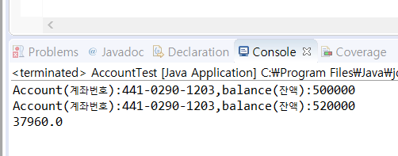
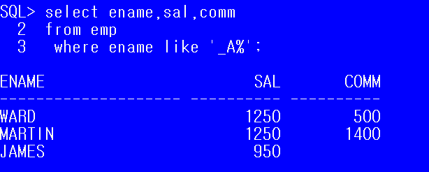

## 0. 데이터 관리 시스템 (DBMS) 

  *-------------------ORACLE, MYSQL,MSSQL,티베로,DB2*

> 관계형 DBMS에서 데이터를 저장, (저장된 데이터를 부를 수 있는)조회, 수정, 삭제하거나, DBMS를 조작하는데 사용되는 언어인 **SQL(Structured Query Language)**
>
> DB를 관리하기 위한 컴퓨터시스템을 **DBMS** 라고 한다.
>
> DBMS과정의 8할은 **조회** 작업.

[시스템 개발 단계]

> 주제정하기 - >(어느 수준으로 개발할 지) 기능 선택 -> 어떤 데이터가 필요한지 선별한 뒤,  DB 뽑아내기

* NoSQL?
  * Not Only SQL
  * 단순히 기존 관계형 DBMS가 갖고있는 특성뿐만 아니라, 다른 특성들을 부가적으로 지원한다.
  * 표준 SQL 인터페이스를 채용하지 않은 경량 Open Source 관계형 데이터베이스
  * 빅데이터 관리.

### #데이터베이스(DB)

- 대량의 정보를 컴퓨터가 효율적으로 접근할 수 있도록 가공 및 저장한 것.
- DB의 장점
  - 다수의 사람이 데이터를 공유할 수 있다.
  - 대량의 데이터 다룰 수 있다
  - Backup이 용이하다.

* 요청을 하는 pc : 클라이언트

* 요청을 받는 pc : 서버
  * DBMS 가 설치된 PC : DB서버

## 1. ORACLE

ORACLE이 돌기위한 서버가 자동 실행으로 켜져 있어야 한다.(XE, Listener)


계정 생성하는 것은 관리자 계정에서밖에 하지 못한다. 관리자 계정으로 접속해야 한다.

관리자 계정은 기본 system계정이다.

> SQL> conn system/manager

계정 생성하기

> SQL> create user scott identified by tiger
>
> ​							----아이디				----비밀번호

접속하기

> SQL> conn scott/tiger

권한 부여하기

* 접속할 수 있는 권한과 여러가지 다양한 권한을 주는데, 여러개의 권한을 하나로 묶어 놓은 롤을 지정하여 작업한다.
* `conn` scott`/`tiger 이용하여 접속하려다 실패한 경우 system계정 접속 상태에서 벗어나므로 다시 계정에 접속.
  * `;` 만나기 전에는 하나의 명령문으로 인식

>  SQL> grant connect,resource to java;
>
> ​            grant      role이름 to 계정명

오늘 날짜

>  SQL> select sysdate from dual;
>
> sysdate : 오늘 날짜 조회하는 함수
>
> dual : TestTable (dummy table)

[출력]

가로길이 변경 

> SQL> set linesize 300;
>
> ​	// 라인당 출력될 문자의 수를 변경해준다.

세로길이 변경

SYSDATE
--------

19/12/18

제약조건은 나중에 추가할 수 있지만 , not null관련은 처음에 언급해야 한다.

>SQL> create table customer(				
>  2       		  id varchar2(10) primary key,				(컬럼명 컬럼타입 제약조건)
>  3       		  pass varchar2(10),
>  4        		 name varchar2(10) not null,
>  5       		  point number,
>  6      		   regdate date);  

조회구문

> SQL> select*from tab; 


테이블 구조 조회

> SQL> desc customer


> SQL> insert into customer values('jang','1234','장동건',1000,sysdate);

데이터 저장

> SQL> commit;


>  NUMBER(precision, scale) 

precision 은 소숫점을 포함한 전체 자릿수

scale 은 소수점 이하 자릿수를 의미해요.


### 1. 	Query - 기본 Select

```oracle
select 컬럼명1,컬럼2,,,,

from 테이블
```

* SQL문은 **대소문자 구분하지 않는다.**
* `;`은 SQL문의 종료를 의미
  * `;`을 입력하기 전에 여러 줄로 SQL문 작성할 수 있다.
* `*` 는 모든 컬럼을 조회하겠다는 의미

- 커럼에 `NULL` 저장할 수 있다.
  - **Null**은 **0**이나 **space**만 입력해놓은 값과 다른 값
  - Null 아무 값도 없는 것을 의미
  - 사용할 수 없고 저장되어있지 않은 상태

* 컬럼명 대신 alias를 정의해서 사용할 수 있다.
  * **select 컬럼명 alias명**, **컬럼명 as alias명**, **컬럼명 "alias명"**
  * **컬럼명 "alias명"** : alias명에 공백이 있는 경우 사용.
  * `alias`만 " " 사용 가능

>select ename 사원명, hiredate as 입사일, sal "나의 급여"
>from emp;

* 여러 컬럼을 합쳐서 하나의 컬럼으로 조회할 수 있다.
  * `||`연산자 이용 (String의 concat 과 비슷)

> SQL> select '나의 입사일은' ||hiredate|| '입니다.'
> from emp;

* 오라클의 문자열, 날짜 데이터는 `' '`  로 표현한다

>  SQL> select ename,sal,comm,sal+comm 급여합
>  from emp;

* 연산의 결과로 컬럼을 생성할 수 있다.
  * (`+`,`-`,`/`,`*`  함수...) 단, `Null`이 포함되어 있는 컬럼은 연산할 수 없다.



* 중복이 있는 경우, **중복을 제거하기 위해 **`select`문에 `distinct`를 추가할 수 있다.

> SQL> select job from emp; 
>
> SQL> select **distinct** job from emp;

* select 절에 조건 추가하기

``` sql
select [distinct] 컬럼명, 컬럼명,.......[alias명]
from 테이블명
where 조건
```

* ​	검색결과를 제한(조건에 만족하는 데이터만 조회하겠다는 의미)

  * where절은 from 절 다음에 정의

  * where절은 조건식이 `true`가 되도록 정의

  * where절에서 사용할 수 있는 비교연산자 : `>`,`>=`,`<=`,`=`,`<>`,`!=`

  * where절에서 조건과 함께 비교하는 값을 추가해야 하는 경우 

    문자, 날짜는 작은 따옴표로 묶어주어야 한다.

  * SQL은 대소문자를 구분하지 않는다. **값을 비교하는 경우 정확하게 대소문자까지 일치.**

    
    
```SQL
select ename,job,hiredate,sal
from emp
where job='MANAGER';
```

```sql
select ename,job,hiredate,sal
from emp
where sal>3000;
```
```sql
select ename,job,hiredate,sal
from emp
where hiredate > '1982/01/01';			//날짜 데이터는 ' ' 로 표현
```
  * 두 개 이상의 조건이 있는 경우 사용할 수 있는 연산자
  
    * `and` 연산자 : 모든 조건일 일치
    
      * between A and B : and 연산과 동일
    
        ​								같은 컬럼에서 조건을 비교하는 경우
    
    ```sql
     select ename,sal
     from emp
     where sal between 2000 and 5000;
    ```
    
    * `or `연산자 : 모든 조건 중 한개만 일치 ( 조건이 모두 다른 컬럼인 경우)
    * `in `연산자 : or연산자의 의미와 동일
      * 컬럼명 in (비교할 값,값,,,,,,)
      * 같은 컬럼에서 값을 여러개 비교해야 하는 경우
    
    * `not`연산자 : 부정

```SQL
select *
from emp
where deptno = 10
       and job = 'MANAGER';
```

```sql
select *
from emp
where deptno =10
        or sal>=2000;
```

```sql
select ename,job,deptno
from emp
where job in ('MANAGER','PRESIDENT');
```

```sql
select ename,job,deptno
from emp
where job not in ('MANAGER','PRESIDENT');
												//'MANAGER','PRESIDENT'가 아닌 데이터 출력
```


* `null`값에 대한 비교
  * `is  null` : null인 데이터를 조회
  * `is not null` : null이 아닌 데이터를 조회						

```sql
select ename, sal, comm
from emp
where comm is null;
```

```sql
 select ename, sal, comm
 from emp
 where comm is not null;
```

* `like` 연산자 : 대표문자와 함께 사용 
  * `like`는 조건비교를 위해 입력한 값이 문자열에 포함되어 있는 것을 찾는 경우
  * `=`  은 정확하게 일치하는 데이터 
  * `%` 은 모든 문자열 / `_`은 한 자리 문자를 의미
    * 컬럼명 like `값 % `: 값이 앞에 위치하는 데이
    * 컬럼명 like `% 값`  : 값으로 끝나는 데이터
    * 컬럼명 like `% 값 %` : 어느 위치든 상관이 없는 데이터
    * like _ A _ _ _ _  : A가 5글자중 2번째 글자에 위치한다.

```SQL
select ename,sal,comm
from emp
where ename like 'A%' ; 
// ename 이 A로 시작하는 모든 것.

select ename,sal,comm
from emp
where ename like '%A%';
```



### 2. 데이터 정렬

```sql
select [distinct] 컬럼명, 컬럼명,.......[alias명]
from 테이블명
where 조건
order by 컬럼명 정렬기준
				------- asc,desc	
```

* 오름차순(작 - 큰)  : **asc**
* 내림차순(큰 - 작) : **desc**
* 정렬기준을 생략하면 기본은 **오름차순**

```sql
 select ename, sal, job
 from emp
 order by job desc;
```

### 3. SQL-Plus에서 사용할 수 있는 명령어

cl scr: 화면 지우기

set linesize 300 : 화면에 보여지는 글자수 조절

desc 테이블명 : 테이블 구조 확인

conn 계정/패스워드 : 접속하기

## 2. RDBMS

정규화 : 같은 종류의 동일한 데이터를 중복을 최대한 피해 나눠서 작업하는 것.


