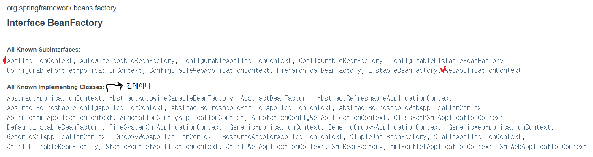
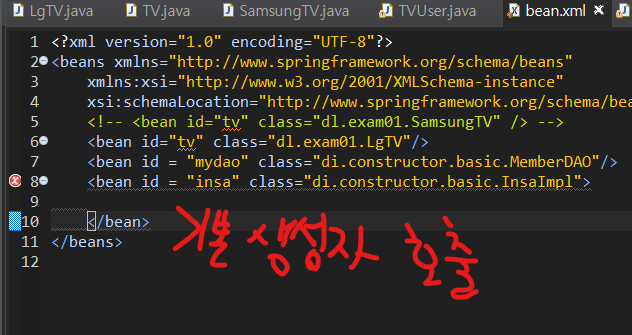
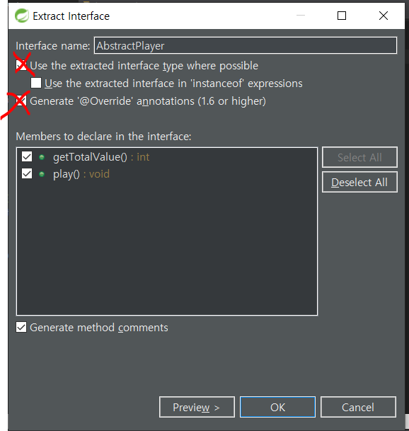

# 스프링의 개요

## 1. 프레임워크

완성된 소프트웨어가 아니라 어떤 문제를 해결하기 위해서 잘 설계된 미완의 모듈로 spring같은 경우 자바 개발자들이 공통으로 사용할만한 기능을 미리 정의해 놓은 **모듈**(코드를 모아놓은 라이브러리)이다.

* 해결해야 하는 문제 : 내가 개발하고 싶은 시스템 - 쇼핑몰, 예약 관리 시스템, 인터넷 뱅킹..
* 재사용이 가능한 모듈이며 일반적으로 프레임워크를 통해서 개발하는 시스템의 공통모듈은 프레임워크에서 제공.
  * 개발자가 처리해야 하는 대부분의 작업을 프레임워크 내부에서 처리해 주므로 **개발**(front-end와 back-end의 교환 작업)을 위한 시간과 노력을 절약할 수 있다.
  * 신뢰있는 프로그램을 개발할 수 있다.
  * 개발자간의 의사소통이 활발하다
  * 주어진 메뉴얼대로 개발하면 된다. 즉, 프레임워크 내부에서 제공할는 모듈을 사용해서 개발하면 된다.

## 2. 스프링의 특징

* 경량 시스템 (포함된 라이브러리가 거의 1MB를 넘지 않기 때문에 가볍다)
* POJO(Plain Old Java Object)로 개발하기 때문에 작성하는 OOP의 특징을 적용하며 개발하면 된다.
* SPRING프레임워크 내부에 IoC컨테이너를 포함하고 있다.

### 1) 의존성 주입 

* 시스템 내부 ( 내가 만든 프로그램) 에서 사용하는 객체를 직접 생성해서 사용하지 않고 스프링 내부에 존재하는 **컨테이너**를 통해 필요한 곳에서 사용할 수 있도록 전달받아서 사용한다.

> ​           ㄴ  스프링 내부에서 라이브러리로 존재한다.
>
> ​			spring-beans-4.2.4.RELEASE.jar
>
> ​			spring-context-4.2.4.RELEASE.jar

* 스프링 내부의 IoC컨테이너를 통해 객체를 관리하면서 커플링을 낮출 수 있다.

* 스프링 내부에는 발생할 수 있는 다양한 모든 경우에 반응할 수 있도록 많은 컨테이너 클래스를 제공한다



## 3. SPRING 컨테이너의 종류

스프링에서는 **BeanFactory**와 이를 상속한 **ApplicationContext** 두 가지 유형이 존재한다.

* **ApplicationContext**  는 스프링 설정 파일에 등록된 <bean> 객체를 생성하고 관리하는 가장 기본적인 컨테이너 기능만 제공.
* **ApplicationContext** 는 **BeanFactory**가 제공하는 <bean> 객체 관리 기능 외에도 트랜잭션 관리나 메시지 기반의 다국어 처리 등 다양한 기능을 제공한다.
  
  * 또한, 컨테이너가 구동되는 시점에 <bean> 등록된 클래스들을 객체 생성하는 즉시 로딩방식으로 동작한다.
  
### bean 엘리먼트의 속성

#### 1. init-method

* Servlet 컨테이너는 web.xml 파일에 등록된 Servlet 클래스의 객체를 생성할 때 **디폴트 생성자**만 인식한다.

  * 따라서, 생성자로 Servlet 객체의 멤버변수를 초기화할 수 없다.
  * 그래서 서블릿은 **init()** 메소드를 **재정의**(overriding)하여 멤버변수를 초기화한다. 

* 스프링 컨테이너 역시, 객체를 생성할 때 디폴트 생성자를 호출한다.

  ```xml 
  <bean id="tv" class="polymorphism.SamsungTV" init-method="initMethod"/>
  ```


#### 2. destroy-method

* 스프링 컨테이너가 객체를 삭제하기 직전에 호출된 임의의 메소드를 지정할 수 있다.

```xml
<bean id="tv" class="polymorphism.SamsungTV" destroy-method="destroyMethod"/>
```


**BeanFactory** : 개발자가 객체를 요청하는 시점에 객체를 생성한다. ( 가장 상위)

^

**ApplicationContext** : 컨테이너 객체가 생성될 때 전달된 xml 안에 정의된 모든 빈을 생성하고 의존성 주입을 처리한다.

^

**WebApplicationContext**

## 4. 의존성 주입

스프링 프레임워크의 가장 중요한 특징은 객체의 생성과 의존관계를 컨테이너가 자동으로 관리한다는 점이다.

이것이 바로 **스프링 IoC(제어의 역행)** 의 핵심 원리이다.

#### 1) DL(Dependency Lookup)

*  컨테이너가 만든 객체를 getBean메소드를 통해 가져오는 작업
* 웹에서는 쓰지 않고 애플리케이션에서 주로 사용한다.

```java
public class TVUser {
	public static void main(String[] args) {
		AbstractApplicationContext factory = new GenericXmlApplicationContext("config/bean.xml");
		TV tv = factory.getBean("tv",TV.class);	//캐스팅을 TV.class로 TV타입임을 명시한다.
		tv.powerOn();
		tv.volumeUp();
		tv.volumeDown();
		tv.powerOff();	
	}
}
```

* **GenericXmlApplicationContext** : 파일 시스템이나 클래스 경로에 있는 XML 설정 파일을 로딩하여 구동하는 컨테이너 이다,
* **XmlWebApplicationContext** : 웹 기반의 스프링 애플리케이션을 개발할 때 사용하는 컨테이너이다.

### 2) DI(Dependency Injection)



* 스프링 설정 파일에 클래스를 등록하려면 **<bean>** 엘리먼트를 사용한다. 
  * `id `속성 ( 참조변수) 은 생략할 수 있지만 `class` 속성은 필수이다.
  * id속성은 컨테이너로부터 <bean>객체를 요청할 때 사용하므로 스프링 컨테이너가 생성한 개체들 사이에서 유일해야 한다. *[ 컨테이너가 각 객체를 식별할 수 있게 해준다.]*

* insaImpl에서 MemberDAO 를 필요로 할 때 내 XML에 생성자를 미리 만들어서 컨테이너가 만들 수 있도록 한다.

* 생성자를 호출시킨다.
* 매개변수 한 개당  constructor-arg 한 개를 추가시켜야 한다.
  * ref는 이미 만들어진 객체를 의미한다. (reference, 참조형)

```xml
	<constructor-arg ref="mydao"/>	
	</bean>
```


**alt+shift+t** : extract interface 자동 생성

