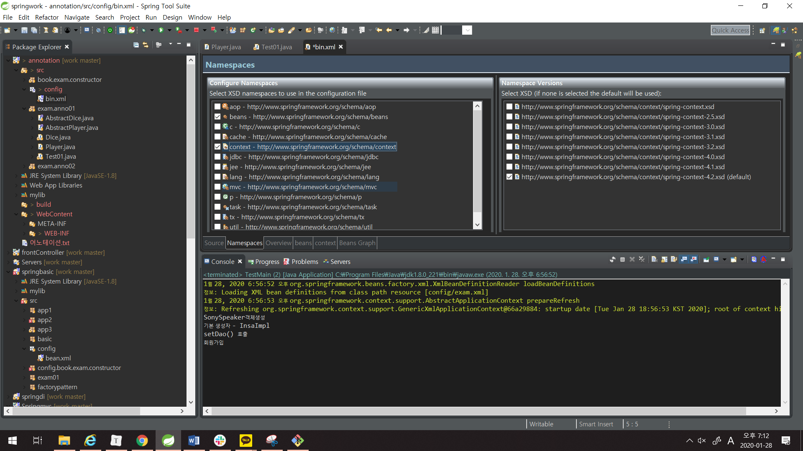
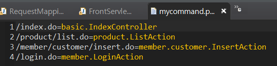
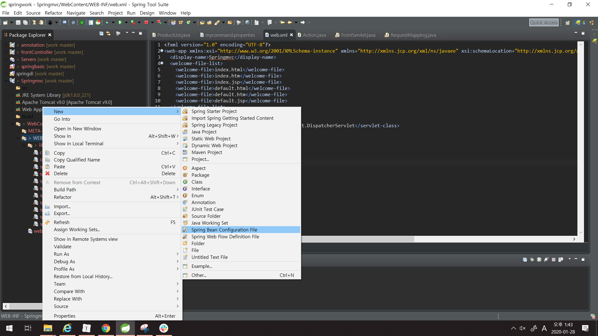
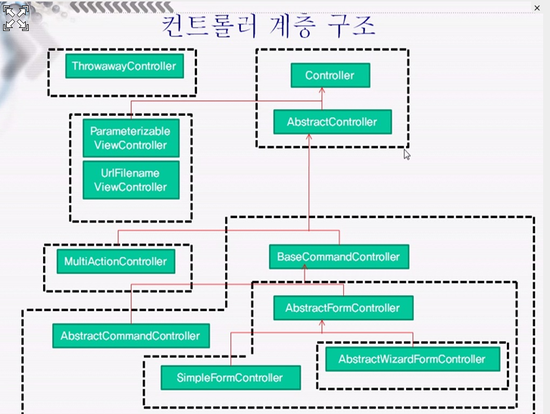

## <<어노테이션을 활용하기>>

- 설정파일에 빈을 등록하지 않고 사용한다.
- 간단하게 기호를 이용하여 빈을 사용할 수 있도록 설정.
- bean을 설정파일에 직접 등록하지 않는다. 
  - annotation을 이용해서 등록 - > 어떤 패키지에서 빈을 찾아야 하는지는 명시

### [규칙]

- 설정파일에 <context:component-scan>엘리먼트를 이용해서
    컨테이너가 빈을 찾을 수 있도록 패키지를 등록한다.
- **@Service** => 일반 객체(서비스객체를 등록)

```xml
<context:component-scan base-package="exam"/> <!--exam에 속해있는 모든 패키지의 bean을 알아서 만들어준다.  -->
	<!-- <context:component-scan base-package="book"/> -->
```

- 기본생성자를 반드시 추가해야 한다.

- 빈 생성을 위해 사용할 수 있는 어노테이션 기호
  * **Component** : 일반적인 빈
  * **Service** : 비지니스로직(DAO제외)이 정의되어 있는 빈을 등록하는 경우 사용 
          * 클래스의 첫 글자를 소문자로 변경한 이름을 빈을 name에 등록.
        * Service클래스 내부에서 자동으로 bean객체를 만들어 준다.
        * 클래스 이름으로 준다.
             Dice => dice
             Player => player
  * **Repository** : DAO를 등록하는 경우 사용
  
  
  
- 빈의 이름을 명시하고 싶으면 ()안에 ""로 정의
  => ex) 빈의 이름을 myplayer
     @**Service**("빈이름")
  
  ```xml
    @Service("myplayer")
  
  			---------
  
                  |____________등록한 빈의 이름은 lookup하거나                                     				        의존성주입할때 사용
  ```
  
  * 어노테이션 설정 시




## FrontServlet

모든 보안, logging 같은 기능들은 공통으로 처리해야 한다.

이에 대한 모든 요청에 대한 관리를 한 곳에서 받아 처리할 수 있는 Servlet을 만든다.

```java
@WebServlet(name="front",urlPatterns= {"*.do","*.jsp","*.html"})	//모든 요청에대한 관리를 한 곳에서 받아 처리한다.
```

* 요청 정보를 분석해서 추출 - 어떤 path로 요청할 지 모르기 때문에 다음과 같은 작업 수행한다.

```java
		String contextPath = request.getContextPath();
		String requestURI = request.getRequestURI();
		String Path = requestURI.substring(contextPath.length());
		System.out.println("Path=>"+Path);
```

* 추출한 요청 `path`로 등록되어 있는 실행할 클래스 정보를 찾아오는 작업
* `RequestMapping`객체에 의뢰 -> `RequestMapping`객체의 메소드를 호출하면 실제 실행할 객체를 찾아서 리턴.
  * 즉, FrontServlet이 넘겨준 요청path를 가지고 실제 실행할 클래스의 객체를 만들어서 리턴하는 작업을 수행
   * 미리 요청 path별로 실행할 실제 클래스를 등록한 설정파일을 보고 객체를 찾아서 생성

```java
RequestMapping mappingObj = new RequestMapping();
Action action = mappingObj.mapping(Path);
action.run(request, response);
//run메소드의 실행결과를 받아서 응답view를 찾는다.
		//응답view로 forward or redirect
```

### 1. RequestMapping

*  mycommand.properies파일에 등록된 요청path를 보고 실행할 객체를 찾는다.



* XML파일이나 properties파일을 파싱하는 코드를 정의할 map을 만든다.

  * 요청 `path`가 `key` , 실제 실행할 `객체` `value`

  ```java
  private HashMap<String,Action> actionMap = new HashMap<String,Action>();
  	public RequestMapping() {
  		//생성자 내부에서 설정파일을 파싱해서 객체로 만드는 코드가 정의되어야 한다.
  	}
  ```

  * 매개변수로 전달된 path로 등록된 Action 객체를 actionMap에서 찾아서 리턴하는 코드가 정의되어야 하나, 우리는 if...else if로 우선 처리하는 방법을 먼저 배운다.

  ```java
  Action action = null;
  		if(path.equals("/product/list.do")) {
  			action = new ProductList();
  		}else if(path.equals("/member/customer/insert.do")){
  			action = new MemberInsert();
  		}else if(path.equals("/login.do")) {
  			action = new LoginAction();
  		}
  ```

  


## <<Spring MVC프로젝트 구성>>

1. **Dynamic Web Project** 생성 - (maven이 아닌 경우 꼭 해야 할 과정)

2. **라이브러리를 lib폴더에 복사하기**

3. **DispatcherServlet**을 **web.xml**에 등록

   - 모든 요청이 DispatcherServlet을 통해 진입하도록 설정해야 스프링이 제공하는 여러가지 기능을 적용할 수 있다. ( frontController 패턴이 적용되어 있다. ) 
- **Class DispatcherServlet**
     - This servlet is very flexible: It can be used with just about any workflow, with the installation of the appropriate adapter classes. It offers the following functionality that distinguishes it from other request-driven web MVC frameworks: 

4. **spring**에서 사용할 **설정 파일**을 만든다.

   * 따로 등록하지 않으면 web프로젝트에서 사용할 스프링 설정 파일은 파일 명을 작성할 때 규칙이 있다.
   * [DispatcherServlet을 등록한 서블릿 명] - servlet.xml

   ```text
   ex) 서블릿 명 : springapp
   /WEB-INF/
       +
      |_springapp-servlet.xml
   ```

   

5. **Controller** 작성하기

* 기본 web에서 서블릿과 같은 역할을 하는 클래스
* 실제 처리를 담당하는 클래스



6. Spring 설정 파일에 컨트롤러 등록하기

* <bean>태그를 이용해서 5번에서 생성한 컨트롤러 등록하기

* 요청path 를 기준으로 컨트롤러를 등록할 것이므로 id속성을 쓰지 않고 name속성을 사용한다.

* **DispatcherServlet**내부에서 요청path에 맞는 컨트롤러를 **getBean**할 수 있도록 등록.

  ```xml
  [형식]
  <bean name="요청 path" class="컨트롤러 클래스"/>
  [예제]
  /test.do 로 TestController를 요청
  <bean name="/test.do" class="test.TestContoller"/>
  ```

  * 1~4는 한번만, 5번을 만들어 6번에 등록하는 과정만 반복 수행하면 된다.

### Spring MVC 구성요소

> Spring MVC를 구축하고 웹을 실행해야 하는데,
>
> 스프링이 제공하는 모든 기능을 잘 활용하기 위해서 스프링이 내가 작성한 자바빈을 관리할 수 있도록 작업해야 한다. [즉, 스프링 내부의 컨테이너가 내가 작성한 빈을 생성하고 관리할 수 있도록 작업함]
>
> 이를 위해 모든 요청이 **DispatcherServlet**이라는 서블릿을 통해 들어올 수 있도록 처리해야 한다.

1. **DispatcherServlet** : 클라이언트의 모든 요청을 처리하기 위해 첫 번째로 실행되는 서블릿
2. **HandlerMapping** : 클라이언트가 요청한 path를 분석해서 어떤 컨트롤러를 실행해야 하는지 찾아서**DispatcherServlet**으로 넘겨주는 기능을 하는 객체
3. **Controller** : 클라이언트의 요청을 처리하는 객체
   * DAO의 메소드를 호출하는 기능을 정의
4. **ModelAndView** : **Controller** 에서 `DAO`의 메소드 실행결과로 만들어진 데이터에 대한 정보나 응답할 VIEW에 대한 정보를 갖고 있는 객체
5. **ViewResolver** :  **ModelAndView** 에 저장된 VIEW의 정보를 이용해서 실제 어떤 VIEW를 실행해야 하는 지 정보를 넘겨주는 객체

* 스프링MVC를 구축하면 위의 클래스들이 자동으로 실행되며 일처리를 한다.

  따라서, 필요에 따라 스프링에서 지원하는 **ViewResolver** 나 **HandlerMapping** 객체를 다양하게 등록하고 사용할 수 있다. 

* 기본 설정을 이용하는 경우 개발자는 **Controller**만 작성하고 설정파일이나 어노테이션@으로 등록하면 된다.

**DispatcherServlet**에서 path를 분석한 뒤, **HandlerMapping** 에 갖고있는 .do 파일에 대해 의뢰한다.

