## maven 라이브러리 설정


#### <참고>UTF-8 설정

대다수의 사이트들은 `uft-8` 을 사용한다.

```html
<meta charset="utf-8">
```


### maven ?

MAVEN이라는 build-tool은 기본적으로 중앙 저장소에서 우리가 사용할 수 있는 library 를 관리한다. 

기본적으로 현업에서 사용하는 프로젝트는 depth가 3개 이상 되도록 만들어야 한다.

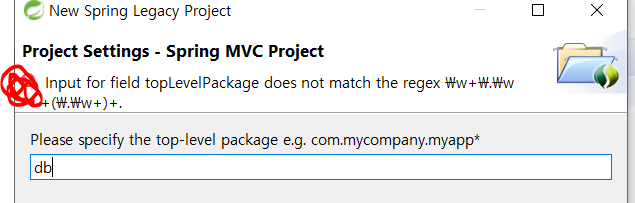

마지막 패키지가 context path로 등록이 된다. ( context path는 프로젝트 명이랑 맞춰주는 것이 일반적이다.)

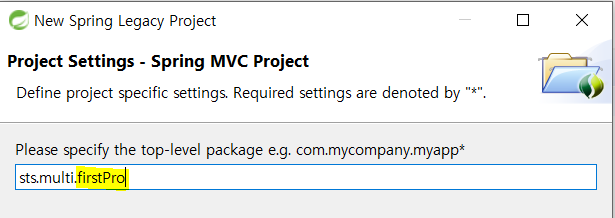


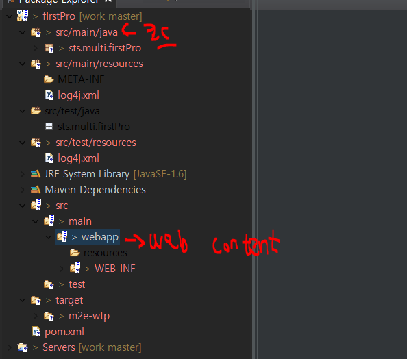


* 기본으로 버전에 맞는 lib가 저장되어 있는 것을 볼 수 있다.

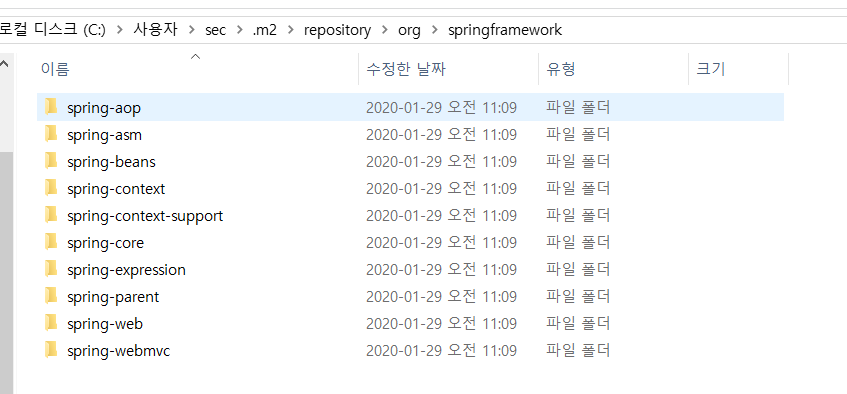

maven dependencies에서 어느 경로에 저장되어 있는지도 확인 가능하다. 

pom.xml 에서 dependency를 추가해서 원격 라이브러리를 사용할 수 있다.

로컬 레포지토리가 다운 안될 경우 1) 로컬레포지토리 삭제 후 다시 킨다. 2) 카피 후 복사 붙여넣기

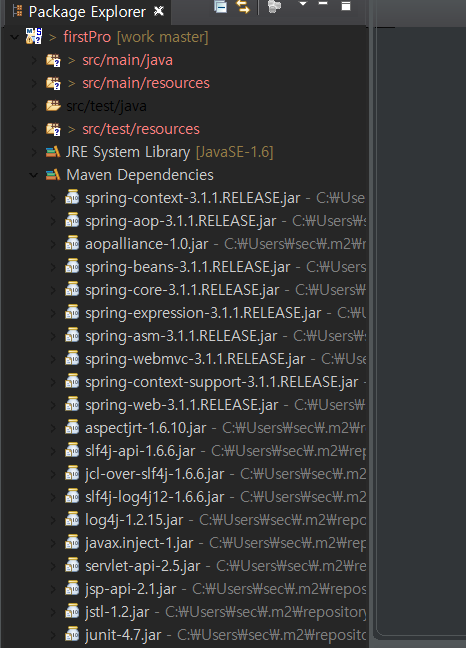

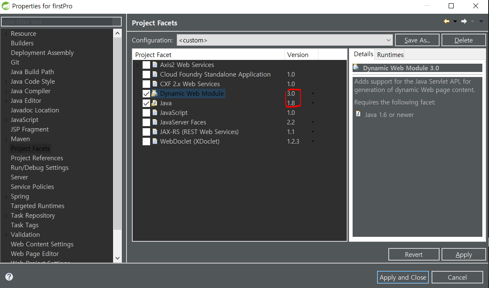


* properties 설정

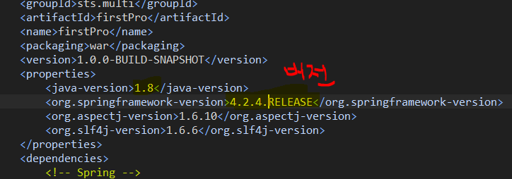

* 버전에 맞게 설정하기 
* servlet 또한, 메이븐에서 (https://mvnrepository.com/)  제공해주는 버전에 맞는 것으로 사용해주기


* spring 기반 mvc 카피하기(import)

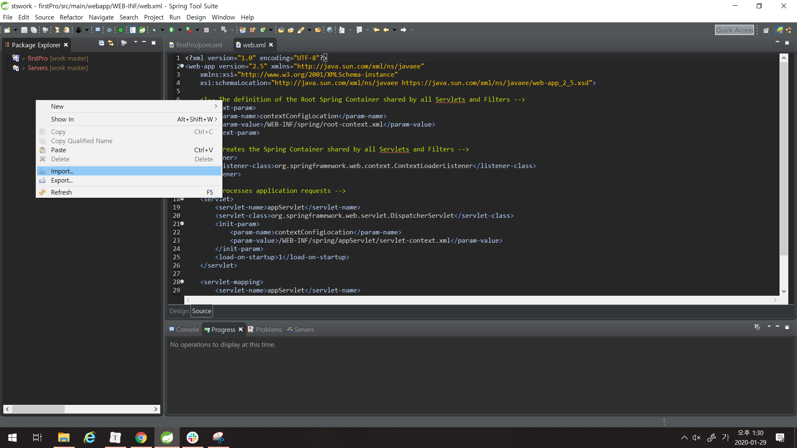

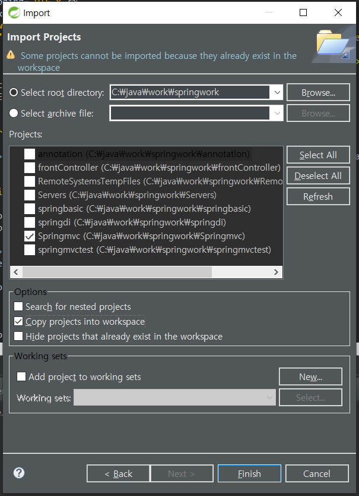

* dispatcher 경로 설정 & 한글 설정

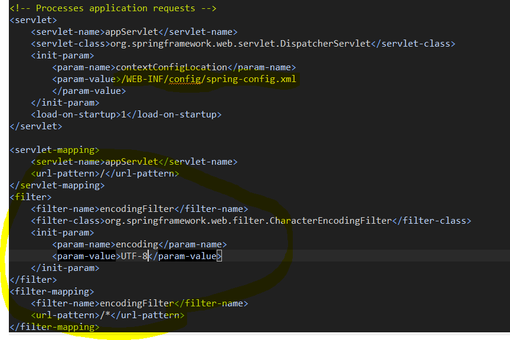

* 설정해준 /WEB-INF/config/spring-config.xml에 맞게 파일을 옮겨준다.
  * (app servlet 하의 파일을 config로 옮기면 된다.) 
  * springwork에서 저장하기 위함이다.

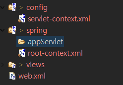

위의 상태에서 servlet-context.xml을 rename한다.

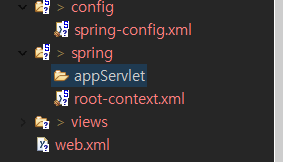

* spring-config.xml <bean> 객체 설정 

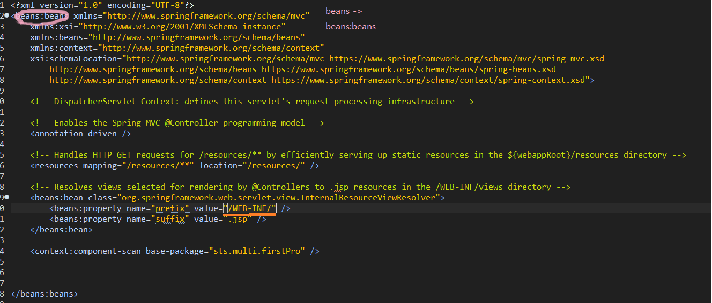

* spring-config.xml

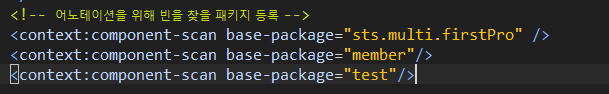