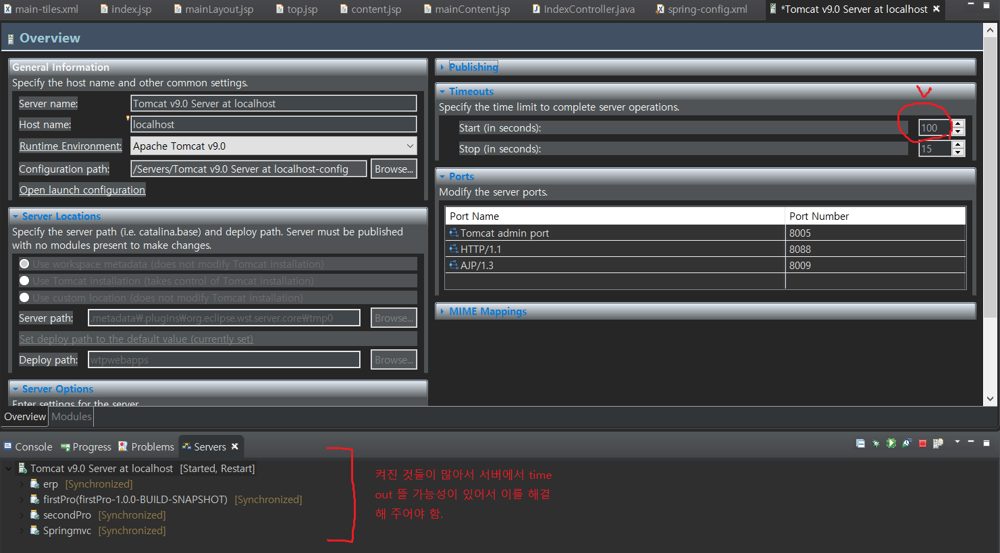
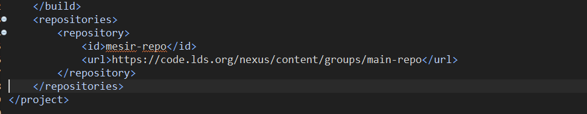
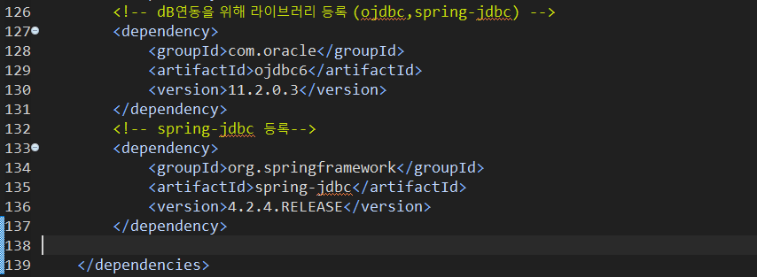
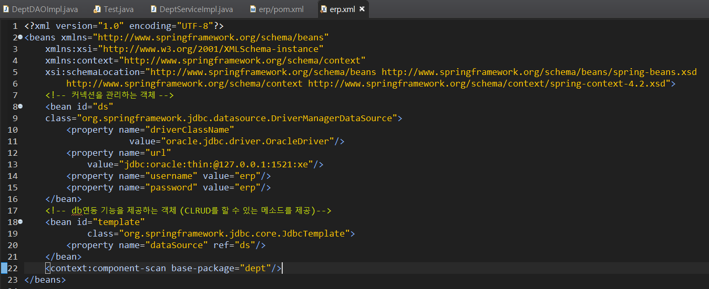
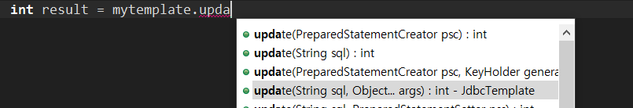

# ★ spring mvc -Tiles

> @ service - 비즈니스 로직
>
> @repository - DAO
>
> @controller - 컨트롤러

`page ` jsp페이지에 대한 속성 지정
`include ` 태그 부분에 지정한 페이지 정적으로 삽입
`<%@ include file="header.jsp"%>`
`taglib` 새로운 태그를 정의하여 사용


---

#### [server timeout 설정]




## Tiles

Tiles프레임 워크를 이용해서 화면 구성하기


**1. Tiles 라이브러리를 pom.xml에 등록 **

```xml
<!-- tiles 관련 라이브러리 -->
		<dependency>
			<groupId>org.apache.tiles</groupId>
			<artifactId>tiles-jsp</artifactId>
			<version>3.0.8</version>
		</dependency>
```


**2. 레이아웃이 적용되어 있는 템플릿 파일과 연결할 jsp 파일들이 미리 준비되어 있어야 한다.** 

* Spring 내부에서 뷰를 만들 때 tiles를 이용해서 뷰를 만들 수 있도록
* 정적 리소스를 spring-config.xml에 작업해주어야 경로 설정이 좀 더 간편하다.

```xml
<!-- Handles HTTP GET requests for /resources/** by efficiently serving 
		up static resources in the ${webappRoot}/resources directory -->
<!-- 정적 리소스를 연결하는 부분 -->
	<resources mapping="/images/**"
		location="/WEB-INF/static/images/" />
	<resources mapping="/common/**"
		location="/WEB-INF/static/common/" />
```


**3. tiles 설정 파일 작성**  *(main-tiles.xml)*

* 템플릿을 등록
  * 템플릿의 각 영역을 나누고 각 영역에 기본으로 연결할 jsp 파일을 설정한다.

**4. 템플릿 ( 레이아웃을 미리 설정해 놓은 파일- mainLayout.jsp) 으로 만들어 놓은 jsp 파일의 각각 영역이 템플릿에 등록한 영역과 일치하도록 설정**

* tiles에서 제공하는 태그를 사용한다.
* 내부에서 tiles설정 파일에 등록한 내용과 연결하여 실행하는 작업을 처리하기 위해 tiles에서 제공하는 태그를 써서 작업해야 한다.

**5. 스프링 내부에서 DispatcherServlet이 뷰 정보를 ViewResolver에게 전달하면 ViewResolver가 tiles 프레임워크를 활용해서 뷰를 만들 수 있도록 spring 설정파일에 등록하는 작업.**

* tiles 설정 파일이 어떤 파일인지를 등록
* 만들어야 하는 뷰가 tiles뷰임을 등록

**6. 템프릿을 활용해서 만들어질 뷰의 정보를 tiles 설정 파일에 등록**


```xml
<beans:bean class="org.springframework.web.servlet.view.InternalResourceViewResolver">
		<beans:property name="prefix" value="/WEB-INF/"/> 
		<beans:property name="suffix" value=".jsp" />
		<beans:property name="order" value="2"/> 
	</beans:bean>
```

* 1순위에서 view를 만들지 못하면 2순위를 사용해서 만들기 때문에 순위를 정해준다.

```xml
<beans:list>
				<beans:value>/WEB-INF/**/*-tiles.xml</beans:value> 
			</beans:list>
			</beans:property
```

* **는 어느 파일이든지 다 해당된다는 의미 ( 폴더에서 사용)
* *는 파일에서 사용.

### 작업 순서

1. `index`라는 뷰를 만드는 기준은 내 스프링 설정 파일에 등록된 `ViewResolver`에 따라 다르게 작성된다

```java
@Controller
public class IndexController {
	@RequestMapping("/index.do")
	public String index() {
		return "index"; 	
		/*		/idex.do 로 요청하면 `index`라는 이름의 뷰를 forward하겠다는 의미 */
	}
}
```

indexController에서 `index` 라는 뷰를 만들었기 때문에 이를 정의해주어야 한다.

```xml
<!-- 실제 사용될 뷰를 정의 -->
<definition name="index" extends ="indexTemplate"></definition>
```

2. 로그인 창 들어가기

```java
@Controller
public class EmpControlloer {
	@RequestMapping("/emp/login.do")
	public String login() {
		return "login";
	}
}
```

* main-tiles.xml 작성


```xml
<definition name="login" extends="mainTemplate"></definition>
```


## spring-jdbc

* 메이븐에서 지원해주는 라이브러리가 아니므로 중앙저장소에 관련 repository가 없다.
  *  따로 추가해주어야 한다.



* dependency 추가



* spring-Jdbc를 하기 위해서는 

  1) connection 관리 

  * DriverManager
  * **<DataSource> Connection Pool (WAS에서 제공해준다)**

  2) sql 처리가 필요하다

  * **JdbcTemplate**



### 1. 메소드

* **queryForList(String sql)** Execute a query for a result list, given static SQL.

* **query**  select를 위한 메소드 ( 전체 데이터 조회 )
  * `RowMapper()` : 검색된 데이터의 하나의 Row랑 Mapping하는 작업

* **queryForObject(String sql, Class requiredType)** Execute a query for a result object, given static SQL.

​	: 객체 하나가 리턴된다.

* **update(String sql, Object... args)**



Issue a single SQL update operation (such as an insert, update or delete statement) via a prepared statement, binding the given arguments.

 ### 2. 소스코드

#### 1] insert

```java
public int insert(String deptno, String deptname) {
		String sql = "insert into dept(deptno,deptname) values(?,?)";
		int result = mytemplate.update(sql, deptno,deptname);
		return result;
	}
```

* DeptServiceImpl.java

```java
public int insert(String deptno,String deptname) {
		return dao.insert(deptno, deptname);
		
	}
```

#### 2] update

* DeptDAOImpl.java

```java
public int update(String deptno, String deptname) {
		String sql = "update dept set deptname=? where deptno=?";
		int result = mytemplate.update(sql, deptname,deptno);
		return result;
	}
```

#### 3] read

* MyDeptRowMapper.java
  * 레코드 한 개를 dto와 mapping 해서 리턴
  * 즉, 개발자는 무슨 DTO 랑 매핑해야 하는지만 지정해주면 된다.

```java
public class MyDeptRowMapper implements RowMapper<DeptDTO> {

	@Override
	public DeptDTO mapRow(ResultSet rs, int rowNum) throws SQLException {
		System.out.println("mapRow=>"+rowNum);
		DeptDTO dept = new DeptDTO(rs.getString(1), rs.getString(2));
		return dept;
	}
}
```

* DeptDAOImpl.java

```java
	public List<DeptDTO> selectAll(){
		return mytemplate.query("select deptno,deptname from dept", new MyDeptRowMapper());
	}
```

* 부서 출력 Test

```java
List<DeptDTO> list = service.selectAll();
		
		for (int i = 0 ; i<list.size();i++) {
			DeptDTO dept = list.get(i);
			System.out.println(dept.getDeptno()+":"+dept.getDeptname());
		}
```

