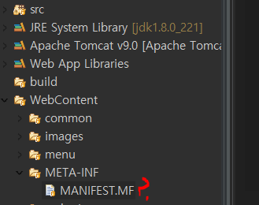
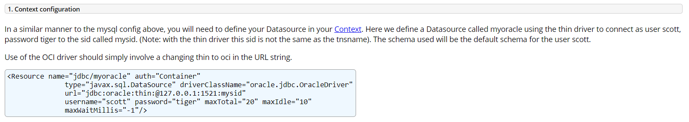
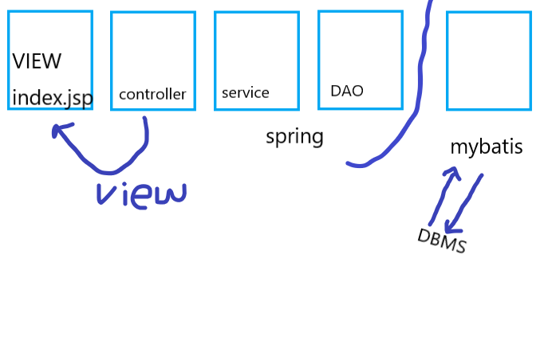

## META-INF 란,




* `MANIFEST. MF`는 프로젝트, 라이브러리에 대한 명세를 기술해 놓는 파일을 말한다.
* `META-INF` 는  WAS의 설정파일을 명세해놓는 폴더이다.



* maxTotal : 최대 20개까지 커넥션 풀 인식 / maxIdle : 커넥션이 사용중이더라도 10개까지는 유지 가능 

```xml
<Resource name="jdbc/myspring" auth="Container"
              type="javax.sql.DataSource"
              driverClassName="oracle.jdbc.driver.OracleDriver"
              url="jdbc:oracle:thin:@127.0.0.1:1521:xe"
              username="erp" password="erp"
              maxTotal="20" maxIdle="10" 
              maxWaitMillis="-1"/>
	</Context>
```


## Connection Pool

1. DBCP
2. WAS


### WAS에서 제공하는 Connection Pool 이용하기

> WAS마다 각각의 고유한 자원으로 Connection Pool을 만들고 관리한다. 자바에서 이를 사용하기 위해 표준 API인 `javax.sql.Datasource`를 이용
> 	1. WAS에 등록된 자원을 lookup한다.
> 	- `initialContext` 의 `lookup`메소드를 이용
> 	2. WAS에서 lookup한 `Datasource`로 부터 커넥션을 가져온다
> 	- `DriverManager`와 동일하게 `getConnection`을 이용

```html
<%
	//1. was에 등록된 자원을 찾아올 수 있는 기능을 제공하는 객체를 생성
	InitialContext context = new InitialContext();
	
	//2.InitialContext객체를 이용해서 lookup
	DataSource ds = (DataSource)context.lookup("jdbc/myspring");
	Connection con = ds.getConnection();
%>
	<h3><%= con %></h3>
```

## MyBatis

 

트랜잭션** :  한꺼번에 모두 수행되어야 하는 일련의 작업 단위.

https://blog.mybatis.org/

### [MyBatis 작업]

**1. pom.xml에 의존 모듈 추가**

* mybatis
* mybatis-spring

**2. mybatis에서 사용할 설정 파일을 작성**

* mybatis 메인 설정 파일 : mybatis를 실행할 때 필요한 내용을 정의

  * connection 관리를 위해 필요한 내용 (spring으로 관리하므로 생략)
  * mapper(sql문 정의)에 대한 정보
  * mapper에서 사용할 DTO
  * SPRING설정파일이 저장되는 위치에 추가

  ​       */WEB-INF/config/mybatis-config.xml*

* mapper : sql문을 정의하는 설정 파일
  * 테이블 한 개에서 사용하는 sql문을 하나의 mapper파일에 저장한다. ( 테이블 1개 : 1개의 mapper 파일
  * src 폴더에 추가

**3. 스프링 설정파일에 mybatis를 사용할 수 있도록 등록 **

* `sqlSession`객체가 `mybatis`에서 사용하는 핵심 클래스

  *(spring jdbc의 **jdbcTemplate**과 동일)*

  * connection을 사용(생성) 할 수 있도록 등록

  * **sqlSession**을 사용하려면 `factory` 객체 부터 생성해야 하므로 Factory객체를 먼저 설정한다. 

    *spring에서 mybatis의 핵심 클래스를 사용할 수 있게 하기 위한 객체*

    * **Connection** 객체를 사용, mybatis의 메인 설정 파일을 등록

  * mybatis의 핵심클래스인 **sqlSession** 클래스의 하위클래스를 생성

    * **sqlSessionTemplate** => spring-jdbc의 jdbcTemplate와 동일

```xml
	<!-- 1.Connection 관리를 담당하는 객 체 -->
	<beans:bean id="ds"
				class="org.springframework.jndi.JndiObjectFactoryBean">
				<beans:property name="jndiName" value="jdbc/myspring"/>
				<beans:property name="resourceRef" value="true"/>
	</beans:bean>
	<!--  2.spring에서 mybatis의 핵심클래스인 sqlSession을 사용할 수 있도록 하기 위해 생성-->
	<beans:bean id="SqlSessionFactory"
			class="org.mybatis.spring.SqlSessionFactoryBean">
		<beans:property name="dataSource" ref="ds"/>		
		<beans:property name="configLocation"
			value="/WEB-INF/config/mybatis-config.xml"/>	
	</beans:bean>
	<!-- 3. mybatis의 핵심클래스를 등록 -->
	<beans:bean
		class="org.mybatis.spring.SqlSessionTemplate">
			<beans:constructor-arg ref="SqlSessionFactory"/>
		</beans:bean>						
```


### [기능 추가]

**0. 새로운 테이블로 작업을 한다면 mybatis-config.xml 파일에 VO 파일과 mapper파일 등록**

**1. mapper에 sql문 추가**

**2. DAOImpl 클래스에 메소드 정의**

* `mybatis`의 핵심 클래스인 `sqlSession`클래스를 이용해서 작업

**3. ServiceImpl 클래스에서 dao의 메소드 호출할 수 있도록 메소드 정의**

**4. Controller에서 ServiceImpl의 메소드를 호출해서 작업할 수 있도록 정의**

**5. Controller에서 response하는 뷰에서 Controller에서 공유해준 데이터를 꺼내서 출려가기(select 작업)**

**6. tiles 설정파일에서 뷰 등록**


