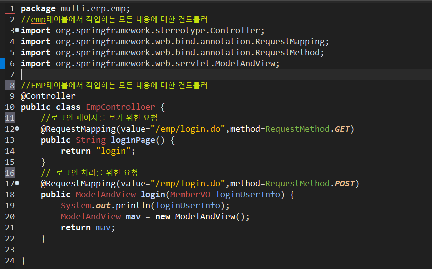
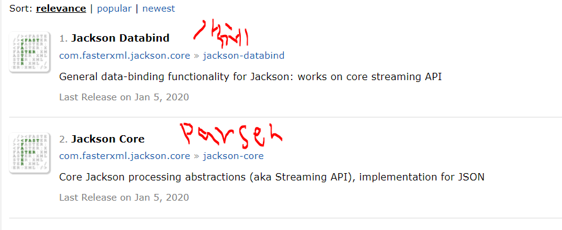
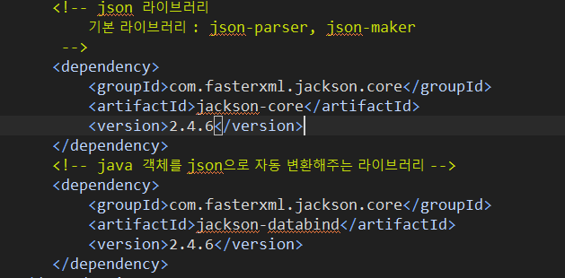
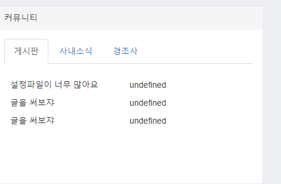

Spring - jquery설치

-> marketplace에서 tern 다운

->configue-tern to project


Service 제어

```xml
<select id="categorySearch" resultType="board" parameterType="String">
  			select * from board where category=#{category}
  		</select>
```

* DAO는 SQL문 한개당 하나의 메소드가 만들어져야 한다.

* 크롬은 한글 인코딩이 자동으로 되지만, 익스플로러는 되지 않는다.


## 게시판

* select 옵션에 따라 검색하기

```html
<form >
		<select name="category"  id="category">
				<option value="all">전체게시물</option>
				<option value="경조사">경조사</option>
				<option value="사내소식">사내소식</option>
				<option value="게시판">게시판</option>
		</select>
</form>
```

* BoardController.java

```java
@Autowired
	BoardService service;
	@RequestMapping("/board/list.do")
	public ModelAndView boardList(String category) {
		System.out.println("category=>"+category);
		ModelAndView mav = new ModelAndView();
		List<BoardVO> list = service.boardList(category);
		System.out.println(list);
		//3.데이터 공유 - jsp 페이지에서 응답뷰 만들 때 사용
		mav.addObject("boardlist", list);
		mav.addObject("category",category);
		//4.뷰의 이름 등록
		mav.setViewName("board/list"); // tiles에 등록하는 이름과 일치
		return mav;
	}
```

* BoardServiceImpl.java

```java
@Override
	public List<BoardVO> boardList(String category) {
	List<BoardVO> list = null;
		if(category!=null) {
			if(category.equals("all")) {
				list=dao.boardList();
			}else {
				list=dao.categorySearch(category);
			}
		}
		return list;
	}
```

* board.xml
  * mybatis는 파라미터 여러개 저장이 되지않기 때문에 `MemberVO `한개로 묶어서 전달해주어야 에러가 나지 않는다.

```xml
 <select id="categorySearch" resultType="board" parameterType="String">
  			select * from board where category=#{category}
 </select>
```

* BoardDAOImpl

  


## 로그인

request view -> Controller ->Service -> dao -> mapper.xml

(login.jsp)   			|

​								ㄴ response view (board/list)

​								 	로그인 후,  top.jsp의 이미지가 로그인 사용자 이미지로 변경 

* emp.xml (mapper 작성)
  * parameter타입의 매개변수 2개가 필요하다.

```xml
<mapper namespace="multi.erp.emp">
  	<select id="login" resultType="emp" parameterType="emp">
  		select m.*
  		from member m
  		where id=#{id} and pass=#{pass}
  	</select>
  </mapper>
```

* mybatis-config.xml
  * 설정 파일 추가

```xml
<configuration>
  	<typeAliases>
  		<typeAlias type="multi.erp.emp.MemberVO" alias="emp"/>
  	</typeAliases>
  	<mappers>
  		<mapper resource="mapper/emp.xml"/>
  	</mappers>
  </configuration>
```

* 로그인 파라미터 매핑용 생성자 만들기 [MemberDAO]

```java
	public MemberVO(String id, String pass) {
		super();
		this.id = id;
		this.pass = pass;
	}
```

* 로그인시, user 값을 한개만 가져오기 때문에 `selectOne` 사용

```java
@Repository
public class EmpDAOImpl implements EmpDAO {
	@Autowired
	SqlSession SqlSession;
	@Override
	public MemberVO login(MemberVO loginUser) {
		return SqlSession.selectOne("multi.erp.emp.login", loginUser);
	}
}
```

* EmpServiceImpl



* 상태 정보 유지

  * 쿠키 : 클라이언트 쪽에 저장이 된다.

    * 정보가 노출이 되어 중요한 데이터는 처리할 수 없다.
    * String밖에 사용이 안되어 자바객체는 넣을 수 없다.

  * 세션 : 

  * request : 한번 들어갔다가 나오면 정보가 사라진다.

    * 게시판

## ajax

(비동기 + javascript+)

서버와 데이터를 교환하는 기술의 하나.

클라이언트가 서버와 **적은 양의 데이터를 교환**하여 비동기적으로 HTML페이지를 업데이트할 수 있다.

@ResponseBody ; 일반 요청이 아니라 ajax요청이라는 명시

```java
@RequestMapping(value="/emp/idCheck.do",method=RequestMethod.GET,produces="application/text;charset=utf-8") 
	public @ResponseBody String idCheck(String id) {
		boolean state = service.idCheck(id);
		String result="";
		if(state) { // 이미 사용자가 입력한 아이디가 db에 저장되어 있다는 의미
			result = "사용 불가능한 아이디";
			
		}else {
			result="사용가능한 아이디";
		}
		
		
		return result;
	}
```

## JSON(JavaScript Object Notation)

**서버에서 값을 XML처럼 받을 수 있고 좀 더 쉬운 방법으로 접근하는 방법을 고민하며 만들어진 데이터 통신방법**


1. 자바스크립트에서 제공되는 객체와 동일한 유형이다.
2. XML보다 경량으로 데이터를 교환하기 위한 기법이다.

3. 이해하기 쉽고 독립적이므로 어떤 언어에서도 사용할 수 있다.

4. 웹상에서 데이터를 주고 받을 때 주로 사용한다.

5. MIME타입은 application/json이며 파일 확장자는 .json이다.

json 파일 유효성 검증 : https://jsonlint.com/

```json
p{

---- jsonObject [ dto]

"color":"red";"a":[ ]

							------ jsonArray	

}
```



* 라이브러리 추가



* ajax로 카테고리별 게시판 데이터를 요청하는 메소드 
  * 컨트롤러 메소드처럼 `ModelAndView`를 리턴하지 않고 일반 메소드 처럼 조회한 데이터를 `ArrayList로 리턴`하면 **jackjon라이브러리**가 자동으로  `ArrayList<BoardVO>`를 json으로 변환해서 리턴해준다.

    
    