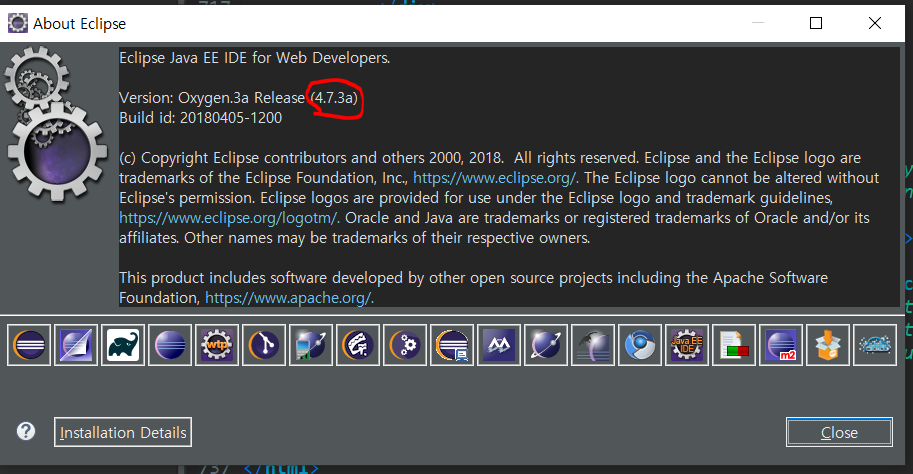
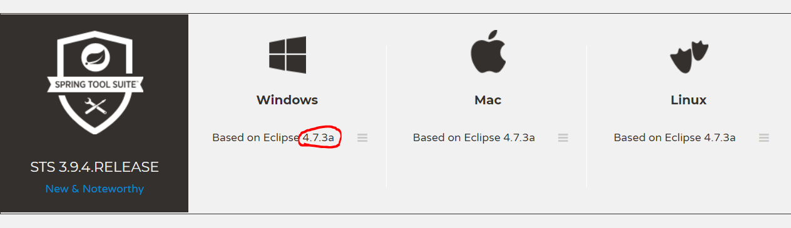
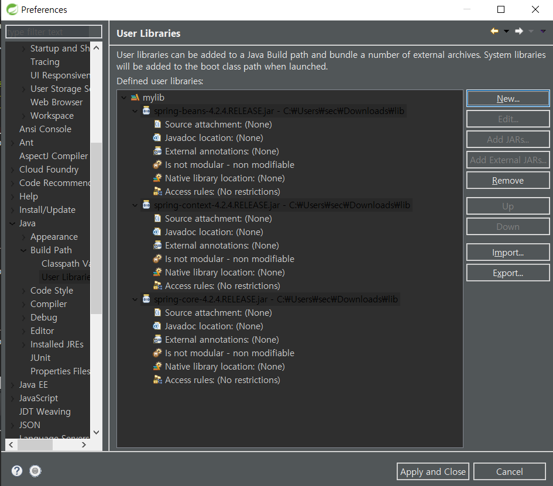
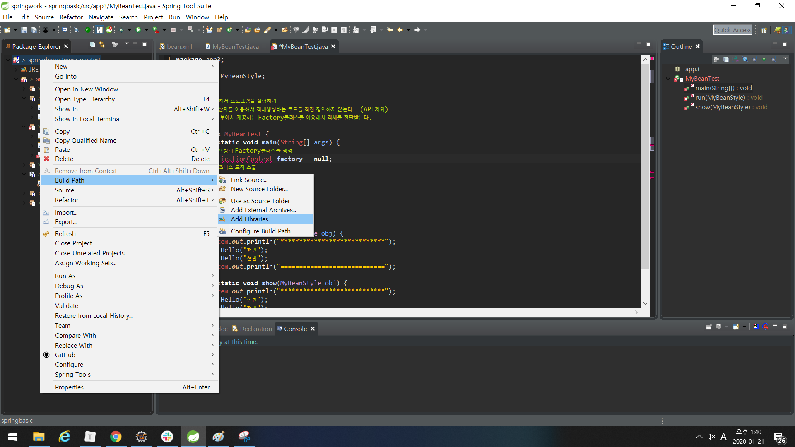
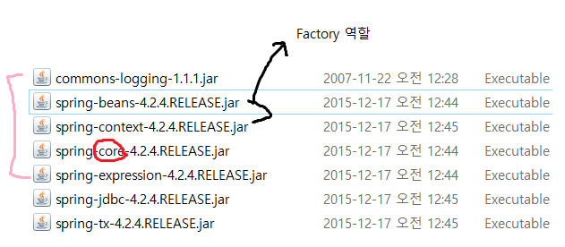
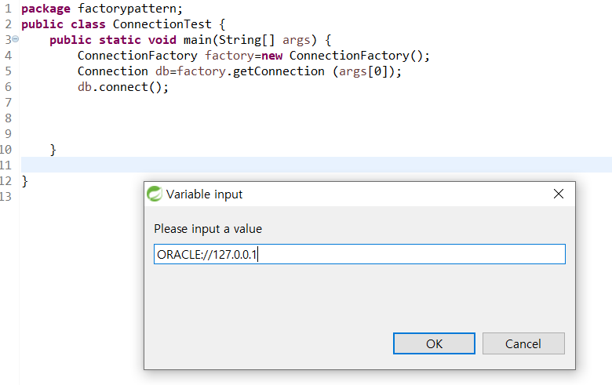
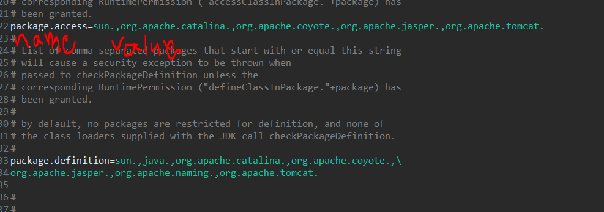
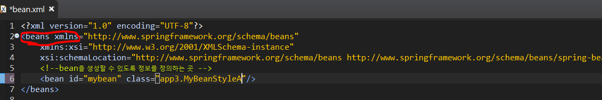

####  Spring 설치 버전

사이트 : [spring.io](http://spring.io/)

- dynamic web project 에서 maven project 변환
- 이클립스 : sts플러그인 추가
- sts를 다운받아 사용 *(내가 사용할 버전 )*



현재 이클립스 **4.7.3a**



* 사용자 정의 라이브러리 만들기

  

* 라이브러리 적용하기

  ex ) Caused by: java.lang.ClassNotFoundException: org.apache.commons.logging.LogFactory

  Sping은 **의존 모듈**이기 때문에 내가 사용하지 않더라도 내부에서 사용되는 것에대해 모두 처리해주어야 한다.

  




# Spring

프레임워크란, 뼈대 혹은 틀로서 소프트웨어 관점에서 **아키텍처**(개발에서 기본이 되는 뼈대나 틀)에 해당하는 골격코드이다.

밑바닥부터 하나하나 개발하는 것이 아니라 화면에 표현되거나 데이터를 처리하는 방식, 외부 모듈과 연계하는 방식 등 미리 구조화된 틀과 라이브러리 등을 제공하고 그 기반에서 개발자가 개발한 코드를 제어하는 것

> **M/V/C** (모델,뷰,컨트롤러) : Model2 아키텍쳐 적용
>
> Spring에서의 객체는 **bean** 이라고 한다.

* **제어 역행**( IoC : Inversion of Control)

 \- 애플리케이션의 느슨한 결합을 도모.

 \- 컨트롤의 제어권이 사용자가 아니라 프레임워크에 있어 필요에 따라 스프링에서 사용자의 코드를 호출한다.

* 결합도가 극도로 높은 프로그램은 클래스 간의 **결합도**가 높고 **의존성**이 높다.

사용되는 클래스를 변경하면 이 클래스를 사용하고 있는 모든 소스를 수정해야 한다.

즉, 수정해야 하는 범위가 넓어진다.

**따라서**


이렇게 OOP가 적용되어 있는 프로그램으로 작성해야 한다.

* OOP특성을 적용하기 위해서 상위 클래스를 정의하고 **MyBeanStyleXXX**클래스를 사용하는 매개변수의 타입을 상위 타입으로 변경하며 다형성을 적용했다.

 * 사용되는 객체가 변경되더라도 코드를 수정하는 범위는 줄어든다.
 * 그러나 실제 객체를 전달하는 곳에서는 생성해서 전달하고 있다.
 * 사용하는 객체가 바뀔 때마다 객체를 직접 생성하는 코드를 모두 수정해야 한다는 단점은 존재한다.
 * 사용하는 곳에서 직접 new해서 객체를 생성하는 코드는 없어져야 하는 코드이다.





Spring은 xml을 통해 설정 파일을 관리한다.

WEB-INF의 web.xml과 비슷하다.



 * 스프링을 이용해서 프로그램을 실행하기 
 *  new 연산자를 이용해서 객체생성하는 코드를 직접 정의하지 않는다. (API제외)
 *  스프링 내부에서 제공하는 Factory클래스를 이용해서 객체를 전달받는다.

```java
public class MyBeanTest {
	public static void main(String[] args) {
		//스프링의 Factory클래스를 생성
		ApplicationContext factory = new GenericXmlApplicationContext("/config/bean.xml");
		//필요한 객체를 factory로부터 가져오는 작업
		//설정파일에 등록한 id명을 정의 - <bean>태그의 id 속성을 정의.
		MyBeanStyle obj = (MyBeanStyle)factory.getBean("myBean"); 
			
		//비즈니스 로직 호출	
		run(obj);
		show(obj);
	}
```

