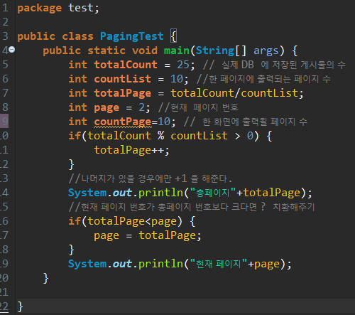
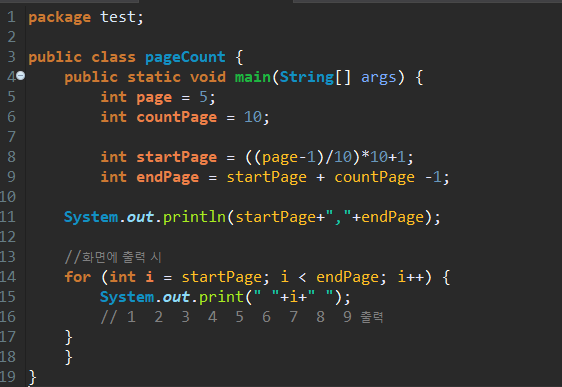
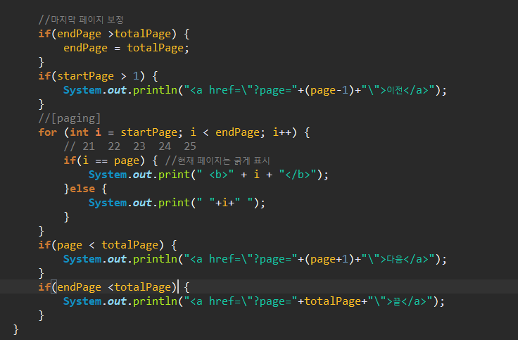
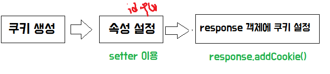

## RESTFulAPI

* `Representational State Transfer`의 약자

* 자원을 **이름**으로 구분하여 해당 자원의 정보를 주고 받는 모든 것을 의미
* 월드 와이드 웹(www)과 같은 분산 하이퍼미디어 시스템을 위한 소프트웨어 개발 아키텍처의 한 형식
  * REST는 기본적으로 **웹의 기존 기술과 HTTP 프로토콜을 그대로 활용**하기 때문에 웹의 장점을 최대한 활용할 수 있는 아키텍처 스타일
  * REST는 네트워크 상에서 Client와 Server 사이의 통신 방식 중 하나이다.
* HTTP URI(Uniform Resource Identifier)를 통해 자원(Resource)을 명시하고, **HTTP Method**(POST, GET, PUT, DELETE)를 통해 해당 자원에 대한 CRUD Operation을 적용하는 것을 의미한다.

*최근의 서버 프로그램은 다양한 브라우저와 안드로이폰, 아이폰과 같은 모바일 디바이스에서도 통신을 할 수 있어야 한다.
이러한 멀티 플랫폼에 대한 지원을 위해 서비스 자원에 대한 아키텍처를 세우고 이용하는 방법을 모색한 결과, REST에 관심을 가지게 되었다.*

 [좀 더 자세히 ](https://gmlwjd9405.github.io/2018/09/21/rest-and-restful.html)

## REST 특징

1. Server-Client (서버-클라이언트 구조)

   자원이 있는 쪽이 Server, 자원을 요청하는 쪽이 Client
   

#### 1) URI는 정보의 자원을 표현해야 한다. (리소스 명은 동사보다는 명사를 사용)

```
    GET /members/delete/1
```

위와 같은 방식은 REST를 제대로 적용하지 않은 URI입니다. URI는 자원을 표현하는데 중점을 두어야 합니다. delete와 같은 행위에 대한 표현이 들어가서는 안됩니다.

#### 2) 자원에 대한 행위는 HTTP Method(GET, POST, PUT, DELETE 등) 로 표현

위의 잘못 된 URI를 **HTTP Method** 를 통해 수정해 보면

```
    DELETE /members/1
```

으로 수정할 수 있겠습니다.
회원정보를 가져올 때는 GET, 회원 추가 시의 행위를 표현하고자 할 때는 POST METHOD를 사용하여 표현합니다.

**회원정보를 가져오는 URI**

```
    GET /members/show/1     (x)
    GET /members/1          (o)
```

**회원을 추가할 때**

```
    GET /members/insert/2 (x)  
    - GET 메서드는 리소스 생성에 맞지 않습니다.
    POST /members/2       (o)
```

| METHOD |                             역할                             |
| :----: | :----------------------------------------------------------: |
|  POST  |     POST를 통해 해당 URI를 요청하면 리소스를 생성합니다.     |
|  GET   | GET를 통해 해당 리소스를 조회합니다. 리소스를 조회하고 해당 도큐먼트에 대한 자세한 정보를 가져온다. |
|  PUT   |             PUT를 통해 해당 리소스를 수정합니다.             |
| DELETE |              DELETE를 통해 리소스를 삭제합니다.              |

## 페이징 처리



* 만약 현재 page가 5일 경우, countPage가 10이기 때문에, 마지막page는 (시작page~ **10page**) 임을 알 수 있다.
  * 현재 page=5에서 1page를 찾으려면 (시작 page) countPage로 나누어 주어야 한다.

* 마지막 페이지는 countPage를 더하면 된다. (단, 더한 뒤 1을 꼭 빼주어야 한다.)



* 현재 page가 22인 경우 
  * 단순히 255개의 게시물이 있을 경우 총 26페이지 존재.
  * 22페이지가 있는 곳에서 21~30페이지가 보일 것.
  * 하지만 26페이지까지이기 때문에 단순히 countPage를 더하는 것만으로는 안된다.
  * 이 때 마지막 페이지는 총 페이지 수로 대체를 해주어야 한다.



* 일반적으로 게시판을 검색할 때에는 최근에 작성한 순서대로 게시물을 조회

```sql
select rownum as rnum ,id, name, content,createdate
from board
oder by createdate
```

*  MyBatis는 데이터를 즉시 받아와서 resultType 이나 resultMap 에 정의된 대로 데이터를 bean 에 저장하기 때문에 원하는 범위의 게시물을 가져와야 한다.
* 위의 쿼리문은 순서대로 출력이 되지 않는다. ( rownum은 oder by 가 이루어지기 전에 이루어지기 때문이다. )

```sql
select rownum, A.id, A.name, A.content, A.createdate
from (
    select id, name, content, createdate
    from board
    order by createdate) A
```

* 속도 저하를 해결하기 위해  **두 번의 서브 쿼리 형태**
  * ROW NUMBER 을 이용할 때에는 between 형태를 이용하지 않도록 주의!

```sql
select X.rnum, X.id, X.name, X.content, X.createdate
from ( 
    select rownum as rnum, A.id, A.name, A.content, A.createdate
    from (
        select id, name, content, createdate
        from board
        order by createdate) A
    where rownum <= 30) X
where X.rnum >= 21
```

*  **createdate** 와 같은 날짜 형은 String으로 받는 경우가 많기 때문에 이를 변환해서 처리한다.
  * 하지만, 이 또한 모든 게시물에 대한 날짜 정보 변환을 하기 때문에 가장 마지막 단계에서 해 준다.

```sql
select id, name, content, to_char(createdate, 'yyyy-MM-dd') as createdate
        from board
        order by createdate)
        --- 생략
```

* 매끼 sql

```sql
select *
	from (
    select * 
        from (
        select recipe_id as rnum,name, member_id,register_date,img_url_main
        from recipe oder by register_date) a
        where rnum<=10)x
	oder by register_date desc;
```

```xml

 	<select id="listall" resultType="recipe">
select name, member_id,register_date,img_url_main
  	from(
        select count(recipe_id) as rnum,name, member_id,register_date,img_url_main
        from recipe 
        oder by register_date) a
        where rnum<=10
        oder by register_date desc               
  	</select>
```

## 쿠키

연결이 끊겼을 때 어떤 정보를 지속적으로 유지하기 위한 수단으로 **쿠키**라는 방식을 사용한다.

쿠키는 서버에서 생성하며 서버가 아닌 클라이언트 측에 특정 정보를 저장한다. 서버에 요청할 때 마다 쿠키의 속성 값을 참조 or 변경할 수 있다.

쿠키는 4kb로 용량이 제한적이며, 300개까지 데이터 정보를 가질 수 있다.



* setMaxAge() : 쿠키의 유효 기간(유지 시간) 설정
* setpath(): 쿠키 사용의 유효 디렉토리를 설정한다.
* setValue() : 쿠키의 값을 설정한다.
* getName() : 쿠키의 이름을 얻는다.

```html
<%	 Cookie cookie = Cookie("cookieN","cookieV"); //쿠키이름,쿠키value
	 cookie.setMaxAge(60*60); //1시간
	 response.addCookie(cookie);
	 
	%>
	<a href="cookieget.jsp">cookieget</a>
```

