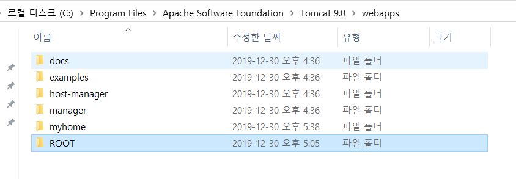
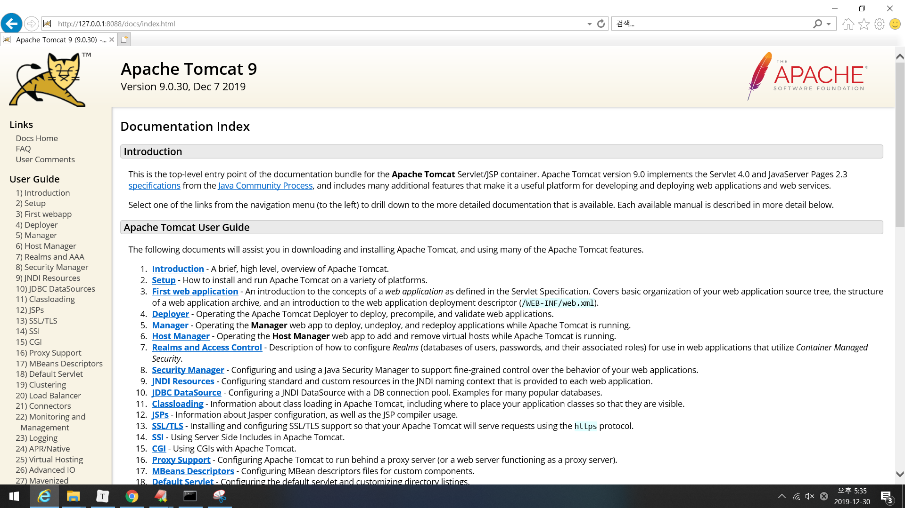
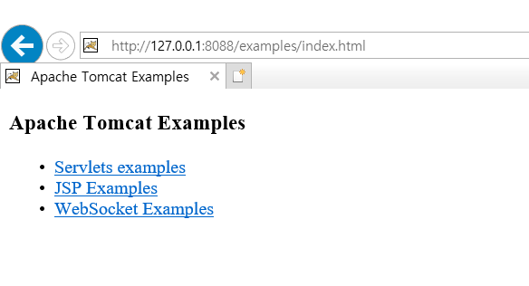
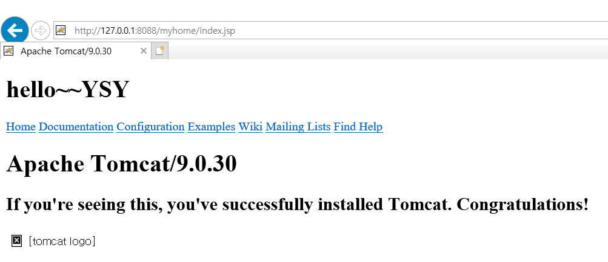
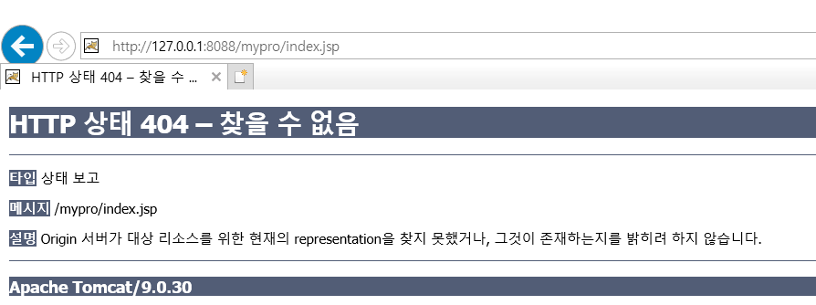

## 1.톰캣 

* **톰캣**은 웹 서버와 연동하여 실행할 수 있는 자바 환경을 제공하여 [자바서버 페이지](https://ko.wikipedia.org/wiki/자바서버_페이지)(JSP)와 [자바 서블릿](https://ko.wikipedia.org/wiki/자바_서블릿)이 실행할 수 있는 환경을 제공하고 있다.

* **WAS(web application server)**   역할을 하는 프로그램
  * **JSP**는 `HTML`내에 자바코드를 삽입하여 웹 서버에서 동적으로 웹 페이지를 생성하여 웹 브라우저에 돌려주는 언어
  * **Servlet** 은 웹 서버의 성능을 향상하기 위해 사용되는 자바 클래스의 일종.
  * `JSP`가 HTML 문서 안에 Java 코드를 포함하고 있는 반면, `Servlet`은 자바 코드 안에 HTML을 포함하고 있다는 차이점이 있다.

C:\Program Files\Apache Software Foundation\Tomcat 9.0



### 1. Web

* 웹 페이지 : 웹에서 보여지는 페이지 
  * 웹페이지를 구성하는 기본 요소는 '글자'
  * 이러한 '글자'라는 구성요소를 정의할 때 사용하느 기술이 HTML (페이지의 뼈대만들기)
  * 사용자에게 보여주기 위해 꾸미는 기술이 'CSS'
*  javascript :  interactive webpage (대화형 웹페이지) 
  * NoSQL 中 점유율이 높은 것이 몽고DB
  * fullstack 개발, mean stack 개발자(몽고DB , 익스플로러,앵글러, 노드제이...)


### 2. 도메인

* **IP** : 인터넷에 연결되어 있는 장치(컴퓨터, 스마트폰, 타블릿, 서버 등등)들은 각각의 장치를 식별할 수 있는 주소를 가지고 있다.
  * 이러한 ip를 이름으로 접근할 수 있게 만들어진 것이 **도메인**
  * 도메인을 입력하면 매핑된 ip를 찾아서 들어간다.

* **http**와 **https** 차이

  * `http(Hypertext transfer protocl)`  : 인터넷에서 사용하는 웹 서버와 사용자의 인터넷 브라우저 사이에 문서를 전송하기 위한 통신규약.
    * http 서버는 80번 포트에서 대기하고 있다.
    * http://

  

  * `https` : HTTP 프로토콜의 **보안성**을 강화한 프로토콜(HTTP+secure)
    
    * https://
    
---

​     

* http://127.0.0.1:8088/index.jsp

  * **index.jsp** 는 보통 첫번째 페이지로 되어있는 경우가 많다.
  
* [http://127.0.0.1:8088/webapplicaion%ED%8F%B4%EB%8D%94%EB%AA%85/webapplicaion%20%ED%8C%8C%EC%9D%BC](http://127.0.0.1:8088/webapplicaion폴더명/webapplicaion 파일)

  ``` 
  http://127.0.0.1:8088/webapplicaion폴더명/webapplicaion 파일)
  ```

### 2.1 도메인 EX

* ``` 
  http://127.0.0.1:8088/docs/index.html
  ```

* docs webapplicaion 폴더 안의 index.html의 실행결과를 확인



---

* ``` 
  http://127.0.0.1:8088/examples/index.html
  ```



---

* ``` 
  http://127.0.0.1:8088/myhome/index.jsp
  ```



---

```
http://127.0.0.1:8088/mypro/index.jsp
```



오류가 뜨는 이유는

myhome 은 tomcat이 인식할 수 있는 위치이지만, 

mypro 는 tomcat이 인식할 수 없는 위치이다.