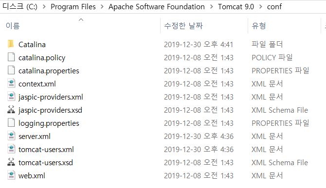
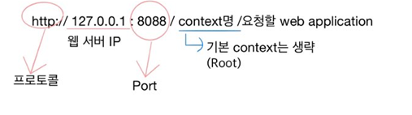
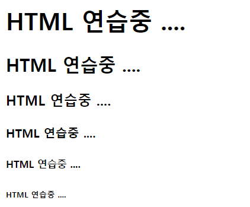

## 0. Front -End vs Back - End

html,css,javascript,JQuery(프론트엔드)-was-jsp,sevlet(백앤드)-jdbc-dbms

* **Front-End** : 사용자 (user) 의 화면에 나타나는 웹 화면 개발
  * html,css,javascript,JQuery
* **Back-End** : 눈에 보이지 않는 서버를 다루는 직군
  * jsp,sevlet(백앤드)

## 1.Tomcat 디렉토리

* **bin** : 톰캣에서 실행할 수 있는 실행파일과 배치파일의 위치
* **conf** : 각종 설정 파일을 `.xml` 파일로 관리한다.
  * **server.xml**  : 서버에 대한 설정을 명시하는 설정 파일



* ```html
  <?xml version="1.0" encoding="UTF-8"?>
  
  <!-- UTF-8 : 한글 인코딩 (Spring)-->
  <!-- 주석--->
  ```

* lib : 톰캣이 실행되고 운영될 때 필요한 각종 라이브러리 파일이 위치.

  * `servlet-api.jar` , `jsp-api.jar` 파일이 서블릿과 JSP에 대한 API파일이다.


* `<Connector port =`  : **연결에 대한 정의**를 태그를 이용해서 한다.

  ```xml
   <Connector port="8088" protocol="HTTP/1.1"
                 connectionTimeout="20000"
                 redirectPort="8443" />
   <Connector port="8009" protocol="AJP/1.3" redirectPort="8443" />
  ```

* 웹 요청 방식 



* port : web의 기본 port `80` (생략 가능 )
  * `window 10`과` IIS`가 80을 기본으로 하기 때문에 80을 사용하지 못한다.        
  * server - tomcat admin port : 8005   

---

* `webapps`를 기본으로 하기 때문에 그 뒤의 파일 경로를 언급해주어야 한다.
  * index.html : 정적 파일

``` 
http://127.0.0.1:8088/examples/sevlets/index.html

http://127.0.0.1:8088/manager/index.jsp
```

* 관리자 아이디/비밀번호 바꾸기
  * conf-tomcat-users.xml

```xml
<tomcat-users xmlns="http://tomcat.apache.org/xml"
              xmlns:xsi="http://www.w3.org/2001/XMLSchema-instance"
              xsi:schemaLocation="http://tomcat.apache.org/xml tomcat-users.xsd"
              version="1.0">
<user username="admin" password="admin" roles="admin-gui,manager-gui" />
```

``` xml
  <Context docBase = "c :\mypro" path = "/mypro" reloadable = "true" debug="0"/>
```

  * xml파일 변경시 tomcat 서버를 stop -> start로 내렸다가 올려야한다.
---

## 2. HTML Tag 문법

* 기초문법


```html
<!-- html 주석(클라이언트에 전송되는 주석 : 주의) -->
<p>문단 바꿈, 앞 뒤로 빈 줄이 삽입</p>
단순한 줄 바꿈<br/>
수평선<hr/>
<pre>pre태그는 쓴 그대로 보여진다</pre>
```

* 폰트 바꾸기

``` html
<b> 볼드체 </b>
<i> 이탤릭체 </i>
<font size="1" color="red" face="굴림">HTML 연습중 ....</font>
<!--여기서의 size는 숫자가 작을수록 작은 글씨체 -->

<a href="https://www.naver.com/" target="_self">네이버</a>
```

* h1~ h6 태그
  
  * 문서의 제목을 단계별로 작성할 때 사용하는 태그로 1부터 6까지 나타낼 수 있다.
  
  * 제목을 추가할 때 사용하는 태그이므로 굵게와 줄 바꿈이 미리 등록되어 있다.
  
    *  1이 가장 큰 사이즈이며 6이 가장 작은 사이즈
  
      ``` html
      	<h1>HTML 연습중 ....</h1> 
      	<h2>HTML 연습중 ....</h2>
      	<h3>HTML 연습중 ....</h3>
      	<h4>HTML 연습중 ....</h4>
      	<h5>HTML 연습중 ....</h5>
      	<h6>HTML 연습중 ....</h6>
      ```
  
      
  
* 이미지 삽입
  
  * **src**  = 추가될 이미지가 위치할 경로 .
  * **alt** = 이미지가 보여지지 않을 때 대신 보여질 문자열을 지정하는 속성으로 이미지 위에 마우스 포인터를 올려 놓을 때 나타나는 풍선도움말이 이 속성으로 표현.

``` html


```

#### Path

* 절대경로 : 늘 고정되어있는 경로

  * IP까지 다 명시하는 방법으로 생략이 가능하므로 거의 사용하지 않는다.
    * /clientweb/images/jang1.jpg

* 상대경로 : 현재 작성 중인 문서의 위치를 기준으로 달라질 수 있는 경로

  * `.` : 현재폴더, 디렉토리

    * img src = "jang1.jpg"

  * `..` : 상위폴더, 디렉토리

    * 현재 문서의 위치에서 한 단계 위인 **상위 폴더로 올라가서** images폴더를 찾고 이미지 파일을 찾는다.

    * ``` html
      ../images/jang1.jpg
      ```

* href

  * 연결될 문서의 경로를 정의하며, 절대경로 상대경로 모두 가능하다.

  ``` html
  <a href="lounge.html"></a><br/>
  ```

  * `_blank`로 지정했기 때문에 팝업 창이 뜨며 응답된다.

  ```html
  <a href="lounge.html" target="_blank">문자열에 하이퍼링크 연결</a>
  ```

  


* 테이블 만들기
  * 테이블은 표를 작성할 때 사용하는 태그로 <table>로 정의한다.
  * 기능이 실행 되지만, width와 height는 원래 CSS에서 하는 것이기 때문에 warning이 뜬다.


```html
<table border = "1" width ="500"> <!--border : 테두리 작성-->
		<tr bgcolor="skyblue">    <!--bgcolor : 표의 배경색 표현-->
			<th>번호</th>
			<th>제목</th>
			<th>저자</th>
		</tr>
		<tr>
			<td>1</td>
			<td>이클립스</td>
			<td>스테파니메이어</td>
		</tr>
</table>
```


* 컬럼 합치기

  * 가로

  ```html
  <tr>
  			<td colspan="3">		<!-- 컬럼 3칸을 합친다 -->
  			비고 : <br/>
  			지금은 table을 작성하기 위해 필요한 태그의 연습 중입니다.
  			</td>
  		</tr>
  ```

  

  * 세로

  ``` html
  <tr>
  			<td>1</td>
  			<td>이클립스</td>
  			<td rowspan="2">스테파니메이어</td>
  		</tr>
  ```

  

  * 가운데 정렬

  ``` html
  <tr align="center">
  </tr>
  ```

  


