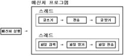
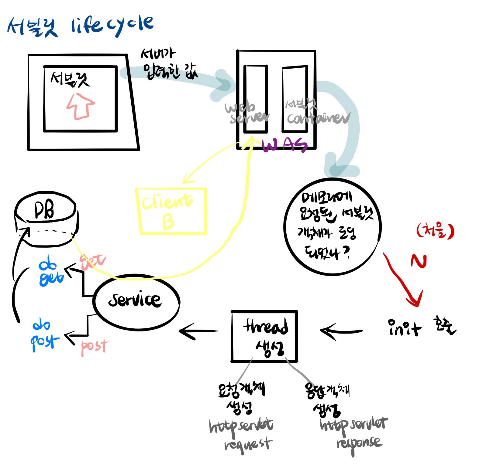

## Parser

> `Parser`는 구문분석이다. 문장이 이루고 있는 구성 성분을 분해하고 분해된 성분의 위계관계를 분석하여 구조를 결정한다.
>
> 즉, 데이터를 분해 분석하여 원하는 형태로 조립하고 다시 빼내는 프로그램을 말한다.
>
> * Parsing 기법은 `XML` 과 `JSON` Parsing이 있다.
> * `Parser`란 **Compiler의 일부** 로서 원시 프로그램의 명령문이나 온라인 명령문, HTML 문서 등에서 Markup Tag 등을 입력으로 받아들여서 구분을 해석 할 수 있는 단위로 여러 부분으로 해석해주는 역할을 한다. 


## Servlet&Jsp

HTML 태그에는 JAVA 명령어를 사용할 수 없다.

웹에서 java코드를 실행하기 위해서 사용하는 것이 `servlet` 이다.

서블릿 객체는 딱 한번만 메모리에 올라온다.

* application : `main() `이 있는 자바프로그램
* 서블릿은 공통으로 실행하는 방법이 정의되어 있다. (spec)
  * 사용자가 입력한 데이터 서블릿 전송하기
  * db연동

* 서블릿 객체의 소멸
  * was의 리로딩
  * context 리로딩
  * 서블릿 컴파일

* 웹은 불특정 다수가 동시에 접속하기 때문에 **thread** 가 필수이다.
  * **thead** : 하나의 프로세스 내부에서 독립적으로 실행되는 하나의 작업 단위
  * 여러 개의 쓰레드가 모여 하나의 **프로세스** 를 구성하며, 이 하나의 프로세스를 구성하는 여러개의 쓰레드를 **멀티쓰레드** 라고 부른다.



---

## Servlet

**서블릿**은 클라이언트 페이지에서 발생하는 클라이언트의 요청을 처리하기 위한 기술.

클라이언트로부터 요청이 전달되면 서버에서 실행되며 DB연동이나 서버의 자원을 액세서하여 만들어진 결과를 클라이언트로 응답한다.

클라이언트의 요청을 인식하고 실행되도록 하기 위해서는 서블릿은 정해진 규칙대로 작성이 되어야 하고, 서버가 서블릿을 찾아서 실행할 수 있도록 **정해진 위치**에 작성되어야 한다.

​															--------------- 표준화된 폴더 구조안에 있는 Classes 폴더(서블릿 디렉토리)

 ### 1. 서블릿 작성 규칙

* **표준화된 폴더 구조** 안에서 서블릿 디렉토리에 저장되어야 한다.

  ------------ Classes 폴더

  * `C:\iot\work\webwork\.metadata\.plugins\org.eclipse.wst.server.core\tmp0\wtpwebapps\serverweb\WEB-INF\classes` 에서 작성되어야 한다.
    * 이 위치에 서블릿 클래스가 없으면 못찾는다.
  
* `public` 클래스로 작성해야 한다.
  
  * 서버가 찾아서 실행해야 하므로
  * `private`
  
* 서블릿 클래스를 상속해야 한다.
  
  * server가 우리가 작성한 서블릿 클래스를 찾아서 생성하고 호출하기 위해서는 서버가  인식할 수 있는 (서버가 사용할 수 있는) 타입이어야 하므로 서버에 등록된 타입으로 서블릿 클래스를 작성한다.
  
  ``` text
  servlet(인터페이스)
   ^
   |
  GenericServlet  	---- 일반적인 내용을 담고있는 서블릿
   ^
   |
  HttpServlet			---- http프로토콜에 특화된 내용을 담고있는 서블릿
   ^
   |
  MyServlet			---- 내가 하고 싶은 일을 담고 있는 서블릿
  							(개발자가 만드는 서블릿)
  ```
  
  http://tomcat.apache.org/     -> reference -> [Servlet 4.0 Javadocs](http://tomcat.apache.org/tomcat-9.0-doc/servletapi/index.html)
  
  우리가 사용하는 것은 [javax.servlet](http://tomcat.apache.org/tomcat-9.0-doc/servletapi/javax/servlet/package-frame.html) 와 [javax.servlet.http](http://tomcat.apache.org/tomcat-9.0-doc/servletapi/javax/servlet/http/package-frame.html)
  
  
  
* 서버가 호출하는 메소드를 오버라이딩 해야 한다.

  * 서블릿 클래스는 일반 클래스를 사용하는 방법처럼 객체생성해서 사용하는 클래스가 아니다.

  * 서블릿이 호출되면 서버가 서블릿 객체를 생성하고 적절한 시점에 따라 메소드를 자동으로 호출한다.

    * 즉, 서블릿의 **Lifecyle** 을 서버가 관리한다

      ​					-------------- 객체를 생성하고 소멸하는 것

    * 서버가 적절한 시점에 따라 자동으로 메소드를 호출할 때 원하는 작업을 처리하기 위해서는 **서버가 호출하는 메소드를 오버라이딩** 해서 내가 원하는 내용을 기술해야 한다.

  

  #### [오버라이딩할 메소드]

  * `init` : 서블릿이 초기화될 때 호출

  * `service` : **클라이언트가 요청**을 하면 호출되는 메소드

    * 클라이언트의 요청을 처리할 수 있는 내용을 기술

      *ex) 로그인, 게시판 목록보기, 회원가입 ....*

    * 요청방식의 구분없이 모두 호출

    1. `doGet` : service와 동일하게 동작하며 클라이언트가 **get방식** 으로 요청하는 경우에만 호출
    2. `doPost` : service와 동일하게 동작하며 클라이언트가 **post방식** 으로 요청하는 경우에만 호출.
    3. `destroy` : 서블릿 **객체가 소멸** 될 때 (메모리에서 해제될 때) 호출되는 메소드

  ```java
  //오버라이딩
  	public void service(HttpServletRequest req,HttpServletResponse res) throws ServletException,IOException{
  		System.out.println("서블릿 요청.....");
  	}
  ```

* 서블릿을 등록

  * 서버가 서블릿을 찾아서 실행할 수 있도록 서블릿을 `web.xml`에 등록
    * `web.xml` : 서블릿에 대한 내용을 등록하는 설정 파일 (WebContent - WEB-INF)

  1. 서블릿 등록

     - 사용할 서블릿이 어떤 클래스인지 정의

     ```xml
     <servlet>
     	  <servlet-name>서블릿의 이름(alias)</servlet-name>
       	  <servlet-class>실제 사용할 서블릿 클래스 (패키지 포함)</servlet-class>
     </servlet>  
     ```

     * EX] basic 패키지에 작성한 `FirstServlet`을 `first`라는 이름으로 등록

       ```xml
       <servlet>
       	  <servlet-name>first</servlet-name>
         	  <servlet-class>basic.FirstServlet</servlet-class>
       </servlet>  
       ```

  2. 서블릿 매핑

  * 서블릿을 어떤 url로 요청할 지 등록

    ```xml
    <servlet-mapping>
      	   <servlet-name>미리 등록한 서블릿의 이름</servlet-name>
      	   <url-pattern>요청url(반드시 /나 .으로 시작</url-pattern>
    </servlet-mapping> 
    ```

    * 위에서 등록한 first서블릿을 `/first.multi` 로 요청

    ```xml
    <servlet-mapping>
      	   <servlet-name>first</servlet-name>
      	   <url-pattern>/first.html</url-pattern>
    </servlet-mapping> 
    ```

    

### 2.  서블릿 요청 방법

#### 1) get 방식으로 요청

* 주소표시줄에 입력하고 요청 	

  => 테스트용으로 사용

  ```text
  http://70.12.115.64:8088/serverweb/first.multi
  				      ---------  ----------
  					server.xml      web.xml에 등록한 요청 path
  					에 등록한 path		<url-pattern>에 등록
  					보통은 context명
  ```

  * EX) GuGuServlet 작성하기
    - 콘솔에 7단 출력하기
    - 서블릿 명 : gugu
    - 요청 url : /gugu.html
    - FirstServlet과 동일한 방법으로 요청하고 .java 와 실행화면 캡쳐 제출
  
* 하이퍼링크를 클릭

  ```html
  <a href="http://서버ip:port/contextpath/서블릿url">하이퍼링크</a>
  <a href="/contextpath/서블릿url">하이퍼링크</a>		<!--일반적인 요청 -->
  ```

* `<form>` 태그에서 method속성을 `get` 으로 설정하고 `submit` 버튼을 선택

  * `action`속성에서 설정한다.
  * form태그를 정의하면서 method속성을 생략하면 get방식으로 요청
  * `submit`버튼을 눌러서 요청하면 `<form>`태그의 action속성에 정의한 서블릿이 요청 (서블릿이 호출되어 실행되도록 한다.) 되며 `<form></form>` 내부에 정의한 모든 양식태그들의 name과 value가 서블릿으로 정의된다.

  ```html
  <form method="get" action="/contextpath/서블릿요청url">
      <input type="submit" value="전송"/>
  </form>
  ```

  

#### 2) post 방식으로 요청

* `<form>` 태그에서 method속성을 `post` 으로 설정하고 `submit` 버튼을 선택

  * `action`속성에서 설정한다.
  * `submit`버튼을 눌러서 요청하면 `<form>`태그의 action속성에 정의한 서블릿이 요청 (서블릿이 호출되어 실행되도록 한다.) 되며 `<form></form>` 내부에 정의한 모든 양식태그들의 name과 value가 서블릿으로 정의된다.

  ```html
  <form method="post" action="/contextpath/서블릿요청url">
      <input type="submit" value="전송"/>
  </form>
  ```

#### 3) 요청방식

* `get` : 요청할 때 입력하는 내용이 url뒤에 추가되어 전송되는 방식 (요청 메시지 헤더에 추가)

  * 클라이언트가 입력하는 내용이 그대로 노출된다.
  * 전송할 수 있는 데이터의 크기에 제한이 있다.
    * ex) 게시판 목록 확인하기 , 상품 정보 가져오기, 검색하기 ......

* `post` : 요청메시지 body에 추가되어 전송되므로 클라이언트에 노출되지 않지만 둘을 이용하면 확인할 수 있으므로 암호화해서 전송해야 한다.

  * 보낼 수 있는 데이터 크기에 제한이 없다.
  * 서버에 클라이언트가 원하는 값으로 update(변경)하는 경우 
    * ex) 회원등록(sql - insert문 실행), 회원정보 수정(sql - update문 실행), 파일업로드, 메일 쓰기....

  
  
  
  
  * **Interface HttpServletRequest** - 정보를 뽑아야 하기 때문에 getter 메소드가 많다.
    * `getMothod()` : Returns the name of the HTTP method
```java
public void service(HttpServletRequest req, HttpServletResponse res) throws ServletException,IOException{
		System.out.println("클라이언트의 요청 처리 service()^^....."+req.getMethod());
		//요청방식이 GET이면 doGet호출, POST면 doPost호출
            if(req.getMethod().equals("GET")) {
                    doGet(req, res);
                }else {
                    doPost(req, res);
                }
	}
```

* `.xml` 수정시 서버 restart
* 로그인

```java
<form method="post" action="/serverweb/login.do">
		아이디 : <input type="text" name="id"><br/>
		패스워드 : <input type = "text" name="pass"><br/>
		<input type="submit" value="로그인">	
</form>
```


### 3. 클라이언트가 전달하는 요청 메시지에서 클라이언트의 입력 정보를 추출하기


### 4. DB연동

