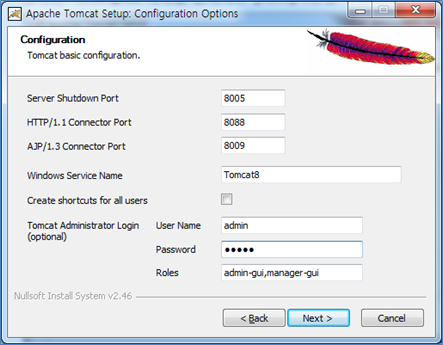
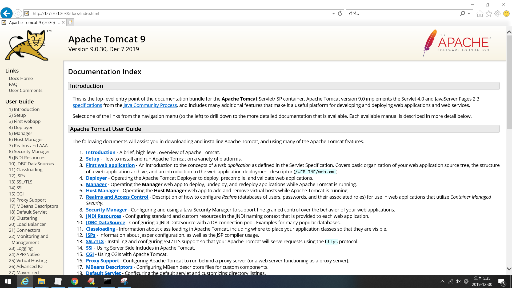
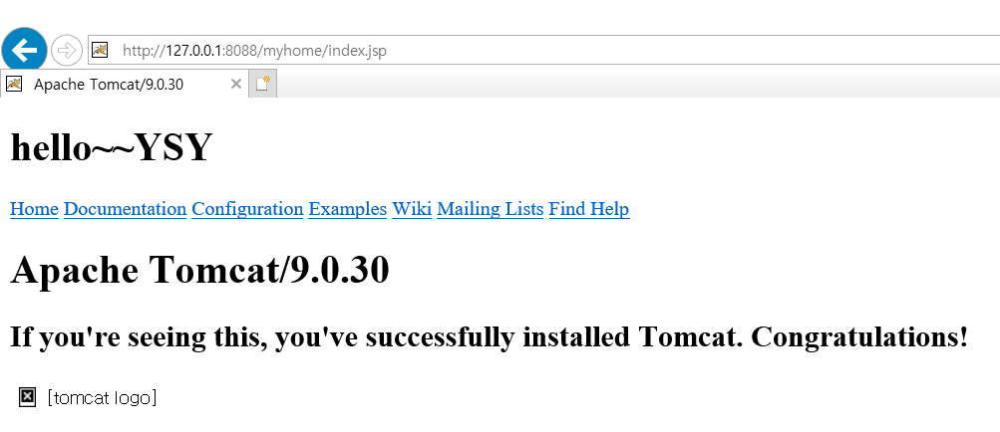
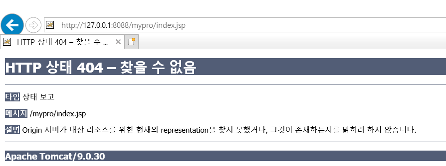
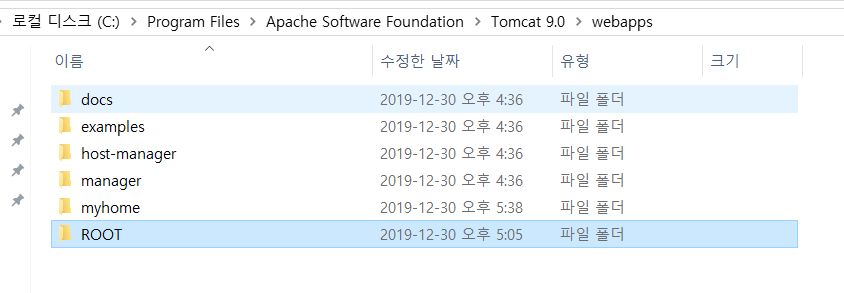
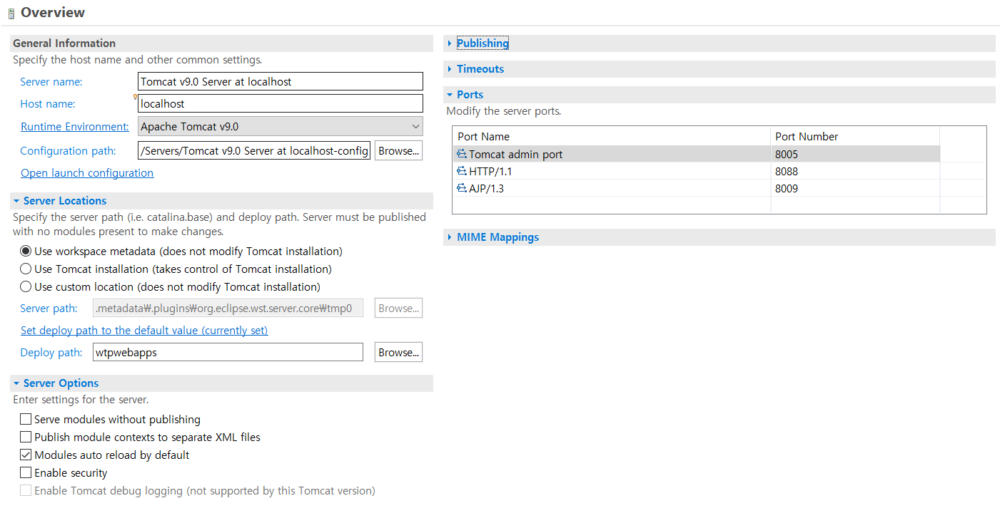
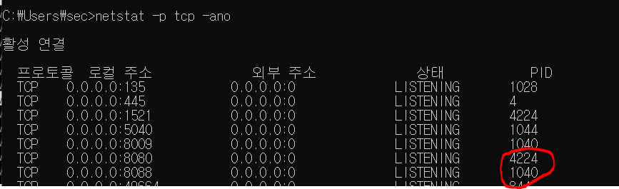

## 1.톰캣 

* **톰캣**은 웹 서버와 연동하여 실행할 수 있는 자바 환경을 제공하여 [자바서버 페이지](https://ko.wikipedia.org/wiki/자바서버_페이지)(JSP)와 [자바 서블릿](https://ko.wikipedia.org/wiki/자바_서블릿)이 실행할 수 있는 환경을 제공하고 있다.

* **WAS(web application server)**   역할을 하는 프로그램
  * **JSP**는 `HTML`내에 자바코드를 삽입하여 웹 서버에서 동적으로 웹 페이지를 생성하여 웹 브라우저에 돌려주는 언어
  * **Servlet** 은 웹 서버의 성능을 향상하기 위해 사용되는 자바 클래스의 일종.
  * `JSP`가 HTML 문서 안에 Java 코드를 포함하고 있는 반면, `Servlet`은 자바 코드 안에 HTML을 포함하고 있다는 차이점이 있다.
### 1. Web

* 웹 페이지 : 웹에서 보여지는 페이지 
  * 웹페이지를 구성하는 기본 요소는 '글자'
  * 이러한 '글자'라는 구성요소를 정의할 때 사용하는 기술이 **'HTML'** (페이지의 뼈대만들기)
  * 사용자에게 보여주기 위해 꾸미는 기술이 **'CSS' **
* 웹 서버가 하는 일
  * 인터넷에 연결되어 있으면서 클라이언트 컴퓨터로부터 요청을 기다린다.
  * 웹 서버가 요청을 받으면 이들 자원을 찾아서 클라이언트 컴퓨터로 보낸다.(응답)
  * **HTTP** 라는 프로토콜 사용
* javascript :  interactive webpage (대화형 웹페이지) 
  * NoSQL 中 점유율이 높은 것이 몽고DB
  * fullstack 개발, mean stack 개발자(몽고DB , 익스플로러,앵글러, 노드제이...)


### 2. HTML

  * **HTML**(Hyper Text Markup Language) : 웹 페이지를 기술하기 위한 언어
  
  * Markup Language 는 **tag의 실행** 으로 구성된 단어를 의미한다.
  
  * **팀 버너스리** 에 의하여 개발되었다.
  
  * 이클립스 상의 서버가 인식하는 기본 위치 : **webapps**
  
    * webapps는  docs(web applicaion 폴더, context), examples,....,root 등으로 구성됨
      * ROOT의 context 생략 가능
    * 서버가 인식하는 위치는 표준화된 폴더 관리가 이루어진다.(WEB-INF)
    
    > C:\iot\work\webwork\.metadata\.plugins\org.eclipse.wst.server.core\tmp0\wtpwebapps\clientwebb  


## 2. 서버의 등록 및 실행

### 1. 도메인

* **IP** : 인터넷에 연결되어 있는 장치(컴퓨터, 스마트폰, 타블릿, 서버 등등)들은 각각의 장치를 식별할 수 있는 주소를 가지고 있다.
  
  * 이러한 ip를 이름으로 접근할 수 있게 만들어진 것이 **도메인**
* 도메인을 입력하면 매핑된 ip를 찾아서 들어간다.
  
* **http**와 **https** 차이

  * `http(Hypertext transfer protocl)`  : 인터넷에서 사용하는 웹 서버와 사용자의 인터넷 브라우저 사이에 문서를 전송하기 위한 통신규약.
    * http 서버는 80번 포트에서 대기하고 있다.
    * http://

  

  * `https` : HTTP 프로토콜의 **보안성**을 강화한 프로토콜(HTTP+secure)
    
    * https://
    
### 2.Port 번호     

* Tomcat의 기본 HTTP Port는 8080 이지만, 기존에 설치한 오라클의 Web Port가`8080`으로 지정되어 설치되었으므로 8080포트는 **사용 중인 포트** 가 된다.  

  * 따라서 Tomcat의 기본 Port를 `8088`로 변경하고 서버관리를 위한 관리자 User Name과 Password를 모두 “admin”으로 변경해서 사용한다.

    

####  도메인 연습

* http://127.0.0.1:8088/index.jsp

  * **index.jsp** 는 보통 첫번째 페이지로 되어있는 경우가 많다.
  
  * 도메인 설정 방식

  ``` 
  http://127.0.0.1:8088/webapplicaion폴더명/webapplicaion 파일)
  ```

* ``` 
  http://127.0.0.1:8088/docs/index.html
  ```

* docs webapplicaion 폴더 안의 index.html의 실행결과를 확인



---

* ``` 
  http://127.0.0.1:8088/myhome/index.jsp
  ```



---

```
http://127.0.0.1:8088/mypro/index.jsp
```



* 오류가 뜨는 이유는 docs webapplicaion 폴더 안의 myhome 은 tomcat이 인식할 수 있는 위치이지만, mypro 는 tomcat이 인식할 수 없는 위치이기 때문이다.

### 3. 이클립스 연동

이클립스에서 웹을 개발하려면 반드시 **JE22** 를 개발할 수 있는 이클립스를 다운받아야 한다.

* J2EE에 명시된 표준화된 스펙을 반드시 지켜주어야 한다.

* 이클립스가 실행되면 불필요한 VIEW는 없애고 [Project Explorer] view에서 웹을 개발할 수 있도록 제공되는 프로젝트는 **"Dynamic Web Project"** 이다.
  * Java Resource - src폴더 : 자바 파일이 위치하는 곳
  * WebContent : 클라이언트에 보여질 웹 페이지를 구성하는 모든 요소가 추가될 위치.

* Files\Apache Software Foundation\Tomcat 9.0



* bin : 실행 파일

* conf : 설정 파일

  * web.xml : 공통으로 정의할 설정 파일
  * server.xml

* lib : 톰캣 라이브러리 저장

* logs 파일 : 모든 활동 내역이 기록된다. 

* context

  * 정적인,  표준화된 폴더 구조(경로 구조)를 가지고있다.

  ``` 
  [ex]
  C:\iot\work\webwork2\.metadata\.plugins\org.eclipse.wst.server.core\tmp0\wtpwebapps\Client\WEB-INF
  ```

  * Preferences - Ant : 자동으로 서버가 위치하는 폴더에 파일 생성해주는 tool
  * explore 기준 `F12` 누르면 소스코드를 볼 수 있다- **크롤링** 시 필수

* WEB-INF가 반드시 필요하다.
  * web.xml : 설정파일
    * 내가 만든 context에 적용할 내용 
  * lib : 라이브러리
    * lib에 외부 라이브러리를 가져다 놓는다.
  * classes : `.java`파일  ( 서블릿, DAO, DTO)

* metadata : 설정파일이 저장됨.

## 서버 등록



* server.xml의 `Context`를 확인하여 서버 등록 작업이 자동으로 등록되었는지 확인하기

```xml
 <Context docBase="basic" path="/basic" reloadable="true" source="org.eclipse.jst.jee.server:basic"/>
```

* 서버 오류시 cmd 창에서 사용중인 `port`의 `pid`를 죽이고 다시 `start`.

  

#### 크롤링?

* Web상에 존재하는 Contents를 수집하는 작업
  * HTML 페이지를 가져와서, HTML/CSS 등을 파싱하고, 필요한 데이터만 추출
  * Open API를 제공하는 서비스에서 필요데이터만 추출하는 기법