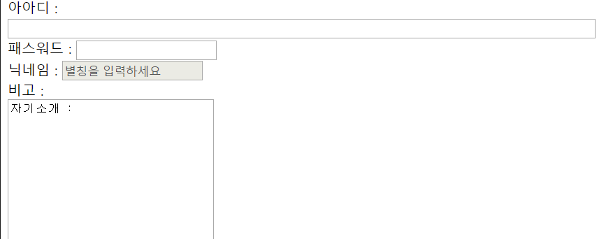

# HTML 입력 양식

입력 양식은 사용자로부터 데이터를 받아서 서버로 넘기는 데 사용된다. 

 ★ 클라이언트가 서버와 통신하기 위해 필요한 아주 중요한 태그 (Server와의 통신 방법)

#### form

**<form>태그는 HTML양식을 생성하는 데 사용된다.**

사용자가 정보를 넣을 수 있는 입력필드를 가진 웹 페이지.

**모든** 입력 양식 관련은 **form 태그**로 묶어주어야 한다.

```html
<form action="" method="get"> 
</form>
```

* **method** : 요청 방식을 정의하는 속성으로 "get" 이나 "post"를 지정한다

  * method="get"일 때, 네임밸류의 값이 주소표시줄에 전부 입력된다.
  * method="post" 일때는 값이 주소창에 노출되지 않는다.

* **action** : 클라이언트가 입력한 값을 이용하여 처리하는 서버 application의 path 지정

  * action에 명시하는 것은 상대경로가 아닌 `절대경로` 

  * 위의 코드 실행시, <form>태그는 **action**  속성에 정의한 application이 존재하지 않으므로 HTTP 프로토콜이 `404`의 응답 코드를 전송해 줄 것이다.

    

## 1. input

사용자로부터 **정보를 받아들이는 용도**로 사용된다. 

> 양식 태그를 이용해서 입력하거나 선택한 모든 값과 name을 함께 서버에 전송한다.

* **name** : 입력할 수 있는 값을 구분하기 위해 정의

* **value** : 속성을 정의하는 경우 텍스트 상자에 기본으로 출력되는 값을 표현

* **disabled** : 수정할 수 없도록 표현하기 위해 사용

  

```html
		<h2>1. 텍스트 관련 태그</h2>
		아이디    : <input type="text" name ="id"><br/>
		패스워드 : <input type="password" name ="pass"><br/>
		닉네임 : <input type="text" name="nickname" value="별칭을 입력하세요" disabled="disabled"><br/>
```



* 글자 제한하기

``` html
	아이디 : <input type="text" name ="id"  size="100" maxlength="20"><br/>
```

* 자유 칸 생성	

```html
    비고 : <br/><textarea rows="30" cols="30" name="info">자기소개 : </textarea>
```


### 1. 버튼 관련 태그

* reset : 입력한 내용 초기화
* submit : 클라이언트가 입력한 내용을 서버 쪽으로 전송하기 위해.

```html
		<input type = "submit" value="서버로 전송하기">
		<input type = "reset" value="입력 취소하기">
		<input type = "button" value="자바스크립트연결하는버튼" 
               onclick="alert('환영합니다.')">
```

### 2. 체크 박스

* checknot는 여러 개의 항목을 선택한다.
* radio는 여러 개 중 하나만 선택 가능하다.
  * name을 동일하게 해주어야 전체 항목이 하나의 그룹으로 묶인다.

``` html
<input type="checkbox" name="subject1" value="서블릿"> 서블릿
<input type="radio" name="subject2" value="자바"> 자바
<!-- 화면에 보여지는 것과 똑같은 VALUE를 주는 것이 일반적.--> 
```

* checked="checked" 는 기본으로 체크되어 있는 설정 항목을 나타낸다.

  multiple="multiple"은 다중 선택이 가능하다.

```html
<input type="radio" name="subject2" value="JDBC"  checked="checked"> JDBC
```

* `select` 태그로 표현하며
  * 콤보 상자로 보일 아이템은` option`태그를 이용해서 구성한다.
  * 리스트는 `"size"`속성만 지정하면 리스트 상자가 된다.

```html
<h3> 좋아하는 과목</h3>
		<select name="subject3">
			<option value="hadoop">hadoop</option>
			<option value="hive">hive</option>
			<option value="mongodb">mongodb</option>
			<option value="sqoop">sqoop</option>
		</select>
```


```html
<h3> 좋아하는 과목</h3>
		<select name="subject4" size="5">
			<option value="hadoop">hadoop</option>
			<option value="hive">hive</option>
			<option value="mongodb">mongodb</option>
			<option value="sqoop">sqoop</option>
		</select>
```


### 3.fieldset

입력요소 그루핑하는데 사용되는 태그

```html
<fieldset>
			<legend>좋아하는과목</legend>
			<input type="checkbox" name="subject1" value="자바">자바
			<input type="checkbox" name="subject1" value="JDBC">JDBC
			<input type="checkbox" name="subject1" value="HTML5">HTML5
			<input type="checkbox" name="subject1" value="서블릿" checked="checked">서블릿
</fieldset>		
```


####  기타 태그

```html
		<!--파일 업로드-->
		<input type="file" name="photo" value="파일선택">
		<!--날짜-->
		<input type="date" name="regdate">
		<input type="number" name="count">
		<input type="email" name="mymail">	
```


## 2.div 와 span

> 웹사이트를 구축하는 데 반드시 필요한 도구이다.
>
> div와 span태그는 논리적인 그룹을 분리할 때 사용하는 태그이다.

* `span`은 태그 자체로는 특별한 의미가 없으며, CSS와 함께 사용되어서 텍스트 일부의 스타일 속성 설정시 사용.
* `div`는 웹 페이지의 공간을 분할하여 레이아웃 작성하는 데 사용된다.

```html
<div> 줄바꿈이 있다.</div>
<span> 줄바꿈이 없는 인라인 요소.</span>
```

div와 p는 단락이 생성되는지 아닌지의 차이.


---

* http://html5test.com/

html5적인 요소를 얼마나 가지고 있는가 확인해주는 사이트
