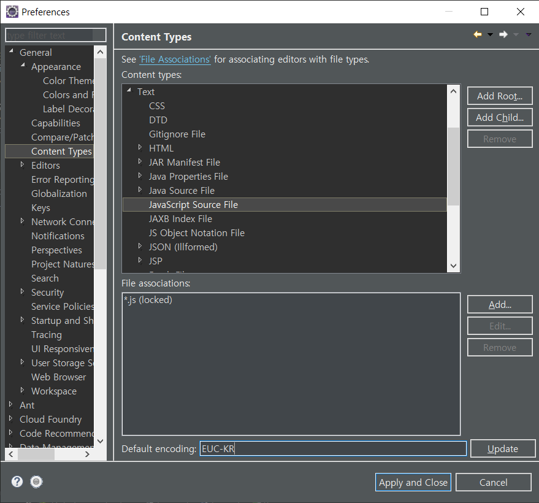

# 자바 스크립트란?

사용자와 페이지간의 상호작용이 이루어지는 **동적인 웹페이지(Dynamic page)** 를 작성.

웹 사이트에서 각종 액션을 처리하는데 사용되고, 웹 브라우저의 내장 객체에도 접근 가능.

* 스크립트? 혼자서 실행할 수 없고, HTML문서에 삽입이 되어 사용되는 것을 말한다.

* **넷스케이프 + 썬** 에서 제작되어 JAVA언어와 유사하다.
* 자바스크립트의 표준 : **ECMA**
* 이벤트에 반응하는 동작을 구현할 수 있다.
* ☆Ajax를 통하여 전체 페이지를 다시 로드하지 않고, 외부나 서버로부터 콘텐츠나 데이터를 받을 때 사용된다. (비동기 통신)
* HTML요소의 크기나 색상을 동적으로 변경 가능
* 상호 대화적인 콘텐츠 구현 가능
* *사용자가 입력한 값을 검증하는 작업도 자바스크립트 이용*
  * 하지만, 공격까지 가능하기 때문에 주로 SPRING을 이용한다.
  * ( 단점 ) 디버깅이 불편하고 **자동완성이 없다**.
    * 따라서 이클립스 툴 중 하나인 `tern` 을 이용해서 해결한다.

##### tern 적용 방법

* 새로운 프로젝트에 적용 
  * project 우클릭 후 -  `Configure` -  `Convert to Tern Project` 
* 기존 프로젝트에 적용
  * project 우클릭 후 - `Properties` - `module` 후 체크

##### 한글 적용




# <<초급>>

## 1. 문법

* 응답화면이 원하는대로 출력되지 않으면 디버그
* 자바스크립트 디버그는 브라우저의 개발자도구 화면에서 - **F12**

### 1. 사용방법

* head 태그 안에 function을 정의하고 사용하는 방법

```javascript
<head>
   function test() {
		alert("테스트 중 - 자바스크립트 사용방법");		
	} 
</head>
<body>
    test();				//sysout이랑 똑같다.
</body>
```


* 태그 내부에서 inline으로 사용하는 방법 : **이벤트 핸들러** 에 연결 


```javascript
	<input type="button" value="자바스크립트 실행하기" onclick="alert('안녕');">
	<input type="button" value="자바스크립트 함수 호출" onclick="test();">
```

* 외부문서로 작성하고 호출하기


```javascript
<body>	
	<input type="button" value="자바스크립트 외부문서의 함수 호출" onclick="test2();">
	<a href="javascript:test();">연결하기</a>
/*test()를 링크로 연결*/
</body>
```

```javascript
<!-- (.js) -->
<script type="text/javascript" src="/basic/common/js/test.js"></script>
```


### 2. 변수

#### # 변수의 사용범위

자바스크립트에서는 변수의 타입을 선언하지 않는다.

자바스크립트에서 **전역변수**와 **지역변수**를 구분하여 선언하기(선언위치, var)

1. 함수 밖에서 변수를 선언하는 경우  - 전역변수

2. 함수 내부에서 변수를 선언하는 경우 - 전역변수

   * 함수 내부에서 변수가 선언되는 경우 **변수를 선언한 함수가  무조건 먼저 호출** 되어야 한다.

3. 함수 내부에서 var키워드를 이용해서 변수를 선언하는 경우 - 지역변수

4. 함수 밖에서 var키워드를 이용해서 변수를 선언하는 경우 

   즉 ,  **함수 밖에서 선언되면 무조건 전역변수 **

#### # 매개변수와 리턴값

* 매개변수 없고 리턴값이 없는 함수

```javascript
<head>
	function test1(){
		num1 = 100;
		num2 = 200;
		result = num1 + num2;
		alert(result);
		}
</head>
<body>
    test1();
</body>
```

* 매개변수 있고 리턴값이 없는 함수

```javascript
<head>
	function test2(num1, num2) {
		result = num1 + num2;
		alert(result);
		}
    </head>
<body>
    //입력받아서 사용한다.
    num1 = parseInt(window.prompt("숫자를 입력하세요"));
	num2 = parseInt(window.prompt("숫자를 입력하세요"));
	test2(num1, num2);
    </body>
```

*  매개변수가 있고 리턴값이 있는 함수

```javascript
<head>
	function test3(num1, num2) {
			result = num1 + num2;
			return result;
		}
    </head>
<body>
    // 리턴값이 있으므로 함수를 호출할 때 결과를 저장한다.
		result = test3(num1, num2);		//result 꼭 @!
		alert("test3의 호출 결과: " + result);
    </body>
```

### 3. 제어구문

*자바와 동일하게 사용 가능하다*

* if 
* for
* switch

## 2. 함수

### 1) 함수의 호이스팅

> **자바스크립트는 다른 스크립트 명령문 보다 함수선언문을 먼저 읽는다.**
> 함수와 변수 등 Global 영역에 추가해야 하는 것들을 먼저 추가하고 다른 스크립트 명령문을 읽기 때문에
> 아래와 같이 작업해도 오류가 발생하지 않는다.
> 이를 **함수의 호이스팅** 이라고 한다. 함수가 선언되기 전에 호출하는 명령문을 정의하는 것은 코드를 엉성하게 만들고, 함수의 선언문이 많아지게 되면 이를 읽어서 Global  영역에 추가하는 시간이 소요되므로 **웹 페이지를 response할 시간이 늦어지므로** 권하지 않는다.

```javascript
<body>
    <script type="text/javascript">
            test(90);		//호이스팅 발생
            function test(num){
                if(num>90){
                    alert("성공");
                }else{
                    alert("실패");
                }
            }
        </script>
</body>
```

### 2) 함수의 표현식

* 함수를 표현식으로 정의하고 사용하면 **함수의 호이스팅이 발생하지 않는다.**
* 또한,  `=`연산자를 이용해서 함수를 변수에 할당한다.
* 이런 경우 정의한 함수명을 사용하지 않고 **변수명을 함수명**처럼 이용한다.

```javascript
	/*
	변수 = function 함수명(){	//실행할 명령문
	}
	*/
myfunc = function test(num) {	//오른족에 정의한 함수를 myfunc이라는 변수로 정의하겠다.
			if(num>90){
				alert("성공");
			}else{
				alert("실패");
			}
		}
```

```javascript
document.getElementById("btninsert").onclick = function(){
			alert("insert")
			}
```

​	

### 3) 익명의 표현식

* **하지만** 어차피 변수명으로 정의해야 하기 때문에 굳이 함수명을 명명해줄 필요가 없다	

```javascript
myfunc2 = function (num) {	//익명으로 함수 정의
			if(num>90){
				alert("성공");
			}else{
				alert("실패");
			}
		}
```


* **callback** 함수 : ()를 붙이지 않는다.

  * Callback함수가 매개변수나 이벤트 핸들러에 연결 되었을 때는, 

    페이지 로딩 시 바로 실행되는 것이 아니라 객체를 불러왔을 때 실행이 되는 것이다.

~~~javascript
  ~.onclick : test ; 	//객체가 실행 될 때 test를 불러서 사용한다.
  document.getElementById("btndomtest").onclick = domTest;
~~~

  

## 3. 내장객체

* `String`         *java의 String 사용법과 동*

* `Array`

  ```javascript
  myarr2 = new Array(30,21,22,55,100);
  		for (var i = 0; i < myarr.length; i++) {
  			document.write("<h2>" + myarr2[i] +"</h2>")
  		}
  ```

  *  `toLocaleDateString() ` :
   *   운영체제에 설정되어 있는 locale정보를 이용하여 날짜 데이터의 년/월/일 정보를 구성한다.
  
  ```javascript
  today = new Date();
  		 // 배열을 담을 변수를 선언하는 방법
  		myarr = ["일요일", "월요일", "화요일", "수요일", "목요일", "금요일", "토요일"];
  document.write("<h2>" + today.toLocaleDateString() + " " + myarr[today.getDay()] + "</h2>");	
```
  
* `.join` : " " 를 기준으로 합치기 
  
    ```javascript
    document.write("<h2>" + myarr.join(",") + "</h2>");
    /*[출력]
    jquery,servlet,jsp,spring,tiles,mybatis
    */
  ```
  
* `.reverse` : 역 순
  
  * `.sort` : **abc** 순서대로 정렬

​	

* `Date` : 날짜시간과 관련된 자바스크립트 내장객체

  ```javascript
  		var today = new Date();
  		day = today.getDay(); //날짜
  		hour = today.getHours(); //시간
  		year = today. getFullYear(); //년도
  		month = today.getMonth()+1 ;
  //getMonth()는 0부터 시작하여 1월이면 0을 반환하기 때문에 1을 더해줘야 함
  ```

  * `getTime()` : millisecond로 반환
    * 따라서, 날짜데이터의 연산은 **millisecond**로 변환하여 연산
  * D-day 계산

  ```javascript
  		today = new Date();
  		dday = new Date();
  		dday.setMonth(1);
  		dday.setDate(3);
  		document.write("<h2>" + Math.floor(((dday - today)/1000/60/60/24)) + "</h2>");
  ```

  

*  Math
  * `.abs()`
  * `.round()`
  * `.floor()`
  * `.ceil()`
  * `.max()` /`.min()`
  * `.random()`

## 4. 이벤트 핸들러

* **이벤트(event) **  : 웹 브라우저나 사용자가 행하는 어떤 동작 
  * 즉, 웹 페이지를 읽어오거나 링크를 누르는 것처럼 웹 문서 영역 안에서 이루어지는 동작 
* `onchange` : 변화가 감지되면 event 발생 ( 변경 감지)
* `onmouseover`, `onmouseout`
* `onload` :페이지가 로딩되면서 발생되는 이벤트
* `onkeyup`
* `onclick`

## 5. 브라우저 객체 모델(BOM)

* 브라우저에 출력되는 모든 구성요소를 **객체**로 정의하고 접근.

* 종류

  * window
  * location
  * document
  * form(양식태그)
  * image

* 접근 방법 

  * 모든 객체는 계층구조를 갖고 있다.

  ```javascript
    window.document......
  ```

  * form태그와 form태그 하위 태그를 객체로 접근하기 위해서 name속성을 정의하고 접근

  ```javascript
  <form>
  	    	아이디 :<input type = "text" name = "id">
  	    	패스워드 :<input type = "password" name = "pass" >
   </form>
   
   		window.document.폼객체.택스트객체
   		window.document.myform.id.속성(메소드)
   		
   		주로 window.document는 생략
  ```

  * id를 정의하는 경우

  ```javascript
  <div id="mydiv">
   		</div>
   		
   		객체 = document.getElementById("mydiv")
  ```

  

* **innerHTML** 은 문자열 컨텐츠를 추가 - 기존의 컨텐츠를 덮는다.
  * div, p, span 태그에서만 사용가능함


<<중급>>

1.DOM

2.JSON

3.AJAX

4.자바스크립트 프로토타입

1) 사용자 정의 객체 정의
2) 클로저

<<고급>>
★ 자바스크립트의 프레임워크 사용
1. Bootstrap - css와 javascript의 프레임워크
2. MEAN stack

* MongoDB
* ExpressJs(express.js)
* AngularJs
* Node.Js
3. ReactJs 
* 웹 UI개발에 사용 (facebook이 공개한 오픈소스)
4. Vue.Js
5. D3