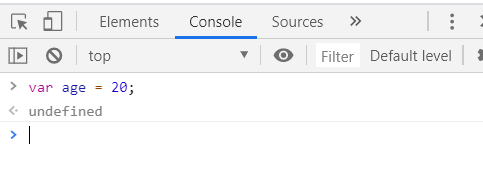
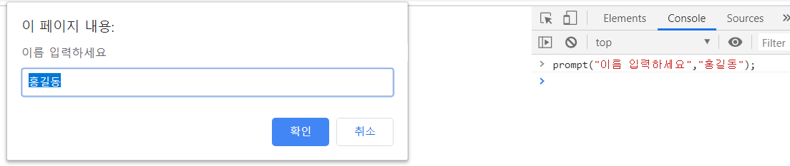

## #웹 프로그래밍?

**서버 ** : 사용자의 검색 요청을 처리해 알맞은 정보를 전달해주는 컴퓨터

웹 브라우저를 보여주는 PC, 노브북, 모바일 기기 : **클라이언트** 

* 서버에서 사용자 요청을 처리하거나 데이터를 관리하는 **백엔드** 
* 서버에서 받아 온 정보를 웹 브라우저에 어떻게 보여줄 것인지 **프론트엔드**  
* **백엔드**  +   **프론트엔드**  = **풀스택**


* HTML 문서의 시작을 알리는 HTML 태그

```html
<!DOCTYPE html>
```


# DOM과 BOM

자바스크립트에서 HTML문서와 웹 브라우저 객체로 간주하여 처리한다

> DOM : HTML문서의 모든요소를 객체로 표현한 것
>
> BOM : 웹 브라우저를 객체로 표현한 것.

# 1) BOM

> 웹 브라우저가 가진 모든 객체로, 브라우저 객체 모델이라고 한다.
>
> 브라우저에 출력되는 모든 구성요소를 객체로 정의하고 접근
>
> 모든 객체는 계층구조를 가지고 있다.

- ```
  window.document... 
  ```

  이런 식으로 각 객체에 접근이 가능하다

  - `window.document.폼객체.텍스트객체`
  - `window.document.myform.id.속성(메소드)`
  - **`window`**는 보통 **생략이 가능**하다.

## window

### 1) 대화상자

클라이언트가 볼 수 있는 팝업창으로 내용을 띄워주는 기능

- **alert**

  - 알림 창으로 출력하기

- **document.write()** 

  - 웹 브라우저 화면에 출력하기
  - **console.log( " " )** 와 비슷

- **prompt**

  - 사용자 입력값 받기

  ```javascript
  var num1 = parseInt(window.prompt("숫자를 입력하세요"));
  var num2 = parseInt(window.prompt("숫자를 입력하세요"));
  ```

- **confirm** 

  - true/false 를 확인한다.
  
  ```javascript
  result = window.confirm("정말 삭제할거야?");
  ```
  
  
  
  ​	

### 2) POPUP

* open : 팝업창을 연다

* close :팝업창을 닫는다.

  ​	

### 3)자동실행

* **setTimeout** : 매개변수로 실행할 행동과 시간을 받는다.

  ```javascript
  <script type="text/javascript">
  	window.setTimeout("location.href='https://www.naver.com'", 3000);
      // 3초 뒤에 naver 사이트로 이동한다.
  </script>
  ```

* **setInterval** 

  * **setTimeout** 과 마찬가지로 실행할 행동과 시간을 받지만, 이 함수는 지정한 시간마다 지정한 행동을 반복한다.
* `window.setInterval`호출문과 변수를 같이 사용하게 되면 실행중인 작업아이디를 변수에 자동저장하게 되므로 실행중인 작업을 제어하기 편하다
  
```javascript
  <script type="text/javascript">
  	jobid = window.setInterval(showTime, 1000);
      // showTime 메서드를 1초마다 실행
      // jobid 객체에 담은 이유는 clearInterval에서 사용하기 위함
  </script>
  ```
  

  
* **clearInterval** : 실행되고 있는 setInterval을 지운다.

  ```javascript
  <script type="text/javascript">
  	window.clearInterval(jobid);
      // 위에서 실행했던 setInterval 객체를 지운다.
  </script>
  ```

  

### 4) 데이터처리

* **parseInt** : 숫자 모양을 한 `문자열`을 `숫자`로 변환
* **isNaN** : 입력받은 값이 숫자인지 문자인지 확인
* (타입을 비교하지 않고 **실제 값을 비교** - 문자 입력되면 true)
* **eval** : 매개변수로 전달된 **데이터(식,연산)를 실제로 실행**
* 하지만, *보안에 취약* 하다.
* **trim** : 공백을 제거


### 5) event

* `onclick` : 버튼 '클릭'
* `onkeyup` : 키보드가 눌리는 동시에 
* `onmouseover`, `onmouseout`
* `onchange` : 변화가 감지되었을 때
* `onload` : 페이지가 로딩되면서 발생되는 이벤트


# 2) DOM

브라우저가 HTML문서를 내부적으로 표현하는 표준 모델 (문서 객체모델 : Document Object Model)

DOM은 HTML문서의 **계층적인 구조** 를 Tree로 표현한다.

브라우저 엔진 안에 DOM을 형성하는 기능의 Library가 존재.

* xml 또한 dom 형식

* **getElementsByTagName(tagName)**

  * `NodeList`를 배열로 반환
  * `getElementsByTagName`은 노드의 구조와 상관없이 **해당 태그를 모두** 찾는다.

```javascript
nodelist = document.getElementsByTagName("div");
//div 태그 목록을 가져온다
	alert(nodelist);
```

* `beforeinsert`

```javascript
                //1.삽입될 노드 생성
                spanNode = document.createElement("span");
                textNode = document.createTextNode("삽입될 텍스트");
                spanNode.appendChild(textNode);
                //2. 삽입될 위치의 상위노드 구하기
                parentNode = document.getElementById("myformId");	//form
                //3. 삽입될 위치의 형제노드 구하기
                targetNode = document.getElementById("btndomtest");
                //4. 노드 추가하기
                parentNode.insertBefore(spanNode,targetNode);
```

* `imageinsert`

```javascript
                document.getElementById("imginsert").onclick = function(){
				//img노드 작성 : createElement 이용
				//1. 삽입될 노드 생성
				newNode = document.createElement("img");
				newNode.setAttribute("src","../images/m_garden01.jpg");
				newNode.setAttribute("style","border:solid 1px red;width:150px");
				//2. targerNode 구하기
				target = document.getElementById("domtestbtn");
				//3.추가하기
				target.appendChild(newNode);
```

* `nodeinsert`

```javascript
window.onload = function(){
			document.getElementById("btninsert").onclick = function(){
				//1.노드생성
				newTextNode = document.createTextNode("삽입될 텍스트");
				// 2. 삽입될 상위 노드를 구하기 
				targetNode = document.getElementById("domtestbtn");
				// 3. target 노드에 새롭게 생성한 노드를 추가한다. - 하위노드로 추가
				targetNode.appendChild(newTextNode);
			}
		}
```

* `remove`

```javascript
window.onload = function(){
			document.getElementById("btndelete").onclick = function(){
				//1. 삭제하고 싶은 노드의 부모노드를 구하기
				targetNode = document.getElementById("myformId");
				//2. 삭제할 노드를 구하기
				//delNode = document.getElementById("btninsert");
				delNode = targetNode.firstChild;
				//3. 삭제하기
				targetNode.removeChild(delNode);
			}
		}
```

* 모든 노드 삭제
  * `hasChildNodes` - 하위노드가 있으면 true, 없으면 false

```javascript
function deleteDivAndP(){
			//root의 모든 하위 엘리먼트 제거
			parentNode = document.getElementById("root");
			childnodelist = parentNode.childNodes;
			while(parentNode.hasChildNodes()){
				console.log("삭제완료");
				parentNode.removeChild(parentNode.lastChild);
			}
```

---

## Web 콘솔 기능 

* `ctrl` + `shift` +`j`



* `>` : 소스
* `<` : 결과값 출력
  * `undefined` : 특별히 출력할 결과값이 없을 때 



```html
> typeof "test"
< "string"
> typeof 100
< "number"
> typeof 2020/01/10
< NaN
> 1==1
< true
> typeof Math
< "object"
```

* `===` 는 자료형의 변환을 허용하지 않는다.
  * `==` 는 자동으로 자료형을 변환하여 비교한다.
  * `===`는 타입check 까지 하기 때문에 "권고사항" 이다.

```html
> "1"==1
< true
> 1===1
< true
> "1"===1
< false
```

