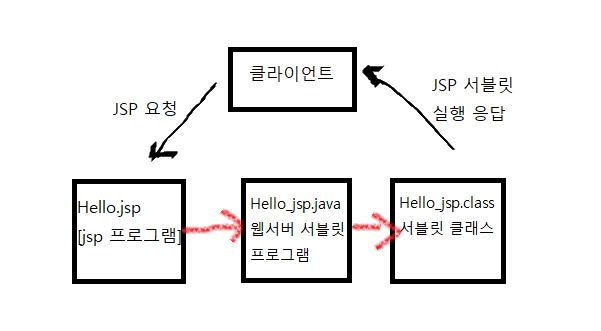
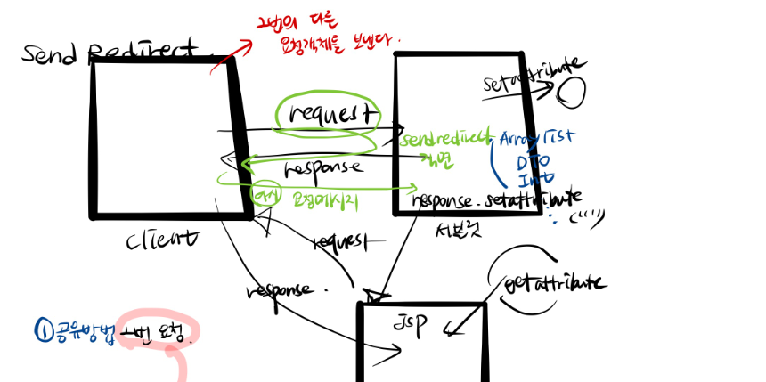
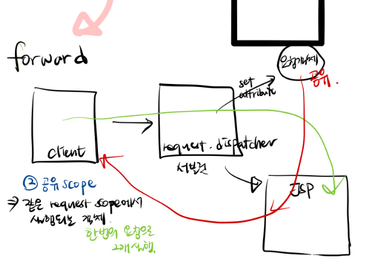
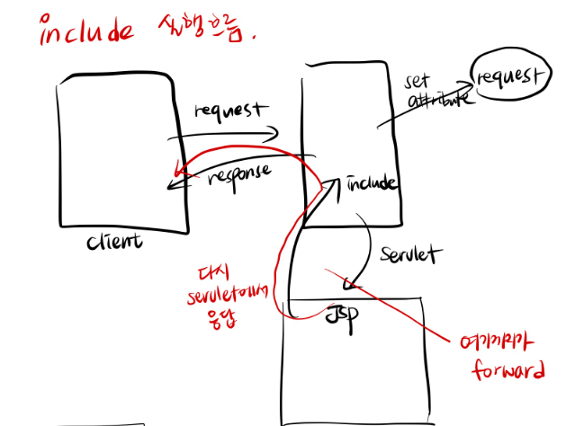
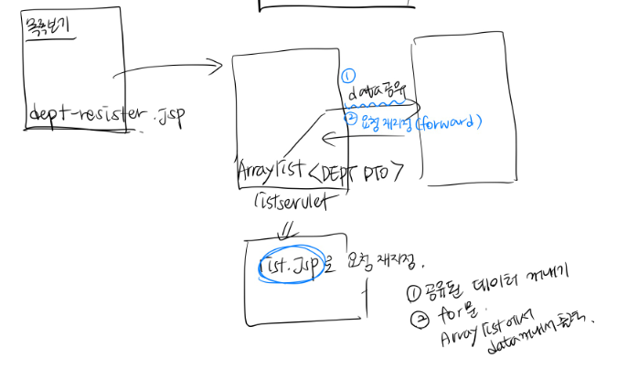

# JSP ( Java Server page)

>  인터넷 서버 프로그래밍 기술.
>
>  HTML코드내에 **직접 비즈니스 로직을 삽입**할 수 있는 개발방식이 필요하여 개발된 기술.
>
>  즉, html문서에 java코드를 쓰지 못하기 때문에 이를 해결하고자 만든 대안이 **JSP** 이다.

* JSP가 실제로 웹 애플리케이션 서버에서 사용자에게 서비스가 될 때에는 서블릿으로 변경되어 서비스된다.
* JSP는 **플랫폼에 독립**적인 기술이다.
  * 어떠한 웹서버 환경에서 작성되어 있던지 한번 작성된 JSP는 모든 웹에서 아무런 문제없이 잘 작동한다.
* JSP프로그램은 하나의 서블릿 프로그램으로 변환되어 실행된다.
  * **Hello.jsp** -> **Hello_jsp.java** -> **Hello_jsp.class**

* 클라이언트의 요청에 대해서 동적 컨텐츠를 생성해서 응답결과**(html태그)**를  만들어줄 때 사용하는 기술로

​        HTML문서에 화면을 구성하는 방법과 동일하게 작성하면 된다.

* 실행이 될 때 WAS내부에서 JSP컨테이에 의해 서블릿으로 변환되어 실행이 되므로 자바코드를 사용할 수 있다.

  ```text
  C:\iot\work\webwork\.metadata\.plugins\org.eclipse.wst.server.core\tmp0\work\Catalina\localhost\serverweb\org\apache\jsp\jspbasic
  ```

  * [tmp0] : 생성하는 서버의 수에 따라 *tmp+번호* 

* JSP는 **서블릿에서 발생한 데이터를 화면에 출력하기 위해서 사용하는 기술**이므로 자바코드를 다양하게 많이 정의하지 않도록 구현해야 한다.

* LifeCycle이 **서블릿과 유사**하다.



* JSP의 시작
  * web.xml에서 servlet관련 코드를 작성한 것과 동일한 기능을 한다.
  * `@` (어노테이션) 
    *  컴파일러에게 어떤 동작을 할 것인지 간단한 기호를 통해서 명시할 수 있다.
    *  그로인해 컴파일러에게 간단하게 알려줄 수 있다

```java
import javax.servlet.annotation.WebServlet;
@WebServlet(name = "MyPost2", urlPatterns = { "/MyPost2.do" })
//절대 이름은 중복이 있으면 안된다.
```


### 1. JSP스크립트요소(scriptTest.jsp)

* 스크립트릿 **<%  %>**  

  * **자바 코드**를 작성할 수 있느 스크립트 요소
  
  ```java
  <% 
     String str = "스크립트릿 태그";
    	out. print(str)
          %>
  ```
  
  
  
* 문장의 끝에 반드시 `;`추가
  
  * 스크립트릿 요소는 여러 번 반복해서 정의할 수 있다. 지양한다
  
* 서블릿이 공유하는 데이터를 꺼내서 출력하는 작업
  
  * `.java` 파일에서 할 수 있는 모든 작업을 할 수 있다. (메소드 선언, 클래스선언 X)
  
* `.java.lang` 패키지 빼고는 모두 import
  
* 스크립트릿 내부에서 정의하는 변수는 모두 _jspService()메소드의 지역변수로 추가
  
* 선언문 **<%! %>**
  
  * jsp 파일이 서블릿으로 변환될 때 서블릿클래스의 멤버로 작성될 **메소드**나 **변수**를 정의.
  
* 주석

```java
<!-- HTML 주석문(클라이언트에 전송된다.)- 사용하지 말 것 -->
<%-- JSP 주석(Servlet으로 변환되기 때문에 클라이언트에 전송되지 않는다.) --%>
```

* 표현식 **<%= %>**

  * **동적**으로 만들어진 컨텐츠를 구성하는 값을 출력하기 위해 사용하는 스크립트 요소
  * 변수, 계산식, 함수 호출 결과를 **문자열 형태**로 출력
* 서블릿으로 변환될 때 **out.print()**의 내부에 매개변수로 추가가 되므로 `;`를 추가하지 않는다.
  

<자체적으로 추가된 매개변수들>

  ```java
   final javax.servlet.jsp.PageContext pageContext;
      javax.servlet.http.HttpSession session = null;
    final javax.servlet.ServletContext application;
      final javax.servlet.ServletConfig config;
      javax.servlet.jsp.JspWriter out = null;
      final java.lang.Object page = this;
      javax.servlet.jsp.JspWriter _jspx_out = null;
      javax.servlet.jsp.PageContext _jspx_page_context = null;
  ```

*  **import** 속성
  * 이용하 class를 지정하는 방법
  * 구분자 `,`를 이용해서 여러 개의 클래스를 지정할 수 있다.

```html
<%@ page import="java.util.Date, java.sql.*"%>
```


  **[오류 상황]**

  ```java
  <%= "test" ; %> ========> out.print("test";)    :error!!!
  ```

  * 표현식은 값을 출력하기 위해서 사용하므로 사용할 수 있는 타입이 제한적이다
  * 기본형, String , 앞의 나열한 타입을 반환하는 메소드 호출문 연산

### 2. 지시자

<%@ %>

### 3. JSP내장객체

* JSP가 서블릿으로 변환될 때 JSP컨테이너에 의해서 **_jspService()**메소드 내부에 추가된 지역변수

  * JSP 문서 내부에서 변수 선언하지 않고 사용할 수 있다.
  * 객체명은 컨테이너가 자동생성해준 이름이므로 반드시 정해진 이름으로 사용해야 한다.
  * **request** : HttpServletRequest
  * **response** : HttpServletResponse
  * **session** : HttpSession
  * **application** : ServletContext
* **out** : JspWriter
  
1. **request** 객체
* 클라이언트의 요청정보를 담고있는 객체 서블릿으로 부터 전달받아 사용한다.
* 서블릿에서 사용하는 모든 것을 사용할 수 있다.

  * void - setCharacterEncoding(String env)
* String - getParameter(String name)
  * String[] - getParameterValues(String name)
* post방식의 request
    * HTML의 <form>태그에서 post방식은 전송 자료 크기에 상관없이 사용자가 입력한 내용을 공개하지 않고 전송하는 방식이다.
    * request.setCharacterEncoding("euc-kr")
      * 한글 처리를 위하여 정보를 전송받은 jsp파일에서 내장객체 request를 이용하기 전에 request.setCharacterEncoding("euc-kr")을 호출한다.
2. **response** 객체
* 서버가 클라이언트에게 요청에 대한 응답을 보내기 위한 객체.
  * void - setContentType(String type)
  * void - sendRedirect(String location)

### 4. JSP액션태그

페이지 내에서 어떤 동작을 하도록 지시하는 태그

#### 1. forward

현재의 페이지에서 다른 특정 페이지로 전환할 때 사용.

완전 보내버린다고 생각하면 된다. 

```html
<jsp:forward page ='sub.jsp'/>
```

* 넘길 때 값을 같이 넘길 수가 있다.

```html
<jsp:forward page ="forward_param.jsp">
   <jsp:param name="id" value="abcdef"/>
   <jap:param name="pw" value="1234"/>
</jsp:foward>
```


#### 2. include

현재 페이지에서 다른 페이지를 삽입할 때 사용.

페이지를 이동했다가 다시 원래의 페이지로 돌아온다. 

```html
<jsp:include page="include02.jsp" flush="true"/>
```


### 5. EL & JSTL


create table mydept(    deptno varchar2(20) primary key,    deptname varchar2(20),    loc varchar2(20),    tel varchar2(20),    mgr varchar2(20))


## <<요청 재지정>>

* 클라이언트로부터 들어온 최초 요청을 servlet에서 원하는 다른 자원으로 요청을 넘기는 것을 **요청재지정**이라 한다.
* 요청재지정을 하는 목적은 서블릿에서 화면단을 분리시키고 분리시킨 화면이 응답하도록하기 위해 필요하다.
* 웹을 개발하기 위해 사용하는 최적화된 패턴인 MVC패턴을 적용하기 위해 반드시 필요한 개념


#### ① 데이터 공유

1. **scope**

   page, request, session, application에 각각 **map**구조의 저장소를 갖고있고 그 저장소에 추가하고 저장소에서 꺼내온다.
   
   * **Page** -> javax.servlet.jsp.PageContext
     * JSP문서 내에서만 사용할 수 있다.
   * **request** -> javax.servlet.ServletRequest
     * 한  번에 request에 대해서 처리하고 response하기 전까지 사용되는 모든 객체에서 공유
   * **session** -> javax.servlet.http.httpSession
     * 세션이 생성되고 사용되는 모든 것들이 공유할 수 있도록
     * 세션이 **생성**되는 시점 : 로그인
     * 세션이 **해제**되는 시점 : 로그아웃 ( or 정해진 시간 동안 사이트를 사용하지 않은 경우 )
   * **application** -> javax.servlet.ServletContext
     * 모두 공개 : 톰캣메모리에 공유
       * 로그인 유무와 상관없이 모두 사용할 것들 공유

2. 데이터 공유하는 메소드

* 공유되는 데이터를 attribute라 한다.

* 모든 객체(scope에 해당하는)의 setAttribute("공유할 attribute이름",**공유할 객체**)

  * **공유할 객체**  바에서 사용할 수 있는 모든 것 java.lang.Object																						

    3) 공유된 데이터 가져오기

    * 모든 객체(scope에 해당하는)의

      ```java
      java.lang.Object = getAttribute("공유된 attribute의 이름")
      ```


#### ② 요청재지정 방법

1. **리다이렉트**(sendRedirect)

* httpServletResponse의 sendRedirect메소드를 이용해서 구현

```java
response.sendRedirect("요청재지정될 web application의 경로")
    					--------------------------------
    					html, jsp, 서블릿 모두 가능
    					-----
    		contextpath/폴더명.../요청application의 path
    ex) /serverweb/dept/list.do
```

2. 실행흐름

* 클라이언트에서 요청한다.
* 서블릿이 실행된다
* 서블릿의 실행이 모두 완료되면 클라이언트로 응답한다.
* 클라이언트가 서블릿에서 요청재지정한(sendRedirect에서 설정한) jsp파일을 다시 요청한다.
* jsp페이지가 클라이언트에 응답된다.

3. 특징

* 두 번 이상의 요청으로 처리되므로 데이터를 공유할 수 없다.
* 주소표시줄이 마지막 **요청path**로 변경된다.



2. **forward**

sendRedirect 와 다르게 한번의 요청으로 모든 web application이 실행된다.

서블릿이 요청재지정된 application으로 모든 제어를 넘기기 때문에 요청재지정된 jsp파일이 응답된다.

RequestDistpatcher가 이런 일을 처리하는 객체이다.

* 문법

```java
RequestDistpatcher rd = request.getRequestDistpatcher("요청재지정할 application경로");
													-----------------------------
rd.forward(request,response);												 |		
		---------------------
            	forward하면서 request와 response객체가 전달되므로  				 |
            	같은 request를 공유해서 사용할 수 있다.							 |
                                                        					 |
                                                        		/폴더../application의 path
                                                        		context의 path생략
                                                        	    jsp, html, 서블릿 모두 가능
```

forward 시 redirect는 client위치에 있지만, forward는 서블릿에 있으므로 context path 생략

* 실행흐름
  * 클라이언트가 서블릿을 요청
  * 서블릿이 실행된다
  * 서블릿이 클라이언트로 응답되지 않은 상태에서 jsp를 요청재지정(호출)
  * jsp가 실행되고 실행된 결과를 클라이언트로 응답한다.
* 특징
  * 한 번의 요청으로 모든 application이 실행되므로 데이터 공유가 가능
  * 주소표시줄이 최초 요청된 서블릿 path에서 변경되지 않는다.
  * **서블릿에서 주로 사용되는 요청 재지정방식**



③ include

* forward와 동일하게 **RequestDispatcher**의 메소드를 이용하여 실행하며 요청재지정될 때 모든 제어를 jsp로 넘기지 않고 다시 서블릿으로 돌아와서 서블릿에서 응답된다.
* 문법

```java
RequestDispatcher rd = request.getRequestDispatcher("요청재지정할 application의 path")
    rd.include(request,response);
```

* 실행흐름
  * 클라이언트가 서블릿을 요청
  * 서블릿이 실행된다
  * 서블릿이 클라이언트로 응답되지 않은 상태에서 jsp를 요청재지정(호출)
  * jsp 실행이 완료되면 jsp실행결과를 갖고 서블릿으로 되돌아온다.
  * 서블릿에서 최종 응답된다.
* 특징
  * forward와 동일
  * **jsp**에서 주로 사용하는 요청재지정방식



