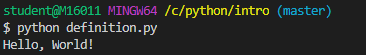
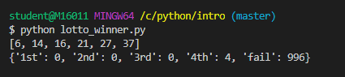
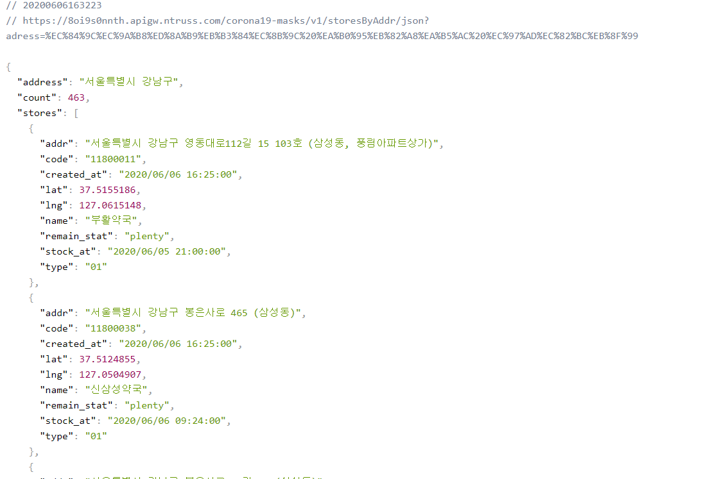

#### # 참고

* 파이썬 알고리즘 확인 사이트

> [python tutor](http://www.pythontutor.com/visualize.html#mode=edit)

* [json viewer](https://chrome.google.com/webstore/search/json)


* [pip request](https://pypi.org/project/requests/) 


* git bash

```bash
$ pip install requests
```


## 1. Definition

>  함수는 원래 return 값이 있기 때문에 그냥 호출 시 None이 나온다.
>
> 따라서 **return**을 안에 꼭 넣어준다.

```python
# def hello():
#     print("Hello, World!")   # 함수를 실행만 했을 뿐 아무것도 넘겨주지 않는다.
# print(hello())

def hello():
    return "Hello, World!"
print(hello())
```



```python

def add(num, number):
    return num + number
nums = add(3,4)
print(nums)
# 7
```

```python
def ran(num,number=10):
    return num + number

nums = ran(3)
print(nums)
# 13
```

```python
def m_num(a,b) :
    print(a)
    print(b)
    return a - b
a = 3
b = 4
minus = m_num(b,a)
print(minus)
# 4
# 3
# 1
```

## 2. 로또 번호 확인 

> <Response [200]> : 성공

```python
import requests
import random

response = requests.get('https://dhlottery.co.kr/common.do?method=getLottoNumber&drwNo=913')
# print(response)  
# print(response.json)
# print(type(response.json()))

winner = []
data = response.json()
# print(dir(winner)) - 사용 가능한 메서드 확인
# winner.append(data['drwtNo1'])

for i in range(1,7) :
    winner.append(data[f'drwtNo{i}'])
    #winner.append(data['drwtNo'+str(i)])
print(winner) 

win_rate = {
    '1st' : 0,
    '2nd' : 0,
    '3rd' : 0,
    '4th' : 0,
    'fail' : 0,
}
for i in range(1000):
    lotto = random.sample(range(1,46),6)

    matched = 0 
    for num in lotto:
        if num in winner :
            matched += 1

    if matched == 6 :
        win_rate['1st'] += 1
    elif matched == 5 :
        if data['bnusNo'] in lotto:
            win_rate['2nd'] += 1
        else :
            win_rate['3rd'] += 1
    elif matched == 4 :
        win_rate['4th'] += 1
    else : 
        win_rate['fail'] +=1

print(win_rate)

```



* 모듈화

```python
from lt import lottos

pick = lottos.lotto()
print(pick)

# 1. 만약 4등한 적이 있으면 4th >= 1,
# 2. 4등 `몇번` 했습니다.

count = pick['4th']
if count>=1 :
    print(f'4등은 {count}번 했습니다')


if pick['4th']>=1 :
    print(f'4등 {pick["4th"]}번 했습니다.')
else :
    print("fail")
```

## 3. 공적마스크 

* dictionary 형태의 json 파일




# Web Service

> 클라이언트가 서버에 **요청**(Get/Post)/ 서버가 클라이언트에게 **응답**(response)
>
> 서버컴퓨터에서 요청과 응답을 처리할 프로그램을 개발한다.


* web ? 
  * 인터넷에 포함된 망
  * 인터넷에 연결된 사람들이 정보를 공유할 수 있는 공간

* html
  * 문장들의 역할을 정해주는 문서
  * **시맨틱 태그** ? 단순히 보여주는 것을 넘어서 의미를 가지는 태그 활용
  * 

