# HTML

* `mark up` 언어

`!` + `Enter` : html 요소 자동 생성

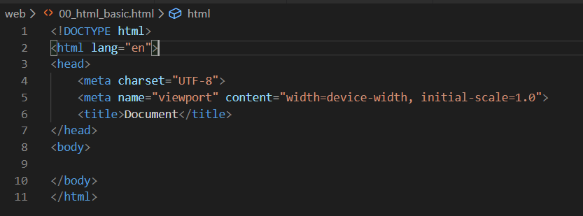

* `lang` : 기본 셋팅 언어
* `viewport` : 반응형 웹 만들기 위함
  * device의 크기에 맞춰서 설정할 수 있도록 도와주는 tag

```html
<body>
    <!-- H1에서 H는 Heading -->
    <h1> HTML TAG 사용해보기</h1>
    <!-- ul 순서가 없는 리스트 -->
    <ul>
        <!--  볼드체 -->
        <li> <strong>강한 아이</strong></li>
        <li><b>볼드체</b></li>
    </ul>
    <!-- 순서가 있는 리스트 -->
    <ol>
        <!-- 이탤릭체 -->
        <li> <em>이탤릭</em> </li>
        <li><i> 이탤릭</i></li>
    </ol>
    <hr>
    <!-- hyper Text Reference-->
    <a href="https://www.google.com/" target="_blank"> google </a>
    
    <iframe width="500" height="315" src="https://www.youtube.com/watch?v=p9EpMpFMmvk"></iframe> 
    <br>
    <!--  기본적으로 html은 들여쓰기와 같은 내용을 무시한다-->
    <span>내용을 넣고
                들여쓰고 
        다시 쓴다
    </span>
    <!-- html에 작성한 내용을 그대로 변형한다. -->
    <pre>
        이거는 내가 
        작성한 그대로 
        내용이 입력된다.
    </pre>
    <form action="">
   
    </form>
</body>
```

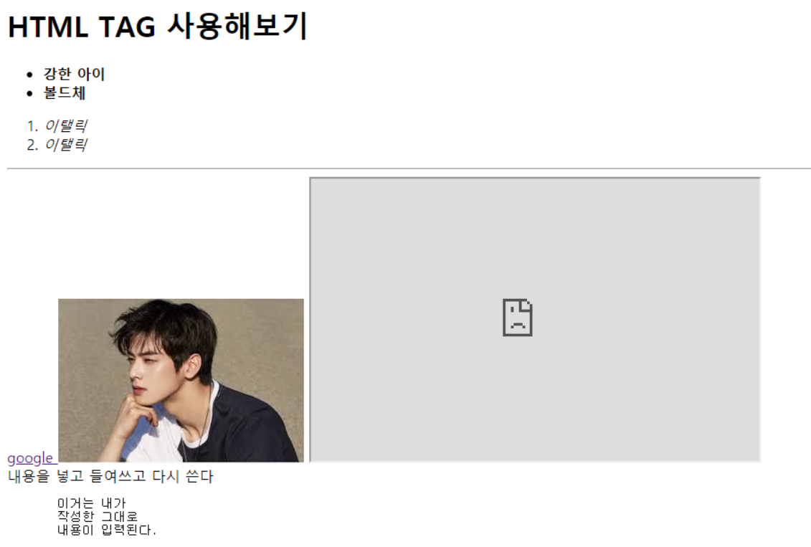


# CSS

> * html 은 정보의 구조화
> * css는 styling

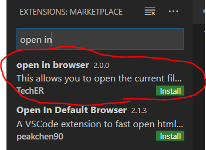

* `alt` + `B` 누르면 브라우저가 켜진다.

* **우선 순위** : id >>> class 
  * id는 보통 고유 값 ( 우선 순위가 높다 .)
  * ` !important` : 모든 디자인 속성을 무시하고 적용하고 싶을 때 사용
    * *ex ) 부트스트랩이나 어떤 형태가 나오는 지 확인하고 싶을 때 주로 사용한다.* 

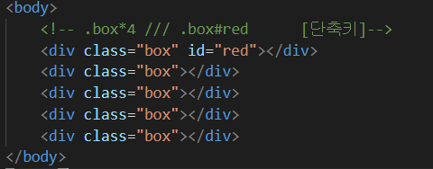

## 1. static (기본위치)

기본적인 요소의 배치 순서에 따라 적용된다.

## 2. absolute 

* 부모의 위치를 기준으로 positioning됨.
* 원래 있었던 위치를 무시하고 적용된다.

```css
 position:absolute;
```


## 3. relative

* 원래 있었던 위치를 기준으로 적용된다.

```css
position: relative;
```


## 4. fixed

* viewport를 기준으로 화면 위치가 결정된다.

* scoll을 내려도 화면에서 계속 위치해있고 따라다닌다.

```css
position : fixed;
```


* **CDN** 이용해서 Bootstrap에 작성된 CSS, JS 활용하기
  * CDN (Content Delivery Network)
  * `em` : 상대적인 값 기준
  * `rem` : 절대적인 값 - 부모/ 최상위 속성의 배수


ctr + alt + 아래 방향키 :

# Django

>  파이썬으로 작성된 오픈 소스 웹 애플리케이션 프레임워크

## MVC? 

* Spring

M : 데이터 베이스 관리

V : 사용자가 마주하는 페이지

C : 요청에 대한 응답처리를 해주는 것


##  **MTV** 

> Model + Template + View 


## Start Django

1. **Django 설치**

```bash
$pip install django==2.1.15
$pip list
```


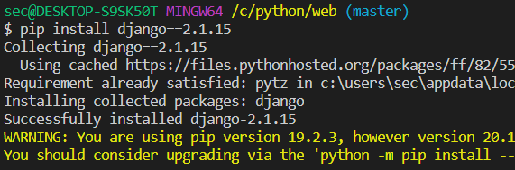

2. **프로젝트 생성**

```bash
$django-admin startproject <프로젝트명>
```


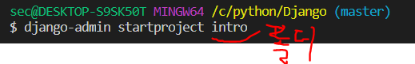

* 파일 생성

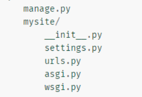

3. **서버 시작하기**

* 위치 이동

  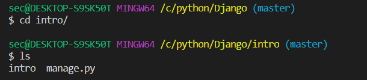

* 서버 실행

  ```bash
  $python manage.py runserver
  ```

  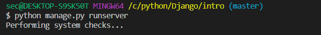

* Django 실행 성공 확인

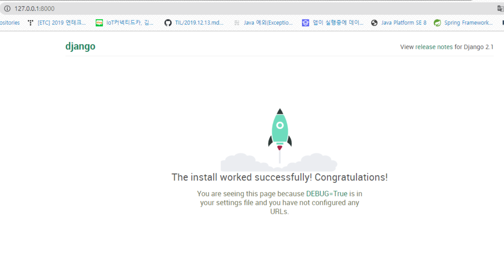

* `.gitignore` 추가
  * venv : virtual 가상환경

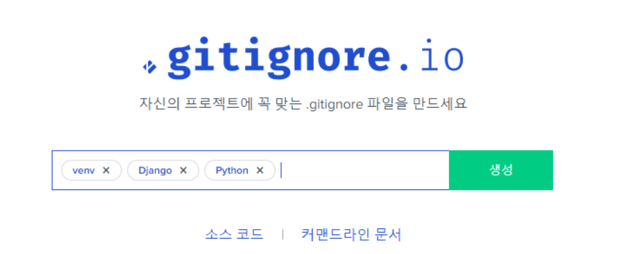

4. 프로젝트 생성 시 제공되는 파일

   * `admin.py` 

   * **manage.py** : 전체 django와 관련된 모든 명령어를 `manage.py`를 통해 실행한다.

   * `__init.py__` : 현재 `__init__.py` 파일이 존재하는 폴더를 하나의 프로젝트, 혹은 패키지로 인식하게 해주는 파일.

     * 실수로 지워지면 프로젝트 새로 파기...

   * **settings.py** : 현재 프로젝트의 전체적인 설정 및 관리를 위해 존재하는 파일.

   * pages 생성

     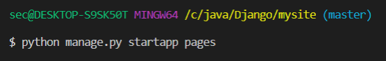

     * settings에 추가
   
     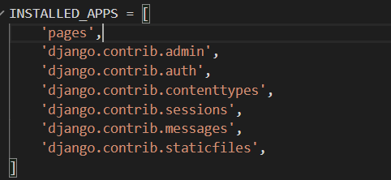
   
     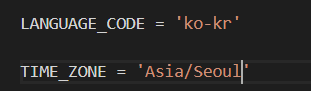
   
   * **urls.py** : 내 프로젝트에 접근할 수 있는 경로를 설정하기 위한 파일
   
     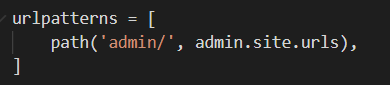
   
   
