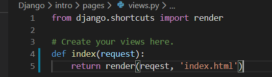
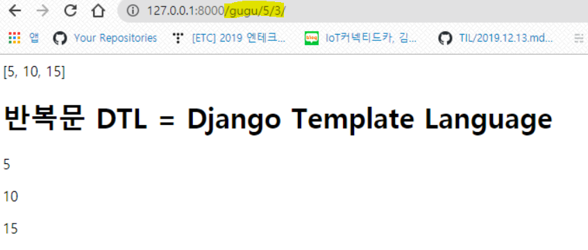
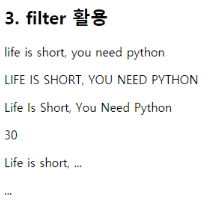

# Django


## 1. URL

> URL mapper는 요청 URL을 기준으로 HTTP 요청을 적절한 view로 보내주기 위해 사용
>
> *  `urlpatterns` 객체는 `path()` 및  `re_path()` 함수의 리스트
> * 

* 경로 설정 ( **urls.py** )

  * `path` 함수 안에 숫자, 문자열로 경로 주소 설정
  * 함수 뒤에 `()` 붙이지 않은 이유는 호출이 아닌, 그저 값을 넘겨주는 것이기 때문
* `views.index` :  함수가 `index()` 
  
  ```python
  from django.contrib import admin
  from django.urls import path
  from pages import views
  # pages로 부터 view 호출
  urlpatterns = [
      path('admin/', admin.site.urls),
      path('index/',views.index) # 지정 url
  ]
  ```

 

### 경로 컨버터

> - `str`-경로 구분 기호를 제외한 비어 있지 않은 문자열과 일치합니다 `'/'`. 변환기가 표현식에 포함되지 않은 경우 이것이 기본값입니다.
> - `int`-0 또는 양의 정수와 일치합니다. 을 반환합니다 `int`.

  * 경로로 변수 가져오기
  
      * 문자열은 앞에 생략해도 괜찮다.
      
    ```python
    path('yourname/<str:name>/',views.yourname)
    path('yourname/<int:name>/',views.yourname)
    path('nameage/<name>/<int:age>/', views.nameage)
    ```

## 2. view

* **views.py**

  

  * **Dictionary** 형태 (key, value)로 값을 넘겨준다.
  *  `HttpRequest` 객체를 (`request`)의 인자로 받고 `HttpResponse` 객체를 반환
  

```python
def hello(request):
    menu = ['닭갈비','탕수육','초밥','스파게티돈까스']
    pick = random.choice(menu)
    return render(request, 'hello.html',{'pick':pick})
```


```python
def introduce(request):
    my_info = ['윤소윤','26']   # 리스트 변수에 넣기
    name = '윤소윤'
    age = '26'
    context = {
        'name' : name,
        'age' : age
    }
    return render(request, 'myinfo.html',context)
```

* url에서 변수 가져오기

```python
def yourname(request,name):
    #name = name
    context = {
        'name' : name
    }
    return render(request,'yourname.html',context)
```


## 3. template

* html에서 key값으로 바로 전달받을 수 있다. by `{{}}`

  ```html
  <h1>오늘 점심 메뉴는 {{pick}} </h1>
  ```

  

## 4. DTL (반복문)

> [DTL](https://docs.djangoproject.com/en/3.0/ref/templates/builtins/) = Django Template Language

* 한줄 주석 : **{# #}**

* 전체 주석 : 

  ```HTML
  
  여기는 전부 출력이 안된다...
  
  ```

  

```python
def gugu(request,big,small):
    result = []
    if big < small :
      big,small = small,big
    for num in range(1,small+1):
      result.append(big*num)
    context = {
      'result' : result
    }
    return render(request, 'gugu.html',context)

```

* **** : 반복문 시작
  * **  ** : 반복문 끝

```html

  <p>{{num}}</p>
  
```




* forloop

```python
my_list = ['짜장면','차돌짬뽕','탕수육','콩국수']
```

```python

  <p>{{ forloop.counter }}. {{ food }}</p>

```

* forloop.first : 루프에서 첫번째 실행이면
  * forloop.last : 루프에서 마지막 실행이면

```html

  
    <p>{{ forloop.first }}</p>
    <p>{{ forloop.last }}</p>
    <p>짜장면엔 고춧가루지</p>
  
    <p>{{ food }}</p>
  

```

* is empty?
  * `empty` 를 통해 값이 비어있는 경우에 대한 예외처리를 해줄 수 있다.

```python
empty_list = []
```

```python

    <p>data</p>

    <p>비어있습니다.</p>

```

* 조건문
  * 변수는 `{{}}` 사용

```html

  
    <p>짜장면엔 고춧가루지</p>
  
    <p>{{ food }}</p>
  

```

* 내용 채우기 용

```html
  <h2> 4. lorem ipsum</h2>
  <p></p>
  <p></p>
  <p></p>
```


### filter 

> my_string = Life is short, you need python

* 소문자

  ```html
    <p>{{my_string|lower}}</p> 
  ```

* 대문자

  ```html
    <p>{{my_string|upper}}</p>
  ```

* 띄어쓰기 기준 앞 글자만 대문자

  ```html
    <p>{{my_string|title}}</p>
  ```

* 문자 길이 출력

  ```html
    <p>{{my_string|length}}</p>
  ```



