# Web - 프로젝트 생성

* Project Name : mysite
* App Name : articles

## 1. 한 프로젝트에서 여러 App 관리

> Web 프로그래밍 ? HTTP(S) 프로토콜로 통신하는 , 클라이언트와 서버 개발

* application 생성 

```bash
$ python manage.py startapp articles
```

* `settings.py`에 어플리케이션 등록
  * 위에서부터 읽어나간다 (참조 순서 ∨)
  * 기존에는 mysite의 urls.py에서 url을 관리했다. 하지만, app이 두 개가 되면서 import 시 views가 같은 이름으로 되어 구분을 할 수가 없다. 
  * 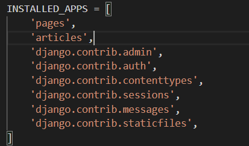


* 언어 설정

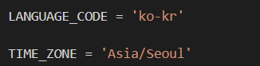

* application이 각각의  url을 관리할 수 있도록 나눠준다.

  * project 폴더 안의 `urls.py`
  * `url.py`를 각 app에서 관리할 수 있다.

  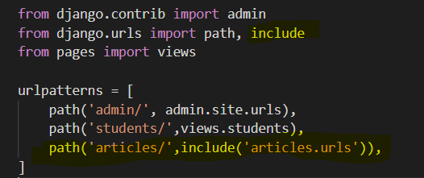

  - articles 안의 `url.py`

    -  `urls.py` 을 각 app에서 관리

    - `경로 , 함수 이름 , 경로 이름`

    - url과 views가 동일 위치에 있기 때문에 다음과 같이 import
    
      ```python
      from . import views
      ```
    
      * variable routing을 통해 주소로 값 전달.
    
      ```python
      path('loop/<int:mynum>',views.loop)
      ```
    

## 2. Page 생성

* **index pages**
  
  * `/index/` : 전체 게시글 목록을 보여 줄 페이지
* **create pages**
  * form 태그가 들어있는 사용자가 직접 입력하는 페이지
  * `/new/` 글 작성을 위한 form(제목, 내용) 입력 페이지
  * `/create/` 글 작성 결과(제목, 내용)를 출력하는 페이지

  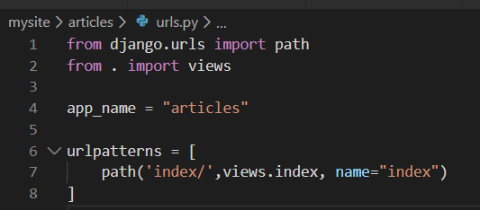

  - articles안의 view.py

  > articles 폴더 안의 html 명시해준다. (templates 는 생략)

  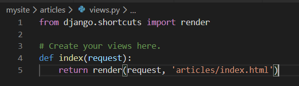

  * 요청에 대한 처리

  ```python
  def loop(request,mynum):
      nums = range(mynum)
      return render(request,'loop.html')
  ```

## 3. base template

>모든 템플릿들이 상속 받을 base.html

* 구역 설정

  * 경로 설정 (`settings.py`)

  * **mysite 안의 templates 안의 html을 접근하는 방법**

  * 폴더 생성

    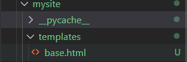

  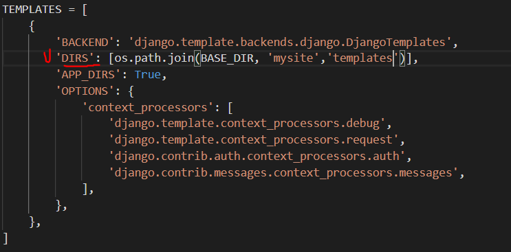

  * base.html 작성
  * APP_DIRS가 True로 되어있기 때문에 해당 기능을 수행할 수 있다. 

  ```html
  <body>
    <div class="container">
      
      
    </div>
  </body>
  ```

* base.html 상속해서 페이지 생성

  * `urls.py`

  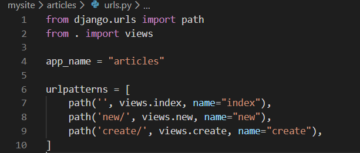

  * `view.py`
  * GET방식으로 데이터 전송
  * `views` 경로 수정
  

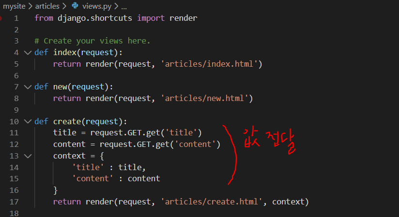

* 상속받는 html 작성 [**템플릿 적용**]
    * 라벨링(Label)
    * `for=id` :
      *  for에 적힌 id와 연결이 되면, 라벨을 눌렀을 경우 id값에 해당하는 곳으로 이동
    
    
  
  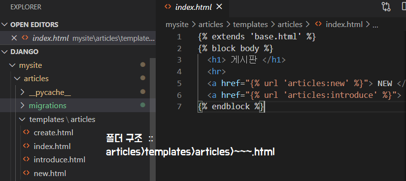
  
  * `a` 태그와 DTL 활용해 연결
  
    * urls.py에 정의한 `app_name` 과 `name` 
  
    ```html
    <a href=""></a>
    ```
  
    
  
  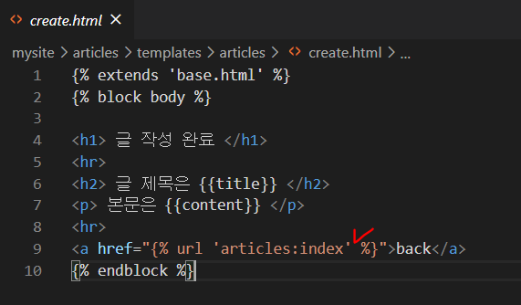
  
  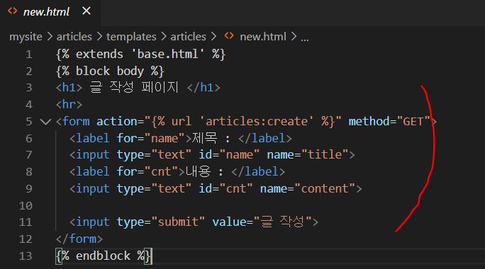

## 4. GET방식

>   DB에 영향을 미치지 않는 요청을 할 때 사용한다.
>
>  *ex. 조회*

* `form` 태그의 `method=` 에 `GET` 을 적어준다. `action=` 속성에는 다음에 수행될 경로
* `/catch/` 를 보면 경로를 상대경로로 적어줬기 때문에 같은 수준에 있는 catch를 찾아 수행한다. 
* 값을 찾을 때 `name`으로 구분하여 찾기

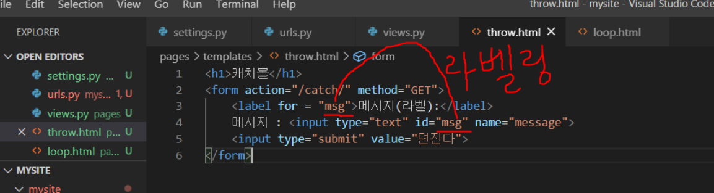

## 5. SQLIte

> 장고의 models를 상속받아 객체 생성

### :star: Model - Django ORM

> **ORM**(Object-Relational Mapping)
>
> * 객체와 RDBMS의 데이터를 매핑해준다.
> * 객체 간의 관계를 바탕으로 SQL문을 자동으로 생성해서 SQL문 없이도 DB 데이터를 다룰 수 있다.
> * 서버를 별도로 올릴 필요가 없다.
> * Django 내에 자체적으로 설치되어있다.

* articles > `models.py`
  * 스키마 설계

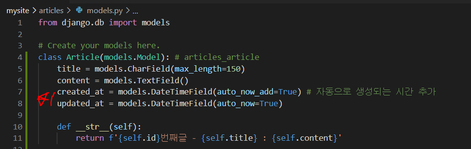

*  `def __str__(self)`    조회를 좀 더 깔끔하게 볼 수있는 메서드

* **makemigrations**

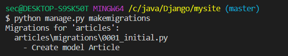

* 설계도 자동 생성
  * mysite > articles > migrations > `0001_initial.py`

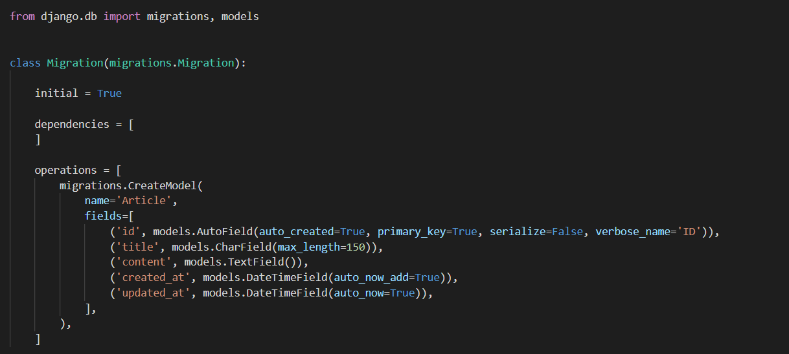

* 만든 설계도대로 DB에 테이블이 생성된다.

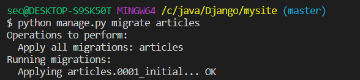

```shell
>>> exit() # shell창 종료
```

* SQL 문 작성하기 위한 Shell 창

```shell
python manage.py shell
```

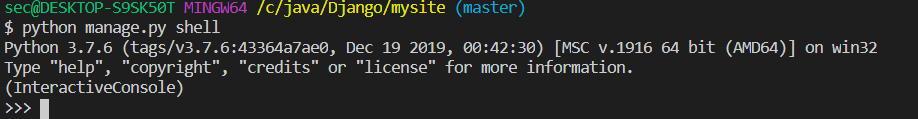

* 모델 데이터 전체 출력

```shell
Article.objects.all()
```

```shell
>>> from articles.models import Article 
>>> Article.objects.all()
<QuerySet []>
```

### 1] CREATE

* **INSERT INTO table (column1, column2....) VALUES (values1, values2...)**

  * DB에 적용 -  *이것을 안해주면 instance 상태로만 남아있는다.*

  * ```shell
     article.save()
    ```

```SHELL
>>> article = Article()
>>> article.title = 'first'
>>> article.content = 'django!'
>>> article 
<Article: Article object (None)>
>>> article.save()
>>> article        
<Article: Article object (1)>
```

* 어느 변수에 어떤 값을 넣을 건지 명시
  * id가 생략되어 있을 뿐 , 자동으로 생성

```shell
>>> article = Article(title='second',content='django!')
>>> article.save()
>>> article
<Article: Article object (2)>
```

* :star:생성 저장 한번에 작성

```shell
Article.objects.create(title='third',content='django!') 
```

### 2] READ

* **SELECT * FROM articles_article** : 전체 조회

```shell
article = Article.objects.all()
```

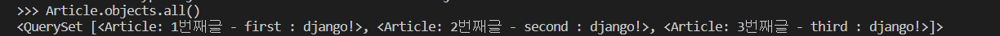

* **SELECT * FROM articles_article WHERE title='first'** : 특정 데이터 조회

```shell
Article.objects.filter(title='first').first()

Article.objects.filter(title='first').last()

Article.objects.filter(title='first')[0]
```

* filter에서 빈값은 **<QuerySet []>**로 출력 

* **SELECT * FROM articles_article WHERE id=1**

```shell
Article.objects.get(id=1)
Article.objects.get(pk=1)
```

> :question: 주의점 :collision:
>
> * 고유값이 아닌 내용을 필터링해서 2개 이상의 값이 찾아지면 오류를 발생한다.
>
> * `.get()`은 반드시 한개만 가져올 수 있다.
>
> * 없는 것을 가지고 오려고 해도 오류가 발생!!


* **모델클래스.objects.filter()**
  * 복수 검색, range 검색, 부분 검색, 범위 검색
  * 조건에 맞는 데이터를 리스트로 가져온다.

```shell
>>> Article.objects.filter(title='first')
<QuerySet [<Article: 1번째글 - first : django!>]>
```

* value값은 중복이 가능하다.

```python
# 생성
Article.objects.create(title='first',content='haha!')
 <Article: 4번째글 - first : haha!>
# 조회
Article.objects.filter(title='first')
 <QuerySet [<Article: 1번째글 - first : django!>, <Article: 4번째글 - first : haha!>]>
```


### 3] **UPDATE**

* **UPDATE article_article SET title='byebye' WHERE id=1**

```python
# 수정
article = Article.objects.get(pk=1)
article.title = 'byebye'
article.save()
```

### 4] DELETE

* **DELETE FROM articles_article WHERE id=1**

```PYTHON
article = Article.objects.get(pk=1)
article.delete()
```


* `admin.py`

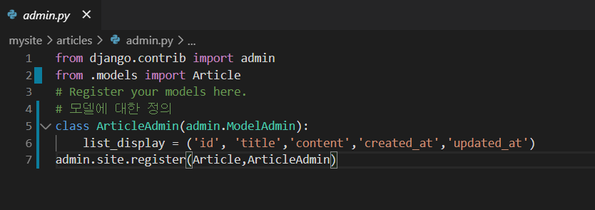

**[결과]**

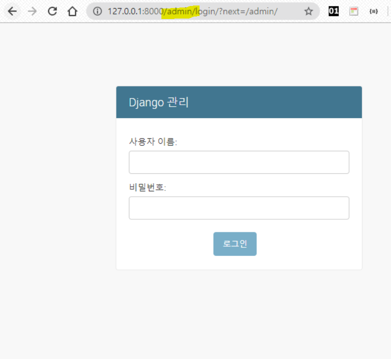

* user 생성

```shell
$ python manage.py createsuperuser
```

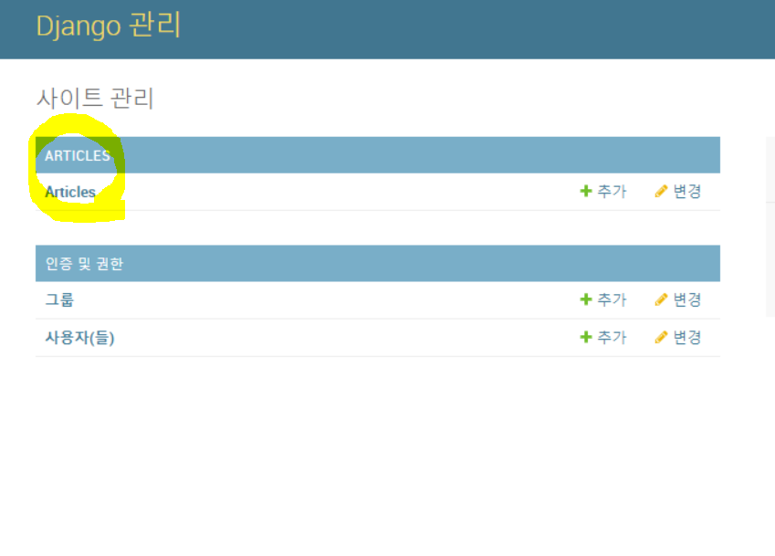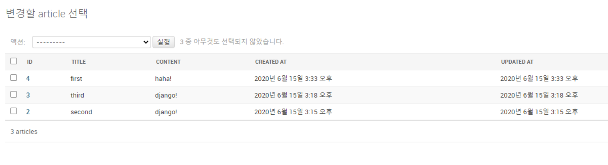

---

작업 전 Django의 인증 필수

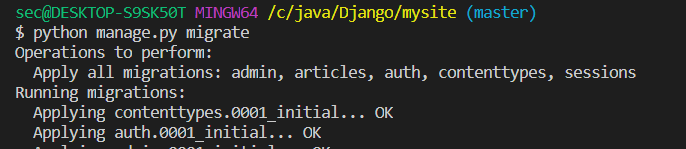