# ORM 복습

* Django 참고 [Git hub](https://github.com/django/django)

* Article에 있는 Model 받아오기

  ```shell
  from articles.models import Article 
  ```

* Select 

  * **QuerySet** : DB에 있는 모든 내용 호출 (List처럼 동작)

  ```shell
  Article.objects.all()
  ```

* 변수 할당

  ```shell
   article.title = 'first'
   article.content = 'django!'
  ```

  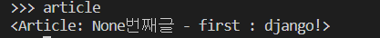

* pk 설정

  * `increment`로 설정되어있기 때문에 새로 생성되더라도 뒤의 번호로 생성된다.

  ```shell
   article.save()
  ```

  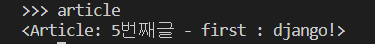

* 생성 + 저장 

  * create 메서드 안에 DB반영되는 기능까지 포함.
  * pk로 바로 저장하는` article.pk=7` 처럼은 작성하지 않도록 조심한다. *- 데이터유실 위험 가능성 o*

  ```shell
  Article.objects.create(title='third',content='django Test') 
  ```

* 특정 데이터 뽑기

  ```shell
  >>> article[0].pk
  2
  >>> article[0].title
  'second'
  ```

  * **filter** - QuerySet 출력

  ```shell
  article = Article.objects.filter(title='first') 
  ```

  * **get** - 하나의 객체 출력 ( 상세 내용 )

  ```shell
   artice = Article.objects.get(pk=2)    
  ```

  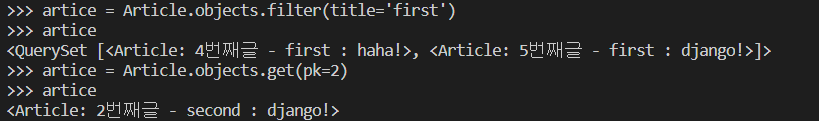

* ASC / DESC

  * order_by는 DB단에서 처리를 한다

  ```python
  Article.objects.all().order_by('pk') 
  # pk 기준으로 오름차순
  Article.objects.all().order_by('-pk')
  # pk 기준 내림차순
  ```

  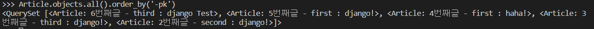

  * 슬라이싱 - Python 내부에서 처리를 한다.

  ```python
  Article.objects.all()[1:3]  # 오름차순
  Article.objects.all()[::-1] # 내림차순
  ```


# :smile: ​ORM - DB연동


* views.py

  ```python
  # 모델 가져오기
  from .models import Article
  
  def index(request):
       # 전체 데이터 가져오기
      articles = Article.objects.all()
      # 그 데이터를 템플릿에게 넘겨주기
      context = {
          'articles' : articles
      }
      
      # 템플릿에서 반복문으로 각각의 게시글의 pk, title 보여주기
      return render(request, 'articles/index.html',context)
  ```

  ```html
    
      <h3>{{article.pk}}</h3>
      <p>{{article.title}}</p>
      <hr>
    
  ```

  

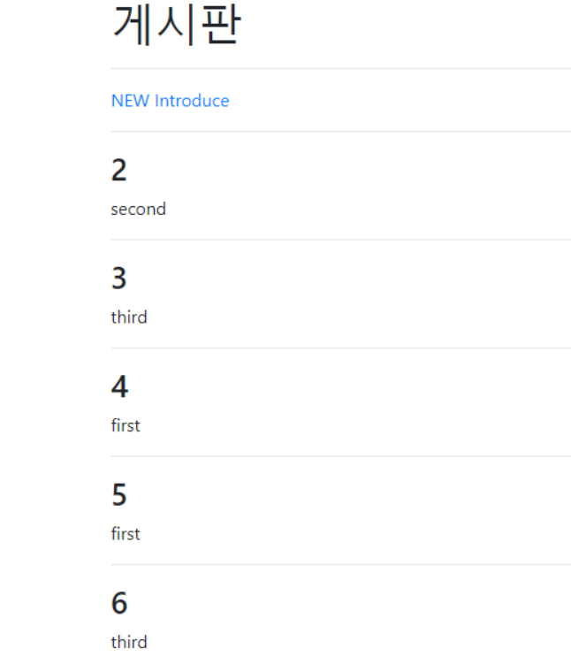

## :hamster: 1. Get/post

### 1 ] Get 

> 어떠한 정보를 가져와서 **조회**하기 위해서 사용

* URL에 데이터가 노출되어 보안에 취약

### 2 ] post 방식

> 데이터를 서버로 제출하여 **추가 또는 수정**하기 위해서 사용하는 방식입니다. 

* 보내는 데이터의 형태가 주소창에 보이면 안될 때(보안)

* **BODY**에 데이터를 넣어서 전송

---

* 데이터 접근

  ```PYTHON
  def create(request):
      title = request.POST.get('title')
      content = request.POST.get('content')
      ....
  ```

  * html 

  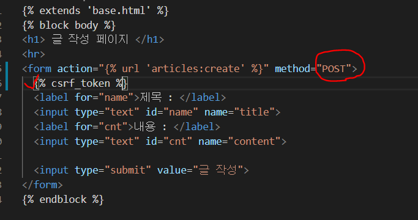

  * :eyes:**csrf** : 사용자간 요청 위조

    * 중간에 가로채서 요청을 위조하는 것을 방지하고자 ㅗHash값을 토근과 함께 넣는 것.
    * `settings.py` > `MIDDLEWARE` : Django 자체적으로 제공

    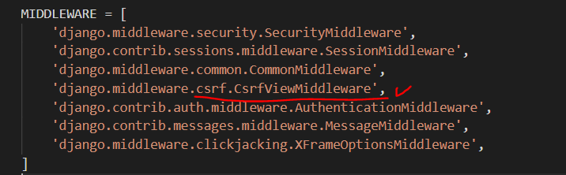

  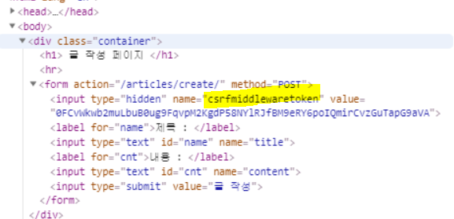

* views.py

```python
from django.shortcuts import render, redirect
```

```python
def create(request):
    title = request.POST.get('title')
    content = request.POST.get('content')
    article = Article.objects.create(title=title,content=content)
    return redirect('articles:index')
```

##  :rabbit:  2.Detail


```html

    <a href=""><h3>{{article.pk}}</h3></a>
    <a href="/articles/{{ article.pk }}"><p>{{article.title}}</p> </a>
    <p>{{article.content}}</p>
    <hr>
  
```

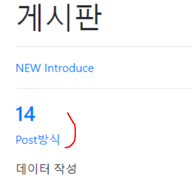

* `url.py`

  ```python
  path('<int:article_pk>/', views.detail, name="detail"),
  ```

* `views.py`

  * render : html 파일의 위치 안내
  * redirect : 해당 경로에 있는 view의 처리
  * *pk와 변수가 헷갈리지 않게 변수 이름 설정해주기*

  ```python
  def detail(request,article_pk):
      article = Article.objects.get(pk=article_pk)
      context = {
          'article' : article 
      }
      return render(request, 'articles/detail.html',context)
  ```

  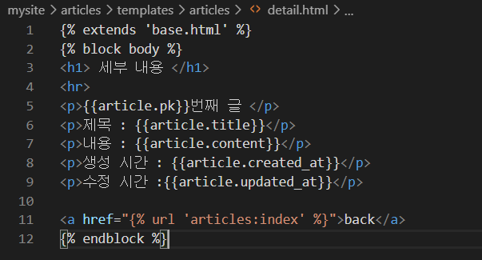

  [결과]

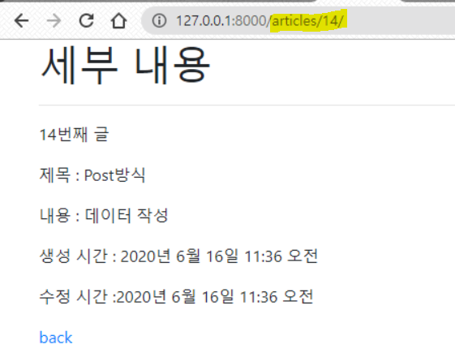

## 3. Delete

* `view.py` : 

```python
def delete(request, delete_pk):
    article = Article.objects.get(pk=delete_pk)
    article.delete()
    return redirect('articles:index')
```

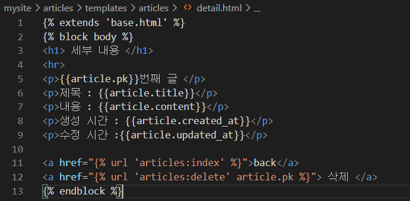

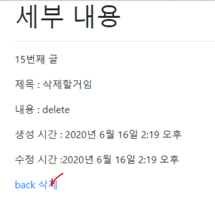

## 4. EDIT

**1. 특정 글 수정을 위한 경로 생성**

**1-1. /articles/1/edit/**

**2. 글 수정 template를 render하는 edit view 작성**

**2-1. 해당 template에 form tag 작성**

**2-3. 각 input tag 내부에 기존 내용이 들어있어야 함.**

**2-3. value 속성을 활용**

```python
def edit(request,article_pk):
    article = Article.objects.get(pk=article_pk)
    context = {
        'article' : article
    }
    return render(request,'articles/edit.html',context)
```

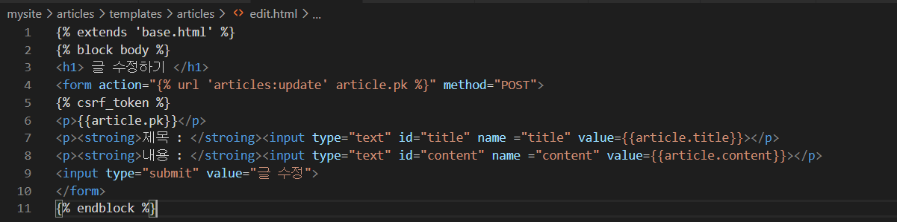

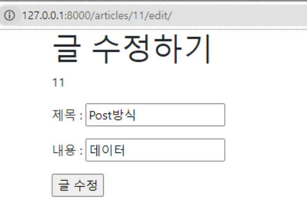

## 5. UPDATE

**1. edit에서 보낸 데이터 처리를 위한 경로 생성**

**1-1. /articles/1/update**

 **2. 글 수정 처리를 하는 update view 작성**

 **3. 해당 글 상세 페이지로 redirect**

 **4. 글 수정을 위한 edit 링크 상세 페이지 설정**

```python
def update(request,article_pk):
  article = Article.objects.get(pk=article_pk)
  article.title = request.POST.get('title')
  article.content = request.POST.get('content')
  article.save()
  return redirect('articles:detail',article_pk)
```

