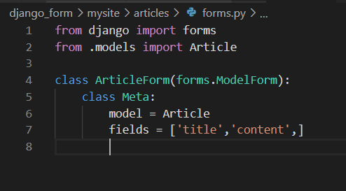

## form 이용한 Post 방식

* 삭제버튼 만들기

  ```html
  <form action="" method="POST"> 
    
    <input type="submit" value="delete">
  </form>
  ```

  * **request.method** : 사용자가 어떤 방식으로 보냈는 지에 대한 정보를 담고있다.

  * `views.py` : 

    * Post 방식이면 삭제, 아니면 세부조회

    ```python
    def delete(request, delete_pk):
        article = Article.objects.get(pk=delete_pk)
        if request.method == "POST":
            article.delete()
            return redirect('articles:index')
        return redirect('articles:detail', delete_pk)
    ```

* **html** :  

  * **textarea** : 높이와 너비를 가진 글 박스
    * 태그 사이에 내용을 넣으면 `textarea`의 기본 내용 값

  ```html
    <textarea name="content" id="cnt" cols="40" rows="10">
      여기에 내용을 입력해 주세요.
    </textarea>
  ```

  


# 실습

**APP Name** : jobs

```bash
$ python manage.py startapp jobs
```


## Model

- **Class Name**: Person

- **Fields**

  | name         | CharField     |
  | ------------ | ------------- |
  | **past_job** | **TextField** |

  
  
  - `makemigrations`로 설계도 작성
    - **migration** : 모델의 변경 내역을 DB 스키마에 적용
  
  ```bash
  $ python manage.py makemigrations
  ```
  
  - migrate로 DB에 설계도 반영
  
  ```bash
  $ python manage.py migrate jobs
  ```

## views 

1. `/index/`
   
   
   
   
   
   - index.html 렌더링
   
   
   
2. `/past_life/`
   - 사용자가 form으로 날린 이름을 받아 저장 
   - DB에 사용자가 입력한 이름이 있는지 확인 
   - 만약 사용자가 입력한 이름이 DB에 있다면 기존 그 사용자의 past_job을 past_job 변수에 담기
   - 직업군 리스트에서 무작위 하나를 뽑아 사용자에게 받은 이름과 새로 뽑은 직업을 DB에 저장 
   - context로 담아서 past_life.html 로 넘김

   

## templates

* 템플릿은 기본 `app/templates/app` 형태로 구분 
  * base.html: 기존의 프로젝트 폴더의 base.html 활용(템플릿 확장)  

  * index.html: 사용자에게 자신의 이름을 입력할 수 있는 form 제공 

    

  * past_life.html: 무작위로 선정된 직업과 사용자에게 받은 이름 출력 

    

  

[결과]


# Form

> Model 클래스로부터 폼(Form)을 자동으로 생성해준다.
>
> **ModelForm** : 모델과 필드를 지정하면 모델폼이 자동으로 폼 필드를 생성해준다.

* models.py


* forms.py

  * forms의 ModelForm 클래스 상속

  * fields에서 입력받을 것 작성 

    ```python
        fields = [ , , ]
    ```



* ArticleForm - model에 대한 정보를 가지고 있다.

* 같은 URL에서 `GET`/`POST`로 나눠서 처리할 수 있다.

  * html에서 작업할 때 따로 작업마다 form[GET/POST]을 정해주지 않아도 된다.

  * 기존에는 `request.method` / `request.POST.get()` 처럼 유효성 검사를 해주어야 했지만 , 이러한 유효성 작업을 한번에 처리할 수 있다.

    * *redirect는 django가 가진 메서드임으로 (built-inX) import 해주어야 한다.*

    * 검증 실패 시 : 오류 메시지와 함께 입력폼을 다시 보여준다

## 1. create


  

  * `ArticleForm`으로 부터 받은 데이터 처리하기 위한 인스턴스 생성
```python
form = ArticleForm(request.POST)
```

  * ArticleForm 클래스에 정의된 `save() `호출
   ```python
    article = form.save()
   ```

  * GET방식은 rendering   /  POST방식은 글 생성
    
    * GET과 POST의 경로는 별개이다. 
    * 경로가 한개인 것 처럼 보이지만 전혀 다르게 작동함을 알 수 있다.


## 2. update

* update와 create를 같은 html을 사용.
  * `form.html`로 이름을 설정
* 원래는 `{{form}}` 안에 value를 설정해줬었다. (ex. `.title`,`.name`) 이러한 정보를 `form`에다가 넣어서 전달해 줄 수 있다.
  * `instance=article `를 이용하여 안에 들어있는 멤버변수에 자동으로 매핑되어 저장된다.


* `request.resolver_match.url_name == 'create' `일때는 글 생성 ,아닐 때는 글 수정페이지로 넘어가도록 한다.


* `get_object_or_404`  : 페이지가 없을 때는 404가 뜨도록 해주는 shortcut
  *  500은 서버 로직 에러이기때문에 해주어야 한다.
  * get_object_or_404처리를 해주면 page not found 발생

```python
from django.shortcuts import render, redirect, get_object_or_404
...
article = get_object_or_404(Article, pk=article_pk) 
```


# [Django bootstrap](https://django-bootstrap4.readthedocs.io/en/latest/) 

```bash
$ pip install django-bootstrap4
```


* base.html 에 CDN 추가


* form.html


[적용 결과]

