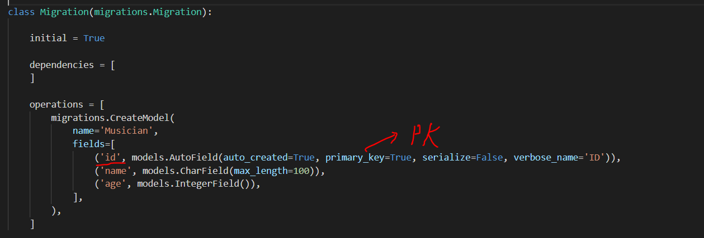
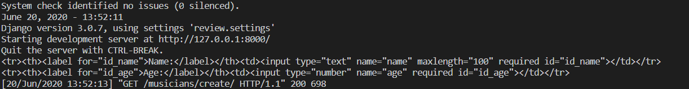

# 종합 실습 프로젝트 

## 1. 목표 

* 데이터를 생성, 조회, 삭제, 수정할 수 있는 Web Application 제작
*  Python Web Framework를 통한 데이터 조작 
* Object Relational Mapping에 대한 이해 
* Template Variable을 활용한 Template 제작 
* 영화 추천 사이트의 영화 정보 데이터 관리

> 환경
>
> Python Web Framework - Django 2.2.13
>
> Python Web Framework 사용을 위한 환경 설정 - Python 3.6+

## 2. ORM 생성


## 3. 페이지

1. 영화 목록
2. 영화 정보 생성 Form
3.  영화 정보 조회
4. 영화 정보 수정 Form
5. 영화 정보 삭제

# Django-review

* app-name : musicians

> base template이 없다는 가정 하에 진행

```bash
$ django-admin startproject review
$ cd review
$ python manage.py startapp musicians
```

* 정의한 객체의 내용 저장(설계도)

  ```bash
  $ python manage.py makemigrations 
  $ python manage.py migrate  # 전부 migrate 해주는 방식
  ```

  

## urls.py

```python
from django.urls import path
from .import views # 경로에 따른 view함수 설정
```

```python
# 어플리케이션 name space
app_name = "musicians"
```

```python
# 장고 내부적으로 정해진 이름
urlpatterns = [
    # u - v - t 순서 고정.
    # path name을 무엇으로 지었는지, 어떤 view함수를 실행하는지 pattern 고정하기
    # 하나의 경로에 하나의 view함수!
    path('', views.index, name="index"),
    path('create/', views.create, name="create"),
    # django가 지정한 경로 작성 방식
    # <데이터 타입 : 변수 명>
    # 실제 사용자가 작성하는 url
    # '3/'
    path('<int:musician_pk>/', views.detail, name="detail"),
    path('<int:musician_pk>/update/', views.update, name="update"),
    path('<int:musician_pk>/delete/', views.delete, name="delete"),


]
```


## forms.py

*  views에서 context에 담아 넘겨준 dictionary 형태의 form

```html
  <form action="">
    {{ form }}
  </form>
```

* MusicianForm()에 정의된 태그 



## Views.py

