# Comment Model

> **1: N**의 관계
>
> 외래키(foreign key) - Article의 ID값

## :ping_pong: models.py

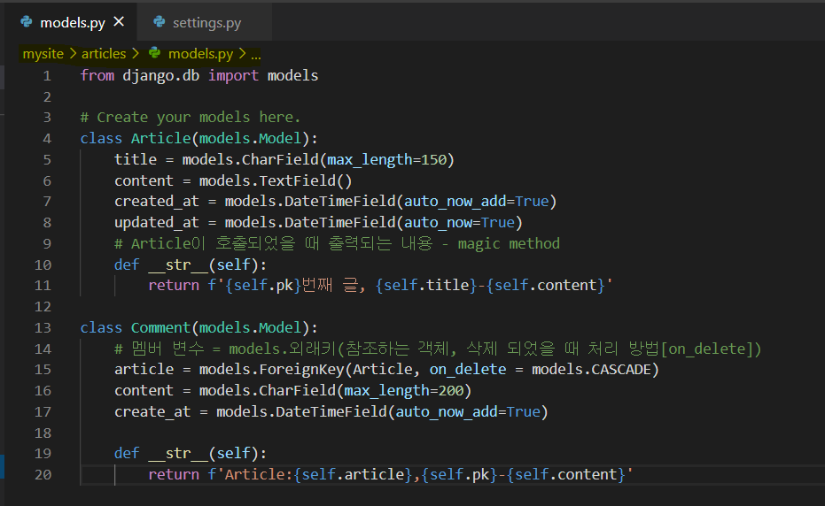

```python
class Comment(models.Model):
    # 멤버 변수 = models.외래키(참조하는 객체, 삭제 되었을 때 처리 방법[on_delete])
    article = models.ForeignKey(Article, on_delete = models.CASCADE)
    content = models.CharField(max_length=200)
    create_at = models.DateTimeField(auto_now_add=True)    # auto_now_add : 생성이 된 시간 적재

```

* `CASCADE`[¶](https://docs.djangoproject.com/en/3.0/ref/models/fields/#django.db.models.CASCADE)

  Cascade deletes. Django emulates the behavior of the SQL constraint ON DELETE CASCADE and also deletes the object containing the ForeignKey.[`Model.delete()`](https://docs.djangoproject.com/en/3.0/ref/models/instances/#django.db.models.Model.delete) isn’t called on related models, but the [`pre_delete`](https://docs.djangoproject.com/en/3.0/ref/signals/#django.db.models.signals.pre_delete) and [`post_delete`](https://docs.djangoproject.com/en/3.0/ref/signals/#django.db.models.signals.post_delete) signals are sent for all deleted objects.

* `PROTECT`[¶](https://docs.djangoproject.com/en/3.0/ref/models/fields/#django.db.models.PROTECT)

  Prevent deletion of the referenced object by raising [`ProtectedError`](https://docs.djangoproject.com/en/3.0/ref/exceptions/#django.db.models.ProtectedError), a subclass of [`django.db.IntegrityError`](https://docs.djangoproject.com/en/3.0/ref/exceptions/#django.db.IntegrityError).

* `SET_NULL`[¶](https://docs.djangoproject.com/en/3.0/ref/models/fields/#django.db.models.SET_NULL)

  Set the [`ForeignKey`](https://docs.djangoproject.com/en/3.0/ref/models/fields/#django.db.models.ForeignKey) null; this is only possible if [`null`](https://docs.djangoproject.com/en/3.0/ref/models/fields/#django.db.models.Field.null) is `True`.

* `SET_DEFAULT`[¶](https://docs.djangoproject.com/en/3.0/ref/models/fields/#django.db.models.SET_DEFAULT)

  Set the [`ForeignKey`](https://docs.djangoproject.com/en/3.0/ref/models/fields/#django.db.models.ForeignKey) to its default value; a default for the [`ForeignKey`](https://docs.djangoproject.com/en/3.0/ref/models/fields/#django.db.models.ForeignKey) must be set.

  

  >  ` article = models.ForeignKey(Article, on_delete = models.CASCADE) `
  >
  > : 어떤 것을 참조 할 것인지, DB가 삭제 되었을 때 같이 삭제될 수 있도록 작성

  

* **설계도 작성**

```bash
$ python manage.py makemigrations
```

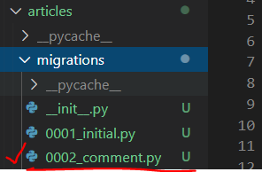

* 설계도 확인
  * 자동으로 article 관련 컬럼이 생긴 것을 볼 수 있다.

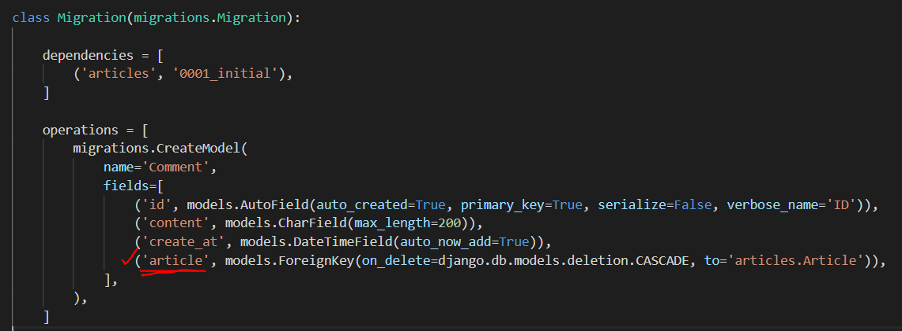


* shell 창에서 db 생성하기[**django-extensions**]
  
  * 장고 확장판 설치
  
    ```bash
    $ pip install django-extensions
    ```

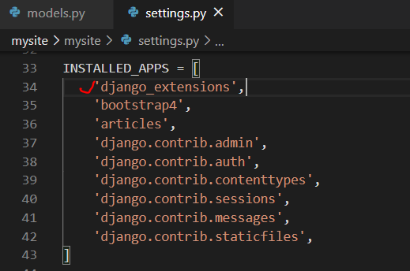

* shell창으로 접속하기

  * ```bash
    $ python manage.py shell_plus
    ```

  * 모델을 별도로 불러오지 않고 바로 사용할 수 있다.

  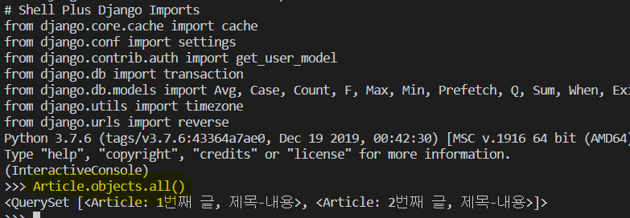

  ```bash
  $ pip install ipython
  ```

  * 설치 후 `migrate` 해주기

  * shell_plus 실행

  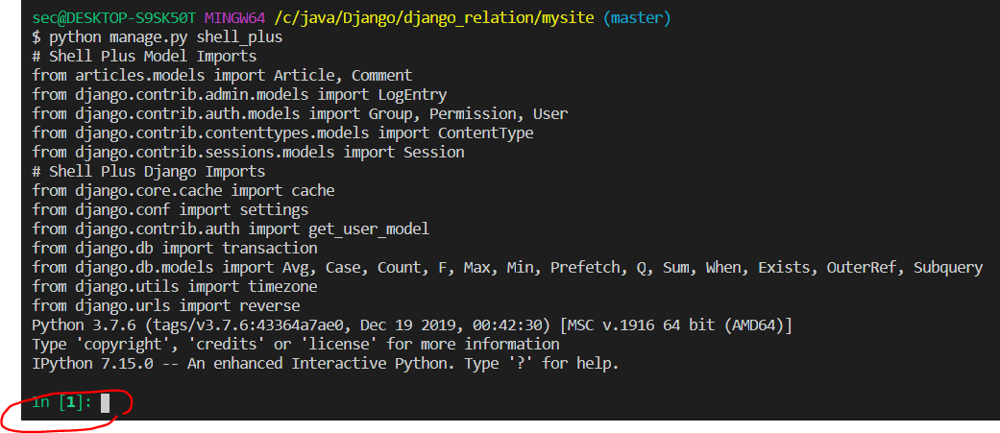

## CREATE

* 방법 [ 1 ] 

```python
# 1. 댓글 생성
comment = Comment()
comment.content = '첫번째 댓글'
comment.save()
# 2. 게시글 하나 불러오기
article = Article.objects.get(pk=1)

# 2-1. comment와 article 연결하기
comment.article = article
comment.save()
```

* 방법 [ 2 ] 

> 작성하는 숫자는 참조하는 게시글 article의 pk 값
>
> 주의 : article_pk 사용 불가 

```python
comment.article_id = 1
comment.save()
```

* 실행
  * 댓글 입력
  * comment와 article을 연결해주지 않았기 때문에 오류 발생

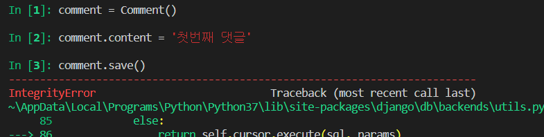

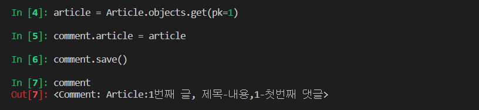

* 댓글 생성 **views.py**

  ```python
  def create(request):
      if request.method == "POST":
          form = ArticleForm(request.POST)
          if form.is_valid():
              article = form.save()
              return redirect('articles:detail', article.pk)
      else:
          form = ArticleForm()
      context = {
          'form': form
      }
      return render(request, 'articles/form.html', context)
  ```

* **urls.py**

  ```python
  path('create/', views.create, name="create"),
  ```

* 댓글 총 갯수

  ```html
  <P>댓글 총 {{ comments|length }} 개</P>
  <P>댓글 총 {{ article.comment_set.all|length }} 개</P>
  ```

  

## READ

* 댓글 조회

  ```python
  # comment 변수들 불러오기
  # 1. 댓글 번호 조회
  comment.pk
  
  # 2. 댓글 content 조회
  comment.content
  
  # 3. 댓글이 어느 게시글에 연결되어 있는가.
  comment.article_id
  
  # 4. 댓글이 연결된 게시글
  comment.article
  ```

  ```python
  # 4-1. 댓글이 연결된 게시글의 제목과 내용
  
  comment.article.pk
  comment.article.title
  comment.article.content
  ```

  * article의 경우는 ? 

    *  **comment_set** : 댓글을 몇개 가지고 있는지 특정지을 수 없기 때문에 comment_set 사용
    * comment와 달리 직접 접근을 할 수 없다.

    ```python
    article.comment_set.all() # 게시글이 가지고 있는 전체 댓글 조회 - QuerySet 형태
    # QuerySet ? - 반복문으로도 사용이 가능하다.
    ```

    

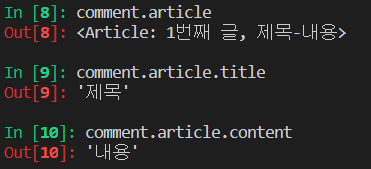

* 댓글 전체 조회

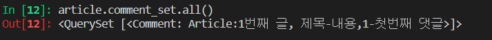

* M: N 관계일 때 역참조 값을 이용해서 DB에 접근할 수 있다

  * 하지만 1:N에서는 잘 사용하지 않는다. 

  ```python
  역참조 값 설정 related_name = 'comments'
  ```

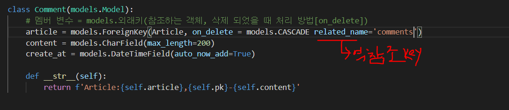

* forms 작성

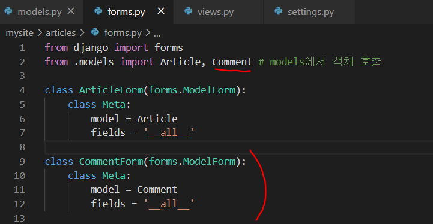

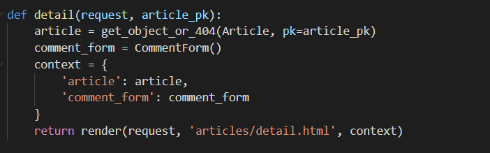

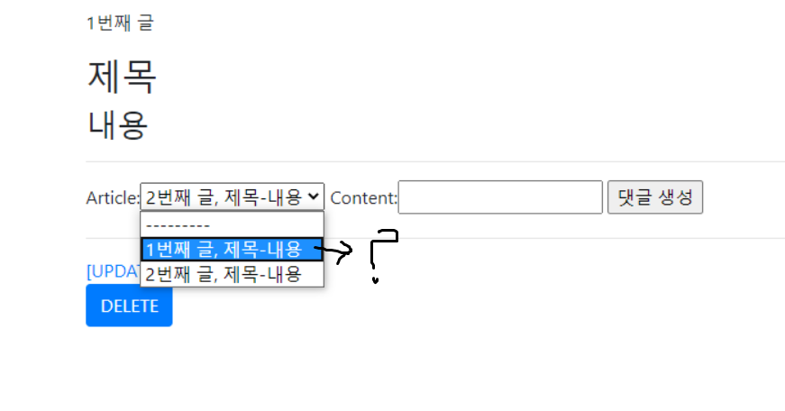

* forms 수정

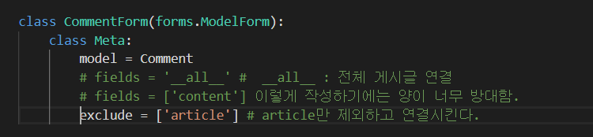

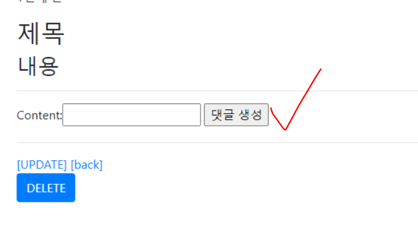

## DELETE

> **Allowed HTTP methods** 
>
> [django.views.decorators.http](https://docs.djangoproject.com/en/3.0/topics/http/decorators/#module-django.views.decorators.http) 는 request method에 기반한 view에 접근을 제한할 수 있다.

* `@require_POST`를 추가하면 POST를 제외한 다른 접근에 대해서는 빈 페이지와 405코드를 반환

```python
@require_http_methods(["GET", "POST"])
def my_view(request):
    pass
```

* 기존의 delete()

```python
def comment_delete(request, article_pk, comment_pk):
    # article_id: 게시글에 대한 pk 값
    comment = get_object_or_404(Comment, pk=comment_pk) # Comment : model에서 정의한 class
    if request.method == "POST":
        comment.delete()
    return redirect('articles:detail', article_pk) # comment.article.pk - OK

```

* require_POST

```python
@require_POST
def comment_delete(request, article_pk, comment_pk):    
    comment = get_object_or_404(Comment, pk=comment_pk) # Comment : model에서 정의한 class
    comment.delete()
    return redirect('articles:detail', article_pk) # comment.article.pk - OK
```

[참고]

* **@classmethod** 

  : 클래스만 접근할 수 있는 메소드 (@ : 데코레이터)

---

# User

* user 생성

  * 프로젝트에 회원가입
  * 프로젝트마다 admin은 가질 수 있다.

  ```bash
  $ python manage.py createsuperuser
  ```

  

## :alien: 회원가입

> 회원가입은 일반 CRUD의 Create 로직 구현과 비슷하다

* 계정관리 application 생성

  ```bash
  $ python manage.py startapp accounts
  ```

  * 순서대로 장고가 읽어나가기 때문에 잘 정리하기

  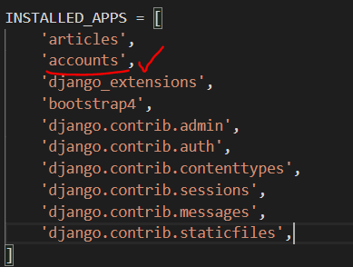

  * mysite - urls.py

  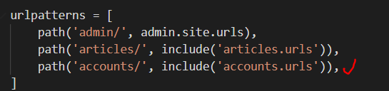

  * accounts - views.py

  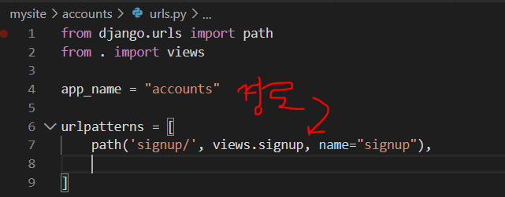

  * [auth](https://github.com/django/django/blob/master/django/contrib/auth/forms.py) 작성 [ **UserCreationForm** ]
    * **내장된 폼**을 사용하기 때문에 모델 수정은 필요 없다.
    * User 모델이 정의가 되어있기 때문에 따로 만들지 않아도 된다.

  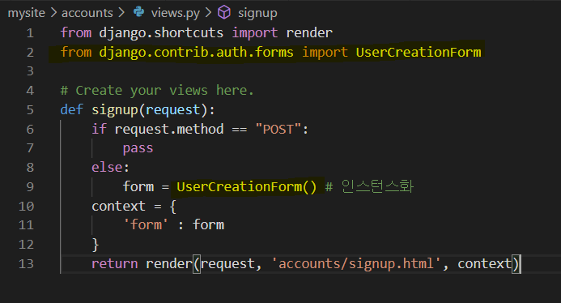

  * signup.html

    * **csrf_token**
    * form.as_p : 전부 `<P>`로 감싸서 좀 더 정리됨

    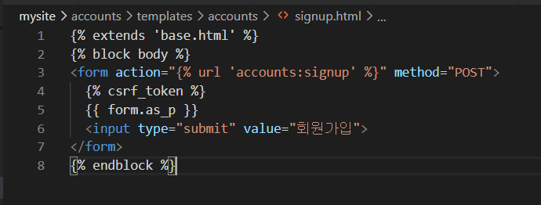

    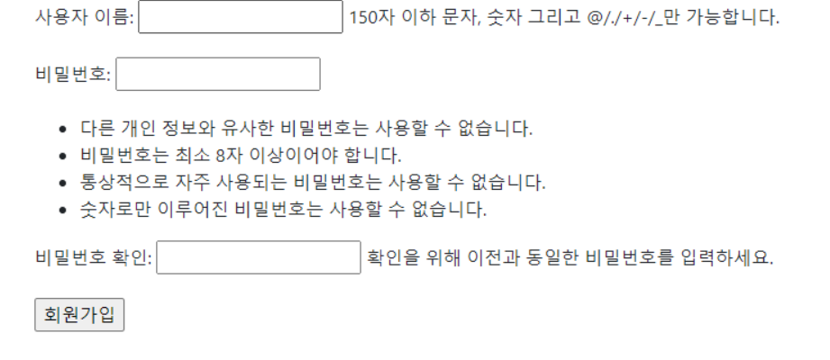

  * views.py

  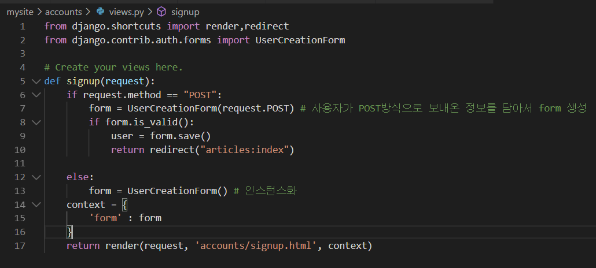

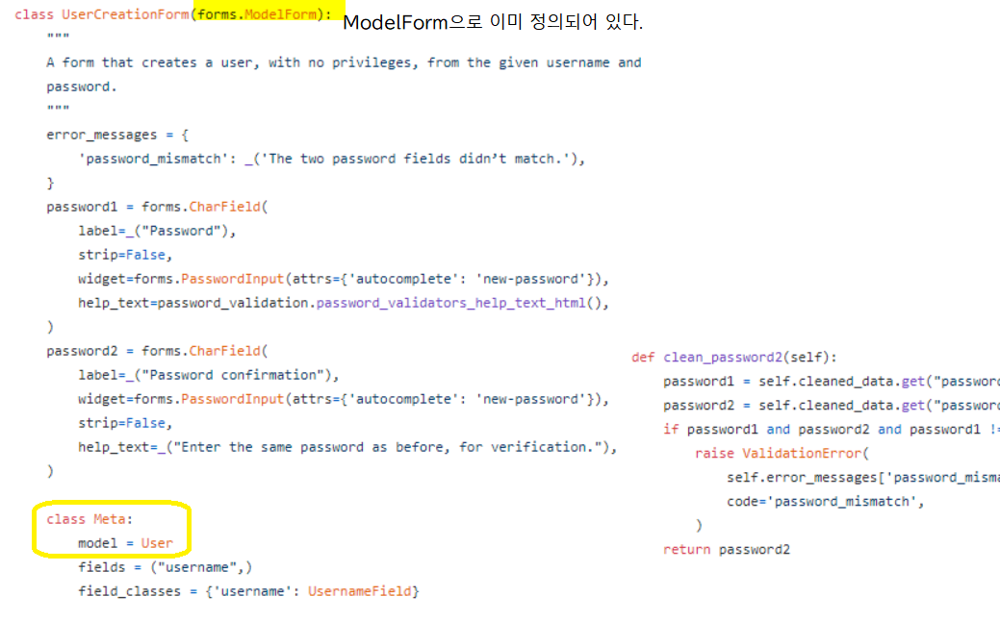


