* python [참고 문서](https://wikidocs.net/book/1553)
* Django [참고 문서](https://wikidocs.net/book/837)

# HTTP

> 요청과 응답으로 이루어진다
>
> * stateless(상태 저장 x) , connectless(연결이 x)
> * [참고 블로그](https://tothefullest08.github.io/django/2019/06/03/Django15_accounts1/)


## 쿠키

* 내 local에 저장

## 세션

* 내 DB에 저장


## AuthenticationForm

> 인증을 위한 폼

다른 Form 은 forms.modelForm

AuthenticationForm은 forms.Form 상속 - Model이 아닌 새로운 인자에 대한 판단

모델에 대한 정보(참고하는 모델)가 없기 때문에 AuthenticationForm은 request을 이용해 사용자가 있는 지 없는 지 확인부터 해주어야한다.

request안에 User에 대한 정보가 들어있다.


```markdown
        AuthenticationForm은 ModelForm이 아닌 Form 상속
        # 별도로 정의된 Model이 없다는 뜻
        # 그래서 넘겨주는 인자가 달라진다.
```


### :star: LOGIN

* 경로 설정

  * `login`으로 꼭 설정해준다.

  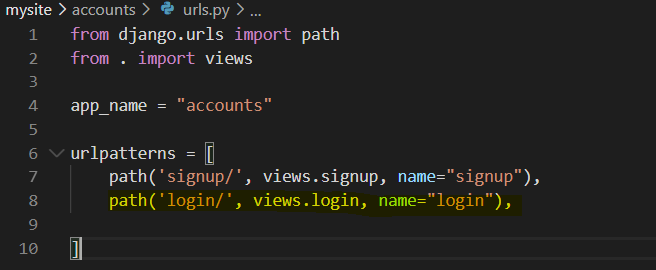

* view함수

  * import

    ```python
    from django.contrib.auth.forms import UserCreationForm, AuthenticationForm
    from django.contrib.auth import login as auth_login
    # views.py 내 정의한 함수 login과 구분하기 위해 auth_log로 재 명명함
    ```

    ```python
    def login(request):
        if request.method == "POST":
            login_form = AuthenticationForm(request, request.POST) # request : 요청 파라미터
            if login_form.is_valid():
                # 로그임은 DB에 뭔가 작성하는 것은 동일하지만,연결된 모델이 있는 건 아니다.
                # 그럼 무엇을 확인해야 하는가?  - 세션과 유저 정보
                auth_login(request, login_form.get_user()) 
                return redirect("articles:index")
        else:
            login_form = AuthenticationForm()
        context = {
            'login_form' : login_form
        }
        return render(request, "accounts/login.html", context )
    ```

  *  `login_form.get_user()`  : User정보 가져오기
  * Django에 자동으로 Session이 생성이 되고 쿠키에 저장되는 것을 볼 수 있다.

  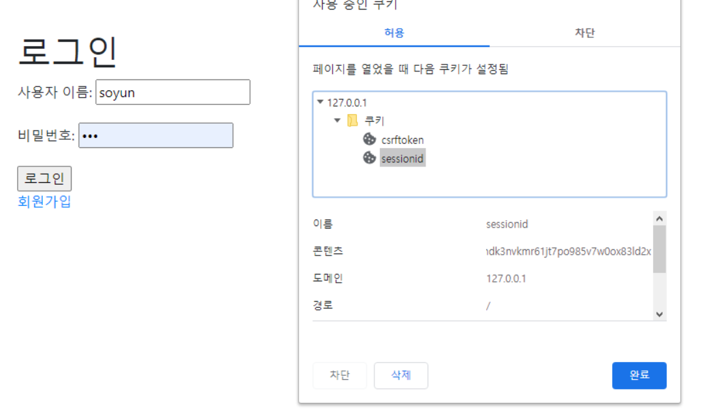

  [결과]

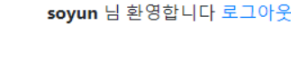

### :star: LOGOUT

* [방법 1] : 권장하지 않는 방법

  ```python
  # views.py
  from django.contrib.auth import logout as auth_logout
  ...
  def logout(request):
      auth_logout(request)
      return redirect("articles:index")
  ```

* **[방법 2]** (권장)

  > embed 를 이용

  ```python
  # views.py
  from IPython import embed 
  # idex로 들어오면 embed 함수 실행하도록 작업해보기
  ```

  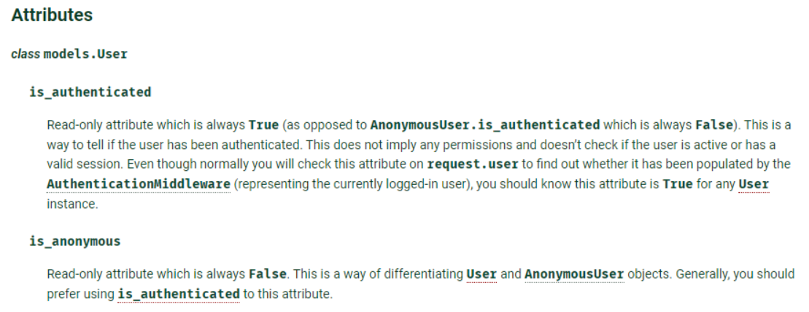

  * logout 상태일 때 - *AnonymousUser*

  ```shell
  In [1]: request.user
  Out[1]: <django.contrib.auth.models.AnonymousUser at 0x1de592fc2c8>
  
  In [2]: request.user.is_anonymous
  Out[2]: False
  ```

  * login 상태 

  ```shell
  In [3]: request.user.is_anonymous
  Out[3]: True
  ```

  * user 정보가 있는지 확인하는 작업

  ```html
      
  ```

  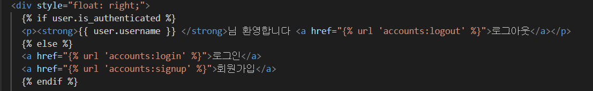

* base.html

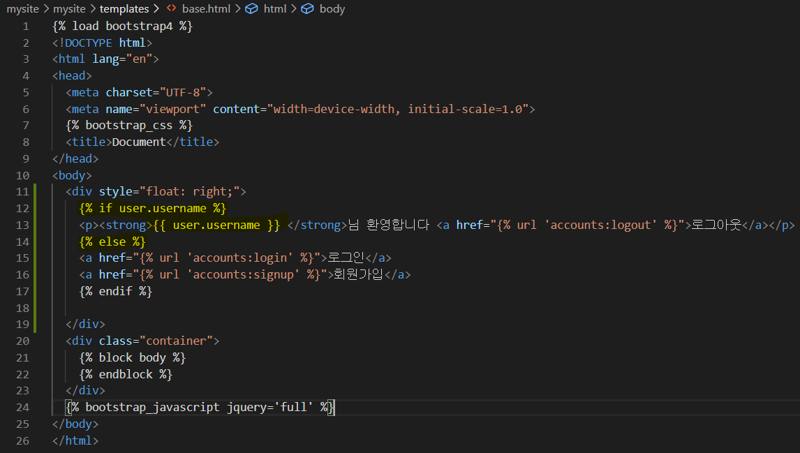


###  :star: 정보 수정

```python
# urls.py
path('update/', views.update, name="update"),
```

* views.py

  ```python
  def update(request):
      if request.method =="POST":
          user_change_form = UserChangeForm(request.POST, instance=request.user)
          if user_change_form.is_valid():
              user = user_change_form.save()
              return redirect("articles:index")
      else:
          user_change_form =  UserChangeForm(instance=request.user)
      context = {
          'user_change_form' : user_change_form
      }
      return render(request, 'accounts/update.html', context)
  ```

  - 이렇게 사용자가 업데이트할 필요가 없는 정보 (보면 안될거같은 페이지) 가  나온다. 따라서 커스트마이징 해주어야 한다.

    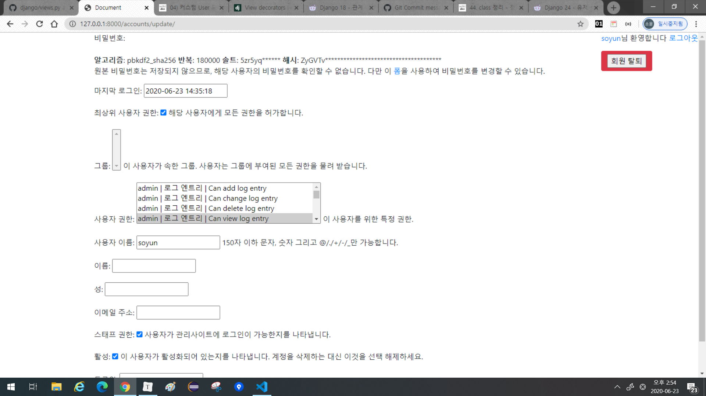

* forms.py

  get_user_model() # 활성화되어 있는 User모델을 가져올 수 있다.

  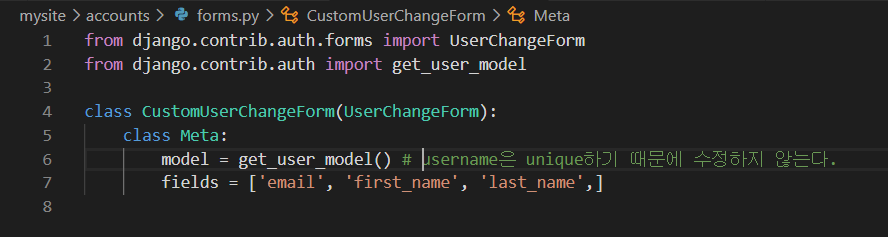

  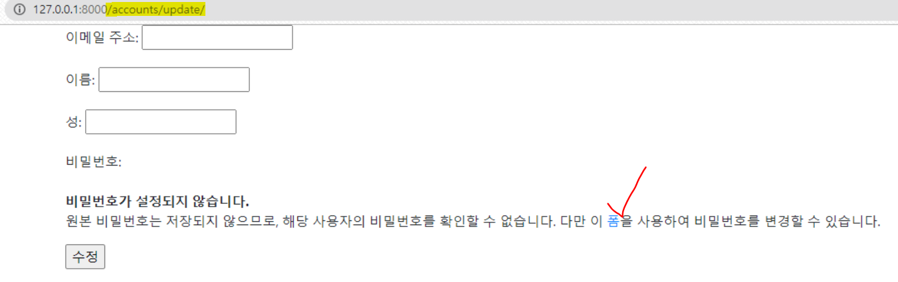

  * `폼`을 눌렀을 때 이동하는 페이지: `/accounts/password/`

    

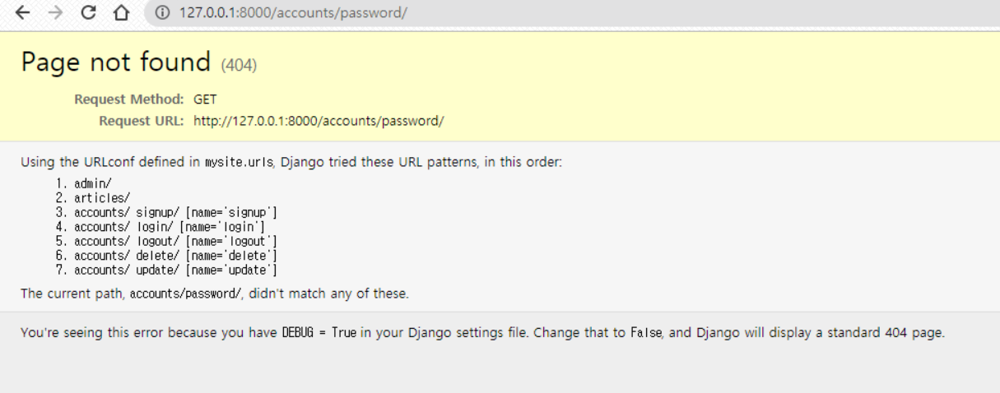

* 로그인 - DB에 있는 세션을 확인해서 이루어진다

* 비밀번호 변경은 인증정보의 내용이 달라지기 때문에 로그아웃이 된다.

  ```python
  # 사용자 인증 정보에 대한 session을 업데이트
  from django.contrib.auth import update_session_auth_hash
  ```

  

* 비밀번호 변경

  * instance가 없이도 user가 있는 상태이기 때문에 빼주어도 된다.

  ```python
  @login_required
  def password(request):
      if request.method == "POST":
          form = UserPassChangeForm(request.user, request.POST) # 순서 꼭 지키기
          if form.is_valid():
              user = form.save()
              # auth_login(request, user) - 저장되어있던 session이 바뀌고 새로운 session을 만든다.
              update_session_auth_hash(request, user)
              return redirect('articles:index')
      else:
          form = UserPassChangeForm(request.user)
      context = {
          'form' : form
      }
      return render(request, 'accounts/form.html', context)
  ```

  


## :ok_hand: ​추가 실습

* `<A> `태그 : 무조건 GET방식 - method라는 속성이 존재하지 않는다
* `<form>`태그는 method에 따라 GET/POST그 때 그때 다르다

*  로그인이 되어있는 상태에서 `accounts:login`을 요청할 때

  ```python
  # views.py
  from django.contrib.auth.forms import UserChangeForm
  
  
  if request.user.is_authenticated :
              return redirect("articles:index")
  ```

* 회원가입을 하자마자 로그인 상태로 전환하기

  ```python
  # views.py
  if request.method == "POST":
          form = UserCreationForm(request.POST) # 사용자가 POST방식으로 보내온 정보를 담아서 form 생성
          if form.is_valid():
              user = form.save()
              auth_login(request, user)
              return redirect("accounts:login")
  ```

* 로그인 인증 decorator

  ```python
  from django.contrib.auth.decorators import login_required
  ```

  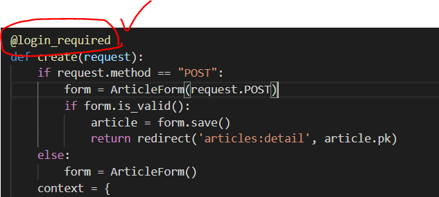

  * 로그인 유저가 없는 상태이면 로그인으로 보내준다.

  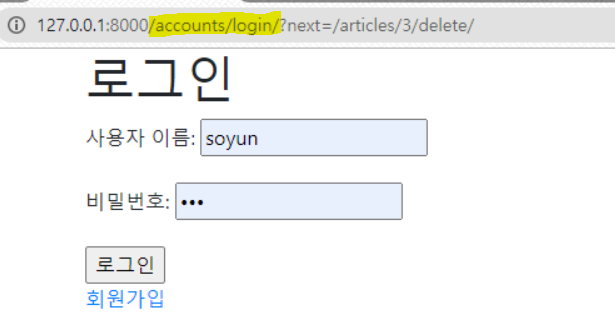

  

* 회원 탈퇴

  ```python
  # urls.py
  path('delete/', views.delete, name="delete"),
  ```

  * request안에 요청을 보낸 user의 데이터가 들어있어서 다른 매개변수는 필요 없다.

    ```python
    # views.py
    from django.views.decorators.http import require_POST
    # 회원 삭제
    @require_POST # 삭제는 POST일 때만 가능 - get방식으로 들어 왔을 때는 405에러 
    def delete(request):
        request.user.delete() 
        return redirect('articles:index')
    ```

