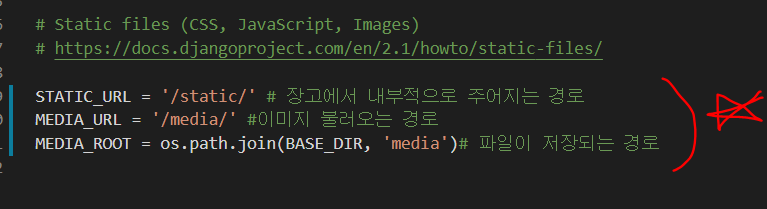

# User 

## 1. Article 모델이 외래키 설정 후 마이그레이션 작업 진행

* 연결할 User모델은 settings.AUTH_USER_MODEL

  * **article - models.py**

    * `settings.AUTH_USER_MODEL` 설정 값을 변경하여 기본 사용자 모델을 재정의 할 수 있다.

      ```python
      class Comment(models.Model):
          # 멤버 변수 = models.외래키(참조하는 객체, 삭제 되었을 때 처리 방법[on_delete])
          article = models.ForeignKey(to=Article, on_delete=models.CASCADE)
          # 역참조 값 설정 related_name = 'comments'
          content = models.CharField(max_length=200)
          create_at = models.DateTimeField(auto_now_add=True)
          user = models.ForeignKey(settings.AUTH_USER_MODEL, on_delete=models.CASCADE)
      ```
      
    * Comment의 user와 Article의 user는 다르다는 점 명심하기

* 마이그레이션 작업을 진행 시 기존의 데이터에 USER정보가 없으므로 Default값 설정

  * `python manage.py makemigrations` 및 `python manage.py migrate`를 실행
  * 첫 migration이라면 특별한 문제없이 성공

* 현재 프로젝트의 admin 계정의 pk값을 찾아 해당 값을 Default로 설정


## 2. CREATE 로직 수정 & 게시글 작성자 표시

* 게시글 생성 시 , 게시글 작성자 정보를 넣어 저장

  ```html
  <p> 작성자 | {{article.user.username }}</p>
  ```

  ```python
  # views.py
  def create(request):
      if request.method == "POST":
          form = ArticleForm(request.POST)  # request.POST : 사용자가 보낸 제목, 내용이 들어있음
          if form.is_valid():
              article = form.save(commit=False)
              article.user = request.user
              article.save()
              return redirect('articles:detail', article.pk)
  ```

  * forms.py

  

  [결과]

  

* 댓글 작성자 추가

  * forms.py

  ```python
  class CommentForm(forms.ModelForm):
      class Meta:
          model = Comment
          exclude = ['article', 'user']
  ```

  * views.py

  ```python
  if comment_form.is_valid():
          comment = comment_form.save(commit=False)
          comment.user = request.user  #작성자
          comment.article = article
          comment.save()
          return redirect('articles:detail', article.pk)
  ```

  * detail.py

  ```html
   <p>
       작성자 | {{ comment.user.username }}
  </p>
  ```

  


## 3. UPDATE & DELETE 로직 수정

* 사용자가 자신의 글만 수정/삭제 할 수 있도록 내부 로직 수정

* 해당 게시글의 작성자가 아니라면, 수정/삭제 버튼이 보이지 않도록 TEMPLATE작성

  ```html
  
    
      <a href="">[수정]</a>
      <form action="" method="POST">
        
        <input type="submit" value="삭제" class="btn btn-primary">
      </form>
    
  
  ```

  

## 4. Image upload

* 파일도 추가해주어야 한다. **(request.FILES)**

  ```python
  def create(request):
      if request.method == "POST":
          form = ArticleForm(request.POST, request.FILES)  
          if form.is_valid():
              ....
  ```

* models.py

  ```python
  image = models.ImageField(blank=True, upload_to="%y/%m/%d/") # 업로드 날짜별 저장
  ```

  

  * 유효성 검사시 비어있어도 괜찮을 때

    ```python
    image = models.ImageField(blank=True)
    # null이 포함이 되어도 된다면?
    image = models.ImageField(blank=True, null=True)
    ```

    * image는 파일 형태로 저장이 되기 때문에 null이어도 되지만, text type은 null이 true 이면 None으로 인식되기 때문에 데이터 없음이 된다.

    * text는 blank=True만 사용할 수 있다.

      

      - **pillow** 설치 필수 ( Pillow : 이미지 관리를 가능케 해주는 library )

      ```bash
      $ pip install Pillow
      ```

    * 이미지 blank 설정해주었기 때문에 `makemigrations` 해주어야 한다.

* **`enctype`**

  >  `method` 특성이 `post`인 경우, `enctype`은 양식 제출 시 데이터의 [MIME 유형](https://ko.wikipedia.org/wiki/미디어_타입)

  - `application/x-www-form-urlencoded`: 기본값(default)
  - `multipart/form-data`: `<input type="file">`이 존재하는 경우 사용하세요.
    - 전달해주는 값이 하나라도 존재한다면 `multipart/form-data`로 설정
  - `<input type="submit">`, `<input type="image">` 요소의 `formenctype` 특성으로 재정의할 수 있습니다.

  

* 이미지 파일 경로 설정

  * settings.py

    

  * urls.py

    

* Image 출력

  * 있을 때, 없을 때 분기해서 보여주어야 한다.

  

### :a:  [참고]

> Image 원본 저장 및 Thumbnail 처리

* ```shell
  $ pip install pilkit
  ```

* ```shell
  $ pip install django-imagekit
  ```
  
  * settings - app 등록


* 
   ```python
  from imagekit.models import ImageSpecField
  from imagekit.processors import Thumbnail
  ```

  * JPEG : 저용량이면서 원본을 저장할 수 있다.
  
  * 파일 크기 설정
  
    
  
  * 파일 경로 출력 - 
  
    ```python
    def articles_image_path(instance, filename):
        return f'user_{instance.user.pk}/{filename}'
    ```
  
  * 별도의 column이 생성되지 않아 migration 생성이 되지 않는다. source의 image를 그대로 따라간다.


