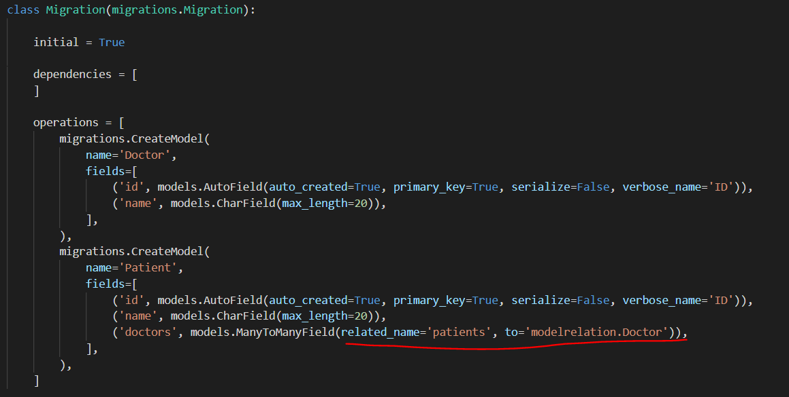

# ORM 테스트

* shell열기

  ```bash
  $ python manage.py shell_plus
  ```

DB 있는 지 확인하기


# 1:N 관계

**게시글 생성 ORM**

```shell
 article1 = Article.objects.create(title ='title',content='content', user=user1)
```

```shell
Article.objects.create(title='title',content='content',user_id=user1.pk)
```

**댓글 생성 ORM**

```python
User.objects.create_user(username="name", password="password")
```

```shell
 Comment.objects.create(content='content',user=user1,article=article1)
```


**게시글이 가지고 있는 전체 댓글 불러오기**

```shell
article = Article.objects.get(pk=8) #특정 게시글이 각지고 있는 전체 댓글 조회
article.comment_set.all()
```

```markdown
## Article에서 Comment로 접근할 때는 _set을 사용해주어야 한다. 
```

:star: **특정 댓글이 어느 게시글과 연결되어 있는지 확인하기**

:star: **게시글이 어느 유저와 연결되어 있는지 확인하기**

**특정 유저가 작성한 전체 게시글 가져오기**

```shell
user1.article_set.all()
# for문 - 제목만 가져오기
for article in user1.article_set.all():
	print(article.title)
```


**특정 유저가 작성한 전체 댓글 가져오기**


# M:N 관계

> PK들로 만들어진 class(Table)을 새로 생성한다.
>
> *[실습] 특정 의사의 환자 누가 있는지 확인*

* models.py

  * 1:N 관계

  

  * M : N 관계

    

* ORM 테스트

  * 의사 - 환자 생성

  ```shell
  In [1]: doctor = Doctor.objects.create(name='KIM')
  
  In [2]: patient = Patient.objects.create(name="TOM")
  ```

  * 의사 - 환자 연결해주기

  ```SHELL
  In [3]: Reservation.objects.create(doctor=doctor, patient=patient)
  Out[3]: <Reservation: 2번 의사 KIM의 환자 -2번 환자, TOM>
  ```

  * 의사 - 환자 조회

  ```SHELL
  In [4]: doctor.reservation_set.all()
  Out[4]: <QuerySet [<Reservation: 2번 의사 KIM의 환자 -2번 환자, TOM>]>
  
  In [5]: patient.reservation_set.all()
  Out[5]: <QuerySet [<Reservation: 2번 의사 KIM의 환자 -2번 환자, TOM>]>
  ```

  ```SHELL
  In [6]: patient2 = Patient.objects.create(name="yoon")
  
  In [7]: Reservation.objects.create(doctor=doctor, patient = patient2)
  Out[7]: <Reservation: 2번 의사 KIM의 환자 -3번 환자, yoon>
  ```

  * 조회

  ```SHELL
  In [8]: doctor.reservation_set.all()
  Out[8]: <QuerySet [<Reservation: 2번 의사 KIM의 환자 -2번 환자, TOM>, <Reservation: 2번 의사 KIM의 환자 -3번 환자, yoon>]>
  # 환자 이름 조회
  In [9]: for reservation in doctor.reservation_set.all():
     ...:     print(reservation.patient.name)
     ...: 
  TOM
  yoon
  # 환자 pk 조회
  In [10]: for reservation in doctor.reservation_set.all():
      ...:     print(reservation.patient.pk)
      ...: 
      ...: 
  2
  3
  ```

  ```SHELL
  In [11]: for reservation in patient.reservation_set.all():
      ...:     print(reservation.doctor.name)
      ...: 
  KIM
  ```

  


* doctor가 `_set`을 꼭 사용해야 하는 것은 아니다.

  * **역참조값**을 사용해주면 됨

    ```python
    class Patient(models.Model):
        name = models.CharField(max_length=20)
        doctors = models.ManyToManyField(Doctor, through='Reservation', related_name="patients")
    ```

    

    * 역참조값을 사용하면 더이상 patient_set.all()은 사용할 수 없다.

      

  * 또한 이렇게 한다면 Reservation을 사용하지 않아도 된다.

    *주의 : sqlite와 001xxx 파일을 지운 뒤, 다시 makemigrations와 migrate을 해주어야 한다.*

    


* 관계 설계로 추가 필드가 필요할 때는 Reservation 처럼 class 만들어주면 된다.
* <최종 스키마>



# 좋아요 구현

* [font awesome](https://fontawesome.com/) 

```python
# views.py
@login_required
def like(request, article_pk):
    # 특정 게시물에 대한 정보
    article = get_object_or_404(Article, pk=article_pk)
    # 좋아요를 누른 유저에 대한 정보
    user = request.user
    # 사용자가 게시글의 좋아요 목록에 있으면,
    if user in article.like_users.all(): #user가 sequence안에 있는지 확인 - 있으면 좋아요 취소
        article.like_users.remove(user)
    else:
        article.like_users.add(users)
    return redirect('articles:index')
```

* article - models.py


```python

 <p>{{ article.pk }}번째 글</p>
 <p><a href="">{{ article.title }}</a></p>
 <p>작성자 : {{ article.user.username }} </p>
 <p>

  </a> 댓글 {{ article.comment_set.all|length }} 개
  
      <a href=""> <i class="fas fa-heart fa-lg text-danger"></i></a> {{ article.like_users.all|length }}
  
      <a href=""><i class="far fa-heart fa-lg text-danger"></i> </a>{{ article.like_users.all|length }}
  
</p> 
```

## :fire: 템플릿의 모듈화

> 반복되는 로직을 모듈화해주어 div 지옥 탈출 @@!!! :imp:


[결과]


# 프로필

* [user custom](https://github.com/django/django/blob/master/django/contrib/auth/models.py)

* ```python
  # urls.py
      path('<str:username>/', views.profile, name="profile"),
  ```

  

  * 맨 밑에 위치하여야 한다. 만약 위에 위치하게 된다면 

    /login/ 시 login을 이름으로 인식하기 때문에 page not found 가 발생한다..

  * AUTH_USER_MODEL의 경로가 달라지기 때문에 settings에서 경로를 설정해주어야 한다.

  * user커스터마이징 후 db를 날려주어야 한다.


* get_user_model : User객체를 가져온다. 활성화된 유저를 가져온다. ( 생성된 테이블 - 자동적으로 accounts의 User를 찾는다)

* AUTH_USER_MODEL는 string을 리턴해준다.  ( 수동적으로 accounts의 User를 찾는다)


* 모델 정의할 때는 문자열 - 설계도 작성 - 테이블 작성


## 친구 추가 구현

* models.py

  ```python
  # Usercustomizing
  class User(AbstractUser):
      followers = models.ManyToManyField(
          settings.AUTH_USER_MODEL,
          related_name="followings",
          blank=True,
      )
  ```

  

* views.py

  ```python
  @login_required
  def follow(request, user_pk ):
      person = get_object_or_404(get_user_model(), pk=user_pk)
      user = request.user
      # 원래 person에 담긴 user_pk값을 가진 유저는 프로필의 주인이다.
      # request.user는 나, 요청을 보내온 사용자이다.
      if user in person.followers.all():
          person.followers.remove(user)        
      else:
          person.followers.add(user)     
      return redirect('accounts:profile', person.username)
  ```

* 뷰

  ```html
  
    
    <a href=""><i class="fas fa-user-plus"> follow </i></a>  
    
    <a href=""><i class="fas fa-handshake-slash"> cancel </i> </a> 
    
  
  ```

  