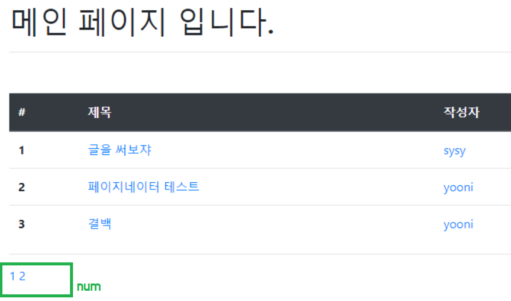

# Pagination

## Paginator


```python
# views.py
from django.core.paginator import Paginator
```

* 한 페이지 당 3개씩, articles에 담긴 데이터 보여줄 것이다.


* index.py

  * **num** : 페이지 번호

  ```python
    
    <a href="?page={{ num }}">{{ num }}</a>
    
  ```

  