# JAVASCRIPT

> 변수 선언 : 카멜 케이스 방식
>
> 전부 대문자 변수 ? - 절대 변하지 않는 속성 ex) API_KEY

* 창 열기 

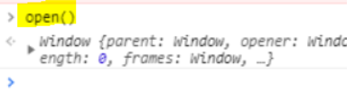

## 1. 변수 

* `var`는 재선언, 재할당에 상관없이 에러가 나오지 않고 다른 값이 출력된다. 

  따라서,  `let`, `const`를 사용하면 `var`를 사용할 때보다 이점이 많다.

* 두개의 공통점은 var와 다르게 `변수 재선언 불가능`이다.

> `let`과 `const`의 차이점은 변수의 `immutable`여부이다.
>
> `let`은 변수에 재할당이 가능하지만(선언은 언제든지 가능),
>
> `const`는 변수 재선언, 재할당 모두 불가능하다. ( 즉, 동일 이름으로 선언 불가능)
>
> * let과 const는 선언과 동시에 값을 할당해 주어야 한다.

```javascript
	let name = 'javascript'
    console.log(name) 
    // Uncaught SyntaxError: Identifier 'name' has already been declared

    name = 'react'
    console.log(name) // OK
```

```javascript
 	const name = 'javascript'
    console.log(name) 
    // Uncaught SyntaxError: Identifier 'name' has already been declared

    name = 'react'
    console.log(name) 
    //Uncaught TypeError: Assignment to constant variable.
```


```javascript
if(lNum ===10){
    let lNum = 30 
    console.log(lNum)
}
```

```javascript
console.log(name)
var name='홍길동'
```

```javascript
console.log(letName)
let letName='윤소윤' 
//호이스팅 - 선언되기 전에 출력되었다면 오류 발생
```

* var 사용하지 말고 `let`과 `const`로 사용한다.

* :construction_worker: **변수 선언에는 기본적으로 `const`를 사용하고, 재할당이 필요한 경우에 한정해 `let` 을 사용하는 것이 좋다.**


## 2. ARRAY Helper Method

> forEach, map, filter, ....]

* The **forEach()** method executes a provided function once per array element.

```javascript
const colors = ["red", "blue", "green"]
colors
(3) ["red", "blue", "green"]
```

* 배열의 원소 출력

```javascript
colors.forEach(function(color) {
    console.log(color)
})
```

## 3. DOM 

### live

* **document.getElementById()** : 주어진 문자열과 일치하는 [`id`](https://developer.mozilla.org/ko/docs/Web/API/Element/id) 속성을 가진 요소 반환

### non-live

>  정적인 상태의 list를 변화시키는 것이 좀 더 원하는 대로 결과를 낼 수 있다.

* **document.querySelector**
  * 선택자와 일치하는 문서 내 첫 번째 Element를 반환
* **document.querySelectorAll**
  * 선택자를 만족하는 모든 요소의 목록이 필요할 때 사용

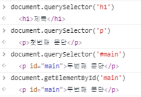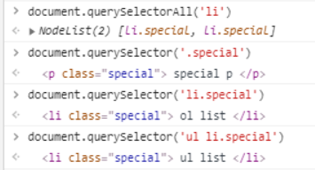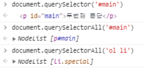

```javascript
    const liveList = document.getElementsByClassName('live')
    for (let i =0;i<liveList.length; i++){
      liveList[i].className = 'blue'
    }
    const nonLiveList = document.querySelectorAll('.non-live')
    for(let i=0;i<nonLiveList.length;i++){
      nonLiveList[i].className = 'blue'
    }
```

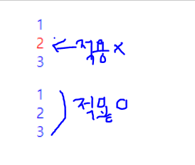

## 4. EVENT

```html
<li onclick="함수()"> 1</li> 
```

:checkered_flag:  javascript가 해야 할 일을 html에 적용하는 것이므로 좋지 않은 방법.

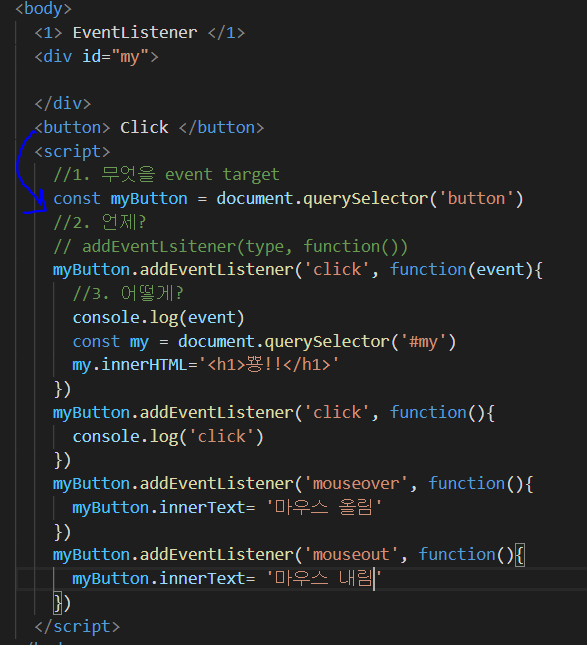

* 대기 상태에 있다가 모든 속성에 반응할 수 있도록 작성함.

  

  * `event.preventDefault()` : event의 전파를 막고 event를 취소한다. 

  [예시]

  ```html
  <p>체크박스 컨트롤을 클릭해 주세요</p>
  
  <form>
  <label for="checkbox">체크박스</label>
  <input type="checkbox" class="my-button"/>
  </form>
  <script>
    const myButton = document.querySelector('.my-button')
    myButton.addEventListener('click', function(event){
      event.preventDefault();
    })
    </script>
  ```

  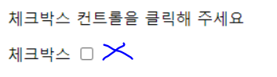


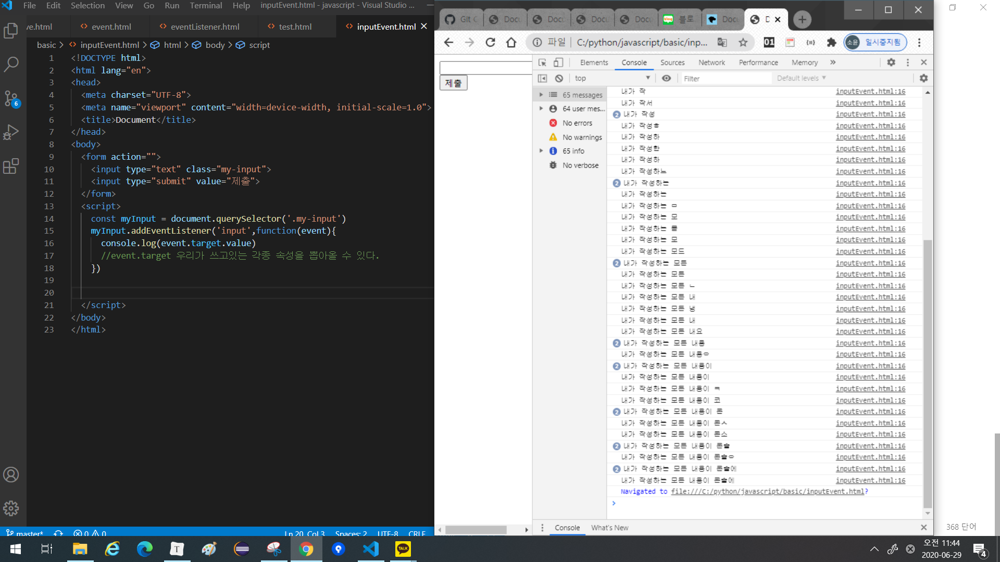


* 클릭 시 태그 색 변경

  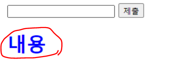

```html
<body>
  <form action="">
    <input type="text" class="my-input">
    <input type="submit" value="제출">
  </form>
  <h1> 내용 </h1>
  <script>
    const myInput = document.querySelector('.my-input')
    myInput.addEventListener('input',function(event){
      console.log(event.target.value) 
      //event.target 우리가 쓰고있는 각종 속성을 뽑아올 수 있다.
    })
    const myH = document.querySelector('h1')
    myH.addEventListener('click', function(evenet){
      event.target.style.color = 'blue'
    })
  
  </script>
```


## 5. arrow function

```javascript
const greeting = function(){
    console.log(this)
}
greeting()
=> Window {parent: Window, opener: null, top: Window, length: 0, frames: Window, …}
```

```javascript
const you = {
    name:'yoon',
    greeting
}//undefined

you.greeting()
=> {name: "yoon", greeting: ƒ}
```

* arrow func

  ```javascript
  const arrow = () => console.log(this)
  
  arrow()
  => Window {parent: Window, opener: null, top: Window, length: 0, frames: Window, …}
  ```

  ```javascript
  const me = {
      name:'kim',
      arrow
  }
  
  me.arrow()
  => Window {parent: Window, opener: null, top: Window, length: 0, frames: Window, …}
  ```

  

* 

* 데이터 추출

  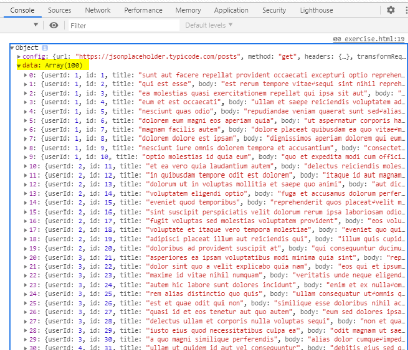

```html
  <h1>JsonPlace</h1>
  <div id="my-json">
  </div>
```

```javascript
//javascript
	axios.get('https://jsonplaceholder.typicode.com/posts')
    .then(response =>{
      response.data.forEach(data =>{
        // data = response.data
        // myTitle = data.title
        const myTitle = data.title
        // pTag를 생성해주는 ptag
        const pTag = document.createElement('p')
        // 그렇게 생성된 pTag의 text = myTitle
        // <p> 각각의 제목들 </p>
        pTag.innerHTML = myTitle
        // id="my-Json"인 div 추가한다.
        const myJson = document.querySelector('#my-json')
        myJson.append(pTag)
      })
    })
    .catch(erro => console.log(error))
```

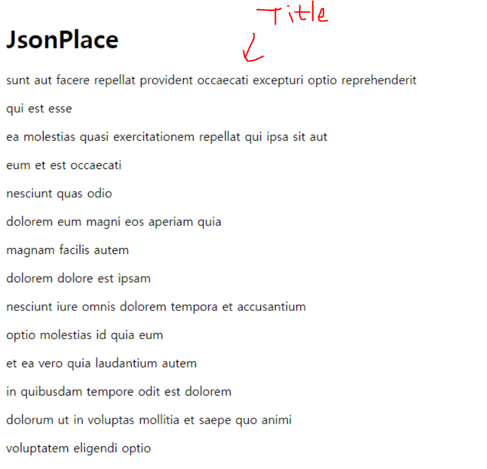

## axios

*  [git hub](https://github.com/axios/axios#promises) 

> addevent listener는 arrow 못쓰니 순수 javascript로 작성

1. axios로 [dog api](https://dog.ceo/dog-api/)에 요청 보내기

   ```javascript
   axios.get('https://dog.ceo/api/breeds/image/random')
       .then(response => {
       ...
       })
   })
   ```

   

2. 응답받은 json 불러오기

   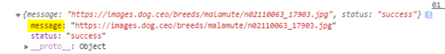

3. json에 작성된 url을 활용해

4. img 태그를 생성해주고

   생성된 img태그의 src값을 해당 url로 설정

5. my-dog div에 태그 append

6. give me dog 버튼을 클릭할 때 axios 요청 보내기

[방법 1]

```javascript
    const myButton = document.querySelector('button')
    myButton.addEventListener('click', function (event) {
      axios.get('https://dog.ceo/api/breeds/image/random')
      .then(response => {
        console.log(response.data)
        const myDog = document.querySelector("#my-dog")
        const imgTag = document.createElement('img')
        //const myMessage = response.data.message
        //imgTag.src = myMessage
        imgTag.src = response.data.message
        myDog.append(imgTag)
      })
    })
```

[방법 2]

```javascript
    const takeImage = function(){
      axios.get('https://dog.ceo/api/breeds/image/random')
      .then(response => {
        console.log(response.data)
        const myDog = document.querySelector("#my-dog")
        const imgTag = document.createElement('img')
        //const myMessage = response.data.message
        //imgTag.src = myMessage
        imgTag.src = response.data.message
        myDog.append(imgTag)
      })
    }
    
    const myBtn = document.querySelector('button')
    myBtn.addEventListener('click',takeImage)
```

[결과]

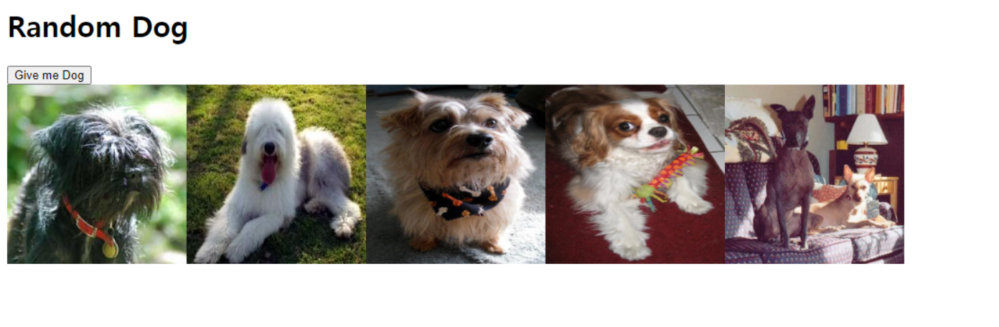