# python

강사님 [github](https://github.com/edu-sk)

## 1. 다운로드

[파이썬 설치]( https://www.python.org/downloads/) [VSCode설치](https://code.visualstudio.com/docs/?dv=win)

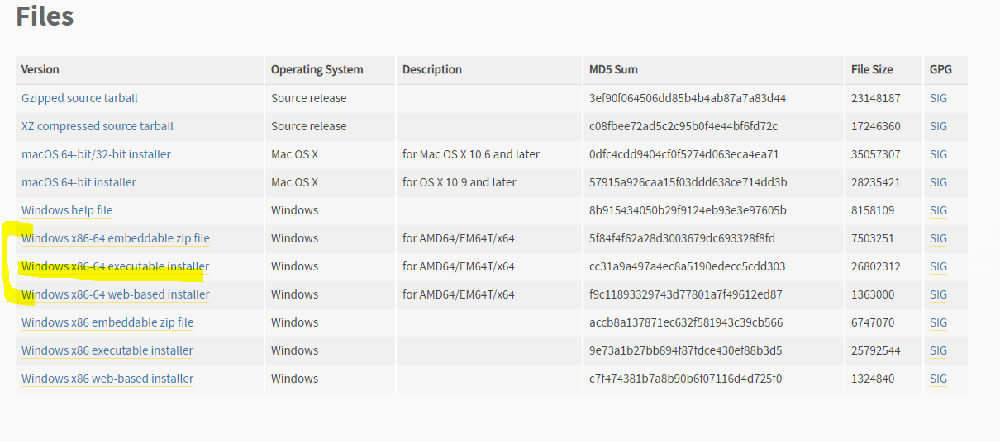

* 파이썬

  * 환경 변수 - PATH

  > C:\Users\student\AppData\Local\Programs\Python\Python37

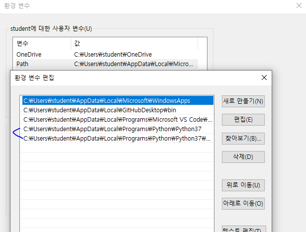

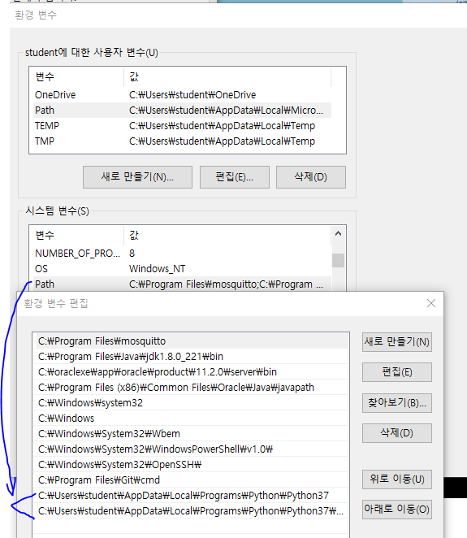

* 설치됐는 지 확인

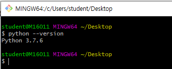

* VSCode

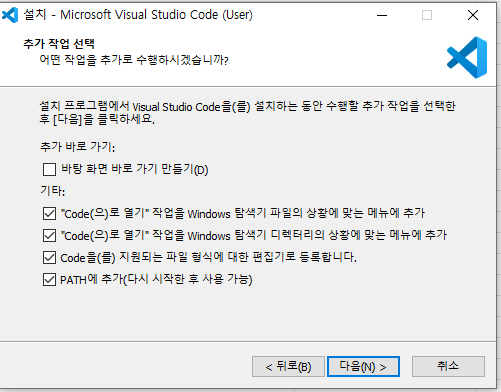


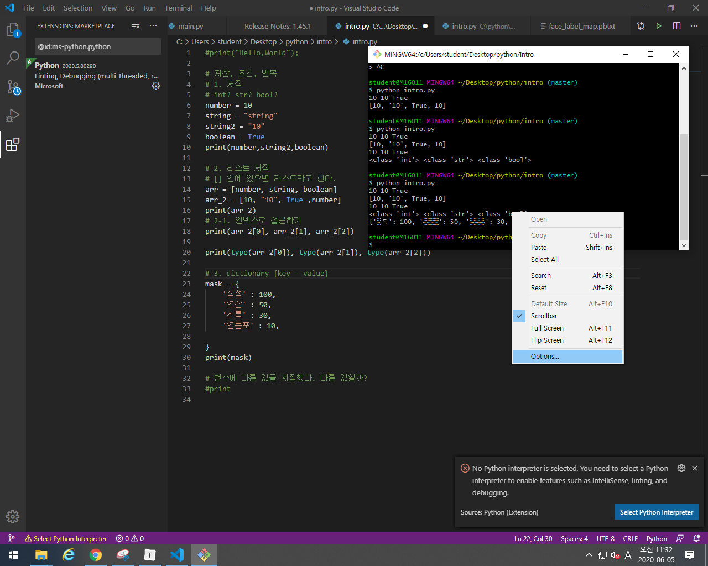

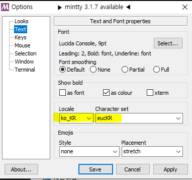

* 터미널 켜기 : `ctrl + shift +``

## 2. 기본 문법

### 1. 저장

#### 1. 선언

```python
# int? str? bool?
number = 10
string = "string"
string2 = "10"
boolean = True
```

```python
# 출력
print("Hello,World");
```

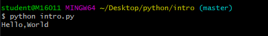

* 실행방법 

  > python 파일이름.py

* 파일 열기 - vscode에서만 사용 가능한 함수

  > code  파일명.py


#### 2. List

* 리스트 저장

```python
# [] 안에 있으면 리스트라고 한다.
arr = [number, string, boolean]
arr_2 = [10, "10", True ,number]  
print(arr_2)
```

* 인덱스로 접근하기

```python
print(arr_2[0], arr_2[1], arr_2[2])
print(type(arr_2[0]), type(arr_2[1]), type(arr_2[2]))
```

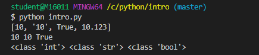

#### 3. Dictionary

> {key - value}
>
> *  입력한 순서는 보장이 되지만 index 접근이 안된다

```python
mask = {
    '삼성' : 100,
    '역삼' : 50,
    '선릉' : 30,
    '영등포' : 10,
}
print(mask)
# {'삼성': 100, '역삼': 50, '선릉': 30, '영등포': 10}
```

* key값으로 접근하는 법(idex X)

```python
print(mask['삼성'])
```

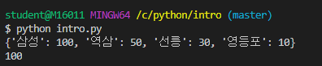


### 2. 조건

>  들여쓰기를 기준으로 조건문 판단
>
> *   = space bar 4번

```python
if number > 3:
    print("3초과")
print("???")
```

* 조건을 여러개 쓰고 싶을 때

```python
if number >10:
  print("10초과")
elif 10 >= number > 5 :
  print("애매")
else: 
  print("5이하")
# 조건문 순서대로 써주기

if number >10:
  print("10초과")
elif number > 5 :
  print("애매")
else: 
  print("5이하")
```

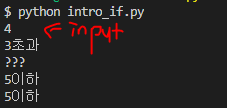

### 3. 반복

#### 1. while

```python
n=0
while n < 3 :
    n +=1
    print(n) 
print(n)   # 1 2 3 3
```


#### 2. for

```python
# 0 1 2 3 4 5 6 7 8 9
for num in range(10):
    print(num)
```

* list for

```python
number = [10,9,8,7,6,5,4,3,2,1,0]
for num in number :
    print(num)
```

```python
number = ['삼성', '역삼','선릉', '영등포']
for num in number :
    print(num)
```

* `index`로 접근
  * `len()` : size

```python
for i in range(len(number)):
    print(i)
    print(number[i])
# 0 
# 삼성
# 1
# 역삼
# 2
# 선릉
# 3
# 영등포
```

* enumerate

```python
for idx, i in enumerate(number):
  print(idx, i)
# 0 삼성
# 1 역삼
# 2 선릉
# 3 영등포
```

##### # for dict

```python
mask = {
    '삼성' : 100,
    '역삼' : '50개',
    '선릉' : True
}
for i in mask :
    print(i)
# 삼성
# 역삼
# 선릉
```

* dict임을 표현하는 for 문

  *  동작은 위와 동일
  * mask.keys()

  ```python
  for i in mask.keys() :
      print(i)
      print(mask[i])
  # 삼성
  # 100
  # 역삼
  # 50개
  # 선릉
  # True
  ```

  * mask.values()

  ```python
  for i in mask.values():
      print(i)
  # 100
  # 50개
  # True
  ```

  ```python
  for key, val in mask.items():
       print(key)
       print(val)
       print(mask[key])
  ```

  ```python
  for idx, i in enumerate(mask,3) :
      print(idx, i)
  # 3 삼성
  # 4 역삼
  # 5 선릉
  ```

  


##  3. [내장함수](https://docs.python.org/ko/3/library/functions.html)

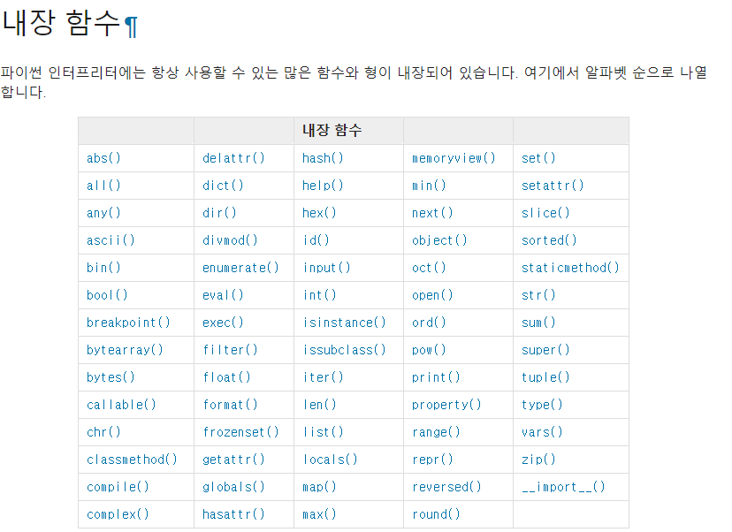

### 1. input()

>  사용자 입력 함수
>
> * **return** 값이 무조건  **string**
>   *  int형은 형변환 해주어야 한다.

```python
number = int(input())
```

```python
string = input("입력하세요>") 
# input의 리턴값이 string에 저장됨.
```

#### :star: cast

* `ValueError`  ? : 변환할 수 없는 것을 변환하려 할 때 발생하는 에러
  * 숫자가 아닌 것을 숫자로 변환하려 할 때
  * 소수점이 있는 숫자 형식의 문자열을 `int()` 로 변환하려 할 때
  
* 숫자 문자열로 바꾸기 : `str()`

  

### 2. range

* `range`(*start*, *stop*[, *step*])

```python
number = list(range(10))   
print(number)   # [0, 1, 2, 3, 4, 5, 6, 7, 8, 9]
number1 = list(range(3,10))   
print(number1)   # [3, 4, 5, 6, 7, 8, 9]
number2 = list(range(3,10,3))  
print(number2)   # [3, 6, 9]
```

```python
for num in range(10):
    print(num)
# 0 1 2 3 4 5 6 7 8 9
```

### random

```python
print(dir(random)) # random이 가지고 있는 기능 확인
```

* 로또 API 를 이용해서 당첨 확인하기

>  API : https://www.dhlottery.co.kr/common.do?method=getLottoNumber&drwNo=1

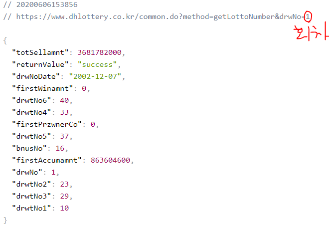


*ex ] 로또 번호 추첨 5번을 한번에 반복해서 출력하기*

```python
import random 
for i in range(5):
print(sorted(random.sample(range(1,46),6)))
```

* 반복문을 한 줄로 쓸 때 - **컴프리핸션**

```python
lotto = [sorted(random.sample(range(1,46),6)) for i in range(5)]
print(lotto) 
```


*ex ] 음식점 이름, 전화번호 dictionary 로 표현 후, 그 중에서 무작위 음식점 하나 뽑아서 출력하기*  

```python
food = {
    '엽떡' : '010-1234-5678',
    '반장떡볶이' : '010-1004-1008',
    '신전떡볶이' : '031-546-8575'
}
pick = random.choice(list(food.keys()))
print(pick)
print('가게이름은?', pick)
print('전화번호는?',food[pick])

# f- string 
print(f'가게이름은 {pick}, 전화번호는{food[pick]}')

```