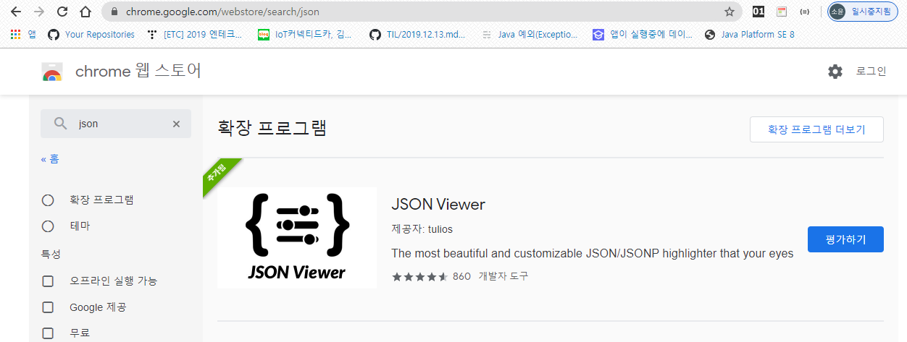
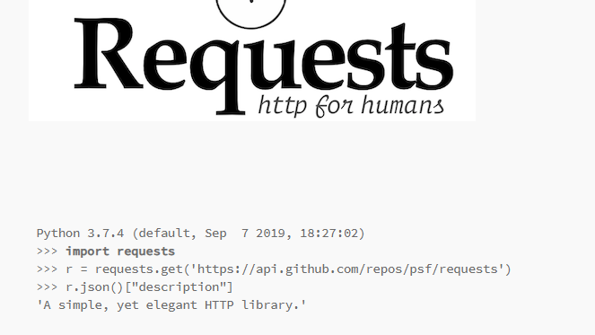

# python

강사님 [github](https://github.com/edu-sk)

## 1. 다운로드

[파이썬 설치]( https://www.python.org/downloads/) [VSCode설치](https://code.visualstudio.com/docs/?dv=win)


* 파이썬

  * 환경 변수 - PATH

  > C:\Users\student\AppData\Local\Programs\Python\Python37


* 설치됐는 지 확인


* VSCode


* 터미널 켜기 : `ctrl + shift +``

## 2. 기본 문법

### 1. 저장

#### 1. 선언

```python
# int? str? bool?
number = 10
string = "string"
string2 = "10"
boolean = True
```

```python
# 출력
print("Hello,World");
```


* 실행방법 

  > python 파일이름.py

* 파일 열기 - vscode에서만 사용 가능한 함수

  > code  파일명.py


#### 2. List

* 리스트 저장

```python
# [] 안에 있으면 리스트라고 한다.
arr = [number, string, boolean]
arr_2 = [10, "10", True ,number]  
print(arr_2)
```

* 인덱스로 접근하기

```python
print(arr_2[0], arr_2[1], arr_2[2])
print(type(arr_2[0]), type(arr_2[1]), type(arr_2[2]))
```


#### 3. Dictionary

> {key - value}
>
> *  입력한 순서는 보장이 되지만 index 접근이 안된다

```python
mask = {
    '삼성' : 100,
    '역삼' : 50,
    '선릉' : 30,
    '영등포' : 10,
}
print(mask)
# {'삼성': 100, '역삼': 50, '선릉': 30, '영등포': 10}
```

* key값으로 접근하는 법(idex X)

```python
print(mask['삼성'])
```


### 2. 조건

>  들여쓰기를 기준으로 조건문 판단
>
> *   = space bar 4번

```python
if number > 3:
    print("3초과")
print("???")
```

* 조건을 여러개 쓰고 싶을 때

```python
if number >10:
  print("10초과")
elif 10 >= number > 5 :
  print("애매")
else: 
  print("5이하")
# 조건문 순서대로 써주기

if number >10:
  print("10초과")
elif number > 5 :
  print("애매")
else: 
  print("5이하")
```

### 3. 반복


##  [내장함수](https://docs.python.org/ko/3/library/functions.html)


### 1. input()

>  입력 함수
>
> * default가 string
>   *  int형은 형변환 해주어야 한다.

```python
number = int(input())
```


### 2. range

* `range`(*start*, *stop*[, *step*])

```python
number = list(range(10))   # [0, 1, 2, 3, 4, 5, 6, 7, 8, 9]
print(number)
number1 = list(range(3,10))   # [3, 4, 5, 6, 7, 8, 9]
print(number1)
number2 = list(range(3,10,3))  # [3, 6, 9]
print(number2)
```

```python
for num in range(10):
    print(num)
# 0 1 2 3 4 5 6 7 8 9
```


```python


# 2 - 1 . list for
number = [10,9,8,7,6,5,4,3,2,1,0]
for num in number :
    print(num)

number = ['삼성', '역삼','선릉', '영등포']
for num in number :
    print(num)

# 2 - 2. idx로 접근
for i in range(len(number)):
    print(i)
    print(number[i])
# 2 - 3 enumerate
for idx, i in enumerate(number):
    print(idx, i)
```

### random

```python
print(dir(random)) # random이 가지고 있는 기능 

$ python lotto.py
['BPF', 'LOG4', 'NV_MAGICCONST', 'RECIP_BPF', 'Random', 'SG_MAGICCONST', 'SystemRandom', 'TWOPI', '_BuiltinMethodType', '_MethodType', '_Sequence', '_Set', '__all__', '__builtins__', '__cached__', '__doc__', '__file__', '__loader__', '__name__', '__package__', '__spec__', '_acos', '_bisect', '_ceil', '_cos', '_e', '_exp', '_inst', '_itertools', '_log', '_os', '_pi', '_random', '_sha512', '_sin', '_sqrt', '_test', '_test_generator', '_urandom', '_warn', 'betavariate', 'choice', 'choices', 'expovariate', 'gammavariate', 'gauss', 'getrandbits', 'getstate', 'lognormvariate', 'normalvariate', 'paretovariate', 'randint', 'random', 'randrange', 'sample', 'seed', 'setstate', 'shuffle', 'triangular', 'uniform', 'vonmisesvariate', 'weibullvariate']
```

* 
* 로또 API 를 이용해서 당첨 확인하기

>  API : https://www.dhlottery.co.kr/common.do?method=getLottoNumber&drwNo=1

* 파이썬 알고리즘 확인 사이트

> [python tutor](http://www.pythontutor.com/visualize.html#mode=edit)

* [json viewer](https://chrome.google.com/webstore/search/json)



* [pip request](https://pypi.org/project/requests/) 



```bash
$ pip install requests
```


* 공적 마스크 리스트 속 dictionary

