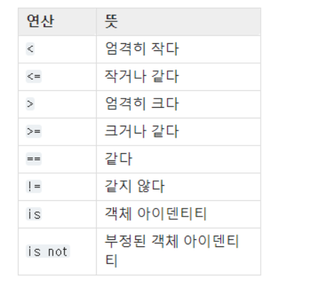
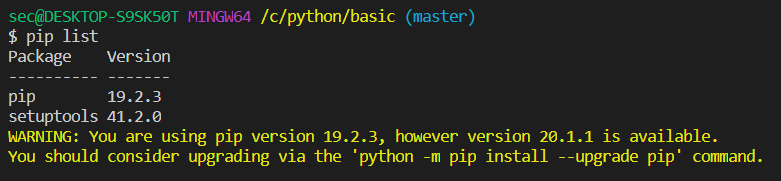
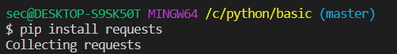
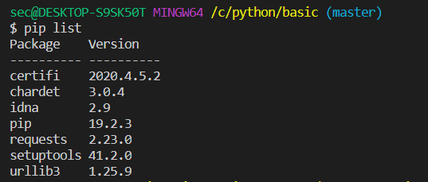
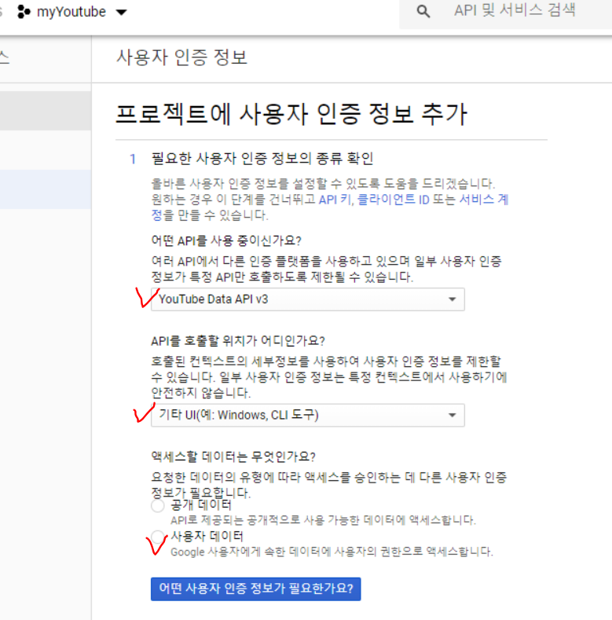
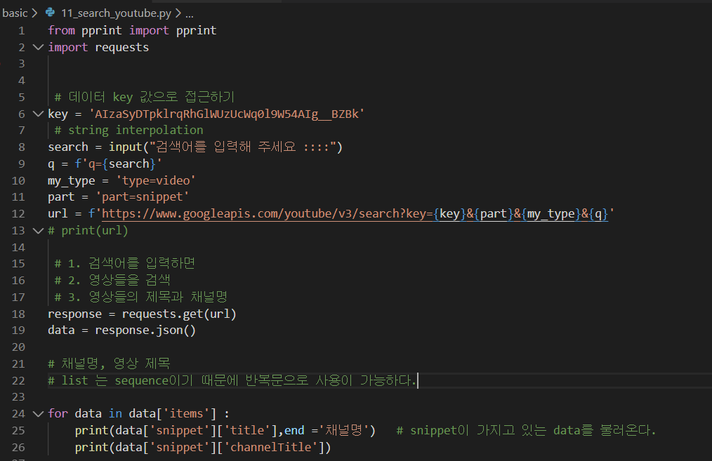
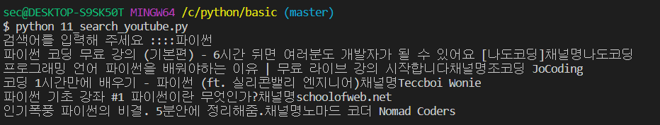

# 자료 구조

## :see_no_evil: sequence

> **sequence** - 데이터의 순차적 나열

* 비교 연산



### :star: tuple

>  리스트는 `[ ]`으로 둘러싸지만 튜플은 `( )`으로 둘러싼다.
>
> 리스트는 그 값의 생성, 삭제, 수정이 가능하지만, 튜플은 그 값을 바꿀 수 없다.

* 수시로 그 값을 변화시켜야 할 경우라면 **리스트**를 사용
* 프로그램이 실행되는 동안 그 값이 항상 변하지 않기를 바란다면 **튜플**

```python
tuple_a  = ()
tuple_a = (1,2)
print(tuple_a)
# tuple - 값을 하나만 넣고자 한다면 
tuple_b = (1,)      # <class 'tuple'>
tuple_c = (1)       # <class 'int'>
# print(type(tuple_b), type(tuple_c))
```

* 튜플 더하기

```python
t1 = (1, 2, 'a', 'b')
t2 = (3, 4)
result = t1 + t2
print(result)
# (1, 2, 'a', 'b', 3, 4)
```

* 튜플 곱하기

```python
t2 = (3, 4)
t2 * 3
# (3, 4, 3, 4, 3, 4)
```

### :star: Slicing

```python
sample_list = list(range(31))
print(sample_list)    # 0 ~ 30
print(sample_list[3])
print(sample_list[3:24])  # 3~ 23
print(sample_list[5:-1]) 
print(sample_list[5:])   # 5 ~ 끝까지
print(sample_list[3:len(sample_list):2]) # 3부터 list길이까지 출력
```

```python
print(sample_list[3::2])
print(sample_list[::2])
print(sample_list[::-1]) # 처음부터 반대로 출력
```

### :star: Dictionary

> 딕셔너리는 **Key**와 **Value**를 한 쌍으로 갖는 자료형
>
> 리스트나 튜플처럼 index를 구하지 않고 Key를 통해 Value를 얻는다.

* `{key : value}`

  *  Key에는 변하지 않는 값 사용
  * Value에는 모두 사용할 수 있다.

* value에 List넣기

  ```python
  a = { 'a': [1,2,3]}
  ```

* `key`객체 리스트

  ```python
  list(a.key())
  ```

* `value `객체 리스트

  ```python
  a.values()
  ```

* `key`, `value` 쌍 얻기 (items)

  ```python
  a.items()
  # dict_items([('name', 'pey'), ('phone', '0119993323'), ('birth', '1118')])
  ```

  * Key로 Value얻기(get) : `a.get('name')`

  * **.get()과 []의 차이점**

    ```python
    dict_a ={'삼성':100,'역삼' : 50}
    print(dict_a.get('선릉'))
    # 오류 발생없이 진행되어야 할 때
    print(dict_a['선릉'])   
    # key 값이 없을 때 멈춰야 할 경우
    ```


### :star:set

> 집합에 관련된 것을 쉽게 처리하기 위해 만든 자료형

* set는 순서가 없이 저장된다.
  * index로 접근이 불가능
  * *list나 tuple은 순서가 있다*
*  sequence로 접근
  * dictionary와 마찬가지로 중복이 허용되지 않는다.

```python
set_a = {1,2,3}
set_b = {3,6,9}
# set_b = set()
print(set_a - set_b) # 차집합
print(set_a | set_b) # 합집합
print(set_a & set_b) # 교집합
```

```python
list_a = [1,1,1,1]
print(list(set(list_a))[0]) # 중복 제거 
```

```python
test = set("Hello")
print(test)
# {'o', 'l', 'e', 'H'}
```

* 비어 있는 집합 자료형은 `변수 = set()`

​    

# :yum: Search: Youtube

> API 요청에 지정된 쿼리 매개변수와 일치하는 검색결과의 모음을 반환.
>
>  기본적으로 검색결과의 집합은 쿼리 매개변수와 일치하는 `video`, `channel`, `playlist` 리소스를 식별

* pip 존재 라이브러리 확인



* pip 설치





* youtube api 이용하기



* HTTP 요청

```python
GET https://www.googleapis.com/youtube/v3/search
```



* [결과]

