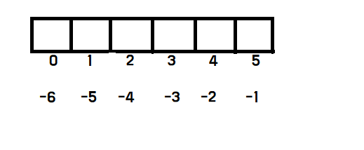
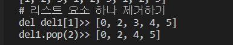
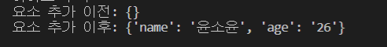
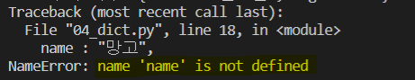

# 리스트

> `[]`에 여러 종류의 자료를 넣어 선언한다.
>
> `[]` 내부에 넣는 자료를 **요소**라고 하고, 영어는 element

* `[]`안에 음수를 넣어 뒤에서부터 요소 선택 가능.



* 리스트 연산자 이중으로 사용 가능

  ```python
  list_a = [127,32,103,"문자열",True,False]
  list_a[3]
  # 문자열
  list_a[3][0]
  # 문
  ```
## 연산자

  * 연결(+)  : 문자열 연결 연산자 `+`

  * 반복(*)

    ```python
    list_c = [1,2,3]
    print(list_c*3)
    # [1, 2, 3, 1, 2, 3, 1, 2, 3]
    ```

  * len() : 길이 구하기

  * 리스트에 요소 추가하기 : `append`, `insert`

    ```markdown
    리스트명.append(요소)
    리스트명.insert(삽입할 위치, 요소)
    # insert는 리스트의 중간에 요소를 추가할 수 있다.
    ## 요소는 뒤로 하나씩 밀린다.
    ```

  * 한번에 여러 요소를 추가하고 싶을 때 : `extend()`

    ```python
    list_a=[1,2,3]
    list_a.extend([4,5,6])
    print(list_a)
    # [1,2,3,4,5,6]
    ```

```markdown
# 리스트 연결 연산자와 요소 추가의 차이

* 연결 연산자 `+`: list_a와 list_b에 어떠한 변화도 없다(비 파괴적 처리)
* 요소 추가(append, insert, extend) : list_a 자체에 직접적인 변화 발생(파괴적 처리)
```

## 요소 제거

* **del** :  리스트의 특정 인덱스에 있는 요소 제거

  ``` python 
  del 리스트명[인덱스]
  ```

  * 범위를 지정해 리스트의 요소를 한꺼번에 제거 가능

    ```python
    del 리스트명[3:6]  # 마지막 요소를 포함하지 않는다.
    del 리스트명[:3] # 3 기준 왼쪽 전부 제거 
    del 리스트명[3:] # 3 기준 오른쪽 전부 제거 
    ```

    

* **pop** : 매개변수 이용

  ```python
  리스트명.pop(인덱스)
  ```

  ```python
  print("# 리스트 요소 하나 제거하기")
  del1 = [0,1,2,3,4,5]
  del del1[1]
  print("del del1[1]>>", del1)
  
  del1.pop(2)
  print("del1.pop(2)>>", del1)
  ```

  

* **remove** : 값으로 제거하기

  * 가장 앞에 있는 **하나**만 제거한다.
  * 모두 제거하려면 반복문과 조합해서 사용하면 된다.

  ```python
  리스트.remove(2) # 리스트 내부에 있는 2를 제거해라.
  ```

  * while 사용 - 여러 개 제거할 수 있다.

  ```python
  list_test=[1,2,1,2]
  value=2
  
  # 해당하는 값 모두 제거하기
  while value in list_test:
      list_test.remove(value)
  # [1, 1]
  ```

  

* **clear** : 모두 제거

  ```python
  리스트.clear() # 요소를 모두 제거 - 결과 list=[]
  ```

* **in/not in** 연산자

  ```python
  값 in 리스트 # 리스트 내부에 값이 있으면 True
  값 not in 리스트 # 리스트 내부에 값이 없으면 True
  ```

  ```python
  print("리스트 선언")
  array = [273,32,103,57,52]
  for element in array:
      print(element)
  # 리스트 선언
  273
  32
  103
  57
  52
  ```

  ```python
  # 반복문과 문자열 - 글자 하나하나에 반복문이 적용된다.
  for character in "안녕하세요":
      print("-", character)
  - 안
  - 녕
  - 하
  - 세
  - 요
  ```

  


# 딕셔너리

**리스트**가 `인덱스`를 기반으로 값을 저장하는 것이라면, **딕셔너리**는 `키`를 기반으로 값을 저장한다.

```markdown
{
	"키1" : 10,
	"키B" : 20,
	1   :   40,
	False: 50
}
```

| 자료형   | 의미                    | 선언 형식   |
| -------- | ----------------------- | ----------- |
| 리스트   | 인덱스 기반으로 값 저장 | 변수 = `[]` |
| 딕셔너리 | 키를 기반으로 값 저장   | 변수 = `{}` |

* 딕셔너리는 중괄호`{}`로 선언하며, `'키:값'` 형태를 쉼표로 연결해서 만든다.

  * 딕셔너리의 요소에 접근할 때는 리스트처럼 딕셔너리 뒤에 대괄호[]를 입력하고 내부에 인덱스처럼 키를 입력한다.

    ```python
    print(dict_a["name"])
    print(dict_a["type"])
    ```

| 구분     | 선언 형식  | 사용 예        | 틀린 예        |
| -------- | ---------- | -------------- | -------------- |
| 리스트   | list_a =[] | list_a[1]      |                |
| 딕셔너리 | dict_a={}  | dict_a["name"] | dict_a{"name"} |

* 딕셔너리에 값 추가/제거

  * 이미 존재하고 있는 키를 지정하고 값을 넣으면 기존의 값을 새로운 값으로 대치

  ```python
  딕셔너리[새로운 키] = 새로운 값
  ```

  * 특정 요소 제거

  ```python 
  del dictionary["ingredient"]
  ```

  ```python
  dictionary = {}
  
  dictionary["name"] = "윤소윤"
  dictionary["age"] = "26"
  ```

  

* **get()** 함수

  * 딕셔너리의 키로 값을 추출하는 기능
  * 존재하지 않는 키에 접근할 경우 `KeyError`를 발생시키지 않고 `None`을 출력한다.

  ```python
  value= dict_key.get("value")
  print("값:",value)
  
  if value == None:
      print("존재하지 않는 키에 접근했습니다.")
  # 값: None
  # 존재하지 않는 키에 접근했습니다.
  ```

  

## Error

* **NameError** : 잘못된 name 접근 (정의되지 않은 name)

  ```python
  dict_key = {
      name : "망고",
      type : "당절임"
  }
  print(dict_key)
  ```

  

  * `name="이름"`처럼 변수를 선언 해주어야 한다.

    ```markdown
    {'이름': '망고', <class 'type'>: '당절임'}
    ```

* **KeyError** : 딕셔너리에 존재하지 않는 키에 접근

* for 반복문 : 딕셔너리와 함께 사용

  ```markdown
  for 키변수 in 딕셔너리 :
  	코드
  ```


# Range

> for 반복문과 함께 많이 사용된다.

```markdown
# 매개변수에 숫자 한 개 넣기
range(A) - 0부터 A-1까지의 정수로 범위를 만든다.
# 매개변수에 숫자 두 개 넣기
range(A,B) - A부터 B-1까지의 정수
# 매개변수에 숫자 세 개 넣기
range(A,B,C) - A부터 B-1까지의 정수로 범위를 만드는데, 앞뒤의 숫자가 C만큼의 차이를 가진다. 
```

* 코드 실행

  ```python
  a = range(5)
  print(a)
  # range(0, 5)
  ```

  * 어떤 값들이 해당하는지 보기 위해 `list()`함수로 출력

    * list()를 이용해 범위를 리스트로 변경한다.

    ```python
    b = list(range(10))
    print(b)
    # [0, 1, 2, 3, 4, 5, 6, 7, 8, 9]
    ```

  * 매개변수에 숫자 3개 입력

    ```python
    c = list(range(0,10,3))
    print(c)
    # [0, 3, 6, 9]
    ```

  * 파이썬의 모든 기능들은 범위를 지정할 때 뒤에 입력한 숫자를 포함하지 않는다.

  * 수식에 나누기 연산자 사용

    ```python
    n = 10
    a = range(0,n/2)
    print(a)
    
    Traceback (most recent call last):
      File "02_range.py", line 15, in <module>
        a = range(0,n/2)
    TypeError: 'float' object cannot be interpreted as an integer
    ```

    * **TypeError** 발생 - range()함수의 매개변수로는 반드시 정수를 입력해야 하기 때문이다.

    > int() 함수 등으로 실수를 정수로 바꿀 수도 있겠지만 보통은 나누기 연산자를 사용한다.

    ```python
    a = range(0, n//2)  ## 정수 나누기 연산자.
    print(list(a))
    # [0, 1, 2, 3, 4]
    ```

* 리스트와 범위를 조합해서 사용

  ```python
  print("리스트와 범위 조합해서 사용하기")
  array = [273,32,103,57,52]
  for i in range(len(array)):
      print("{}번째 반복:{}".format(i, array[i]))
  
  # 리스트와 범위 조합해서 사용하기
  0번째 반복:273
  1번째 반복:32
  2번째 반복:103
  3번째 반복:57
  4번째 반복:52
  ```

* 역반복문

  ```python
  for i in range(4,0 -1,-1): # 0까지 반복하고 싶어서 이 코드를 사용했다고 강조
      print("현재 반복 변수:{}".format(i))
      
  현재 반복 변수:4
  현재 반복 변수:3
  현재 반복 변수:2
  현재 반복 변수:1
  현재 반복 변수:0
  ```

  ```python
  # reversed 함수 사용
  for i in reversed(range(5)):
      print("현재 반복 변수:{}".format(i))
  ```

  * reversed 적용하면 [0,1,2,3,4]의 범위가 [4,3,2,1,0]으로 뒤집어진다.

* 

