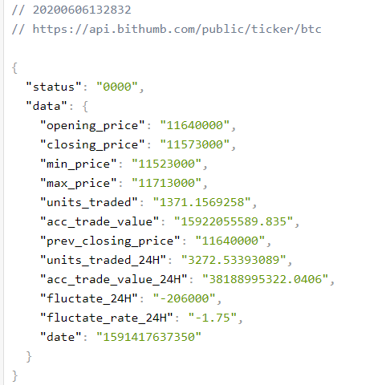

### 상승장? 하락장?

> 최고가와 최저가의 차이를 변동폭으로 정의할 때 (시가 + 변동폭)이 최고가 보다 높을 경우 '상승장', 그렇지 않을 경우 '하락장' 문자열을 출력하시오
>
> 시가 : 시작 거래 금액



| Key Name      | Description                     |
| ------------- | ------------------------------- |
| opening_price | 최근 24시간 내 시작 거래금액    |
| closing_price | 최근 24시간 내 마지막 거래 금액 |
| min_price     | 최근 24시간 내 최저 거래금액    |
| max_price     | 최근 24시간 내 최고 거래금액    |

```python
# btc.py
import requests
url = 'https://api.bithumb.com/public/ticker/btc'
response = requests.get(url).json()['data'] # json 형태를 python에서 쓸 수 있도록 형태 변환
print(response)

fluctuation = int(response['max_price']) - int(response['min_price'])
# print(fluctuation) # 190000

if fluctuation + int(response['opening_price']) >= int(response['max_price']) :
    print("상승장")
else :
    print("하락장")
```


### 모음 제거하기

>  다음 문장의 모음을 제거하여 출력하세요.

```python
# my_str.py
my_str = "Life is too short, you need pyhton"
# 아래에 코드를 작성하세요.
```


### 과일 개수 골라내기

>  장바구니에 아래와 같은 과일이 들어 있고 과일 판별 리스트가 있습니다. 현재 장바구니에는 과일이 몇 개이고, 과일이 아닌 것은 몇 개인지 출력하시오.

```python
# fruit.py
basket_items = {'apples': 4, 'oranges': 19, 'kites': 3, 'sandwiches': 8}

fruits = ['apples', 'oranges', 'pears', 'peaches', 'grapes', 'bananas']
# 아래에 코드를 작성하세요.
```


### 특정 유저의 게시글 출력하기

> 제시된 url을 통해 게시글 정보를 받아와 userId가 4인 유저가 작성한 모든 게시글의 제목을 출력하시오.

```python
# boards.py
import requests
url = 'https://jsonplaceholder.typicode.com/posts'
# 아래에 코드를 작성하시오.
```


### 불쌍한 달팽이

> 달팽이는 낮 시간 동안에 기둥을 올라갑니다. 하지만 밤에는 잠을 자면서 어느 정도의 거리만큼 미끄러집니다. (낮 시간 동안 올라간 거리보다는 적게 미끄러집니다.)
>
> 달팽이가 기둥의 꼭대기에 도달하는 날까지 걸리는 시간을 반환하는 함수를 작성하세요.

> 함수의 인자는 다음과 같습니다.

1. 기둥의 높이(미터)
2. 낮 시간 동안 달팽이가 올라가는 거리(미터)
3. 달팽이가 야간에 잠을 자는 동안 미끄러지는 거리(미터)

---

예시)

```python
snail(100, 5, 2)
# => 33
```

```python
# snail.py
# 아래에 코드를 작성하시오.
```

